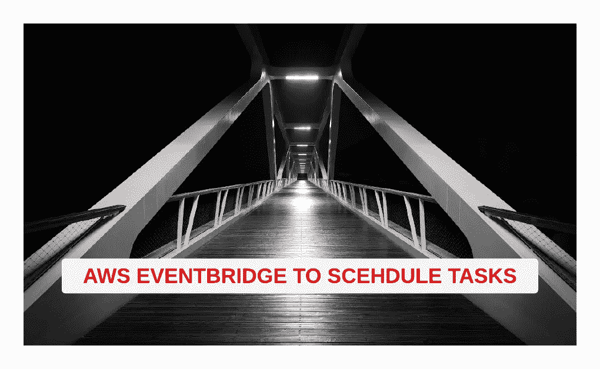
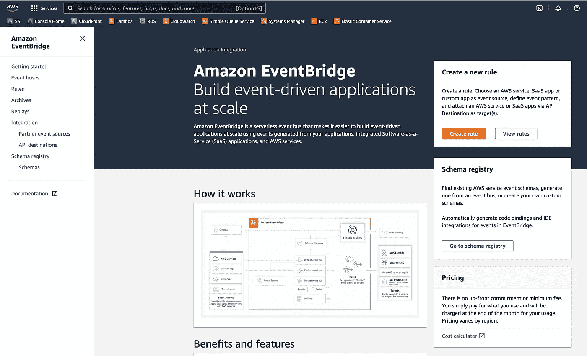
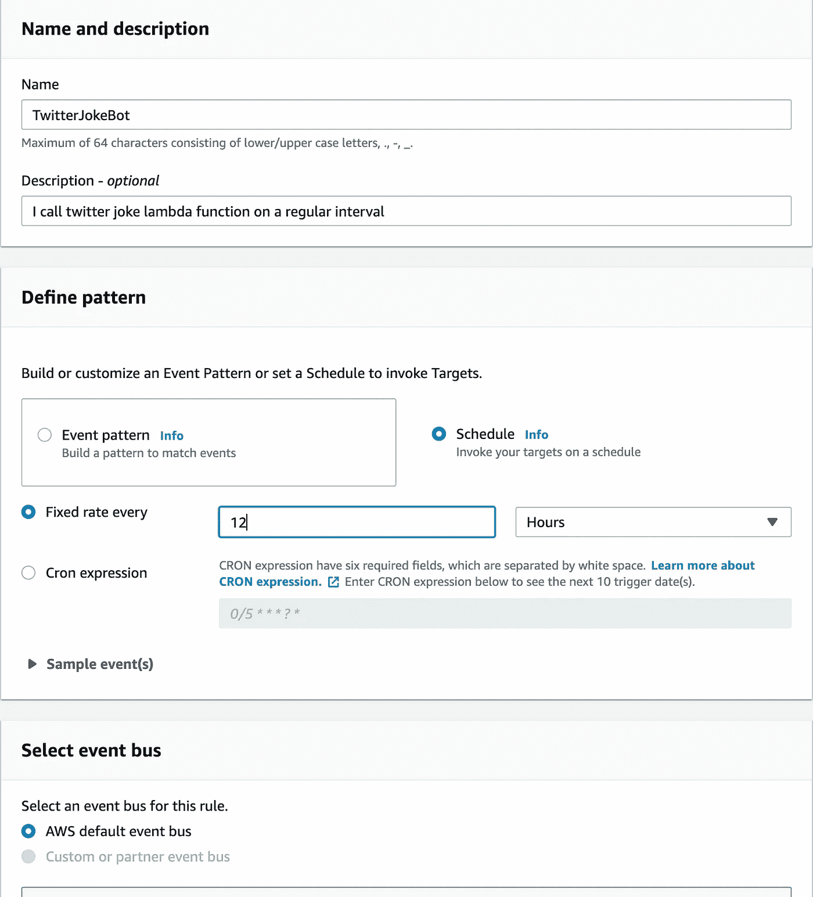
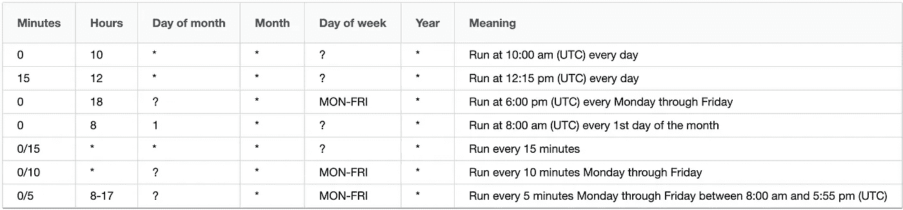
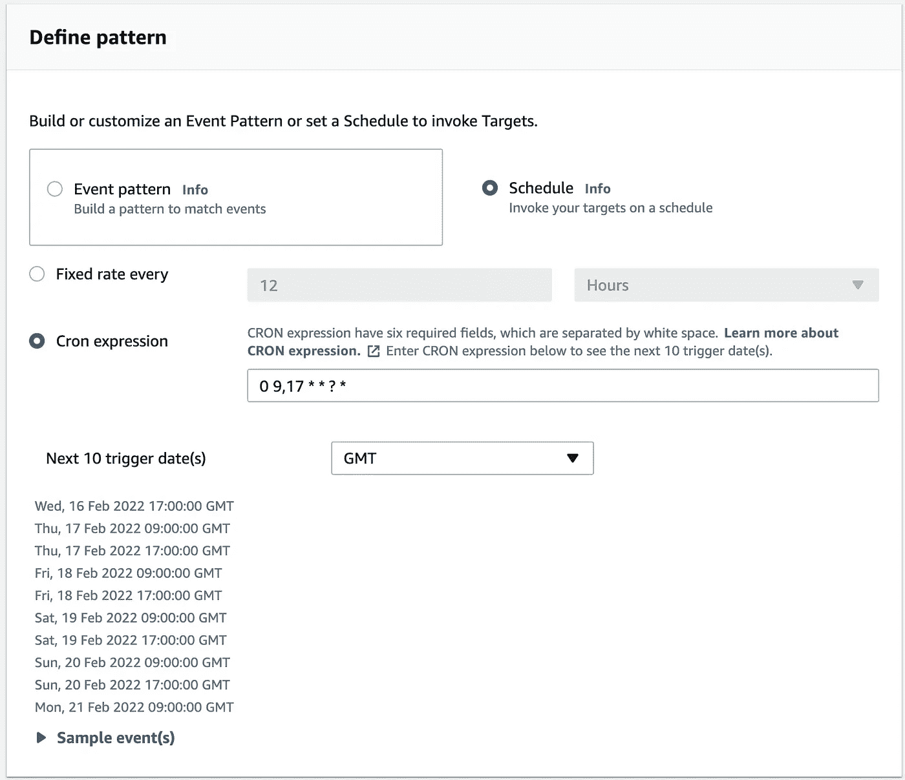
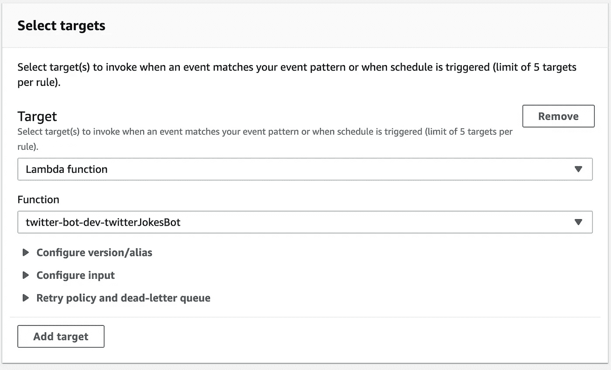
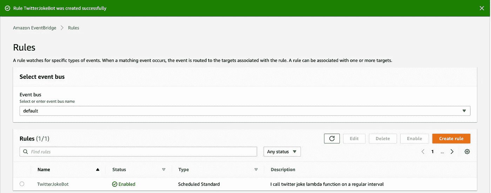
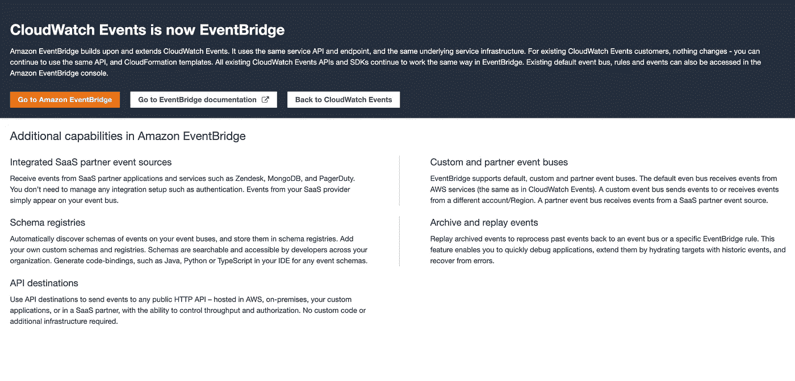

# 如何使用 AWS EventBridge 计划任务

> 原文：<https://levelup.gitconnected.com/how-to-use-aws-eventbridge-to-schedule-tasks-72d367fcf938>

AWS EventBridge 计划任务

在我的上一篇博客中，我写了如何使用无服务器框架创建自己的 [Twitter bot](https://medium.com/p/c8bcbd481bb7) 并将其部署在 AWS 上。而且，现在我已经在 AWS 上部署了这个函数，我希望有一个自动过程来定期运行这个 lambda 函数(就像一个调度的作业或 corn 任务)

在 AWS 上这样做的一种方法是使用他们的 EventBridge 服务。这是 AWS 对 EventBridge 的描述

> Amazon EventBridge 是一个无服务器的事件总线，它使得使用从您的应用程序、集成的软件即服务(SaaS)应用程序和 AWS 服务生成的事件来大规模构建事件驱动的应用程序变得更加容易。

要开始，请登录 AWS 控制台并转到 EventBridge 页面。

点击“**创建规则**按钮，您将进入一个新的规则表单。填写名称和描述字段。然后从定义模式字段中选择“**计划**选项，如下所示-

新事件桥表单

有两种方法来安排您的活动。一种是每 x 分钟/小时/天的固定速率，其中 x 是一个数值，或者您也可以将它们设置为一个 corn 表达式。你可以阅读所有关于他们的模式规则-[https://docs . AWS . Amazon . com/Amazon cloud watch/latest/events/scheduled events . html # cron expressions](https://docs.aws.amazon.com/AmazonCloudWatch/latest/events/ScheduledEvents.html#CronExpressions)

**我将选择 cron expression，因为我想每天发送 2 条推文。一个在早上 9 点，另一个在晚上 5 点。**

如果你是玉米表达的新手，那么 AWS 已经给出了一个非常好和简单的表格来理解每个条目

因为我想在一天中的某个特定时间触发我的事件两次，所以我的玉米作业将如下所示- ( **0 9，17 * *？*)
注意 9 & 17** 之间的逗号

AWS 还会给你接下来的 10 个触发器，这样你可以在保存之前测试你的玉米设置。是的，AWS 有时会有所帮助😉

事件桥 Cron

下一步是选择要被事件桥调用的目标。选择目标作为 lambda 函数，然后从下拉函数中搜索您的 Lambda

点击页面底部的 create，你的事件桥就可以调用 lambda 函数了。

请注意，在更早的时候(甚至现在)，你可以从 Cloudwatch 完成这项工作，但 AWS 已经将其转移到 EventBridge 服务中。目前，当你去参加 Cloudwatch 的活动时，这是他们向你展示的

读完这些之后，如果你对收到这样的开发者笑话感兴趣/兴奋，那么你可以在 Twitter 上关注我

感谢您的阅读，如果您想支持我，请关注我，成为会员，支持更广泛的社区。

 [## 通过我的推荐链接加入媒体 Meta Collective

### 作为一个媒体会员，你的会员费的一部分会给你阅读的作家，你可以完全接触到每一个故事…

medium.com](https://medium.com/@metacollective/membership)