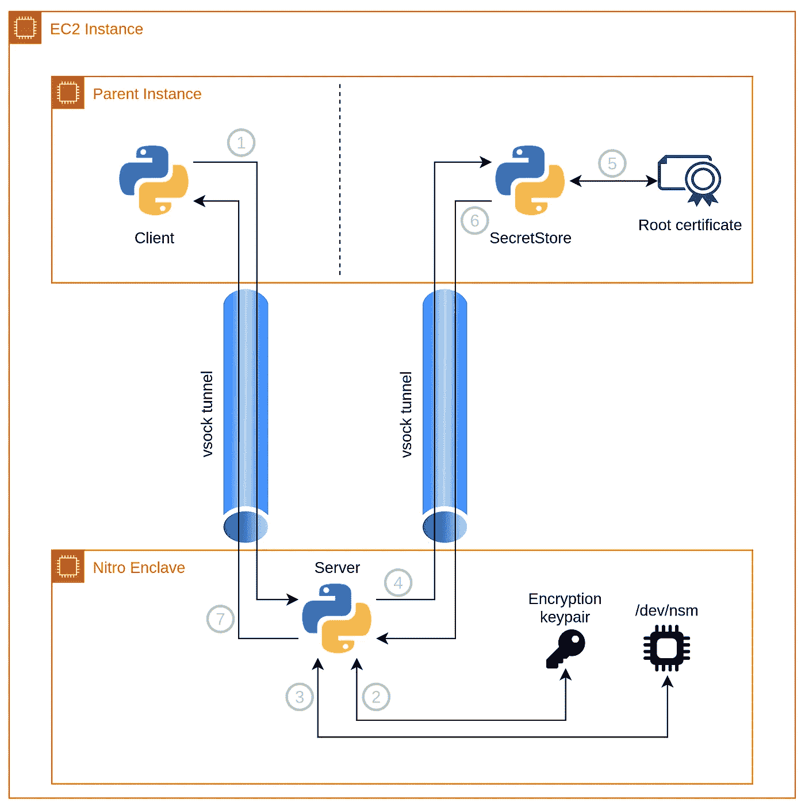
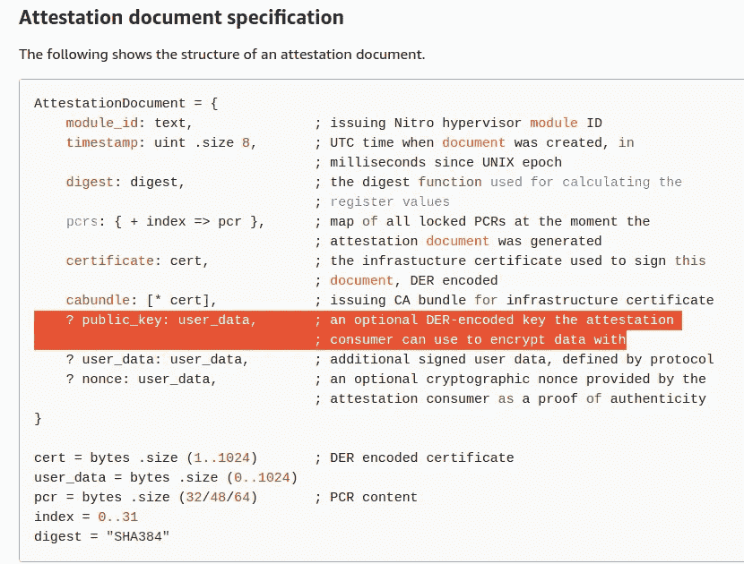
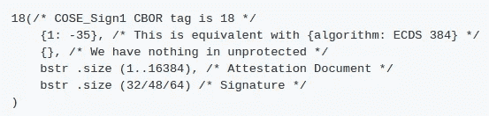
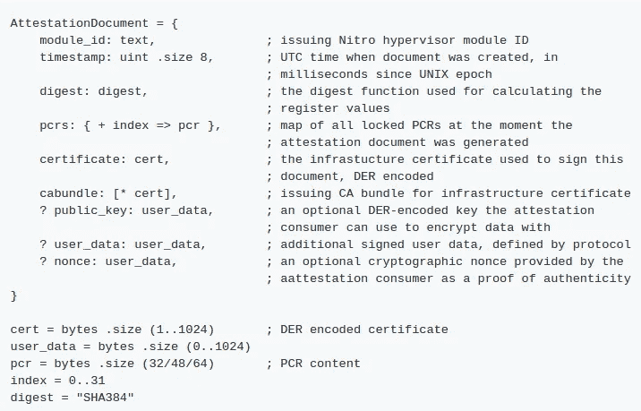

# 如何使用 AWS Nitro Enclaves 认证文件

> 原文：<https://levelup.gitconnected.com/how-to-use-aws-nitro-enclaves-attestation-document-7824e176ffa4>

在我的上一篇博客文章[中，在 AWS Nitro Enclaves](/running-python-app-on-aws-nitro-enclaves-56024667b684) 上运行 Python 应用程序，我简要介绍了什么是 **AWS Nitro Enclaves** ，并演示了网络连接如何在 Nitro Enclaves 上工作。

本周，我将讲述如何利用由 **Nitro 安全模块(NSM)** 生成的证明文件。

# 常见场景

AWS Nitro Enclaves 是隔离的计算环境，可以安全地处理高度敏感的数据。当与 enclave 之外的其他组件(例如中央秘密存储)通信时，我们也希望这个过程尽可能安全。两个主要问题是:

1.  外部组件如何知道它是否与正确的 enclave 映像通信，而不是与冒充 enclave 的攻击者通信？
2.  我们如何保护 enclave 和外部组件之间传输的数据？

为了解决这个问题，AWS Nitro Enclaves 提供了一个认证机制，其细节在 [AWS 文档](https://docs.aws.amazon.com/enclaves/latest/user/verify-root.html)中提供。但是为了更容易理解它，我为您创建了一个 Python 演示来进行实际操作。

[](https://github.com/richardfan1126/nitro-enclave-python-demo/tree/master/attestation_verifier) [## Richard fan 1126/nitro-enclave-python-demo

### 该项目展示了我们如何验证由 AWS Nitro Enclaves 的 Nitro 安全模块(NSM)生成的证明文件…

github.com](https://github.com/richardfan1126/nitro-enclave-python-demo/tree/master/attestation_verifier) 

# 组件

1.  **客户端**
    这是为了模拟依赖于安全进程输出的通用组件。例如，支持 SSO 的网站需要知道用户是否已经过身份验证。
2.  **服务器** 这是模拟处理敏感数据的流程。在前面的示例中，它将是 SSO 身份验证者，它可以访问 OAuth 应用程序机密来进行身份验证。
3.  **SecretStore**
    这是模拟存储秘密的中央数据库。在前面的例子中，它是存储不同 SSO 提供者的应用程序秘密的数据库。

然而，为了简单起见，演示不会对秘密执行任何处理，因为这不是我们的重点。它只是将秘密的明文传递给客户端。

# 该过程



## 1.客户端发送请求

用户首先运行客户端应用程序，并将请求发送到服务器应用程序。这部分就像通过 vsock 通道发送一个 JSON 字符串一样简单

## 2.生成加密密钥对的服务器

当我们启动服务器应用程序时，它会生成一个随机的 RSA 密钥对。公钥将在每次请求时被发送到 SecretStore。它用于加密从 SecretStore 到服务器的响应，以便只有服务器可以解密并获得实际内容。

为了生成随机密钥，大多数软件依赖于`/dev/urandom`来生成随机值。这个特性在 AWS Nitro Enclaves 中不可用，但幸运的是，Luc van Donkersgoed 在他的[Nitro epper](https://github.com/donkersgoed/nitropepper-enclave-app/blob/main/kms.py)项目中通过指示 **Crypto** python 包使用 NSM 提供的随机值生成器解决了这个问题。你可以阅读[他的博客文章](https://www.sentiatechblog.com/ultra-secure-password-storage-with-nitropepper)了解更多细节。

```
@classmethod
def _monkey_patch_crypto(cls, nsm_rand_func):
    """Monkeypatch Crypto to use the NSM rand function."""
    Crypto.Random.get_random_bytes = nsm_rand_func
    def new_random_read(self, n_bytes):
        return nsm_rand_func(n_bytes)
    Crypto.Random._UrandomRNG.read = new_random_read
```

## 3.生成证明文档

证明文档由 NSM 生成，AWS 已经实现了一个 [SDK](https://github.com/aws/aws-nitro-enclaves-nsm-api) (用 Rust 编写)来执行请求。再次感谢 Luc van Donkersgoed，他修改了代码[并使其可以在 Python 中使用。](https://github.com/donkersgoed/aws-nitro-enclaves-nsm-api/commit/112a450082d108bf466ca57e687beaaeff19db4a)

```
def get_attestation_doc(self):
    """Get the attestation document from /dev/nsm."""
    libnsm_att_doc_cose_signed = libnsm.nsm_get_attestation_doc(
        self._nsm_fd,
        self._public_key,
        len(self._public_key)
    )
    return libnsm_att_doc_cose_signed
```

证明文档有一个可选字段`public_key`供消费者用来加密数据。在我们的例子中，我们将把步骤 2 中生成的公钥放入这个字段中(通过第二个参数`nsm_get_attestation_doc`，它将被 SecretStore 使用。



证明文件中有一个可选字段 **public_key**

证明文件编码为 [**【简明二进制对象表示(CBOR)】**](https://en.wikipedia.org/wiki/CBOR)，为二进制数据形式。我们将做一个 base64 编码，这样我们可以把它放在请求有效载荷中。

```
# Base64 encode the attestation doc
attestation_doc_b64 = base64.b64encode(attestation_doc).decode()# Generate JSON request
secretstore_request = json.dumps({
    'attestation_doc_b64': attestation_doc_b64
})# Send the request to secretstore
secretstore_socket.send(str.encode(secretstore_request))
```

## 4.将请求发送到 SecretStore

在我们的演示中，因为所有东西都在同一个实例中，所以我们完全通过 vsock 通道从服务器向 SecretStore 发送请求。

但是在现实生活中，秘密商店很可能在别处。为了在实例外部建立连接并避免传输中的数据被攻击者读取，我建议使用 HTTPS。关于如何从 enclave 建立 HTTPS 连接，你可以按照我之前在 http-proxy 上的演示来做。

## 5.验证证明文档

为了验证证明文档，我们将做 3 件事:

1.  **匹配 PCR**—检查请求是否由所需的 enclave 映像生成。
2.  **验证签名** —确保请求的完整性，即请求未被修改。
3.  **验证证书** —确保请求由 **AWS Nitro 认证公钥基础设施(PKI)** 下的有效证书签名。这是通过根据 AWS 提供的根证书验证证书来完成的。

证明文档以 **CBOR** 编码，并使用 [**CBOR 对象签名和加密(COSE)**](https://tools.ietf.org/html/rfc8152) 进行签名。我们将使用 Python 包`[cbor2](https://pypi.org/project/cbor2/)`和`[cose](https://pypi.org/project/cose/)`来进行解码和签名验证。证明文件的细节可在 [AWS 文件](https://github.com/aws/aws-nitro-enclaves-nsm-api/blob/main/docs/attestation_process.md)中找到。



包含证明文档的 CBOR 对象的结构

为了获得证明文档，我们需要解码 CBOR 对象并获得该对象的第三个值。

```
# Decode CBOR attestation document
data = cbor2.loads(attestation_doc)# Load and decode document payload
doc = data[2]
doc_obj = cbor2.loads(doc)
```



证明文件的结构

然后，我们将从文档中获得**PCR**值，这些值是飞地的测量值。

在我们构建了服务器应用程序 enclave 映像之后，我们可以获得映像的 PCRs 值。我们可以检查证明文档中的值是否与它们匹配，以验证请求是由同一个 enclave 映像生成的。

有关 PCR 的更多详细信息，请查看[官方文档](https://docs.aws.amazon.com/enclaves/latest/user/set-up-attestation.html)。

匹配 PCR 后，我们将验证文档的签名。

该证明文件采用 [**COSE 签名 1**](https://pycose.readthedocs.io/en/latest/cose/messages/sign1message.html) 格式并由证书签名。我们可以从文件中的`certificate`字段获得证书。

AWS Nitro Enclaves 使用 **ES384** 算法对文档进行签名。为了验证签名，我们将通过证书公钥的参数(即 x/y 坐标和曲线)创建一个 [**EC2 密钥**](https://pycose.readthedocs.io/en/latest/cose/keys/ec2.html) 。

```
# Get signing certificate from attestation document
cert = crypto.load_certificate(
    crypto.FILETYPE_ASN1,
    doc_obj['certificate']
)# Get the key parameters from the cert public key
cert_public_numbers = cert.get_pubkey()\
    .to_cryptography_key().public_numbers()
x = long_to_bytes(cert_public_numbers.x)
y = long_to_bytes(cert_public_numbers.y)# Create the EC2 key from public key parameters
key = EC2(
    alg = CoseAlgorithms.ES384,
    x   = x,
    y   = y,
    crv = CoseEllipticCurves.P_384
)
```

构造密钥后，我们将从接收到的数据中构造 **Sign1** 消息，并对照 **EC2 密钥**进行验证。

```
# Get the protected header from attestation document
phdr = cbor2.loads(data[0])# Construct the Sign1 message
msg = cose.Sign1Message(phdr = phdr, uhdr = data[1], payload = doc)
msg.signature = data[3]# Verify the signature using the EC2 key
if not msg.verify_signature(key):
    raise Exception("Wrong signature")
```

验证的最后一部分是验证证书本身。

因为我们使用同一文档中提供的证书来验证签名。我们需要确保证书本身是有效的，但不是由其他方颁发的(可能是攻击者的自签名证书)。

为此，我们将验证所提供的 CA 包是否由 **AWS Nitro 认证公钥基础设施(PKI)** 的 CA 根证书签名。

根证书可以在 [AWS 文档](https://docs.aws.amazon.com/enclaves/latest/user/verify-root.html#validation-process)中找到。

```
# Create an X509Store object for the CA bundles
store = crypto.X509Store()# Create the CA cert object from PEM string,
# and store into X509Store
_cert = crypto.load_certificate(crypto.FILETYPE_PEM, root_cert_pem)
store.add_cert(_cert)# Get the CA bundle from attestation document
# and store into X509Store
# Except the first certificate, which is the root certificate
for _cert_binary in doc_obj['cabundle'][1:]:
    _cert = crypto.load_certificate(
        crypto.FILETYPE_ASN1,
        _cert_binary
    )
    store.add_cert(_cert)# Get the X509Store context
store_ctx = crypto.X509StoreContext(store, cert)# Validate the certificate
# If the cert is invalid, it will raise exception
store_ctx.verify_certificate()
```

## 6.将秘密加密并发送回飞地

在将秘密发送回 enclave 之前，我们将使用服务器应用程序的公钥对其进行加密。密钥在我们启动 enclave server 应用程序时生成，并在证明文档中发送。

通过这样做，我们可以确保只有服务器应用程序可以读取秘密，即使消息被其他方捕获。这非常重要，因为 Nitro Enclave 没有直接的网络访问，SecretStore 和 Enclave 之间的连接很可能通过 EC2 实例，我们不希望它们读取它。

我们使用与上一步相同的方法，解码 CBOR 对象，以获得服务器应用程序的公钥。然后我们用 [**PKCS1_OAEP**](https://pycryptodome.readthedocs.io/en/latest/src/cipher/oaep.html) 对秘密进行加密，将密文编码成 base64 格式，发回服务器 app。

```
# Decode CBOR attestation document
data = cbor2.loads(attestation_doc)# Load and decode document payload
doc = data[2]
doc_obj = cbor2.loads(doc)# Get the public key from attestation document
public_key_byte = doc_obj['public_key']
public_key = RSA.import_key(public_key_byte)# Encrypt the plaintext with the public key
# and encode the cipher text in base64
cipher = PKCS1_OAEP.new(public_key)
ciphertext = cipher.encrypt(str.encode(plaintext))return base64.b64encode(ciphertext).decode()
```

## **7。解密秘密并对其执行业务逻辑**

server 应用程序收到 SecretStore 的响应后，会使用自己的私钥来解密这个秘密。之后，我们可以对其执行业务逻辑，并将结果发送回客户端。

```
def decrypt(self, ciphertext):
    """
    Decrypt ciphertext using private key
    """
    cipher = PKCS1_OAEP.new(self._rsa_key)
    plaintext = cipher.decrypt(ciphertext) return plaintext.decode()# Decrypt ciphertext using private key
plaintext = nsm_util.decrypt(ciphertext)# Perform the business logic on the plaintext secret# Send the plaintext back to client
client_connection.sendall(str.encode(plaintext))
```

在这个演示中，我们不打算执行任何业务逻辑，而是直接将秘密发送回客户端。

# 可能的使用案例

当我们有经常使用的静态秘密时，这个演示中显示的模式很有用。例如

1.  SSO 应用程序机密
2.  证书私钥

通常，我们会将这些秘密保存在一个单独的组件中。当请求到来时，它将在那个中央组件中被处理。例如，当用户请求 SSO 登录时，该请求将被重定向到有权访问 SSO 应用程序密码的验证者。

但是在使用 Nitro Enclaves 后，我们可以安全地将应用程序秘密传递到 enclave 中，并将认证工作卸载给它，而不会将应用程序秘密暴露给服务器管理员。

此外，因为我们控制了整个流程，所以我们可以定制业务逻辑并将其添加到“SecretStore”中，使其不仅仅是一个商店。

# 特征图像


[Cytonn 摄影](https://unsplash.com/@cytonn_photography?utm_source=medium&utm_medium=referral)在 [Unsplash](https://unsplash.com?utm_source=medium&utm_medium=referral) 上拍照