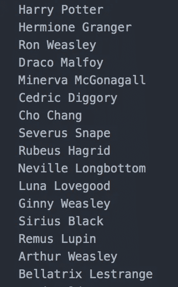

# 如何使用 Axios 处理 HTTP 请求

> 原文：<https://levelup.gitconnected.com/how-to-use-axios-for-http-requests-b26ff40e65af>


对于所有的 JavaScript 开发人员来说，我敢肯定你们一整天都在让“获取”发生。在这篇博客中，我将向你介绍 fetch 的竞争对手 Axios。

Axios 是一个轻量级的 HTTP 请求库。关键特性包括能够从 Node.js 发出 http 请求，支持承诺，并自动转换 JSON 数据，这意味着它可以解析传入的 JSON 数据。它还提供了有趣的错误处理功能，我将在后面介绍。我将带您了解如何使用 Axios 让**获得**和**发布**请求。如果你一直关注我的博客(❤️💕💖谢谢大家！)，你知道我喜欢发现新的有趣的 API 来练习。对于这个博客，我将使用一个哈利波特 API 和一个尤达翻译器 API。所以，抓紧你们的巫师帽和光剑，这里会变得很无聊。

我们需要做的第一件事是安装 Axios。

```
npm install axios
```

接下来，在我们将要执行请求的文件的顶部，我们需要写入:

```
const axios = require("axios")
```

# 获取请求

现在让我们对哈利波特 API 做一个 GET 请求。我们想得到所有的角色。

我们正在调用 axios.get 到 API url。在第 4 行和第 5 行，我们得到了返回的响应(注意，我们不需要做 res.json()，因为它已经被解析了)，这是一个对象数组，通过映射数组来获得字符名称列表。

get 请求的 API 响应如下所示:


映射响应后，我们得到以下结果:



成功！但是，如果请求不成功并且没有获得期望的结果，会发生什么呢？

# **Axios 中的错误处理**

Axios 有一个名为 err.response 和 err.request 的属性，它允许我们确定错误是发生在响应上还是请求上。正如您在第 7–15 行看到的，我们使用这些属性来处理潜在的错误。

如果我们向一个不存在的路由发送请求，比如"[http://hp-api.herokuapp.com/api/](http://hp-api.herokuapp.com/api/characters)斯莱特林规则"，我们会得到一个响应错误:


从第 8–9 行

请求被发送到正确的 url，但是服务器不知道如何处理，因为它不希望任何请求被发送到这样的路由。

现在，如果我们向一个无效和错误的 url 发出请求，比如"[http://nomuggles/API/characters](http://hp-api.herokuapp.com/api/characters)"，我们会得到一个请求错误:


# **发布请求**

现在，让我们向 Yoda Translator API 发出一个 POST 请求。

axios.post 接受两个参数，请求 url 和数据对象。这里，数据对象是我们希望由 API 翻译的文本，第 2 行的`"text":"Hello World"`。我们得到的回应是:


那都是朋友！下次见！