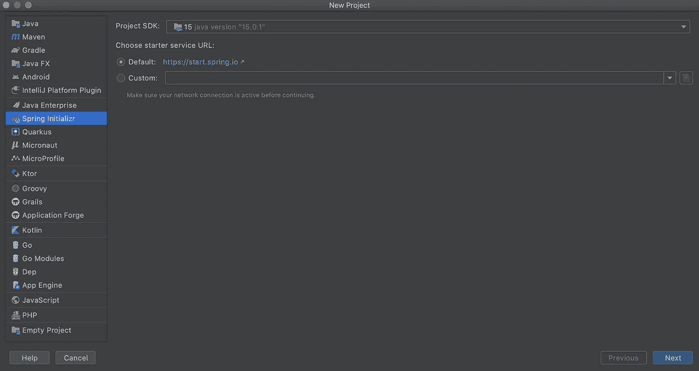
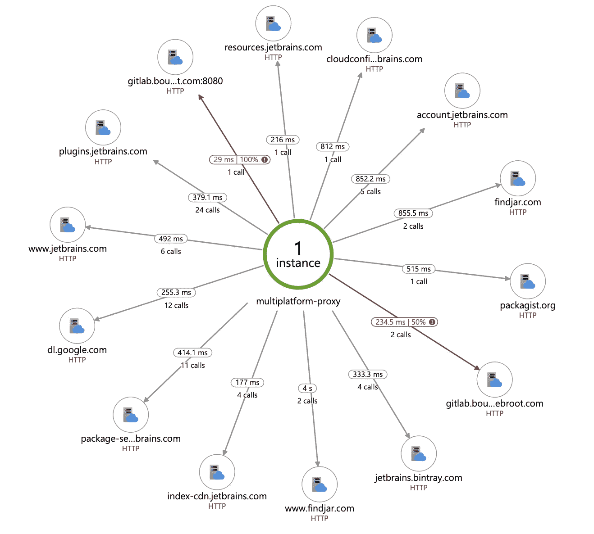

# 如何在 Java Web 应用程序中使用 Azure Insights

> 原文：<https://levelup.gitconnected.com/how-to-use-azure-insights-with-a-java-web-application-57ae95c1c669>

利用自动化指标和强大的分析功能升级您的日志记录框架！


来自[微软文档](https://docs.microsoft.com/en-us/azure/azure-monitor/app/app-insights-overview)

应用洞察是微软 Azure 监控套件的一部分。它可以用来监控实时应用程序，并与强大的分析工具一起自动检测性能异常。您不仅可以使用它来诊断应用程序中的问题，还可以使用它来更深入地了解用户如何与您的应用程序交互。

Insights 适用于各种应用程序和平台，例如。NET，JavaScript (Node+React)，Java 和 Python 在任何形式的环境下。更重要的是，大量的日志记录是自动的，让开发人员在日志记录中扮演更多的补充角色，而不是必须设计完整的框架和方法。

在本文中…

> 我们将使用 Spring 创建一个基本的 Java web 应用程序，它将包含基本的日志和 REST 功能。然后，我们将使用推荐的无代码代理配置 Application Insights，这样我们就有了一个简单的工作示例，您可以从中扩展自己的功能和用途。

我们开始吧！

# 创建基本的 Java Spring 应用程序

让我们从创建一个简单的 Spring 项目开始。



我们使用 Gradle 定义基本设置..点击下一步后，我们可以跳过添加任何进一步的依赖关系。


然后选择下一步，并决定您的项目将保存在哪里。一旦项目设置完成，请仔细检查您的根文件`build.gradle`如下所示。如果需要做出改变，记得`Reload All Gradle Projects`。

# 添加 REST 服务

现在我们的应用程序什么都不做。因此，让我们添加逻辑来处理一个基本的`GET`请求，该请求将为用户提供问候和 ID。在`src/main/java/com/azureinsights/demo`中，创建一个名为`Greeting`的新 Java 类。添加以下代码:

这里我们用私有属性`id`和`content`定义了一个`Greeting`对象。我们为我们的属性添加了一个简单的构造函数和 getters。很简单，现在让我们给`src/main/java/com/azureinsights/demo`添加一个名为`GreetingController`的新 Java 类，将这段代码放在新的类文件中。

在这里，我们创建了一个简单的带有`@RestController`注释的控制器，通知 Spring 我们正在创建一个 RESTful 服务。我们首先定义一个名为`template`的`String`，作为我们问候的占位符。然后我们在下一行定义一个计数器，最后使用注释`"@GetMapping"`提醒 Spring 我们正在为路由`"/greeting"`创建一个新的`GET`请求。

我们创建的新的`greeting`对象接受请求参数`"name"`，默认值为`"World"`。基本上，当我们点击`/greeting`路径时，我们告诉 Spring 随后调用`greeting()`函数，该函数返回一个新的`Greeting()`，带有一个计数器 ID 和一个可选的传递给`name`的值。

如果您通过 IntelliJ 运行您的应用程序，并在网络浏览器中打开`localhost:8080/greeting`，您应该会看到`{“id”:1,”content”:”Hello, World!”}`显示出来。我们可以通过在 web 浏览器中输入`[localhost:8080/greeting?name=Izzy](http://localhost:8080/greeting?name=Izzy)`来发出`GET`请求，这就是我们如何将参数`"Izzy"`传递给`name`参数！


[http://localhost:8080/greeting](http://localhost:8080/greeting)


[http://localhost:8080/greeting？姓名=伊西](http://localhost:8080/greeting?name=Izzy)

# 使用 SLF4J 添加日志记录

Azure Insights 的另一个优点是，它可以从以下框架中自动捕获任何形式的日志记录:

*   Java . util . log
*   Log4j(包括 MDC 属性)
*   SLF4J/回溯(包括 MDC 属性)

因此，让我们快速地将 SLF4J 添加到我们的项目中。首先将以下依赖项添加到根`build.gradle`文件中:

在`src/main/java/com/azureinsights/demo`中创建新的 Java 类`LoggingController.java`。添加以下代码:

这里我们专门为日志创建了另一个`RestController`，它将为我们的 Spring 应用程序的归途`("/")`提供一个`RequestMapping`。我们只需在第 11 行创建一个新的 logger 对象，在向 web 页面返回欢迎消息之前记录一条警告和一条错误消息。现在，当你进入`localhost:8080`时，你会收到 Spring logging 消息，如果你在 IntelliJ 中打开`Console`，你就能看到日志。


# 添加 Azure 洞察

好吧，你一直在等待的部分！在本节中，您将设置一个新的 Azure 资源，下载 Insights JAR 文件，并为您的应用程序配置自动洞察。

让我们开门见山，打开微软 Azure——如果你没有帐户，你需要创建一个。

[](https://azure.microsoft.com/en-us/) [## 云计算服务|微软 Azure

### 在专为数据和分析构建的云上获得无与伦比的洞察力、规模和性价比。报名参加…

azure.microsoft.com](https://azure.microsoft.com/en-us/) 

点击“创建资源”


在搜索栏中输入“应用洞察”并选择相应的选项。单击创建。创建一个新的资源组(名称由您决定)并添加必要的配置。点击“创建”后，安装程序将在一两分钟内完成。这是您的所有日志和应用程序数据将被发送到的地方！

在构建新资源的同时，请在此下载 Azure Insights 无代码代理:

[https://github . com/Microsoft/application insights-Java/releases/download/3 . 0 . 0/application insights-agent-3 . 0 . 0 . jar](https://github.com/microsoft/ApplicationInsights-Java/releases/download/3.0.0/applicationinsights-agent-3.0.0.jar)

我会将这个 jar 存储到项目的根目录中，或者容易访问的地方。接下来，您需要将 JVM 指向 Insights 代理。您可以通过打开 IntelliJ 中的“帮助”选项卡，然后单击“编辑自定义虚拟机选项”来完成此操作。然后，您需要指定 jar 的路径，例如:`javaagent:path/to/applicationinsights-agent-3.0.0.jar`


看到我如何在文件底部的第 21 行设置路径了吗？好了，快好了。我们需要配置 Insights 代理，以了解将遥测数据发送到哪里。创建一个配置文件`applicationinsights.json`并*将其放在与 Insights 代理相同的目录中。*将以下代码放入其中:

```
{
    "connectionString": "InstrumentationKey=..." 
}
```

将`InstrumentationKey`设置为等于新洞察资源中的值。


就这样，您已经提升了日志记录技能，可以使用 Azure Insights 进行自动日志记录和度量了！

# 使用应用洞察

现在您已经有了自动日志记录，让我们看看我们可以用 Insights 做些什么。首先，你需要启动你的应用程序并与之互动。你应该选择以下路线:

*   本地主机:8080
*   本地主机:8080/问候语
*   localhost:8080？姓名=伊西

这将启动 REST 服务和日志框架，Insights 代理将把它们发送到您的 Azure 资源。给应用程序一些时间来发送日志(在某些情况下，最多半小时)。然后转到你的 Azure 资源，点击“Logs”，退出初始提示，然后双击左下方的“traces”。点击运行。您应该会在右下角看到您的报告:


您可以展开这些日志，以在您的应用程序中获取详细信息。

但是等等，还有更多！

您可以获取实时指标或查看自动生成的应用地图，以查看您的应用架构和流程。


该地图是交互式的，因此您可以单击一个节点来扩展其信息。



很漂亮吧？如您所见，在这里您可以做很多事情。您还可以执行自定义日志记录指标和事件，深入了解应用性能和使用情况，甚至了解用户如何与您的 web 应用交互！我把探索的任务留给了你，但是你现在应该已经具备了将 Azure 洞察力添加到你自己的应用程序中的技能和知识。

官方 Azure Insights 文档:

[](https://docs.microsoft.com/en-us/azure/azure-monitor/app/app-insights-overview) [## 什么是 Azure Application Insights？- Azure 监视器

### 实时 web 应用程序的应用程序性能管理和使用情况跟踪。检测、分类和诊断…

docs.microsoft.com](https://docs.microsoft.com/en-us/azure/azure-monitor/app/app-insights-overview) 

我希望你喜欢这篇关于将 Azure Insights 从底层整合到 Spring Boot web 应用程序的教程。Azure Insights 还有很多内容，所以如果你想了解更多，我鼓励你在下面留下评论。

感谢阅读！