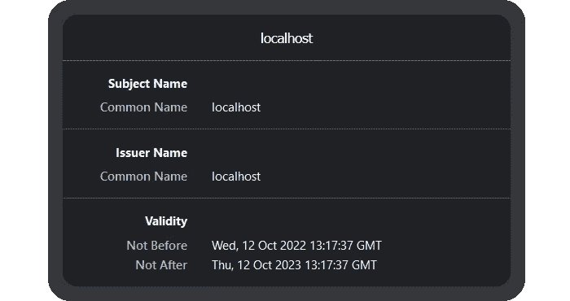
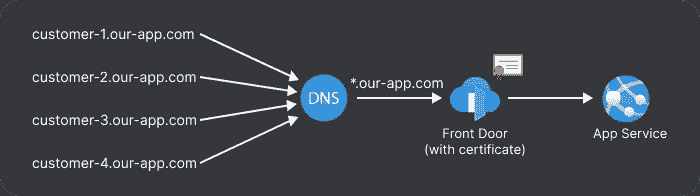
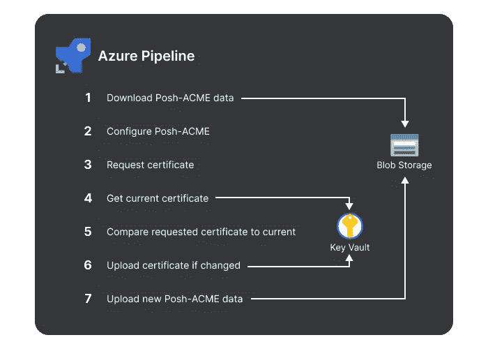

# 如何使用 Azure 管道进行自动证书续订

> 原文：<https://levelup.gitconnected.com/how-to-use-azure-pipelines-for-automatic-certificate-renewal-2870f5930c5>

近年来，web 浏览器使 SSL 引起了所有用户的注意。谷歌 Chrome 在 2017 年 1 月开始转向更安全的网络，并自 2018 年 7 月起将所有通过 HTTP 提供的页面显示为“不安全”。如今，为 HTTPS 网站提供服务是必须的，因此维护 SSL 证书的过程至关重要。有许多创建证书的工具，许多 web 主机包括免费管理( [Cloudflare SSL](https://www.cloudflare.com/en-gb/ssl/) ， [Azure 管理证书](https://learn.microsoft.com/en-us/azure/app-service/configure-ssl-certificate))。

# 什么是 SSL 证书？

简单地说，SSL 证书是一种数字证书，用于验证网站的身份。这些证书允许网站通过 HTTPS 而不是 HTTP 提供内容来加密。

SSL 证书由可信的证书颁发机构(CA)进行数字签名，例如 [DigiCert](https://www.digicert.com/) 。任何人都可以创建证书，但是浏览器只信任由可信 CA 签名的证书。

证书只在给定的时间内有效。一旦证书过期，浏览器将不再信任它。证书必须在到期前更新，这样您的站点才不会不安全。

# 为什么网站需要 SSL 证书？

拥有 SSL 证书的主要原因是为了让一个站点可以在整个 HTTPS 提供服务。这提供了客户端和服务器之间的加密，以保持用户数据的私密性。拥有这种端到端加密可以防止中间人攻击，这种攻击会使攻击者能够窃听通信。让该网站服务于 HTTPS 意味着用户将在他们的地址栏看到可信赖的挂锁，向他们保证他们的连接是安全的。

浏览器地址栏中的挂锁

要从 CA 接收 SSL 证书，您必须验证您拥有该域—通常通过 DNS。这意味着用户可以确信托管该站点的服务器是由拥有该域的同一批人运行的，并且该站点是可信的。

# 管理 SSL 证书

过去，企业会从 CA 购买证书。然后，他们需要在证书到期前手动更新证书，并将其重新上传到服务器。这些证书通常是长期有效的(1-2 年),因此不需要经常更新。这是一个仍然被广泛使用的选项，然而，许多企业现在选择使用免费服务来获得他们的证书。

可以免费创建自签名证书。顾名思义，这些证书不是由可信的 CA 签名的，也不会被浏览器信任。这是因为没有外部权威机构来验证其所声称的来源。这种类型的证书通常用于开发，因为它可以在本地被信任。

开发证书

[让我们加密](https://letsencrypt.org/)是一个免费、自动化、开放和可信的 CA，它已经成为一项非常受欢迎的服务，每天颁发[~ 300 万个证书](https://letsencrypt.org/stats/#daily-issuance)。自动化工具可以与 Let's Encrypt 一起使用，在证书到期前自动更新证书——这类工具包括 [win-acme](https://www.win-acme.com/) 和 [Posh-ACME](https://poshac.me/) 。这些是 Audacia 用于托管在虚拟机上的应用程序的工具，因为它们可以轻松设置为后台任务来管理证书。

为了进一步简化这个过程，许多主机服务提供免费的证书管理。我们的许多系统托管在 Azure 应用服务中，自 2021 年 5 月[起](https://azure.microsoft.com/en-gb/updates/app-service-managed-certificates-now-generally-available/)提供免费的证书管理。开发人员只需设置一次证书，Azure 将无限期处理续订。诸如此类的流程减少了企业维护和监控 SSL 证书的需求，从而降低了出错的风险。

# 为什么我们仍然需要一个自动化续订的工具？

虽然我们的应用程序托管在 Azure 应用服务中，但由于缺乏对通配符证书的支持，我们无法使用他们的托管证书。我们提供了一个多租户应用程序，客户可以通过一个自定义的子域，例如`customer-1.our-app.com`和`customer-2.our-app.com`进行访问。我们不是每次添加新客户时都给应用服务分配一个新的自定义域(Azure 有 500 个自定义域的硬性限制)，而是将`*.our-app.com`指向应用服务。为了让我们的客户在访问产品时看到挂锁，我们需要获得一个通配符证书。

多租户域

由于我们没有在 VM 中托管我们的应用程序，所以像我们为其他应用程序所做的那样使用 win-acme 并不简单。仅仅为了更新我们的证书而运行虚拟机是不经济的。

相反，我们的流程是让某人每隔几个月手动运行一次 Let's Encrypt 并上传证书。我们的两个环境总共有 10 个证书需要续订。这一过程并不理想，因为每次需要 1-2 个小时，而且工程主管是唯一有权更新生产系统的人。

我们估计一个自动化系统大约需要一天的时间来建立。由于手动过程每两个月花费两个小时，所以只需要 8 个月就可以获得投资开发时间的回报。自动化将大大降低由于忘记更新或人员不在而导致证书过期的风险。

# 我们如何自动续订我们的证书？

我们的回购托管在 Azure DevOps 中，我们按计划使用 Azure 管道来处理我们的证书续订。这使开发者和利益相关者可以从管道状态中轻松了解续订情况。

我不会详细说明我们是如何设置的，因为这必须归功于布伦特·罗宾逊的优秀向导。这被用作我们的过程的基础，经过一些调整，使它更适合我们的需要。

证书续订流程

首先，管道试图从 Azure Blob 存储容器下载缓存的 Posh-ACME 数据。这包含先前创建的证书的域、指纹和日期。

然后，Posh-ACME 将根据缓存的数据对自己进行配置，并确定是否需要请求新的证书。如果以前的证书将在接下来的 30 天内过期，将从 Let's Encrypt 请求新的证书。

然后，我们从 Azure Key Vault 获取当前证书，并将该证书的指纹与来自 Posh-ACME 的指纹进行比较。如果指纹不匹配，则生成新的证书。

然后，新证书被上传到密钥库，Azure Front Door 将在接下来的 72 小时内自动提取该证书。

管道的最后一步是将新的 Posh-ACME 数据上传到 Blob 存储，以便在下一次运行的第一步中下载。

# 摘要

托管网站时，SSL 证书是浏览器和用户信任您的网站的一项要求。使用由你的主机提供商管理的证书是降低出错风险的明显选择。但是，在某些情况下，这些功能可能无法使用。对于这个 Audacia 项目，使用 Azure Pipelines 和 Posh-ACME 是一个很好的解决方案，因为它运行起来很便宜，而且我们在现有的 Azure DevOps 项目中获得了我们续订状态的出色可见性。

[Audacia](https://audacia.co.uk/) 是一家总部位于英国的软件开发公司，总部位于利兹。在我们的技术洞察博客上查看更多来自我们的顾问、业务分析师、开发人员和测试人员团队的[技术洞察](https://bit.ly/3VKKFUy)。

本文由 Audacia 高级软件开发人员 Jack Percy 撰写。Jack 目前在一个团队中使用 VueJS 和。网芯。在此项目之前，他曾在多个行业工作过，包括汽车维修和房屋建筑。杰克喜欢所有的东西，尤其是 CI 和 CD。

# 分级编码

感谢您成为我们社区的一员！在你离开之前:

*   👏为故事鼓掌，跟着作者走👉
*   📰查看更多内容请参见[升级编码刊物](https://levelup.gitconnected.com/?utm_source=pub&utm_medium=post)
*   🔔关注我们:[Twitter](https://twitter.com/gitconnected)|[LinkedIn](https://www.linkedin.com/company/gitconnected)|[时事通讯](https://newsletter.levelup.dev)

🚀👉 [**加入升级人才集体，找到一份神奇的工作**](https://jobs.levelup.dev/talent/welcome?referral=true)