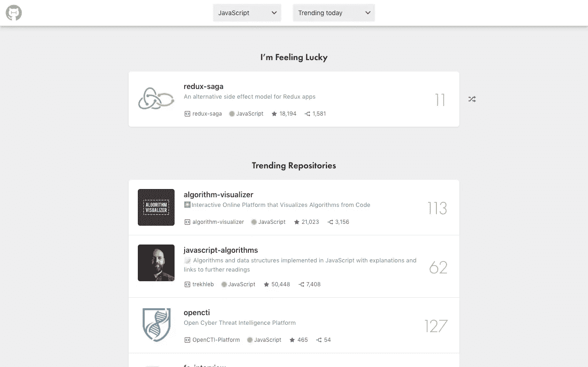
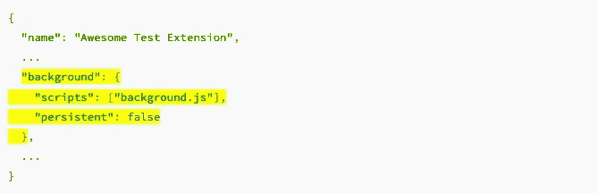
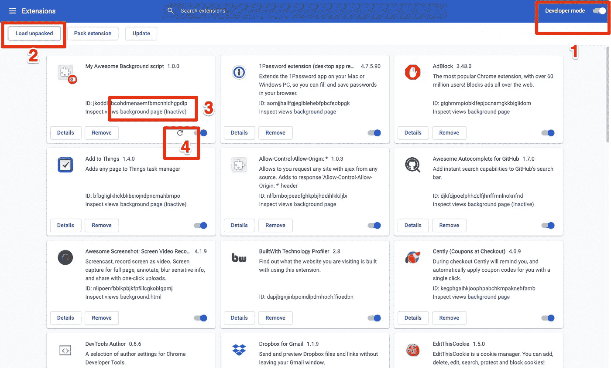
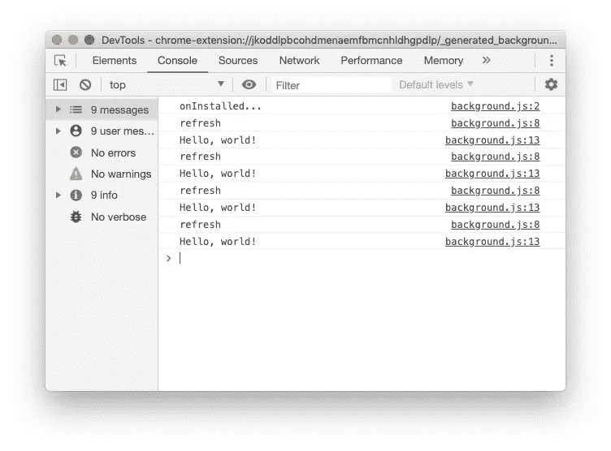

# 如何使用后台脚本获取 Chrome 扩展中的数据

> 原文：<https://levelup.gitconnected.com/how-to-use-background-script-to-fetch-data-in-chrome-extension-ef9d7f69625d>



黑客标签:Chrome 扩展，在新标签上查看 GitHub 趋势项目📈

如果你不确定如何编写一个 chrome 扩展，可以先看看我之前的故事 [**如何用 React.js 在 5 分钟内创建一个跨浏览器扩展**](/how-to-use-react-js-to-create-chrome-extension-in-5-minutes-2ddb11899815) 。它教你如何使用 create-react-app 为新标签页构建一个浏览器扩展。

我们构建的扩展很好，但是每次用户打开一个新标签，我们将从 API 重新加载最新的趋势库，这可能需要几秒钟。即使只需要一秒钟，对于一个新的标签页打开来说仍然很慢。

> 如果我们定期在后台获取数据，将数据保存在 localStorage 中，并在打开一个新标签时读取它，会怎么样？

我花了几天时间研究它，发现它是完全可行的。在这篇文章中，我将与你分享我在这个过程中所学到的东西。

# 1.向 manifest.json 添加后台脚本

后台脚本可以对浏览器事件做出反应并执行某些操作，后台页面在需要时加载，空闲时卸载。要使用背景文件，在`manifest.json`文件中声明如下:



你会注意到`persistent`参数，在扩展的生命周期中存在一个持久的背景页面，并且只有一个实例在 Chrome 浏览器的背景中运行，等待用户与扩展交互。

根据[谷歌开发者文档](https://developer.chrome.com/extensions/background_migration)，更推荐使用非持久模式，它可以帮助降低你的扩展的资源成本。非持久后台脚本是完全基于事件的，它保持休眠状态，直到它们监听的事件触发，对指定的指令做出反应，然后卸载。事件的一些例子包括:

*   该扩展首先被安装或更新到新版本，或者浏览器被重新启动。
*   背景页正在侦听一个事件，该事件已被调度。(例如，我们将创建`[alarm](https://developers.chrome.com/extensions/alarms)`来定期调度事件)
*   内容脚本或其他扩展[发送消息。](https://developer.chrome.com/extensions/messaging)
*   扩展中的另一个视图，比如弹出窗口，调用`[runtime.getBackgroundPage](https://developer.chrome.com/extensions/runtime#method-getBackgroundPage)`。

# 2.添加警报以定期触发操作

您可能熟悉以下定期运行的代码:

```
window.setInterval(function() {
  console.log('Hello, world!'); 
}, 1000 * 60 * 3);
```

上面印着“你好，世界！”每 3 分钟。为了将其更改为基于事件的警报，我们将使用[警报 API](https://developer.chrome.com/extensions/alarms) 来代替。

```
chrome.alarms.create('refresh', { periodInMinutes: 3 });
```

然后添加一个监听器。

```
chrome.alarms.onAlarm.addListener((alarm) => {
  alert("Hello, world!");
});
```

我们将需要在安装扩展时创建一个警报，以便每 3 分钟在后台触发一次警报，这是我们到目前为止的`background.js`。

要使用警报，您还需要在`manifest.json`中添加`alarms`权限

# 3.调试后台脚本

为了测试上述脚本是否能按预期运行，我们需要在本地测试它。这和[上一个故事](/how-to-use-react-js-to-create-chrome-extension-in-5-minutes-2ddb11899815)中的步骤非常相似。

1.  确保开发者模式打开，如上图所示。
2.  点击“Load unpacked”，目标文件夹包含您的`manifest.json`。
3.  你应该点击`background page`,而不是在新标签页上检查，因为背景页正在一个单独的进程中运行。
4.  如果您在本地更改了代码，则需要单击 reload。



本地测试扩展

从下图可以看出，警报每 3 分钟运行一次。



检查后台脚本

您也可以在这里检查**网络**、**本地存储**。如果您的扩展修改了新标签，本地存储将在您的扩展中共享，这就是我们在后台脚本和新标签扩展之间传递数据的方式。

# 4.提取数据并保存到本地存储

现在我们有一个基本的警报工作，让我们获取数据并保存到本地存储。后来在我们的 React 扩展中，我们可以在加载时直接从本地存储读取，而不是从 API 获取。

1.  我们将创建一个“**刷新**”警报，以便在首次安装或升级扩展时每 30 分钟获取并保存数据。
2.  我们将在 chrome 重启时获取数据，以便用户获得最新数据。
3.  我们还将每 5 分钟创建另一个“**看门狗**”警报，以检查刷新警报是否仍然可用，如果不可用，我们将创建它。(这里可能不需要)

# 5.重用逻辑并转换到 ES5

上面的代码有两个问题，我们现在需要解决它们:

1.  请注意，我们没有为`fetchRepositories`和`saveToLocalStorage`编写实现，它们很可能已经存在于您的 React 应用程序中，将实现复制到`background.js`是很好的，但如果我们能够重用这些函数以保持代码干燥，那会更好。
2.  我们已经使用 ES6 语法编写了`background.js`，比如`**=>**`和`**async await**`，旧的浏览器可能无法运行它。

这里我们将使用`webpack`来帮助将代码捆绑和传输到 ES5。

## 5.1 安装依赖项

```
yarn add --dev webpack-cli npm-run-all rimraf
```

注意，我们不应该安装`webpack.` ( `react-scripts`已经依赖于它，它会抱怨`webpack`的另一个实例)。如果您没有使用`create-react-app`，请随意安装它。

## 5.2 更改构建脚本

现在更改您的`build`脚本来构建您的应用程序和后台脚本:

```
"prebuild": "rimraf build",
"build": "npm-run-all build:*",
"build:app": "INLINE_RUNTIME_CHUNK=false react-scripts build",
"build:bg": "webpack --mode production ./src/background.js --output ./build/background.js",
```

我们已经在[之前的教程](/how-to-use-react-js-to-create-chrome-extension-in-5-minutes-2ddb11899815)中介绍过`INLINE_RUNTIME_CHUNK=false`。更改后，如果您运行`npm run build`，它将执行

*   清洁`build`文件夹
*   使用`react-script`捆绑 React 扩展
*   使用 webpack 捆绑`src/background.js`并导出到`build/background.js`

## 5.3 重构。/src/背景. js

在您的`src/background.js`中，您可以自由导入任何外部库，如`lodash`或从其他文件导入常量/函数，如:

```
import { 
  fetchRepositories, 
  saveToLocalStorage
} from './lib/helpers';chrome.runtime.onInstalled.addListener(() => {
...
```

你的代码现在更干净了。

## 5.4 更新 ESlint 配置

如果你在你的编辑器中使用 ESLint，它可能会抱怨在你的`./src/background.js`中没有定义`chrome`。这是因为`chrome` API 只在扩展中可用，我们需要告诉 ESLint 我们正在开发扩展，请忽略这些。

在您的`package.json`中添加/更新以下行。

```
"eslintConfig": {
  "extends": "react-app",
  "env": {
    "browser": true,
    "webextensions": true
  }
}
```

把`webextensions`加到`env`后，编辑就不再抱怨了。

## 5.5 添加。巴伯尔克

Webpack 将需要一个`.babelrc`文件来编译，我们需要手动添加它。因为`react-scripts`已经安装了`babel-presets-react-app`，我们只需要使用它。

```
{
  "presets": ["react-app"]
}
```

现在运行`npm run build`将会在你的`build`文件夹中有你完整的扩展和编译好的后台脚本。

# 就是这样！

如果你好奇的话，你可以在 GitHub 上查看我的扩展的提交中所有被修改的文件[。](https://github.com/huchenme/hacker-tab-extension/commit/ff765829f2d96ea5e53265b11d4a27cec4133b5d)

谢谢你读到这里。你可以在 [Github](https://github.com/huchenme/hacker-tab-extension) 中查看源代码，或者在 [Chrome 网络商店](https://chrome.google.com/webstore/detail/hacker-tab/ibomigipadcieapbemkegkmadbbanbgm)和 [Firefox 附加组件中心](https://addons.mozilla.org/en-US/firefox/addon/hacker-tab/)下载扩展，祝你黑客愉快，让我知道你构建了什么！