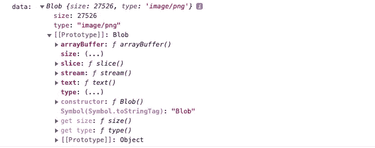
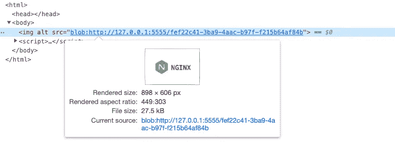
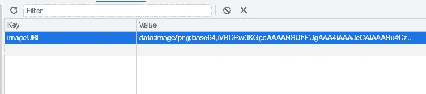
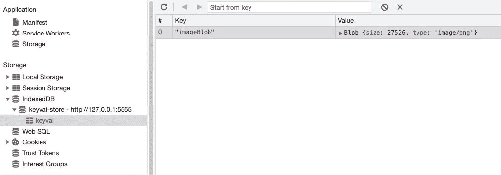

# 如何在浏览器中使用 Blob 对象进行缓存

> 原文：<https://levelup.gitconnected.com/how-to-use-blob-in-browser-to-cache-ee9577b77daa>

## 缓存可以大大提高应用程序的性能


布雷特·乔丹在 [Unsplash](https://unsplash.com?utm_source=medium&utm_medium=referral) 上拍摄的照片

浏览器中的 Blob 对象是不可变的原始数据的类似文件的对象；它们可以作为文本或二进制数据读取，或者转换为可读流，以便其方法可以用于处理数据。

使用 blob 功能，我们可以轻松地将图片或音频、视频转换为内存中的数据，从而减少网络延迟，改善用户体验。

# 1.准备 Blob 数据

使用内置的 fetch 可以很容易地将响应内容转换为 blob:

```
async function createBlob() {
  const response = await fetch(
    '[https://miro.medium.com/max/1400/1*sAUnjuM5TXHlf7Qdef84jw.png'](https://miro.medium.com/max/1400/1*sAUnjuM5TXHlf7Qdef84jw.png'),
  );
  const blob = await response.blob(); return blob;
}
```

或者使用`axios`:

```
async function createBlob() {
  const { data } = await axios(
    '[https://miro.medium.com/max/1400/1*sAUnjuM5TXHlf7Qdef84jw.png'](https://miro.medium.com/max/1400/1*sAUnjuM5TXHlf7Qdef84jw.png'),
    { responseType: 'blob' },
  ); return data;
}
```

控制台中的输出:



# 2.如何用 Blob 生成 URL？

我们可以使用`[URL.createObjectURL()](https://developer.mozilla.org/en-US/docs/Web/API/URL/createObjectURL)`将 blob 转换成 URL，然后我们就可以使用这个普通的 URL。



当然，这是有代价的。当使用`URL.createObjectURL()`时，意味着有一个对 blob 数据的引用，如果不使用`[URL.revokeObjectURL()](https://developer.mozilla.org/en-US/docs/Web/API/URL/revokeObjectURL)`，那么这个数据将一直占用内存，直到页面被刷新或关闭。这很可能会导致内存泄漏。所以要注意在合适的时机释放。

# 3.如何持久化 Blob 数据？

使用`URL.createObjectURL()`可以被认为是将数据“持久化”在内存中。但是如果我们想把它保存在磁盘上呢？

我们可以使用浏览器内存储 API，如 LocalStorage、SessionStorage、IndexedDB 等。

让我们首先使用 LocalStorage:

```
const blob = await createBlob();// Convert blob to base64 string
const reader = new FileReader();
reader.addEventListener('load', () => {
  localStorage.setItem("imageURL", reader.result);
});// Read the contents of the specified Blob or File
reader.readAsDataURL(blob);
```

由于 LocalStorage 的`keyValue`只能是字符串，所以 Blob 必须转换为字符串类型。这里使用了`[FileReader.readAsDataURL()](https://developer.mozilla.org/en-US/docs/Web/API/FileReader/readAsDataURL)`函数将其转换成 base64 编码的字符串。



以下是完整的代码:

下次使用 [IndexedDB](https://developer.mozilla.org/en-US/docs/Web/API/IndexedDB_API) :

这里我使用了来自 [idb-keyval](https://github.com/jakearchibald/idb-keyval) 的 IndexedDB 代码的一部分。你可以看到我们可以直接存储原始 blob 数据。这是因为 IndexedDB 不仅可以存储字符串，还可以存储二进制数据(ArrayBuffer 对象和 Blob 对象)。



此外，请注意这些浏览器存储 API 的容量限制。例如，localStorage 大约为 5MB，而 IndexedDB 适合存储大量数据，是根据可用磁盘空间计算的，而“组”限制(对于给定的域，包括其所有子域)的范围可以从 10MB 到 2GB。详见[MDN](https://developer.mozilla.org/en-US/docs/Web/API/IndexedDB_API/Browser_storage_limits_and_eviction_criteria#storage_limits)。

# 结论

图像缓存也可以使用 Canvas API，**，但是 Blobs 可用于各种媒体类型**。你还有其他 blobs 的用例吗？请随意与我分享你的想法。

*感谢阅读。如果你喜欢这样的故事，想支持我，请考虑成为* [*中会员*](https://medium.com/@islizeqiang/membership) *。每月 5 美元，你可以无限制地访问媒体内容。如果你通过* [*我的链接*](https://medium.com/@islizeqiang/membership) *报名，我会得到一点佣金。*

你的支持对我来说很重要——谢谢。

# 分级编码

感谢您成为我们社区的一员！更多内容见[升级编码出版物](https://levelup.gitconnected.com/)。
跟随:[推特](https://twitter.com/gitconnected)，[领英](https://www.linkedin.com/company/gitconnected)，[通迅](https://newsletter.levelup.dev/)
**升一级正在转型的理工大招聘➡️** [**加入我们的人才集体**](https://jobs.levelup.dev/talent/welcome?referral=true)