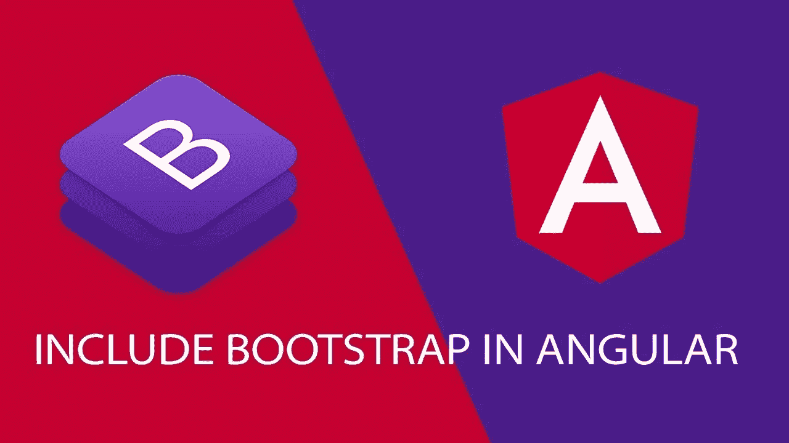

# 如何在你的角度项目中使用 Bootstrap

> 原文：<https://levelup.gitconnected.com/how-to-use-bootstrap-in-your-angular-project-7e12f94c4d04>



在这篇文章中，我们将看看如何在你的 Angular 项目中设置 Bootstrap。我总是更喜欢在我的项目中使用 Bootstrap 使样式更加容易，不必自己写出所有的 CSS。

# 款式

现在，你可能会想，为什么不像这样使用一个<链接>标签将引导 CDN 包含在*index.html*中:

这种方法的缺点是，如果在连接到 CDN 服务器时出现任何问题，我们的整个风格都会中断，相信我，这是一个令人心碎的场景——我经历过。这就是为什么在本地设置 Bootstrap 总是好的。我们如何做到这一点，是我们将要看到的。

# 安装引导软件包

通过在项目目录中运行以下命令，可以将 Bootstrap 安装在项目目录中。

```
npm i bootstrap --save
```

# 链接 CSS

CSS 链接可以通过两种方式完成，如下所述:

打开 *angular.json* (或者在 Angular CLI 的早期版本中为 *angular-cli.json* )，将下面一行添加到“样式”部分，使其看起来像这样:

# 运筹学

**更新 styles.css 文件**

这种方法更老派，尽管出于多种原因，它更整洁、更好。我们在这里所做的，是打开位于项目目录的" *src* "文件夹中的" *styles.css* "文件，并在它的顶部添加下面的 import 语句，使它看起来像这样:

一旦你正确地完成了上面的步骤，你现在就可以很容易地开始在你的项目中使用 Bootstrap 类了——在整个项目中，你不必为每一个样式和响应性设计需求编写 CSS 了。

# 动画

这就是风格。现在是相对更具挑战性的部分——在应用程序中添加引导动画，如模态、弹出窗口等等。

在你的应用程序中安装/添加 Bootstrap 将不允许使用 modals 之类的东西，仅仅是因为它们需要比普通的 Bootstrap 更多的东西来工作。

因此，我们的第一步是添加这些函数所需的依赖项。你这样做，运行以下命令:

`npm i jquery tether --save`

我们在这里所做的是为 jQuery 和 tether.js 安装 NPM 包，这些依赖项将为所有漂亮的视觉效果注入活力，比如模态和滑块。

下一部分很简单，你可能已经猜到了；也就是说，通知项目它必须为我们准备好这些依赖关系。为了做到这一点，我们编辑我们心爱的 *angular.json* 文件二，保存下面的“代码”位。

这应该可以了！你现在可以在你的角度应用程序中拥有所有漂亮的模态和下拉框以及 Bootstrap 所没有的东西。

*快乐自举！*

> 有兴趣和我就这个故事或 Angular、Typescript 和 Javascript 进行一对一的交谈吗？前往[聘请作者](https://www.hiretheauthor.com/ashwinSathian)，让我们连线！