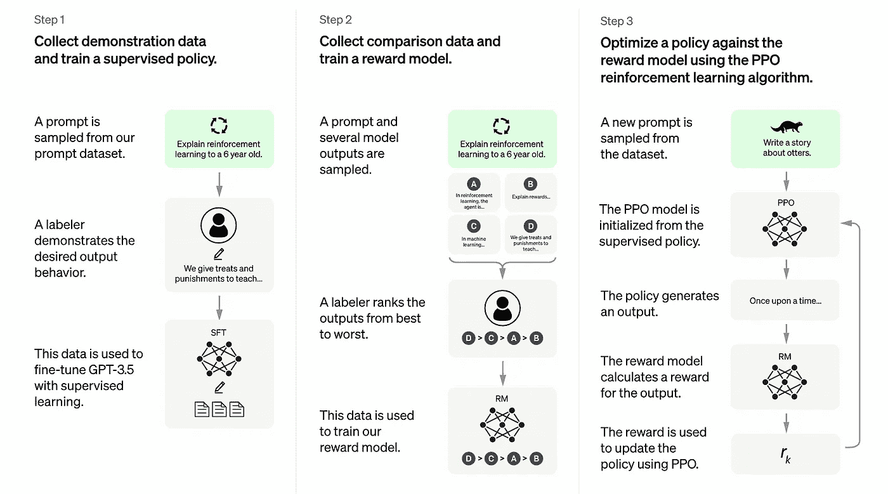

# 开发者如何使用 ChatGPT

> 原文：<https://levelup.gitconnected.com/how-to-use-chatgpt-for-developers-4e7f354bbc02>

## 只有正确使用它，它才是一个强大的工具

使用 [DALL-E 2](https://openai.com/dall-e-2/) 生成的图像给出提示“*一个人工智能机器人在山顶俯瞰一个被毁灭的社会*

ChatGPT 无疑是公众所知的最知名的人工智能模型。随着它的流行，人们一直试图用它来完成各种任务。有些人已经用它来产生文章，其他人试图回答高度哲学的问题，但我最感兴趣的是软件开发和工程用途。

如何看待 ChatGPT 有一个潜在的问题，这导致了对它的不正确使用。由于围绕它的头条新闻，许多人被愚弄了，认为它是一个无所不知的存在，不会犯错，也不会做错事，它是一个“更好的谷歌”，会给你每个问题精确的答案。

我们越早明白事实并非如此，我们就能越早真正有效地利用它。

## 但首先，ChatGPT 到底是什么？

使用 [DALL-E 2](https://openai.com/dall-e-2/) 生成的图像给出提示“一个神经网络”

ChatGPT 是一个**语言**模型。它与用户进行对话式互动，用户输入一个问题或一个提示，模型做出响应，然后对话可以来回继续，就像你在消息应用程序上给真人发消息一样。

从其[网站](https://openai.com/blog/chatgpt/)上，以下是对训练 ChatGPT 模型背后的方法论的解释:

*我们使用来自人类反馈的强化学习(RLHF)来训练该模型，使用与 InstructGPT 相同的方法，但在数据收集设置上略有不同。我们使用监督微调训练了一个初始模型:人类人工智能训练员提供对话，他们扮演双方——用户和人工智能助理。我们让培训师访问模型编写的建议，以帮助他们撰写回答。*

*为了创建强化学习的奖励模型，我们需要收集比较数据，这些数据由两个或更多按质量排序的模型响应组成。为了收集这些数据，我们听取了人工智能训练员与聊天机器人的对话。我们随机选择了一个模型编写的消息，对几个可选的完成进行了采样，并让人工智能训练器对它们进行排序。使用这些奖励模型，我们可以使用* [*近端策略优化*](https://openai.com/blog/openai-baselines-ppo/) *对模型进行微调。我们执行了这个过程的几次迭代。*

## ChatGPT 的局限性

使用 [DALL-E 2](https://openai.com/dall-e-2/) 生成的图像给出了提示“一个机器人撞上了一堵墙，摔成了碎片”

希望这澄清了很多关于 ChatGPT 的问题，并消除了围绕它的一些神秘感。ChatGPT 团队还提到了该模型的局限性，包括:

*   该模型可能产生正确的声音，但不正确的答案。那是因为模型本身对代码没有真正的内在理解，而是知道正确的代码“看起来像什么”。请记住，这是一个基于数据训练的模型，而不是实际的软件工程师。
*   重新措辞会导致完全不同的结果。对于“正确答案”的最高概率，要求输入提示极其精确。
*   这让我想到了另一个限制，即“正确答案”可能并不存在。ChatGPT 的答案是由人类验证的，没有一个集中的真理来源，不同的人会将不同的答案排列为“正确答案”。
*   您可能无法从第一个问题中得到您想要的答案，您需要继续与模型对话，进行改进和重新措辞，以最终得到您想要的答案。
*   它接受训练的数据仅限于 2021 年的数据。所以通常情况下，这个模型会落后于最新的行业标准，我会产生一些不推荐的代码。

## 如何不使用 ChatGPT

使用 [DALL-E 2](https://openai.com/dall-e-2/) 生成的图像给出提示“人类误用工具”

现在我们了解了 ChatGPT 是什么和不是什么，让我们讨论一下如何绝对不使用它:

*   **不要用它来学习如何编码**。生成的代码不能保证是正确的。它可能是功能性的，但是即使它是功能性的，它也可能不是编码的最佳方式。例如:当我让它编写 React 组件时，我注意到它使用了一个通用的 props 项，并且没有按照行业标准明确定义每个属性。此外，它不会自动将相似的代码抽象成函数，因此代码通常过于冗长。
*   不要用它来生成需要大量上下文的代码。如果你想让模特完成你的工作，我有个坏消息要告诉你。向模型提供整个代码库或产品的上下文是不可能的，所以如果你对如何完成任务还没有一个很好的想法，那么 ChatGPT 实际上是没有多大帮助的。
*   不要将它用于学校或大学的作业。除了答案可能不正确的事实，以及其他学生可能会出于同样的目的使用它导致剽窃检测，你不会学到。在我接受软件工程的正规教育期间，解决任务是让我成长最多的事情。不是讲座，是作业教会了我最多的东西，所以如果你用 ChatGPT 作弊，你只是在欺骗自己放弃更好的职业。

## 如何使用 ChatGPT

使用 [DALL-E 2](https://openai.com/dall-e-2/) 生成的图像，提示“机器人与人类牵手”

*   **用它来帮助你发现代码中的错误**。如果您有一段调试起来有问题的代码，您可以将它放入 ChatGPT，其中包含您所期望的和实际发生的信息。该模型也许能够帮助您找到问题。
*   使用它来帮助在你的代码中找到边缘情况。这个模型有很强的计算能力，所以它可能会产生一些你的代码可能会失败的边缘情况，而你可能无法很快地识别出这些情况。
*   **用于产品创意**。问 it 产品相关的问题可以让你快速得到一个基于其他产品和想法的软件用例列表。这通常不会产生创新的想法，但它会帮助你找到你的产品与其他产品相比的差距。
*   **用它来写测试用例。** ChatGPT 在编写单元测试方面是有能力的，从模型中获取测试用例的风险很低，因为如果它们是错误的，它们就会失败，如果它没有测试它应该测试的东西，它们将会被错误地表达出来。此外，由于单元测试通常是直接的，假设您输入以下格式:用输入 a、b 和 c 测试组件 X，并期望输出为 y，那么模型得到正确结果的概率很高。
*   **使用它获得架构和基础设施选项**。在评估一项任务的不同策略时，如果您知道需要对基础设施进行更改，那么询问 ChatGPT 的意见可能会有所帮助。它可以给你一些想法，但不要完全依赖它的答案，如果你不确定该走哪条路，它应该只是一个灵感的来源。

# 分级编码

感谢您成为我们社区的一员！在你离开之前:

*   👏为故事鼓掌，跟着作者走👉
*   📰查看[升级编码出版物](https://levelup.gitconnected.com/?utm_source=pub&utm_medium=post)中的更多内容
*   🔔关注我们:[Twitter](https://twitter.com/gitconnected)|[LinkedIn](https://www.linkedin.com/company/gitconnected)|[时事通讯](https://newsletter.levelup.dev)

🚀👉 [**加入升级达人集体，找到一份惊艳的工作**](https://jobs.levelup.dev/talent/welcome?referral=true)