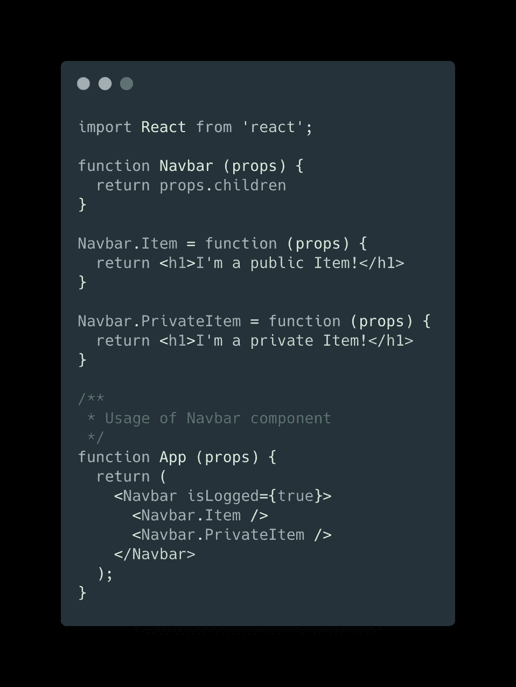
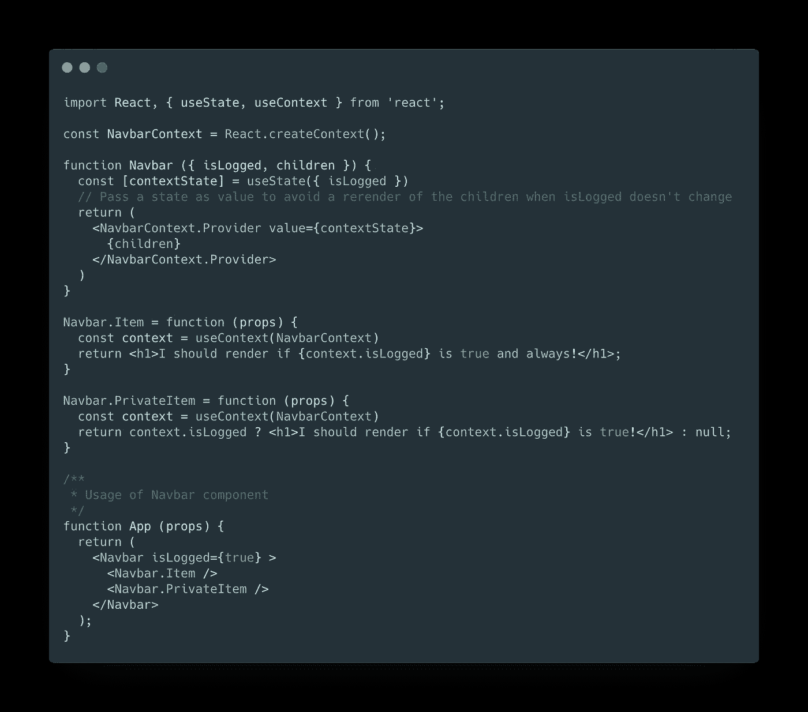
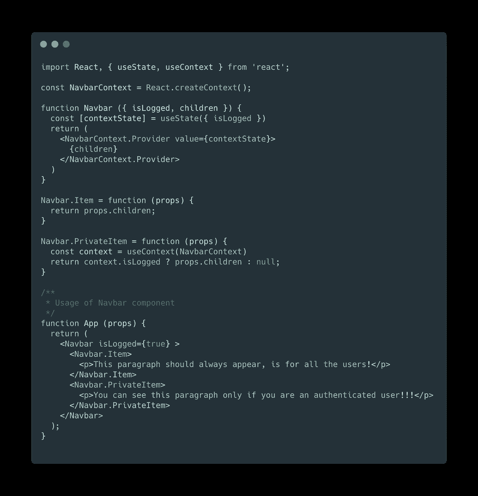
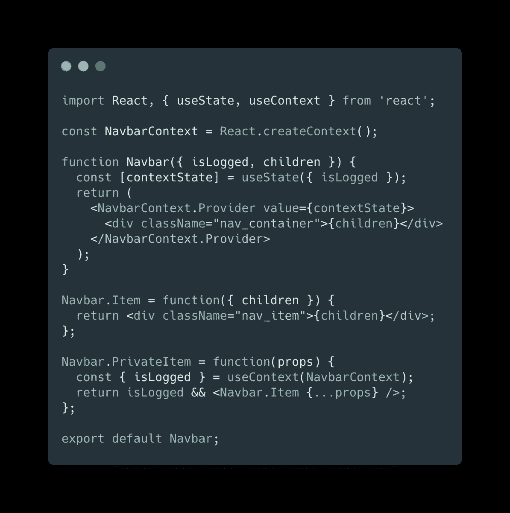

# 如何在 React 中使用组件组合创建灵活的复合组件

> 原文：<https://levelup.gitconnected.com/how-to-use-component-composition-to-create-a-flexible-compound-component-in-react-4024660b9613>

## 按照组合模式创建坚固而灵活的 React 组件。

Gabriel Crismariu 在 [Unsplash](https://unsplash.com?utm_source=medium&utm_medium=referral) 上拍摄的照片

当我开始使用 React 时，我立即感受到了它的 API 给前端开发带来的灵活性。创建一个 web 组件似乎更容易，我们的特设元素完美地完成了它们的工作。当我开始在[***Codeworks***](https://codeworks.me/?cw_source=medium&cw_medium=organic&cw_campaign=marco_ghiani_gitcommit_create_flexible_compound)*当我作为一名 JavaScript 讲师深入 React 时，我也意识到我没有恰当地利用这个库的功能，我发现我们的组件不仅仅是状态和道具。*

*知道了如何使用 React 的概念，我们可以创建非常灵活的组件来适应我们应用程序的多种场景。受到 Kent C. Dodds 和他对社区的巨大贡献的启发，我想帮助你理解一种不同的模式，使你的代码更加强大。*

# *有什么问题？*

*我们想要创建一个简单的 navbar，它能够呈现元素列表，并且我们想要只在特定的情况下显示其中的一些元素。现在让我们假设我们的 navbar 可以向所有用户显示公共元素，而某些元素只向那些登录到平台的用户显示。*

**

*照片由[Olav Ahrens rtne](https://unsplash.com/@olav_ahrens?utm_source=medium&utm_medium=referral)在 [Unsplash](https://unsplash.com?utm_source=medium&utm_medium=referral) 上拍摄*

*导航栏中的项目将会很复杂，它应该能够无缝地处理不同的场景。我们需要创建一个组件，它使用一个单独的道具来决定某些元素是否应该渲染。让我们开始创建您的第一个复合组件吧！*

# *指定您的组件需要什么*

*因为我们想要创建一个具有公共和私有特征的 navbar，所以我们需要`Navbar`组件。这个组件应该接收一个属性来确定一个元素是公共的还是私有的，所以我们可以保持简单。我们将使用一个`**isLogged***<boolean>*`道具。*

*此时，定义该组件的角色是至关重要的。它将呈现任何子节点，并将该属性(或任何其他道具，如果我们开发了应用程序的话)传递给它们。但是第一个问题来了——我们不想把这个道具传递给每个孩子，或者通过组件向下钻取道具，特别是因为我们可以包含其他非 React 元素。为此，我们将使用`React.Context`来修复它。*

*我们希望将另外两个组件定义为 Navbar 功能组件的静态属性。让我们称他们为`Navbar.Item`和`Navbar.PrivateItem`。*

*总结一下我们现在所拥有的:*

*   ***导航条***
*   ***导航条。项目***
*   ***导航条。私人物品***

*现在我们有了组件框架，让我们通过传递组件道具来添加一些逻辑。*

**

# *把所有道具传给每个孩子*

*如前所述，`Navbar`组件接收`isLogged`道具，我们希望将它转发给每个子元素，使它们能够决定是否应该呈现。但是我们如何把这个道具，或者任何其他的道具，传递给孩子们，避免任何形式的道具钻呢？此外，我们可能面临的另一个问题是子列表中非 React 元素的存在，我们并不真的想将`isLogged`属性传递给任何`div`或其他任何东西！*

*为了达到这个结果，我们利用`React.Context` *，*向所有需要访问`isLogged`属性的子元素和嵌套元素提供数据。这样做，我们可以为子组件创建一个条件渲染:*

**

*使用 React 上下文来避免道具演练。*

*此时，我们可以自由地向`Navbar`中插入尽可能多的公共或私有项目，但是总是添加一个 H1 似乎并没有真正的意义。使用该组件的真正原因是抽象出`Navbar`项的条件呈现的逻辑。现在重要的是能够根据记录的条件呈现我们想要的任何内容。*

# *组成作品*

*最后，我们将为此目的完成组件。我们想要做的是在每个项目中呈现我们选择的东西，可以是一些文本，只是一个简单的图标。为了获得预期的结果，有必要呈现每个项目的子项目，去掉我们之前使用的 H1 标签，例如:*

**

# *最后一笔*

*这就是创建灵活的复合组件所需的全部内容！这是一个简单的例子，但是您可以按照不同的和更复杂的逻辑来组合您的组件。为了完成组件，最后一个片段展示了我将如何亲自编写整个组件:*

**

*重复使用导航条。项有条件地呈现具有相同形状的私有项*

> *关于这个话题的评论、分享和讨论总是被接受的，我很乐意回答你的任何问题！*

*感谢您阅读文章！*

* [## 重构复杂的 React 组件——编写高效可读组件的 5 个最佳实践

### 使用最佳实践编写高效可读的 React 组件的 5 条规则

levelup.gitconnected.com](/refactoring-a-complex-react-component-5-best-practices-to-write-efficient-and-readable-components-b0d06f4f22b4)  [## Javascript 技巧#4:数组平面和平面图实现

### 对新的 flat 和 flatMap 方法的潜力的有用介绍

medium.com](https://medium.com/better-programming/javascript-tips-4-array-flat-and-flatmap-implementation-2f81e618bde)  [## JavaScript 技巧#3:将错误优先回调函数转换为承诺

### JavaScript 异步概述和保证错误优先回调的实用程序

medium.com](https://medium.com/better-programming/javascript-tips-3-convert-error-first-callback-functions-to-promises-f2561d2aaefd)  [## JavaScript 技巧#2:对象/数组深度克隆实现

### JavaScript 中深度克隆方法的简单实现

medium.com](https://medium.com/better-programming/javascript-tips-2-object-array-deep-clone-implementation-2d6a43e43d2a)  [## JavaScript 技巧#1:对象属性的过滤方法

### 应用于对象属性的过滤器数组方法的简单 JavaScript 聚合填充

medium.com](https://medium.com/better-programming/javascript-tips-1-the-filter-method-for-object-properties-a2d6869b5127)*