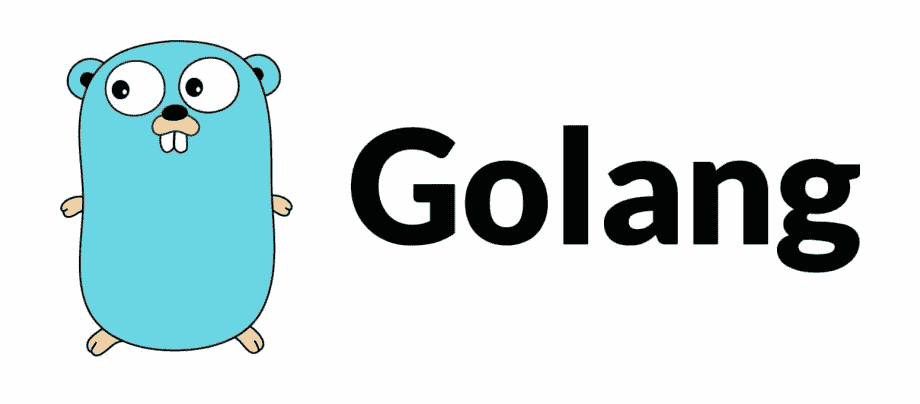

# 像老板一样管理孩子的日常事务。语境

> 原文：<https://levelup.gitconnected.com/how-to-use-context-to-manage-your-goroutines-like-a-boss-ef1e478919e6>



## 牛逼围棋— #2

如果你曾经使用过 Go，你可能会意识到它内置的现代并发编程模型是 Go 最好的特性之一，并使它从其他编程语言中脱颖而出。在 Go at glance 中编写并发代码看起来非常容易，只需:

```
**go** task1()
**go** task2()
```

然后你有你的主 goroutine，`task1`和`task2`并发运行，你根本不用关心线程。Go 将尽力为您有效利用资源。

同步也很容易。使用通道编程模型，只需通过通道进行通信(交换消息)即可。您的 goroutines 将无缝同步，这被称为“**不要让计算通过共享内存进行通信，让它们通过通道**进行通信来共享内存”。

然而，当涉及到管理多个 goroutines 时，Go 不再支持开箱即用的一切。当您的主 goroutine 退出时，其他 go routine 会继续运行，您负责清理它们。Go 内置了包`context`和`sync`来与管理 goroutines 的通道进行交互，但是要实现这样的用例，还需要一点研究和理解。

# 语境。语境

正如官方 Go 文档中所描述的，`context.Context`携带截止日期、取消信号和其他跨边界和跨进程的范围值。

## 基本用法

上下文表示附加 goroutines 的范围或生存期。当您看到如下所示的函数签名时:

```
*// Task is a function that can be and should be run as goroutine,
// it can be cancelled by cancelling the input context.*
**func** Task(context.Context, ...args interface{})
```

这意味着您可以使用如下功能:

```
**func** main() {
    *// Create a new context being cancelled in 5 seconds.*
    ctx, _ := context.WithTimeout(context.Background(), 5 * time.Second) *// Start a new goroutine whose lifetime's attached to ctx.*
    **go** task(ctx, args...)
}
```

上面的代码意味着如果`task`功能持续超过 5 秒，它将被取消，这有助于避免泄漏 goroutines。

您应该按照上面显示的方式设计自己的 API。当您有一些长期运行的函数时，可以考虑将它们的生存期附加到上下文中。

## 创建和派生上下文

要创建新的空上下文，请使用:

```
*// Create a new, empty, and unexecuted context.*
context.Background()
```

可以导出上下文，一旦父上下文完成，子上下文也就完成了。

```
**func** main() { *// Create a new context.*
    parent, cancelParent := context.WithCancel(context.Background()) *// Derive child contexts from parent.*
    childA, _ := context.WithTimeout(parent, 5 * time.Secound)
    childB, _ := context.WithDeadline(parent, time.Now().Add(1 * time.Minute) **go** func() {
        <-childA.Done()
        <-childB.Done()
        fmt.Println("All children are done")
    }() *// Cancel parent make all children are cancelled.*
    cancelParent()
}*// -> Result: All children are done*
```

*   `context.WithCancel(parentContext)`创建一个新的上下文，该上下文在调用返回的 cancel 函数时或父上下文结束时完成，以先发生的为准。
*   `context.WithTimeout(contextContext, 5 * time.Second)`创建一个新的上下文，该上下文在调用返回的取消函数、超时或父上下文结束时结束，以先发生的为准。
*   `context.WithDeadline(parentContext, time.Now().Add(1 * time.Minute)`创建一个新的上下文，该上下文在返回的取消函数截止时间到期时或父上下文完成时结束，以先发生者为准。

还有其他一些方法来推导上下文。点击查看[了解更多详情。](https://golang.org/pkg/context/#example_WithCancel)

# 管理子 Goroutines

现在让我们用`context.Context`解决一个现实世界中常见的问题。

以下是并发编程中一个非常常见的用例:

> “您有两个任务 A 和 b。您的主 goroutine 分支 N 个 goroutine(workers)运行任务 A，M 个 go routine(workers)运行任务 b。当您的主 go routine 完成时(例如，用户请求关闭应用程序)，您如何优雅地关闭所有子任务？”