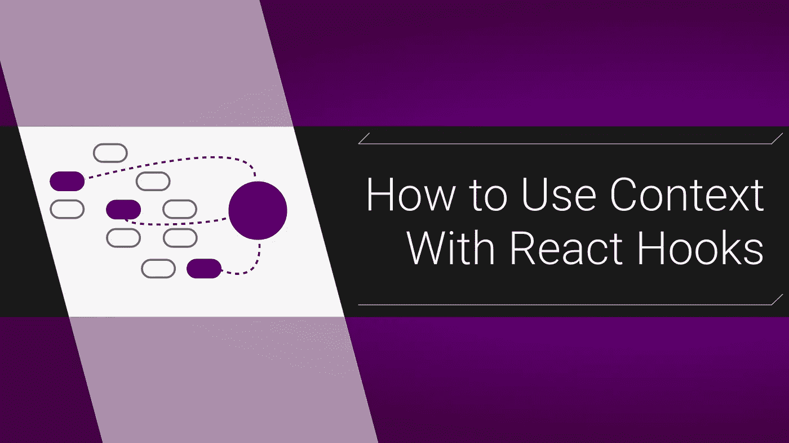

# 如何将上下文与 React 挂钩一起使用

> 原文：<https://levelup.gitconnected.com/how-to-use-context-with-react-hooks-5591a4010689>

## Redux 的一个很好的替代品



[上下文](https://reactjs.org/docs/context.html)可能是我最喜欢的 React 特性，尤其是在使用[钩子的时候。这不再是前沿技术了，所以你应该花点时间了解一下它是如何工作的。我们将创建一个上下文组件，然后在我们的主应用程序中读取/设置它的值。这将是一个非常简单的项目，但它展示了基础知识，以及如何在未来的基础上进行构建。下面是 GitHub](https://reactjs.org/docs/hooks-intro.html) 上的[代码。](https://github.com/MostlyFocusedMike/context-template)

# 什么是语境？

Context 让您拥有可以从项目中的任何位置访问的全局属性和函数。Redux 就是这么做的，区分 Redux 和上下文的最好方法是大小:上下文更小更简单。Redux Store 的模型通常是一个复杂的、不可变的对象，而对于 Context，如果您将它想象成一个可以与任何其他组件对话的浮动组件，会更有帮助。你也不必使用减速器，这也可以大大简化事情。

## 设置

使用 create-react-app 就可以了。我们不会有任何外部依赖。我们将创建一个上下文组件，给它一个内部状态，然后与应用程序的其余部分共享该状态。我们的应用程序实际上要做的就是将输入字符串保存到上下文中。我鼓励你去读它们。知道钩子和状态版本是很好的，因为你的公司可能没有使用最新的 React。

# 步骤 1:创建上下文组件

在`src/`中创建一个`context/`目录，并将`index.js`和`ContextProvider.js`放入其中。先来填一下`index.js`:

```
*import* **React** from '*react*';*const* **AppContext** = **React**.createContext({});**export** *default* **AppContext**;
```

我将解释第二行，但首先让我们也创建`ContextProvider.js`:

```
import **React**, { **useState** } from 'react';
import **AppContext** from '.';*const* **ContextProvider** = ({ **children** }) => {
  *const* [**example**, **setExample**] = **useState**('*Hello there*')
  *const* **context** = {
    **setExample**,
    **example**,
  }; return (
    <**AppContext.Provider** value={ **context** }> 
      {**children**}
    </**AppContext.Provider**>
  );
}**export** *default* **ContextProvider**;
```

# 步骤 1a:我们做了什么

好了，我们来说说`createContext`和`AppContext.Provider`。我们实际上在`index.js`中创建了我们的上下文，如果你愿意，这是“原始”上下文。看，上下文本身实际上只是一个值，但是 React 将它合并到它的系统中，并赋予它`Consumer`和`Provider`组件。现在，钩子让我们绕过了对`Consumer`组件的需求，但是我们仍然需要一个父`Provider`组件。

我们的提供者组件所做的是获取一个`value`(我们称它为`context`，但是它可以被命名为任何东西)，然后使它可以被任何`children`组件访问。这个`value`实际上是我们的全球商店。另外，如果你不熟悉`children`道具，我们将在下一步讨论它。

## 内部状态

注意我们传递给我们的`context`值的内容:这是一个`useState`钩子和它的伴随值。这是这个设置最好的部分，我们只是跟踪一个常规组件的状态。当一个外部组件需要更新存储时，没有什么神奇的，它只是更新上下文组件的内部状态。这种变化随后被更新，就像一个不同版本的道具。除了*数据存储的地方*之外，这里没有什么新的东西。你当然可以给这个对象添加任何你喜欢的东西，但是现在我们保持它的基本框架。

# 第二步:将你的背景插入你的应用程序

为了让上下文做任何事情，我们需要让它可用。我们的`ContextProvider`组件的任何子组件都可以访问商店。这意味着，我们需要把它放在组件链中非常高的位置，所以我通常把它放在`src/index.js`文件的顶部:

```
import **React** from '*react*';
import **ReactDOM** from *'react-dom';*
import **ContextProvider** from *'./context/ContextProvider';*
import **App** from '*./App*';**ReactDOM**.render(
  <**React**.StrictMode>
    <**ContextProvider**>
      <**App** />
    </**ContextProvider**>
  </**React**.StrictMode>,
  **document**.getElementById('*root*')
);
```

这也是我们`ContextProvider`中`children`道具发挥作用的地方。回想一下我们的提供商组件中的退货声明:

```
return (
  <**AppContext**.Provider value={ **context** }>
    {**children**}
  </**AppContext**.Provider>
);
```

通过将`<App>`嵌套在`<ContextPrivider>`中，我们的主应用程序及其所有子组件现在都是`<AppContext.Provider>`组件的子组件。这实际上让我们的应用程序可以访问我们的上下文，并防止不必要的渲染。如果你不熟悉，这里有一篇关于道具的快速文章。

# 步骤 3:在组件中使用上下文

好了，我们走吧！我们要做的只是一个小表单，让我们在上下文中设置`example`的字符串值。我们将用`useEffect`钩子和控制台日志来显示它。我们将使事情变得简单，并在我们的主`src/app.js`文件中完成所有操作:

```
*import* **React**, { **useContext**, **useState**, **useEffect** } from 'react';
*import* '*./App.css*';
*import* **AppContext** from '*./context*';*const* **App** = () => {
  *const* { **example**, **setExample** } = **useContext**(**AppContext**);
  *const* [**formText**, **setFormText**] = **useState**(''); **useEffect**(() => {
    **console**.log('*context here: '*, **example**);
  }, [**example**]);

  *const* **handleChange** = (**e**) => {
    **setFormText**(**e**.target.value);
  }; *const* **handleSubmit** = (**e**) => {
    **e**.preventDefault();
    **setExample**(**formText**);
  };

  return (
    <**div** className="*App*">
    <**form** onSubmit={**handleSubmit**}>
      <**label** htmlFor="example">Example: </**label**>
      <**input**
        type='*text*'
        value={**formText**}
        onChange={**handleChange**}
      />
      <**button**>DO IT</**button**>
    </**form**>
    </**div**>
  );
};*export* *default* **App**;
```

这是全部，这是使用上下文的部分:

```
*import* **AppContext** from '*./context*'; 
// ...
*const* **App** = () => {
  *const* { **example**, **setExample** } = **useContext**(**AppContext**); **useEffect**(() => {
    **console**.log('*context here: '*, **example**);
  }, [**example**]);// ... *const* **handleSubmit** = (**e**) => {
    **e**.preventDefault();
    **setExample**(**formText**);
  };

  return (
// ...
      <**input**
        type='*text*'
        value={**formText**}
        onChange={**handleChange**}
      />
```

我们只需将我们的上下文输入到`useContext`钩子中，然后取出我们想要使用的属性。使用这些属性的方式与使用`useState`函数或值的方式非常相似。记住上下文对象是在`index`中定义的，而不是在`ContextProvider`组件中定义的，它只在一个地方使用过。这出奇的简单，但这都要归功于钩子。它们一起无缝地工作，这种环境非常适合。

# 差不多就是这样

在基于类的组件中使用上下文时，曾经有一点华丽和环境，但是钩子使它像另一个`useState`(如果你需要基于类的组件，[查看 Wes Bos 的教程](https://www.youtube.com/watch?v=XLJN4JfniH4)，我只是为钩子修改了模式)。当然，事情可以变得更加复杂，比如多个上下文或者用一个`useReducer`代替`useState`，但是在它的核心，这是一个简单的概念。

大家编码快乐，

麦克风