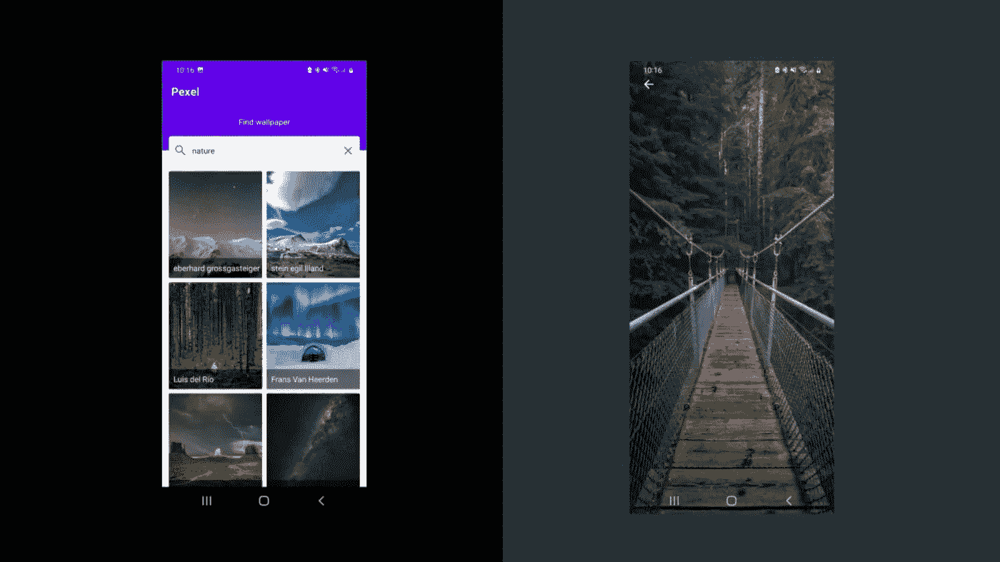

# 如何在 Android 中使用数据绑定

> 原文：<https://levelup.gitconnected.com/how-to-use-data-binding-in-android-658fb0d139c3>

## 让你的代码更具可读性


Emil Widlund 在 [Unsplash](https://unsplash.com?utm_source=medium&utm_medium=referral) 上拍摄的照片

数据绑定被认为是现代 android 开发中的最佳实践之一。它是 android jetpack 的一部分。它消除了有时成本高昂的操作`findViewById()`。数据绑定有很多好处。它使我们的代码简洁，易于维护，可读性强。

首先，我们会知道什么是数据绑定。根据官方文件

> 数据绑定库是一个支持库，允许您使用声明性格式而非编程方式将布局中的 UI 组件绑定到应用程序中的数据源。

# 我们在读什么



这是一个很棒的应用程序。不是吗？

这个应用程序是使用 MVVM 结构和许多其他现代 android 组件制作的。今天我们将看到我是如何在这个项目中实现数据绑定的。

对于本文，使用这个 [**GitHub**](https://github.com/Farhandroid/Pexel) 存储库。请随意检查。我们开始吧

# 数据绑定在起作用

首先，在你的应用程序模块的`build.gradle`文件中启用`dataBinding`构建选项。

```
android {
    ...
    buildFeatures {
        dataBinding true
    }
}
```

为了生成一个绑定类，我们需要将我们的布局包装在`<layout></layout>`标签中。举个例子，让我们看看下面的`fragment_image_viewer.xml`。

你可以看到，我不是从`ConstraintLayout`开始，而是从`<layout></layout>`标签开始。稍后我会谈到`<data></data>`标签。现在设置已经完成，如果我们构建我们的项目，将会生成绑定类。

绑定有一个命名约定。它接受 XML 布局的名称，删除下划线，并使每个名称以大写字母开头。然后在末尾加上绑定。迷茫？举个例子，

> `fragment_image_viewer.xml -> FragmentImageViewerBinding`

我希望现在清楚了。

# 如何访问绑定

由于构建已经完成，现在我们可以像下面这样访问绑定。

```
private var _binding: FragmentImageViewerBinding? = null
private val binding get*()* = _binding!!
```

你可以看到`_binding`的数据类型是`FragmentImageViewerBinding`。你可能会问，我们不能像正常变量一样访问`FragmentImageViewerBinding`吗？。是的，你可以。但是在这种情况下，有可能会发生内存泄漏。如果你想知道更多关于 android 内存泄漏的信息，请查看这篇[文章](/how-to-handle-a-memory-leak-in-android-d6e7e1ea435b)。

之前我们使用`setContentView`来设置布局，但是我们可以像下面这样做

```
override fun onCreateView(
    inflater: LayoutInflater, container: ViewGroup?,
    savedInstanceState: Bundle?,
): View? {
    // Inflate the layout for this fragment
    _binding = FragmentImageViewerBinding.inflate(inflater, container, false)
    return binding.root
}
```

现在我们可以使用`binding`变量来访问我们的布局组件，并执行与布局相关的操作。例如，我们可以使用`binding.textView.text = "text"`在文本视图中设置文本。

# 什么是数据标签

前面我已经说过，我将在后面讨论`<data></data>`标签。现在是时候谈谈了。

简单地说，`<data>`声明有一个数据，而`<variable>`标签描述了数据的名称和类型。您可以通过简单的`"@{variable_name}"`来访问 XML 中的值。您可以在`<variable>`标签中传递任何类型的数据以及自定义对象。这就是数据绑定的美妙之处。

在上面的例子中，你可以看到如下

```
*<*data*>
    <*variable
        name="imageSrc"
        type="com.farhan.tanvir.pexels.data.model.Src" */>
</*data*>*
```

这里变量名是`imageSrc`，类型是一个定制对象(在本例中是数据类)。您可以通过`binding.imageSrc = imageSrc`从`ImageViewerFragment`设置变量`imageSrc`。现在你可以通过`"@{imageSrc}"`访问布局中的`imageSrc`变量。

# 如何使用自定义数据绑定

数据绑定的另一个优点是定制。让我们创建一个自定义数据绑定，它将在 ImageView 中加载图像。

在这里，我创建了一个自定义绑定名称`loadImageFromUrl`，它将在`ImageView`中加载图像。我们可以在 XML 布局的 ImageView 中使用这个自定义绑定，如下所示。

```
*<*ImageView
    loadImageFromUrl="@{imageUrl}"
    android:id="@+id/wallpaperImageView"
   */>*
```

它现在将在`ImageView`中加载图像。太棒了。不是吗？

今天到此为止。希望你学到了有用的东西。

如果你有什么建议，请在评论中分享。直到我们再次见面…干杯！

```
**Want to Connect?**If you want to, you can connect with me on [**Twitter**](https://twitter.com/FarhanT99598254) or [**LinkedIn**](https://www.linkedin.com/in/farhan-tanvir-b08520151/).
```