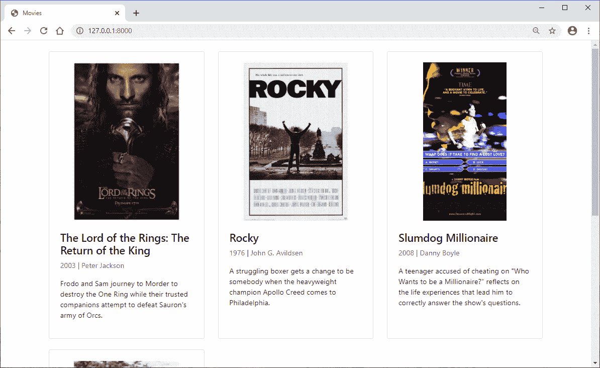
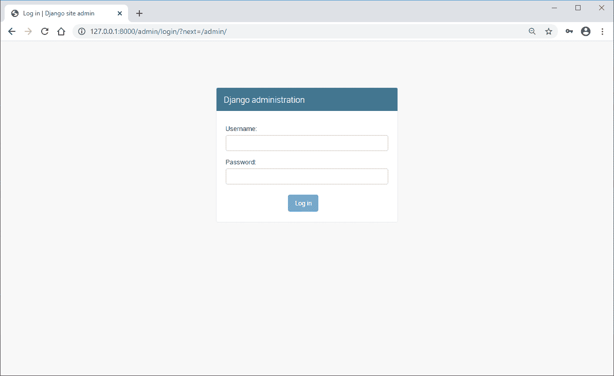
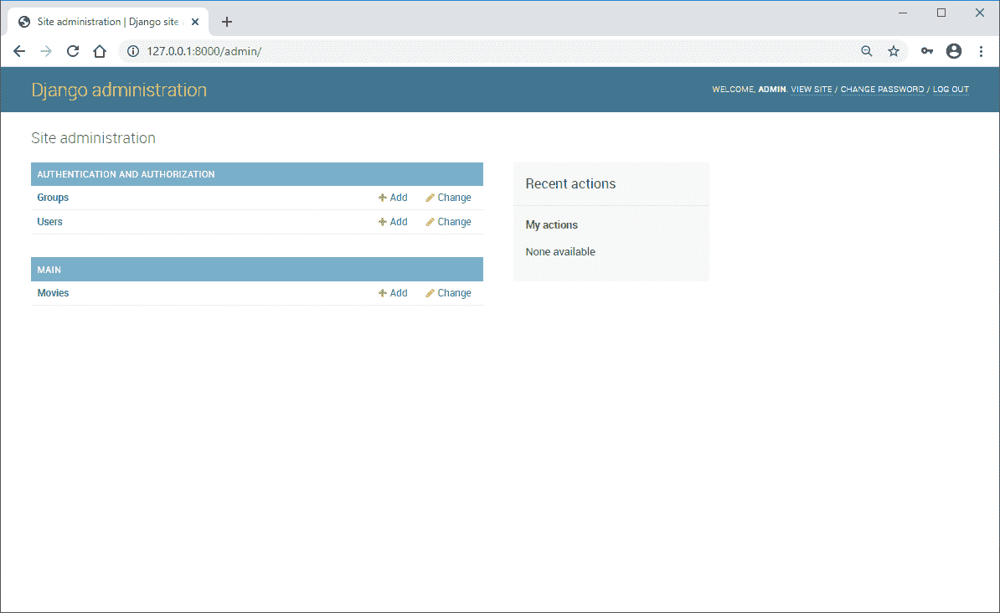
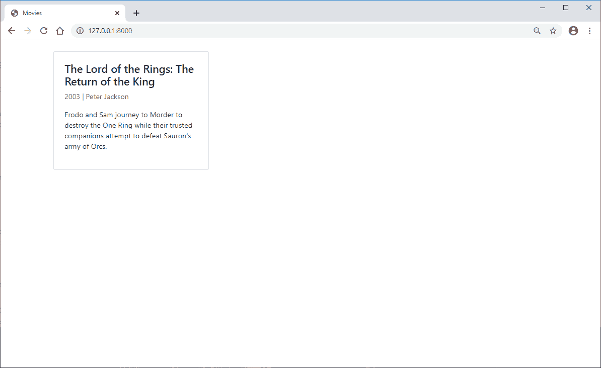
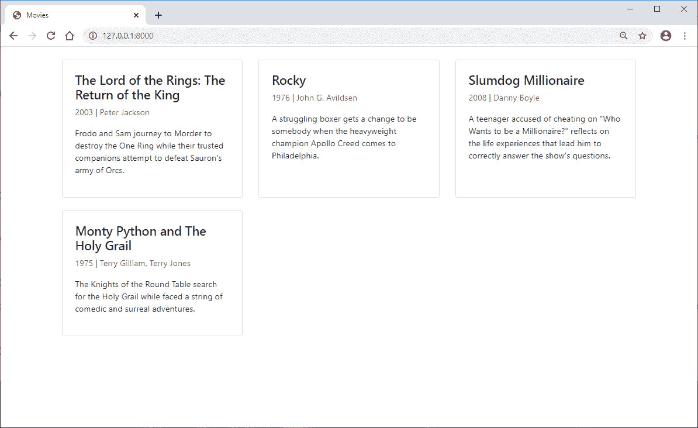
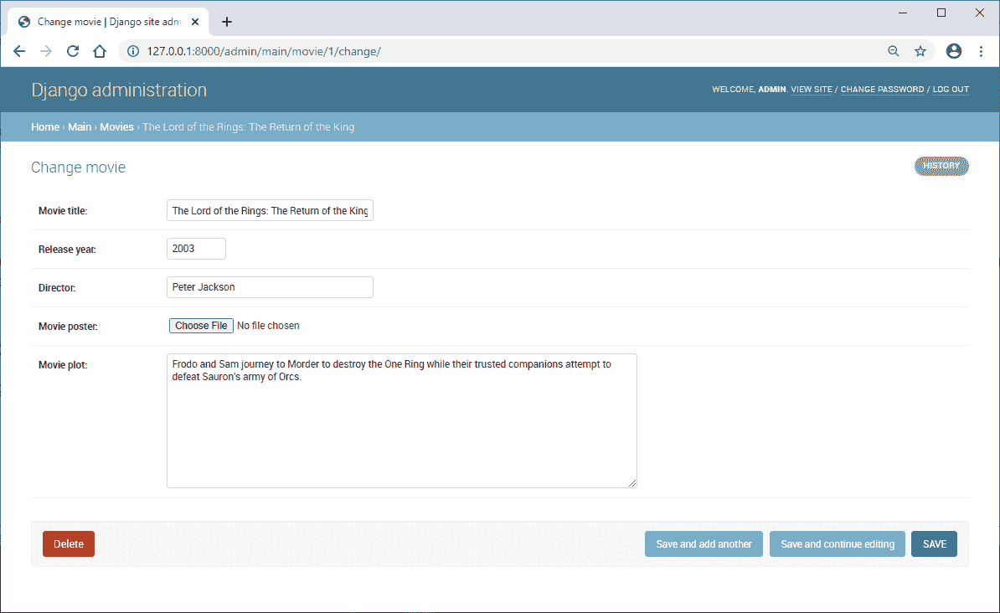
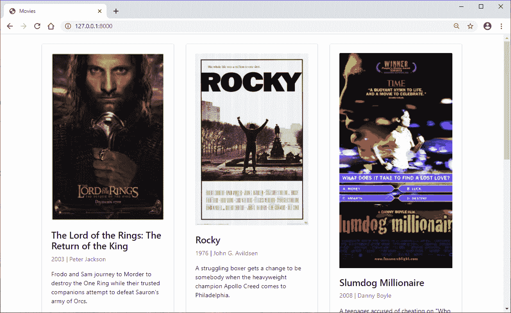

# 如何使用 Django 模型

> 原文：<https://levelup.gitconnected.com/how-to-use-django-models-1c8d31c770a7>



# **什么是 Django 模型？**

Django 模型是存储在单个数据库表中的信息和行为的来源。

Django 模型是如何工作的？

把 Django 模型想象成一个蓝图。

每个模型都由需要用户输入的 Django 模型字段组成。

一旦用户完成了必需的字段，模型对象就被保存在数据库中。

然后可以通过 queryset 访问模型的信息，query set 是模型对象的可调用集合。

**您何时使用 Django 模型？**

当您需要在项目中动态加载信息时，可以使用 Django 模型。

例如，如果你创建一个博客，不要硬编码每一篇文章的内容。

创建一个文章模型，将文章标题、URL slug 和内容作为模型字段。

然后，通过基于用户请求动态加载 queryset，为每篇文章使用相同的模板。

要了解更多关于这个过程的信息，请访问 [Django II，第 4 课:创建博客](https://www.ordinarycoders.com/creating-a-blog)。

**是否需要 Django 模型？**

Django 模型在技术上不是必需的，但强烈推荐。

尽可能使用 Django 模型来减少重复代码是一个很好的实践，但最终并不是必需的

对于不变或很少改变的站点信息。

**Django 模型示例**

为了演示 Django 模型的用途，让我们创建一个列出流行电影的 Django 模型示例。

首先，我们将创建模型及其字段，然后登录 Django 管理站点并创建模型对象，最后，我们将使用模板中的 for 循环呈现 queryset。

# **如何在 Django 中创建模型**

```
#*env > mysite > main > models.py*from django.db import models# Create your models here.class Movie(models.Model):
```

首先打开 app 目录文件夹中的 Django *models.py* 文件。

`class Movie`继承评论正下方的`(models.Model)`。

接下来，我们需要指定我们希望在添加到项目中的每个电影下列出的所有信息。

**添加基本 Django 模型字段**

```
#*env > mysite > main > models.py*from django.db import models# Create your models here.class Movie(models.Model):
	movie_title = models.CharField(max_length=150)
	release_year = models.IntegerField()
	director = models.CharField(max_length=100)
	movie_plot = models.TextField()
```

首先，为电影标题添加一个字段。该字段是一个 Django `models.CharField()`或字符字段，最多包含 150 个字符的文本。

接下来，为发布年份添加一个`IntegerField`。

让我们也为导演的名字添加一个字段。

我们将添加的最后一个字段是使用姜戈 `models.Textfield()`的电影情节。此字段允许提交段落文本。

**如何更改 Django 型号显示名称**

```
#*env > mysite > main > models.py*from django.db import models# Create your models here.class Movie(models.Model):
	movie_title = models.CharField(max_length=150)
	release_year = models.IntegerField()
	director = models.CharField(max_length=100)
	movie_plot = models.TextField()  def __str__(self):
		return self.movie_title
```

在我们继续之前，让我们添加一个返回电影标题作为显示名称的函数。

如果你忘记添加这个函数，它会在 Django 管理中列出电影对象(1)，电影对象(2)，等等，很难知道哪个对象对应于一个特定的电影。

**进行 Django 迁移以在数据库中创建模型**

*macOS 终端*

```
(env)User-Macbook:mysite user$ python3 manage.py makemigrations
Migrations for 'main':
  main\migrations\0001_initial.py
    - Create model Movie (env)User-Macbook:mysite user$
```

*Windows 命令提示符*

```
(env) C:\Users\Owner\Desktop\Code\env\mysite>py manage.py makemigrations
Migrations for 'main':
  main\migrations\0001_initial.py
    - Create model Movie(env) C:\Users\Owner\Desktop\Code\env\mysite>
```

为了在 Django admin 中使用模型，我们需要`makemigrations`并创建映射到单个数据库表的模型。

**将模型迁移到数据库**

*macOS 终端*

```
(env)User-Macbook:mysite user$ python3 manage.py migrate
Operations to perform:
  Apply all migrations: admin, auth, contenttypes, main, sessions
Running migrations:
  Applying main.0001_initial... OK (env)User-Macbook:mysite user$
```

*Windows 命令提示符*

```
(env) C:\Users\Owner\Desktop\Code\env\mysite>py manage.py migrate
Operations to perform:
  Apply all migrations: admin, auth, contenttypes, main, sessions
Running migrations:
  Applying main.0001_initial... OK(env) C:\Users\Owner\Desktop\Code\env\mysite>
```

现在有了创建的表，我们可以`migrate`这个模型，这样所有上传到这个模型的信息都将保存到 Django 数据库中， *db.sqilte3* 。

**在 Django admin 中注册模型**

```
#*env > mysite > main > admin.py*from django.contrib import admin
from .models import Movie# Register your models here.admin.site.register(Movie)
```

模型成功添加到数据库后，我们需要将它注册到管理页面，这样我们就可以在 Django 管理页面上访问它。

从页面顶部的 *models.py* 文件中导入`Movie`，然后在下面添加`admin.site.register(Movie)`。

保存文件，否则模型将不会出现在我们即将访问的管理页面上。

# **创建管理员用户名和密码**

*macOS 终端*

```
(env)User-Macbook:mysite user$ python3 manage.py createsuperuser
Username (leave blank to use 'owner'): admin
Email address:
Password: *****
Password (again): *****
Superuser created successfully.(env)User-Macbook:mysite user$ python3 manage.py runserver
```

*Windows 命令提示符*

```
(env) C:\Users\Owner\Desktop\Code\env\mysite>py manage.py createsuperuser
Username (leave blank to use 'owner'): admin
Email address: 
Password: *****
Password (again): *****
Superuser created successfully.(env) C:\Users\Owner\Desktop\Code\env\mysite>py manage.py runserver
```

返回 CLI 并运行项目中的`createsuperuser`命令。输入用户名和密码，然后按 Enter 键跳过可选的电子邮件地址字段。创建用户后，再次运行服务器。这是访问项目管理网站所需的用户名和密码，所以请务必记住它们。

**登录 Django 管理网站**

在一个新标签页中进入[http://127 . 0 . 0 . 1:8000/admin/](http://127.0.0.1:8000/admin/)，使用刚刚创建的用户名和密码登录 Django 管理页面。登录后，您将看到一个界面，在您的应用程序名称“Main”下面列出了模型“Movies”。



**向 Django admin 添加一个模型对象**

现在让我们给模型添加一个电影。点击“电影”,然后点击右上角的“添加电影”按钮。然后您将被带到一个页面，这个页面显示了我们在 models.py 中添加到模型中的字段。



# **渲染模板中的模型**

```
#*env > mysite > main > views.py*from django.shortcuts import render
from .models import Movie# Create your views here.
def movies(request):
	movies = Movie.objects.all() #queryset containing all movies we just created
	return render(request=request, template_name="main/movies.html", context={'movies':movies})
```

是时候在模板中渲染模型了。为此，转到您想要渲染电影的模板的视图函数，在本例中，它是*movies.html*，并向该函数添加一个 queryset。然后在 return render 中，将 movies 设置为模板显示时返回的上下文。

**将路径连接到视图**

```
#*env > mysite > main > urls.py*from django.urls import path
from . import viewsapp_name = "main" urlpatterns = [
    path("", views.movies, name="movies"),
]
```

如果您没有连接到 *views.py* 函数的 URL 路径，请确保向 *main > urls.py* 添加一个，以便视图在浏览器中呈现。

**将 BootstrapCDN 添加到 Django 模板**

```
#*env > mysite > main > templates > main > movies.html*<!DOCTYPE html>
<html>
  <head>
    <!-- Required meta tags -->
    <meta charset="utf-8">
    <meta name="viewport" content="width=device-width, initial-scale=1.0">
    <title>Movies</title>
    <!--Bootstrap CSS-->
    <link rel="stylesheet" href="https://stackpath.bootstrapcdn.com/bootstrap/4.4.1/css/bootstrap.min.css" integrity="sha384-Vkoo8x4CGsO3+Hhxv8T/Q5PaXtkKtu6ug5TOeNV6gBiFeWPGFN9MuhOf23Q9Ifjh" crossorigin="anonymous">
  </head>
  <body> <!-- Optional Javascript -->
    <script src="https://code.jquery.com/jquery-3.4.1.slim.min.js" integrity="sha384-J6qa4849blE2+poT4WnyKhv5vZF5SrPo0iEjwBvKU7imGFAV0wwj1yYfoRSJoZ+n" crossorigin="anonymous"></script>
    <script src="https://cdn.jsdelivr.net/npm/popper.js@1.16.0/dist/umd/popper.min.js" integrity="sha384-Q6E9RHvbIyZFJoft+2mJbHaEWldlvI9IOYy5n3zV9zzTtmI3UksdQRVvoxMfooAo" crossorigin="anonymous"></script>
    <script src="https://stackpath.bootstrapcdn.com/bootstrap/4.4.1/js/bootstrap.min.js" integrity="sha384-wfSDF2E50Y2D1uUdj0O3uMBJnjuUD4Ih7YwaYd1iqfktj0Uod8GCExl3Og8ifwB6" crossorigin="anonymous"></script>
  </body>
</html>
```

接下来，转到 *views.py* 中指定的模板，这样我们就可以将模型添加到模板中。

我们使用 [Bootstrap](https://getbootstrap.com/) 来帮助渲染模板，但是我们将使用 Django 模板语言(DTL)来渲染模型。

**将 Django 模型字段添加到模板中**

```
#*env > mysite > main > templates > main > movies.html*<!DOCTYPE html>
<html>
  <head>
    <!-- Required meta tags -->
    <meta charset="utf-8">
    <meta name="viewport" content="width=device-width, initial-scale=1.0">
    <title>Movies</title>
    <!--Bootstrap CSS-->
    <link rel="stylesheet" href="https://stackpath.bootstrapcdn.com/bootstrap/4.4.1/css/bootstrap.min.css" integrity="sha384-Vkoo8x4CGsO3+Hhxv8T/Q5PaXtkKtu6ug5TOeNV6gBiFeWPGFN9MuhOf23Q9Ifjh" crossorigin="anonymous">
  </head>
  <body>
 <div class="container p-4">
      <div class="row">
        
        <div class="col-lg-4 col-md-6 col-sm-12 pb-4">
          <div class="card h-100 p-4">
            <h4>{{m.movie_title}}</h4>
            <p class="text-muted">{{m.release_year}} | {{m.director}}</p>
            <p>{{m.movie_plot}}</p>
          </div>
        </div>
        
      </div>
    </div> <!-- Optional Javascript -->
    <script src="https://code.jquery.com/jquery-3.4.1.slim.min.js" integrity="sha384-J6qa4849blE2+poT4WnyKhv5vZF5SrPo0iEjwBvKU7imGFAV0wwj1yYfoRSJoZ+n" crossorigin="anonymous"></script>
    <script src="https://cdn.jsdelivr.net/npm/popper.js@1.16.0/dist/umd/popper.min.js" integrity="sha384-Q6E9RHvbIyZFJoft+2mJbHaEWldlvI9IOYy5n3zV9zzTtmI3UksdQRVvoxMfooAo" crossorigin="anonymous"></script>
    <script src="https://stackpath.bootstrapcdn.com/bootstrap/4.4.1/js/bootstrap.min.js" integrity="sha384-wfSDF2E50Y2D1uUdj0O3uMBJnjuUD4Ih7YwaYd1iqfktj0Uod8GCExl3Og8ifwB6" crossorigin="anonymous"></script>
  </body>
</html>
```

创建一个由``编写的 for 循环，其中`movies`是我们在视图函数中传递的上下文，`m`是循环中对`movies`的简写引用。

现在，我们可以调用之前在 *models.py* 中指定的所有字段来呈现我们在 Django admin 中添加的所有信息。

直接在 HTML 元素中添加`{{m.movie_title}}`、`{{m.release_year}}`、`{{m.director}}`和`{{m.movie_plot}}`，就像它们是常规文本一样。

添加完所有字段后，用标签``关闭 for 循环。

**在浏览器中查看页面**

一旦模型被添加到模板中，运行服务器并转到呈现包含模型的模板的 URL。

您添加到 admin 中的 Django 模型对象应该看起来像是硬编码在模板中的引导电影卡。



# **添加更多模型对象**

向 Django 管理添加尽可能多的电影。然后，当您在浏览器中重新加载 HTML 模板页面时，所有新的模型对象将以与第一个相同的格式出现。如果你想删除一个模型对象，进入管理页面，点击这个对象，在编辑页面的底部找到“删除”按钮。



# **Django 模型字段列表**

我们刚刚介绍了一些基本的 Django 模型字段，但是在 *models.py* 中还有更多容易实现的字段。例如:

*   使用`models.DateField()`添加出版日期
*   使用`models.BooleanField()`添加一个复选框
*   使用`models.SlugField()`或`models.URLField()`添加一个 URL 链接
*   使用`models.DecimalField()`添加带小数位的数字

这些只是一些常用的字段，但是在[文档](https://docs.djangoproject.com/en/3.0/ref/models/fields/)中还解释了更多的模型字段。

**添加图像上传字段**

```
#*env > mysite > main > models.py*from django.db import models# Create your models here.class Movie(models.Model):
	movie_title = models.CharField(max_length=150)
	release_year = models.IntegerField()
	director = models.CharField(max_length=100)
	movie_poster = models.ImageField(upload_to='images/', null=True)
	movie_plot = models.TextField()  def __str__(self):
		return self.movie_title
```

Django 提供了一个将图像上传到模型的字段，它只需要对项目进行一点点配置。首先，在模型中添加一个名为`ImageField`的新字段，指定上传到名为`'images/'`的文件夹中。我们还将添加`null=True`,这样就不需要这个文件了。

**配置 settings.py**

```
#*env > mysite > mysite > settings.py*
...MEDIA_URL = '/media/'MEDIA_ROOT = os.path.join(BASE_DIR, 'media')
```

在 *settings.py* 中，我们需要为上传到`movie_poster`模型字段的图像指定一个媒体上传文件夹。media 文件夹将保存用户在 Django admin 中上传的所有图像，而不是直接将图像添加到项目的静态图像文件夹中。

**将媒体文件夹添加到 URL 中**

```
#*env > mysite > mysite > urls.py*from django.contrib import admin
from django.urls import path, include
from django.conf import settings #add this
from django.conf.urls.static import static #add thisurlpatterns = [
    path('admin/', admin.site.urls),
    path('', include ('main.urls')),
]if settings.DEBUG: #add this
    urlpatterns += static(settings.MEDIA_URL, document_root=settings.MEDIA_ROOT)
```

现在在 *mysite > urls.py* 中添加上面的代码来创建上传到您的项目的媒体图像的 URL 路径。这种配置仅用于开发，因此使用 if 语句进行调试。在部署中，您将需要[为生产](https://www.ordinarycoders.com/blog/article/serve-django-static-and-media-files-in-production)配置您的静态和媒体文件。

**安装枕头**

*macOS 终端*

```
(env)User-Macbook:mysite user$ pip install Pillow
```

*Windows 命令提示符*

```
(env) C:\Users\Owner\Desktop\Code\env\mysite>pip install Pillow
```

为使媒体上传正确工作，`install Pillow`在您激活的虚拟环境中。

**再次进行迁移**

*macOS 终端*

```
(env)User-Macbook:mysite user$ python3 manage.py makemigrations
Migrations for 'main':
  main\migrations\0002_auto_20200601_1806.py
    - Add field movie_poster to movie(env)User-Macbook:mysite user$ python3 manage.py migrate
```

***Windows 命令提示符***

```
(env) C:\Users\Owner\Desktop\code\env\mysite>py manage.py makemigrations
Migrations for 'main':
  main\migrations\0002_auto_20200601_1806.py
    - Add field movie_poster to movie(env) C:\Users\Owner\Desktop\code\env\mysite>py manage.py migrate
```

因为我们向模型中添加了一个新字段，所以我们需要再次运行迁移来将更新推送到数据库中。首先运行`makemigrations`然后运行`migrate`。迁移完成后，再次运行服务器。

**上传图像到模型**

重新登录到管理站点，点击一个现有的模型。您将看到一个带有“选择文件”按钮的新字段。点击按钮，将电影海报添加到模型对象中。确保点击“保存”,否则更新将不起作用。



**在模板**中添加 Django image 字段

```
#*env > mysite > main > templates > main > movies.html*<!DOCTYPE html>
<html>
  <head>
    <!-- Required meta tags -->
    <meta charset="utf-8">
    <meta name="viewport" content="width=device-width, initial-scale=1.0">
    <title>Movies</title>
    <!--Bootstrap CSS-->
    <link rel="stylesheet" href="https://stackpath.bootstrapcdn.com/bootstrap/4.4.1/css/bootstrap.min.css" integrity="sha384-Vkoo8x4CGsO3+Hhxv8T/Q5PaXtkKtu6ug5TOeNV6gBiFeWPGFN9MuhOf23Q9Ifjh" crossorigin="anonymous">
  </head>
  <body>
 <div class="container p-4">
      <div class="row">
        
        <div class="col-lg-4 col-md-6 col-sm-12 pb-4">
          <div class="card h-100 p-4">
            
            <h4>{{m.movie_title}}</h4>
            <p class="text-muted">{{m.release_year}} | {{m.director}}</p>
            <p>{{m.movie_plot}}</p>
          </div>
        </div>
        
      </div>
    </div> <!-- Optional Javascript -->
    <script src="https://code.jquery.com/jquery-3.4.1.slim.min.js" integrity="sha384-J6qa4849blE2+poT4WnyKhv5vZF5SrPo0iEjwBvKU7imGFAV0wwj1yYfoRSJoZ+n" crossorigin="anonymous"></script>
    <script src="https://cdn.jsdelivr.net/npm/popper.js@1.16.0/dist/umd/popper.min.js" integrity="sha384-Q6E9RHvbIyZFJoft+2mJbHaEWldlvI9IOYy5n3zV9zzTtmI3UksdQRVvoxMfooAo" crossorigin="anonymous"></script>
    <script src="https://stackpath.bootstrapcdn.com/bootstrap/4.4.1/js/bootstrap.min.js" integrity="sha384-wfSDF2E50Y2D1uUdj0O3uMBJnjuUD4Ih7YwaYd1iqfktj0Uod8GCExl3Og8ifwB6" crossorigin="anonymous"></script>
  </body>
</html>
```

接下来，我们需要将图像字段添加到模板中。

为此，您需要一个带有`src="{{ m.movie_poster.url }}"`和`alt="{{m.title}}"`的图像 HTML 元素。

class 属性是一个自定义的引导类。保存文件。

**在浏览器中查看图像**

当您再次刷新浏览器选项卡时，将显示您上传的图像。



**可选:调整图像大小**

```
<!DOCTYPE html>
<html>
  <head>
    <!-- Required meta tags -->
    <meta charset="utf-8">
    <meta name="viewport" content="width=device-width, initial-scale=1.0">
    <title>Movies</title>
    <!--Bootstrap CSS-->
    <link rel="stylesheet" href="https://stackpath.bootstrapcdn.com/bootstrap/4.4.1/css/bootstrap.min.css" integrity="sha384-Vkoo8x4CGsO3+Hhxv8T/Q5PaXtkKtu6ug5TOeNV6gBiFeWPGFN9MuhOf23Q9Ifjh" crossorigin="anonymous">
  </head>
  <body>
 <div class="container p-4">
      <div class="row">
        
        <div class="col-lg-4 col-md-6 col-sm-12 pb-4">
          <div class="card h-100 p-4">
            
            <br>
            <h4>{{m.movie_title}}</h4>
            <p class="text-muted">{{m.release_year}} | {{m.director}}</p>
            <p>{{m.movie_plot}}</p>
          </div>
        </div>
        
      </div>
    </div> <!-- Optional Javascript -->
    <script src="https://code.jquery.com/jquery-3.4.1.slim.min.js" integrity="sha384-J6qa4849blE2+poT4WnyKhv5vZF5SrPo0iEjwBvKU7imGFAV0wwj1yYfoRSJoZ+n" crossorigin="anonymous"></script>
    <script src="https://cdn.jsdelivr.net/npm/popper.js@1.16.0/dist/umd/popper.min.js" integrity="sha384-Q6E9RHvbIyZFJoft+2mJbHaEWldlvI9IOYy5n3zV9zzTtmI3UksdQRVvoxMfooAo" crossorigin="anonymous"></script>
    <script src="https://stackpath.bootstrapcdn.com/bootstrap/4.4.1/js/bootstrap.min.js" integrity="sha384-wfSDF2E50Y2D1uUdj0O3uMBJnjuUD4Ih7YwaYd1iqfktj0Uod8GCExl3Og8ifwB6" crossorigin="anonymous"></script>
  </body>
</html>
```

如果您希望所有的卡片和图像以相同的高度显示，那么向图像元素添加以下样式属性:`style="width: auto; height: 350px; object-fit: contain;"`。这些属性共同指定图像的高度，同时缩小图像以适合其父元素。

当您重新加载页面时，图像将以相同的高度显示。


*原载于*[](https://www.ordinarycoders.com/blog/article/django-models)**。**