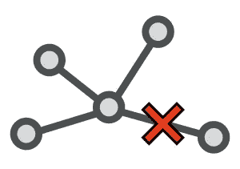

# 如何使用功能标志

> 原文：<https://levelup.gitconnected.com/how-to-use-feature-flags-74412b67336>

功能标志或功能切换是控制软件如何运行以及启用或禁用哪些功能的设置。功能标志应该在运行我们的软件的同一台主机上使用结构化数据格式进行配置，以确保它们高性能、稳定且易于管理。


功能标志

# 为什么要使用功能标志

通过使用特征标志，可以在不破坏整个系统的情况下将不完整的功能集成到我们的软件中。特性标志还允许我们在生产环境中进行测试，并一次向一小组用户推出功能。当目标是持续地集成和频繁地交付新代码时，这可能是有帮助的。

功能标志可以简单到根据环境启用功能，也可以复杂到修改不同用户在不同时间使用的功能。

# 避免网络请求

当我们配置功能标志时，我们可以在运行我们软件的主机上或网络上的其他地方进行。但是，我们应该避免通过网络请求来获取我们的特性标志，因为这会增加停机时间，降低系统速度，并使更改更难管理。



网络请求

如果需要通过网络访问功能标志，则主机在处理请求时都会因节流而导致失败。这对于在无服务器环境或频繁伸缩的环境中运行的流程来说很常见。可以通过获取值并在本地或数据存储中缓存它们来缓解节流问题，但是这样做会增加代码的复杂性，同时还会引入更多与缓存相关的问题。

当通过网络调用访问功能标志配置时，任何请求的延迟都会根据该系统的响应时间而增加。与向本地环境发出请求的一致性相比，这可能会导致长时间且不可预测的延迟。

如果功能标志存储在外部，则管理配置的值和系统可能会根据需要这些标志的主机而不同。如果配置不当，这可能会导致在生产中修改配置更改，并可能导致停机。相反，在发布软件之前，最好改变服务的特征标志配置并测试它们。

# 避免环境变量

环境变量通常用于将值传递给需要配置的命令行界面软件。这是一种快速简单的更改设置的方法，但是我们应该避免使用它们来配置特性标志。


环境变量

环境变量仅限于字符串，因此任何需要读写环境变量的软件都需要将字符串解析为适当的数据类型。这种复杂性是对软件和管理软件的任何工具的额外工作，这是不必要的。

环境变量不是结构化的，而是在一个进程中全局作用，这意味着任何结构化的键都需要扁平化。例如，要将软件 A 中组 B 的属性 C 设置为值 9090，我们需要将环境变量展平为:

```
A_B_C="9090"
```

这种额外的解析和全局范围会导致环境变量的处理更加复杂。

很难将环境变量打包并包含到软件中，因为它们是在运行时加载的。要设置值，我们需要运行命令或脚本，在主机上为运行软件的 shell 设置值。一种选择是在运行软件之前，通过导出文件中的所有内容来加载它们。这是可行的，但是有一个更好的方法…

# 解决方案

我们可以为我们的软件配置特性标志，方法是在我们的软件目录中包含一个结构化数据文件，如 config.json/config.yaml.的 JSON/YAML，然后我们可以在软件启动时加载这个文件，并用内置工具解析它。我们可以为不同的标志使用内置类型和结构化配置。

## 配置. json

```
{ 
  "features": { 
    "customer_icon": { 
      "enabled": true 
    }, 
    "billing_alerts": { 
      "release_date": "2022-08-06" 
    }, 
    "date_format": "%Y-%m-%d", 
    "console": { 
      "version": 1.0 
    } 
  } 
}
```

## config.yaml

```
--- 
features: 
  customer_icon: 
    enabled: true # We can also write comments in yaml
  billing_alerts: 
    release_date: '2022-08-06' 
  date_format: "%Y-%m-%d" 
  console: 
    version: 1.0 # Should be updated to 2.0 soon
```

我们可以通过在运行软件的主机上存储功能标志配置来避免网络问题。通过将它作为一个文件包含在主机上，我们将延迟降低到几乎为零，并避免了由网络故障导致的停机。

我们还可以通过使用 JSON 和 YAML 等结构化数据格式来避免环境变量的限制。这让我们能够适当地构建数据，并使用除字符串之外的内置类型。

要使用这些功能标志，我们只需加载它们，并根据值打开或关闭功能。下面是一个 Python 示例:

```
import datetime 
import json # Loading JSON File 
configuration = json.loads(open('./config.json', 'r').read()) # Date Format 
date_format = configuration['features']['date_format'] 
print("Using Date Format:", date_format) # Todays Date 
date_today = datetime.datetime.today() 
print("Todays Date:", date_today.strftime(date_format)) # Billing Alerts 
billing_alerts_release_date = datetime.datetime.strptime( 
  configuration['features']['billing_alerts']['release_date'], 
  date_format 
)
print(
  "Billing Alerts Release Date", 
  billing_alerts_release_date.strftime(date_format)
) 
if billing_alerts_release_date < date_today: 
  print("Billing Alerts Are Enabled") 
else: 
  print("Billing Alerts Aren't Enabled Yet") # Customer Icon 
print(
  "Showing Customer Icon", 
  configuration['features']['customer_icon']['enabled']
) # Console Version 
print(
  "Using Console Version", 
  configuration['features']['console']['version']
)
```

这就是我们如何启用或禁用特性，在指定日期发布功能，以及使用内置类型来管理我们的配置。

# 摘要

结构化配置文件是管理特性标志的最佳方式，无需担心网络问题或解析进出环境变量的所有内容。这也可以用来管理我们系统中的任何环境特定设置，作为一个中心控制点。

用结构化文件配置软件还有很多正面的副作用，我们还没有谈到。如果这个解决方案适合您，或者您有任何其他问题，请告诉我们。

点击此处了解更多内容，或通过以下方式联系我:

*   **推特:** [@BenTorvo](https://twitter.com/BenTorvo)
*   【ben@torvo.com.au】邮箱: [邮箱:](http://torvo.com.au/)
*   **网址:**[torvo.com.au](http://torvo.com.au/)

# 分级编码

感谢您成为我们社区的一员！更多内容见[级编码出版物](https://levelup.gitconnected.com/)。
跟随:[推特](https://twitter.com/gitconnected)，[领英](https://www.linkedin.com/company/gitconnected)，[通迅](https://newsletter.levelup.dev/)
**升一级正在改造理工大招聘➡️** [**加入我们的人才集体**](https://jobs.levelup.dev/talent/welcome?referral=true)