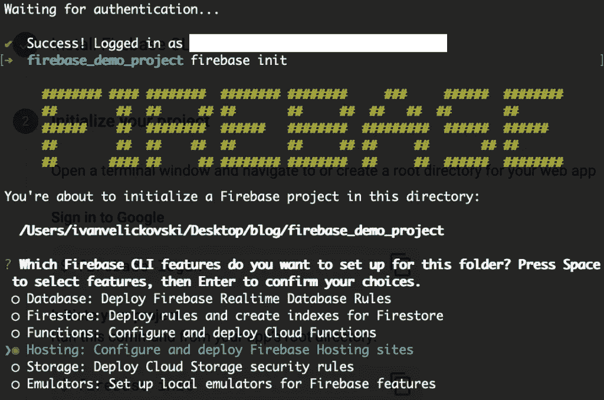
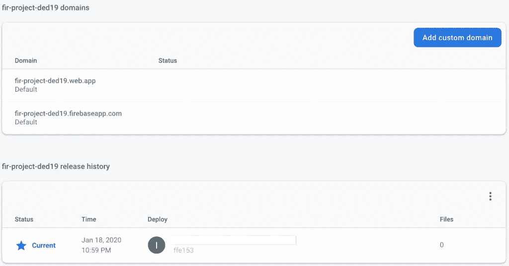
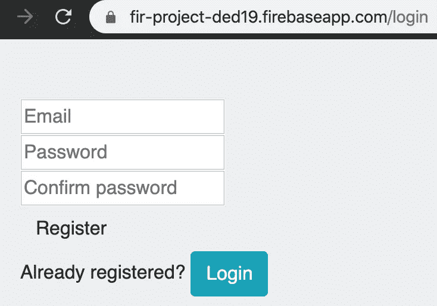
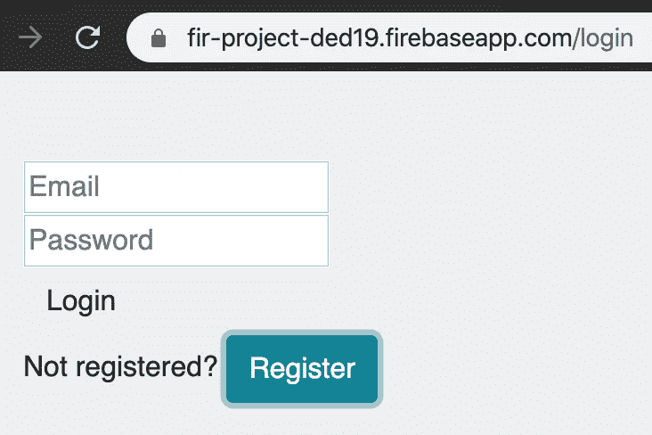

# 如何使用 Firebase 作为应用程序的后端和 CMS(第 1 部分)

> 原文：<https://levelup.gitconnected.com/how-to-use-firebase-as-your-apps-back-end-and-cms-part-1-563fbf6d3740>

```
This is part 1 of the [series](http://ivanruns.tech/how-to-use-firebase-as-your-apps-back-end-and-cms-part-1/). Stand by for the next parts... and together, we will build the best CMS!
```


包括我自己在内，移动开发人员面临的最痛苦的事情之一是他们不得不为自己构建后端时的痛苦。除非你有预算，可以支付另一个后端开发人员以更经典的方式为你做这件事，否则你很可能会想使用一些“免费”的解决方案，如 Firebase(它是免费的，直到你的应用程序“爆炸”，在这种情况下[为服务支付](https://firebase.google.com/pricing)将有望不是问题)。

如果你在过去的几年里一直在睡觉，你没有从零开始捡起这个名字， [Firebase](https://firebase.google.com/) 现在是[解析](https://parseplatform.org/)在脸书买下它之前的样子，而[彻底毁了它](https://techcrunch.com/2016/01/28/facebook-shutters-its-parse-developer-platform/)。毫无疑问，它是所有 BaaS(业务即服务)解决方案中的王者，并且有 Google 的支持，看起来它不会很快走向任何地方。

为了客观地看待问题，我将只列举几个使用 Firebase 可以完成的事情:

*   通过电子邮件、脸书、谷歌进行用户认证...基本上任何你能想到的社交媒体，有了 **Firebase 认证**
*   使用**实时数据库** / **Cloud Firestore** 存储您的 NoSQL 数据库
*   将文件存储在 **Firebase 存储器**
*   用 **Firebase 托管**创建并托管一个 web 应用
*   创建响应事件的 JavaScript 函数，并使用 **Firebase 函数**调用由其他 Firebase 特性公开的功能
*   使用 **Firebase Analytics** 跟踪你的应用程序的统计数据
*   使用 **Firebase 质量**跟踪您的应用程序的性能
*   通过 **Firebase 云消息**创建通知并将其发送给用户

...这样的例子不胜枚举。简单地说，作为一个(移动)开发者，你可以用 Firebase 作为你的 BaaS 来实现任何你能想到的东西。

# 我们要建造什么？

每一个移动应用的主干都是它使用并传播给用户的数据。如今，大多数移动开发人员只是通过使用由其他开发团队完成的后端来获取数据。如果你是一个移动开发人员的专业团队的一员，你可能永远不会真的为这些数据烦恼。一旦你想自己做某事，问题就出现了。

这篇文章将探讨这个问题的核心。我建议的解决方案是使用 Firebase 服务的许多特性。我们将使用 Firebase 主机创建一个简单的 web 应用程序，世界上的每个人都可以使用。我们将使用 Firebase 数据库在我们的 web 应用程序中显示数据。最后，我们将使用 Firebase 身份验证来创建用于填充数据的管理员用户。

# 步骤 1:创建 web 应用程序

一旦你在 Firebase 中创建了你的项目，你需要在左侧的“开发”菜单中选择主机，然后点击“开始”按钮。在此之后，您需要遵循的步骤包括 Firebase CLI(命令行工具)的安装，项目的初始化和部署。



从项目列表中选择您想要的项目，然后接受 Firebase CLI 向您推荐的其他项目。现在你只需要在控制台中输入“ **firebase deploy** ”。

然后嘣！就像那样，一旦你切换到 Firebase 控制台，你会看到你已经有了一个 web 应用程序，它的 URL 自豪地呈现在你面前。你甚至可以为它添加一个自定义域。



# 步骤 2:在 web 应用程序中创建页面

我们的 web 应用程序将有 4 个页面，用于:

1.  用户的登录或注册
2.  选择或创建数据库节点
3.  选定节点的选项列表
4.  从节点中选择的选项的详细信息

为此，我们将创建 4 个文档:login.html、app.html、list.html 和 details.html，我们将删除 index.html。一旦你这样做了，确保在终端中输入另一个“firebase deploy ”,看看会发生什么。

发生错误了吗？很可能是的，除非你没有忘记修改你的 **firebase.json** 文件，该文件保存了我们正在设置的主机的详细信息。

在这个文件中，我们需要改变默认设置，它总是重定向到一个 index.html 页面的用户，如果你跟着我，你应该已经删除了它。下面是我在 firebase.json 中使用的代码:

如果你查看了上面的 **cleanUrls** 参数，会得到加分。这将使你的网站页面看起来更酷。html 扩展！

# 步骤 3:启用 Firebase 身份验证+创建登录/注册流

由于我们的第一页是登录/注册，我们将首先启用 [Firebase 认证](https://firebase.google.com/docs/auth/web/start)。你可以选择 Firebase 的许多选项中的任何一个，但是在这篇文章中，我们将研究使用用户/通行证凭证的简单电子邮件认证。

在 Firebase 控制台中启用该选项后，您可以在登录页面中添加以下代码:

这将添加登录/注册流程所需的简单按钮和输入视图，如下图所示:



为了对这些字段进行实际操作，我们需要使用简单的 Firebase 电子邮件/密码认证，详细说明见[这里的](https://firebase.google.com/docs/auth/web/password-auth)。上面左边带有确认密码字段的截图实际上根本不需要。这个字段只是添加在那里，以便它与大多数网站使用的用户注册流程保持一致，如果您愿意，可以从您的实现中删除它。

注册代码片段:

登录代码片段:

另一件我们可能会发现很方便的事情是，如果用户登录了，就在我们的应用程序(登录)页面中创建一个检查，如果没有，就将其重定向到登录页面。

现在，我们的演示已经完全适用于用户登录/注册流程。我们将立即继续构建这个 web 应用程序，但首先，让我们看看它目前的样子:

[](https://www.urbandictionary.com/define.php?term=blyatiful)****不是吗？****

**因此，我们结束了本系列的第 1 部分。在第二部分中，我们将研究为我们的项目创建 Firebase 数据库。敬请期待！**