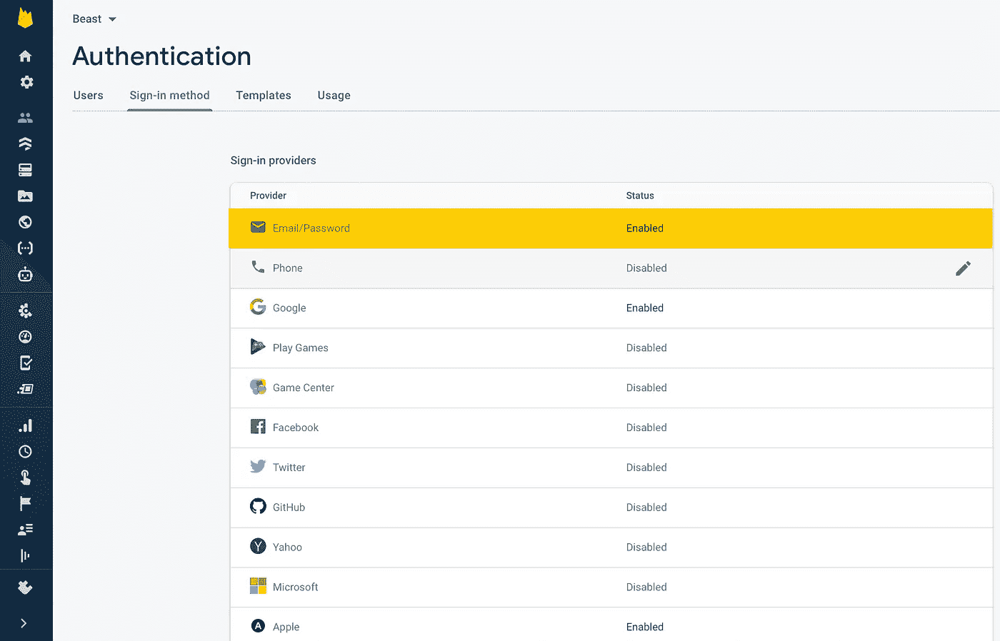
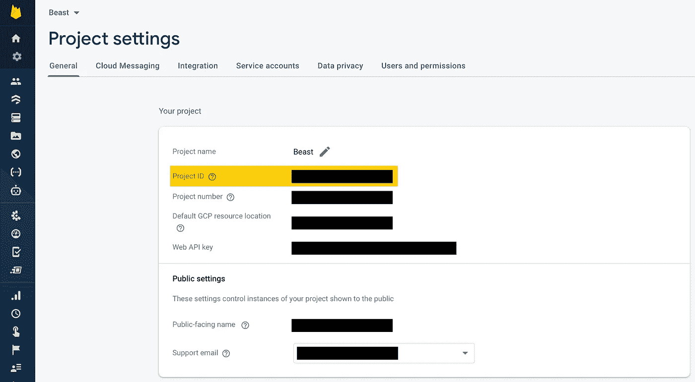
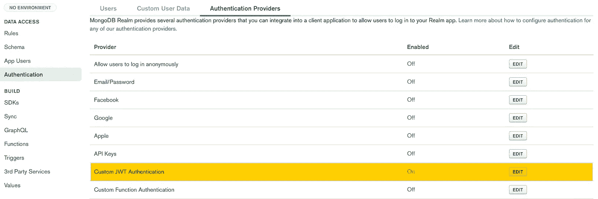
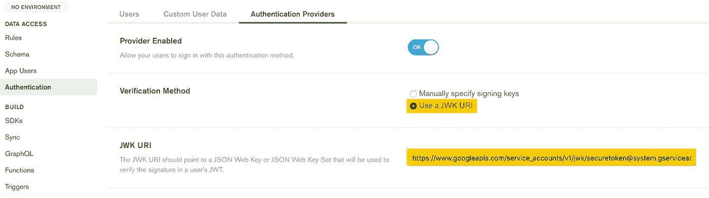
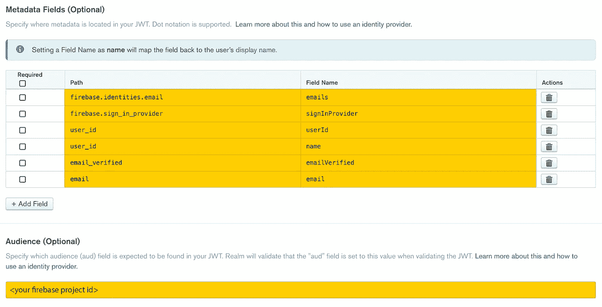

# 如何以最简单的方式在 MongoDB 领域中使用 Firebase 身份验证

> 原文：<https://levelup.gitconnected.com/how-to-use-firebase-authentication-with-mongodb-realm-the-easy-way-5b85c8532000>

## 如何在 MongoDB 领域认证用户的分步指南

图片:a-image/Shutterstock

无论您是从 Realm 迁移到 MongoDB Realm，还是从 MongoDB Realm 开始，您可能会想:认证用户最简单的方法是什么？虽然 MongoDB Realm 提供了内置的身份验证机制，但我个人更喜欢使用 Google 的 Firebase 身份验证方法。如果您知道如何做，那么将 Firebase 与 MongoDB 领域集成起来进行身份验证是非常简单的。这正是您将在本文中学到的东西。

不幸的是，MongoDB 团队的标准文档没有充分涉及与 Firebase 的集成。但是不要担心——读完这篇文章后，您应该能够轻松地将它应用到您自己的项目中。本文使用了 iOS 和 Swift 客户端代码，但这一概念稍加修改即可应用于所有其他受支持的平台。

剧透:在本文的最后，您将了解到，您能够使用经过身份验证的 Firebase 用户连接到 MongoDB 领域，只需三行代码:

# 步骤 1: Firebase 配置

一个先决条件是，您已经成功地创建了一个新的 Firebase 项目，并配置了相关的 iOS 应用程序(或任何其他平台，如 Android，您希望与 MongoDB Realm 连接)。Google 提供了一些关于如何进行基本 Firebase 设置的很好的文档。您的 Firebase 项目的身份验证应该至少激活“电子邮件/密码”，如下所示:

Firebase 电子邮件/密码验证是领域的先决条件

在“项目设置”下，您需要记下您的 Firebase 项目 id。稍后在配置 MongoDB 领域时，您将需要它。

具有所需项目 id 的 Firebase 项目设置

# 步骤 2: MongoDB 配置

假设您已经创建了一个 MongoDB Realm 项目，并且能够匿名连接到它。为此，您需要激活“身份验证”下的“允许用户匿名登录”。您可以使用下面的 Swift 代码来测试匿名连接。

测试客户端和服务器之间的连接

一旦匿名连接正常工作，您就知道您的项目正确地链接到了 MongoDB 应用程序，并且您可以继续进行 Firebase 集成。对于生产系统，确保在测试成功后禁用匿名登录选项。

现在你已经确定你的应用程序和你的 MongoDB Realm 项目之间的连接工作正常，让我们激活“自定义 JWT 认证”选项，如下图所示。

必须启用自定义 JWT 身份验证

在“自定义 JWT 认证”菜单选项中，配置非常简单。如果你选择“JWK URI”选项，而不是“手动指定签名密钥”，你会节省很多时间。使用手动选项，您需要经历所有的麻烦，包括通过 openssl 创建一个公共/私有 RSA 密钥对。那么您将需要一个定制的 Firebase 函数，必须从 Swift 代码中调用该函数来生成 JWT 令牌。去过那里，做过，我真的不建议这样做。

好消息是:有一种更好的方法可以达到同样的效果。作为一个副作用，性能也更好了，因为您省去了对 Firebase 函数的不必要调用，该函数将为您的客户端应用程序生成所需的 JWT 令牌。

JWK URI 和 JSON 网站的关键网址

选择验证方法后，您需要指定 JWK URI，它对于 Firebase 身份验证总是相同的。具体如下:

消防基地的 JWK URI

接下来，您应该将令牌的有效负载提供的信息映射到 MongoDB 领域用户元数据。我为 Firebase 使用的映射如下:

MongoDB 领域和 Firebase 身份验证元数据字段

最后，你必须(！)将观众设置为您的 Firebase 项目 id。它被认为是可选的，但实际上它是 MongoDB 领域和 Firebase 工作之间集成的必备组件。

# 第三步:Swift iOS 代码

现在我们已经在服务器端配置好了一切，让我们来看看 Swift 中的基本客户端代码。在我们连接到 Realm 之前，我们需要注册一个新用户来使用 Firebase。为此，请随意重用以下函数:

注册 Firebase 的功能

电子邮件和密码将来自应用程序用户界面上的文本字段。在我的例子中，电子邮件和密码存储在视图模型中。或者，您也可以将电子邮件和密码作为参数传递给该函数。您需要使用 *createUser* 函数来创建一个新的 Firebase 用户。如果用户创建成功，我建议您继续登录用户，这将引导我们进入下一个代码片段:

登录 Firebase 的功能

在上述函数中，涵盖了三种不同的场景:

*   选项 1:使用 Firebase 进行身份验证，并与 Realm 同步成功。如果是这种情况，你要引导用户到你的应用程序的主屏幕。
*   选项 2:使用 Firebase 的身份验证成功，但在使用领域登录时出错。在这种情况下，最好也从 Firebase 退出，并通过一条错误消息将用户引导回登录屏幕。
*   选项 3:使用 Firebase 进行身份验证不成功。同样在这种情况下，您希望用一条错误消息将用户引导回登录屏幕。

下面是三个最相关的函数，它们将实际利用我们在步骤 2 中完成的 MongoDB 领域配置:

*   **initiateSynchronizationWithRealm:**这个函数只是下一个函数的包装器。如果同步领域用户加载成功，则返回 true，否则返回 false。
*   **loadSyncedUserRealm:** 这个函数将尝试从 Real 中检索一个同步用户。如果成功，它将尝试打开用户的同步领域。
*   **getSyncUser:** 第三个函数与本文的目的最相关。因为我们在步骤 2 中使用了 JWK URI 机制，所以它是直接从 Firebase 用户检索令牌的地方。使用此令牌，可以创建领域凭据。然后，这些凭据用于检索领域用户。

使用 Firebase 身份验证从领域中检索同步用户的示例代码

我知道，第一眼看上去，最后三个函数看起来有点重，但是如果您忽略所有的样板代码，您会发现 Firebase 和 MongoDB 领域之间的基本身份验证只需要三行代码，如本文开头所述:

总结一下，这就是集成 Firebase 和 MongoDB 领域的本质

# 最后

在本文中，我向您展示了结合 MongoDB 领域利用 Firebase 身份验证功能的最简单方法。你现在应该已经有了创建下一个重磅应用的必要基础。去建吧！

想知道如何在自己的移动应用程序中使用 MongoDB Realm 吗？查看[拳击蔻驰](https://itunes.apple.com/WebObjects/MZStore.woa/wa/viewSoftware?id=1308556493&mt=8)和[野兽训练](https://itunes.apple.com/WebObjects/MZStore.woa/wa/viewSoftware?id=1487388888&mt=8)，它们充分利用了 MongoDB 领域和 Google Firebase 后端。

# 资源

以下是文章中提到的网站:

*   [MongoDB 领域](https://www.mongodb.com/realm)官网
*   [Firebase](https://firebase.google.com) 官网