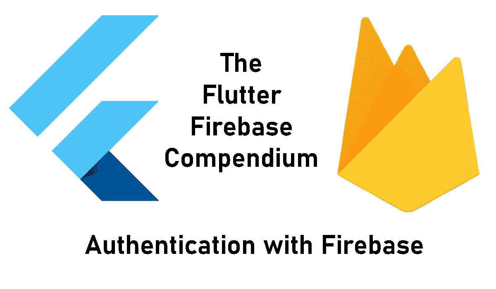
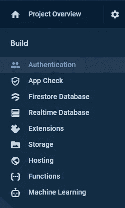
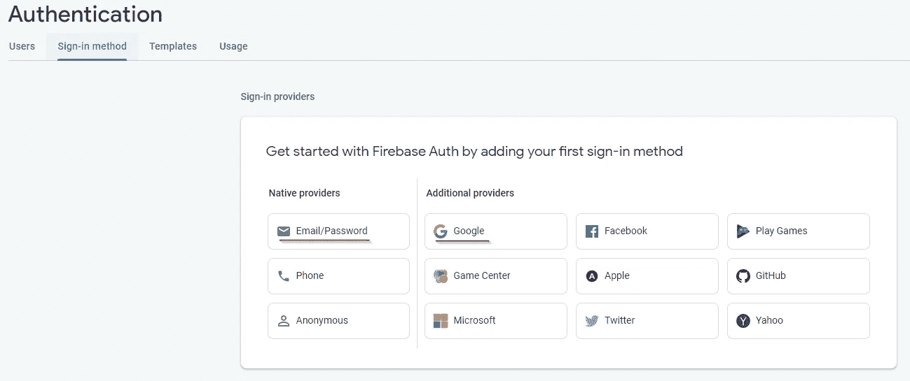
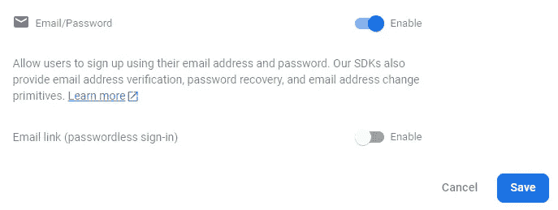
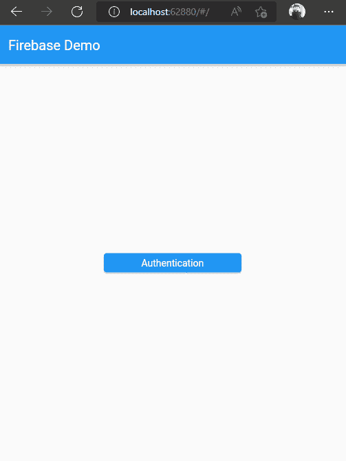
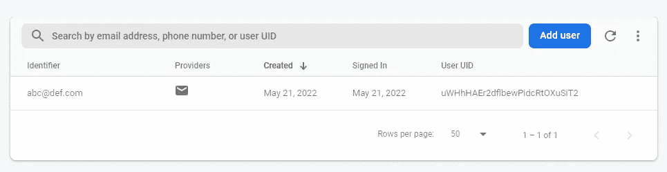
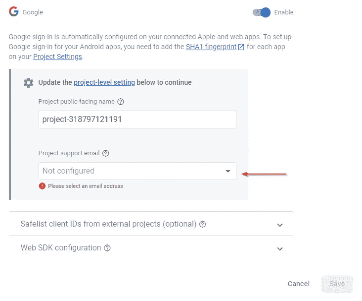

# 如何在你的 Flutter 应用中使用 Firebase 认证

> 原文：<https://levelup.gitconnected.com/how-to-use-firebase-authentication-with-your-flutter-app-4603c1b78156>

## 了解你的用户！

## 在本文中，我们将了解 Firebase 认证机制，以及如何将它集成到您的 Flutter 应用程序中。



## 什么是 Firebase 认证？

Firebase 身份验证是一种验证用户的简单方法，无需担心存储凭据。它支持多种登录机制，并且易于设置。如果需要，您会收到一个完整的用户注册流程，包括邮件确认和验证。在自己实现身份验证过程之前，请考虑使用此选项。

```
👉 Do you want all the details? Check out [**my ebook**](https://xeladu.gumroad.com/l/ffc) with in-depth guides about building Flutter apps with Firebase! Buy it on [**Gumroad**](https://xeladu.gumroad.com) now!
```

你需要自己建立一个 Firebase 项目来使用这里的代码示例或者我的 [GitHub](https://github.com/xeladu/flutter_firebase) 页面上的代码。如果你还没有这样做，这里有一篇文章可以指导你完成必要的步骤。

[](/how-to-create-a-firebase-project-and-link-it-with-your-flutter-app-acd826be8356) [## 如何创建一个 Firebase 项目并将其与您的 Flutter 应用程序链接

### 在本文中，我将向您展示如何创建一个 Firebase 项目，以及如何将它与您的 Flutter 应用程序链接起来。

levelup.gitconnected.com](/how-to-create-a-firebase-project-and-link-it-with-your-flutter-app-acd826be8356) 

## 支持哪些机制？

🔹电子邮件/密码
用户使用[电子邮件和密码组合](https://firebase.google.com/docs/auth/flutter/password-auth?hl=en)或[电子邮件链接](https://firebase.google.com/docs/auth/flutter/email-link-auth?hl=en)登录

🔹电话号码
用户登录并用他的[电话号码](https://firebase.google.com/docs/auth/flutter/phone-auth?hl=en)进行验证

🔹匿名
用户匿名登录[进行临时访问](https://firebase.google.com/docs/auth/flutter/anonymous-auth?hl=en)

🔹社交登录
用户通过[社交提供商](https://firebase.google.com/docs/auth/flutter/federated-auth?hl=en)登录，如谷歌、脸书、GitHub、微软、雅虎等。需要安装额外的插件。

## 如何启用提供商？

在 Firebase 控制台仪表板的左侧，转到**构建** → **验证**。



作者在 Firebase 控制台仪表板中的授权菜单屏幕截图

然后选择标签**签到方式**。



按作者列出的可用登录方法的屏幕截图

这里列出了所有可用的提供程序，您可以激活和配置您喜欢使用的提供程序。下面的例子，我们会用**邮箱/密码**和 **Google** ，所以在截图中已经标注了。

## 示例:使用邮件和密码进行身份验证

首先，我们需要激活**电子邮件/密码**提供者。点击它，启用复选框，并用**保存**确认。



按作者在 Firebase 中启用电子邮件/密码提供程序时的屏幕截图

将 [firebase_auth](https://pub.dev/packages/firebase_auth) 包安装到你的 Flutter 应用程序中，如果你还没有这样做的话。

要注册一个新用户，可以使用下面的代码。

代码执行后，用户也将登录。下一个代码片段将执行当前用户的注销。

如果你想在没有注册新用户的情况下登录，你可以使用下面的代码。

要处理身份验证状态更改，您可以侦听提供更新的流。请参见下面的代码示例。

`FirebaseAuth.instance.authStateChanges().listen((user) {...});`

如果您没有登录，`User`对象将为空。否则，它包含数据。

注册之后，你会在 Firebase 中找到用户的详细信息(当然密码除外)。您可以从认证仪表板的**用户选项卡**管理用户。

这里是一个简短的演示视频提供的源代码。



作者的 Firebase 身份验证演示



按作者划分的 Firebase 中用户仪表板的屏幕截图

您可以使用其他功能，如
🔹更改或重置密码
🔹定制用户将收到的电子邮件
🔹[使用仿真器](https://firebase.google.com/docs/auth/flutter/start#optional_prototype_and_test_with_firebase_local_emulator_suite)测试

## 示例:使用 Google 进行身份验证

激活 **Google** 登录提供商，输入所需的邮件地址，点击**保存**确认。



作者在 Firebase 中启用 Google provider 时的屏幕截图

将 [firebase_auth](https://pub.dev/packages/firebase_auth) 包安装到你的 Flutter 应用程序中，如果你还没有这样做的话。

使用下面的代码片段通过 Google 启动登录过程。

对于注销，您可以使用与上一个示例相同的代码。

谷歌、Facebook 和微软的❗社交认证只适用于网络平台。在所有其他平台上，您会得到一个运行时异常。如何在 Android 或 iOS 上获得 Google 登录的示例可以在下面的文章中找到。它需要一个额外的包和一些设置步骤。

[](https://medium.com/flutter-community/flutterfire-ui-simplifying-social-logins-in-flutter-27cc0f17890a) [## Flutter fire UI——简化 Flutter 中的社交登录

### 社交认证是一个多步骤的认证流程，允许您让用户登录帐户或链接他们…

medium.com](https://medium.com/flutter-community/flutterfire-ui-simplifying-social-logins-in-flutter-27cc0f17890a) 

## 结论

Firebase 身份验证提供了一种简单的方法来实现应用程序的登录和注册过程，而无需处理所有的细节。该软件包易于使用，并提供可以直接传递给用户的可理解的错误消息。您可以在我的 GitHub 页面上找到完整的示例源代码。

[](https://github.com/xeladu/flutter_firebase) [## GitHub - xeladu/flutter_firebase

### 这是附带代码示例的 Flutter Firebase 概要的配套应用程序。颤振燃烧基地纲要是一个…

github.com](https://github.com/xeladu/flutter_firebase) 

这篇文章是 Flutter Firebase 纲要的一部分，其中有许多教程和操作指南，介绍了 Firebase 与 Flutter 应用程序相结合的可能性。


xeladu

## 了解 Flutter 和 Firebase 的威力

[View list](https://xeladu.medium.com/list/learn-about-the-power-of-flutter-and-firebase-2ec07e25baba?source=post_page-----4603c1b78156--------------------------------)13 stories

用我的电子书为 Flutter 开发者充分利用 Firebase。

[](https://xeladu.gumroad.com/l/ffc) [## 颤振燃烧基础概要

### 这本电子书着重于让你能够在你的应用中集成 Firebase 云服务。当你想要的时候，它是一个跳跃的开始…

xeladu.gumroad.com](https://xeladu.gumroad.com/l/ffc) 

[***通过我的推荐链接加入成千上万的媒体会员，每月只需 5 美元就可以阅读你想阅读的文章！***](https://medium.com/@xeladu/membership)

[](https://medium.com/@xeladu/membership) [## 通过我的推荐链接加入 Medium-xela du

### 只需点击一下，就可以通过会员资格访问数千篇文章！您的会员资格只需 5 美元一张…

medium.com](https://medium.com/@xeladu/membership) 

点击 [**此处**](https://xeladu.medium.com/subscribe) 将我所有的新文章发送到你的邮箱🔔浏览[我的 Gumroad 商店](https://xeladu.gumroad.com/)寻找有趣的编程素材🏬


xeladu

## 适合初学者的颤振文章

[View list](https://xeladu.medium.com/list/flutter-articles-for-beginners-a040ea777956?source=post_page-----4603c1b78156--------------------------------)24 stories

xeladu

## 软件工程师的高级颤振文章

[View list](https://xeladu.medium.com/list/advanced-flutter-articles-for-software-engineers-f074879fdef3?source=post_page-----4603c1b78156--------------------------------)9 stories