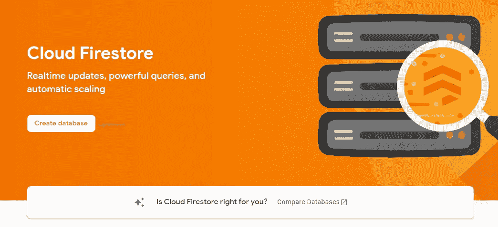
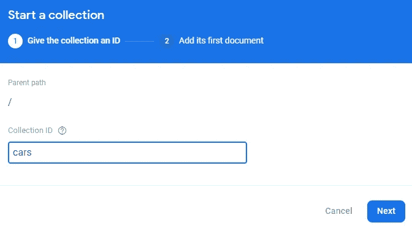

# 如何通过 Flutter 应用程序使用 Firebase Cloud Firestore

> 原文：<https://levelup.gitconnected.com/how-to-use-firebase-cloud-firestore-with-a-flutter-app-2110da689e08>

## 数据存储是关键！

## 在本文中，我将指导您完成 Cloud Firestore 的设置步骤，并向您展示如何从 Flutter 应用程序中读取和写入数据。


Firebase Cloud Firestore 是一个可扩展的 NoSQL 云数据库，您可以在其中存储应用程序的相关数据。它非常灵活，可以通过访问规则来保护。在接下来的章节中，我们将讨论

🔹设置数据库
🔹使用 Firebase 数据库编辑器
🔹从一个 Flutter 应用程序访问数据库
🔹为访问控制添加安全规则

```
👉 Do you want all the details? Check out [**my ebook**](https://xeladu.gumroad.com/l/ffc) with in-depth guides about building Flutter apps with Firebase! Buy it on [**Gumroad**](https://xeladu.gumroad.com) now!
```

你需要自己建立一个 Firebase 项目来使用这里的代码示例或者我的 [GitHub](https://github.com/xeladu/flutter_firebase) 页面上的代码。如果你还没有这样做，这里有一篇文章可以指导你完成必要的步骤。

[](/how-to-create-a-firebase-project-and-link-it-with-your-flutter-app-acd826be8356) [## 如何创建一个 Firebase 项目并将其与您的 Flutter 应用程序链接

### 在本文中，我将向您展示如何创建一个 Firebase 项目，以及如何将它与您的 Flutter 应用程序链接起来。

levelup.gitconnected.com](/how-to-create-a-firebase-project-and-link-it-with-your-flutter-app-acd826be8356) 

## 初始设置

在 Firebase 仪表板中打开 Firestore 数据库菜单。


作者 Firestore 数据库菜单条目的屏幕截图

接下来，通过点击按钮**创建数据库**创建一个新的数据库。



作者创建云 Firestore 新数据库前的屏幕截图

以下向导屏幕询问生产或测试模式。我们将从**测试模式**开始，并在稍后的过程中配置安全规则。请注意，如果没有安全规则，任何人都可以读写(甚至删除)数据库中的数据！


作者为云 Firestore 选择模式的屏幕截图

最后，您将被要求选择一个位置。这将影响定价和可用性(您可以在此阅读更多详细信息[)。对于这个例子，不会有任何成本，因为数据库包含足够多的免费操作。](https://firebase.google.com/docs/firestore/locations)


作者为云 Firestore 选择位置的屏幕截图

在这个过程之后，您将看到一个空的数据库可以使用了。


作者提供的空云 Firestore 数据库截图

在接下来的步骤中，我们将添加、编辑和删除数据，并配置安全规则以防止第三方访问。

## 使用 Firebase 编辑器

云 Firestore 编辑器允许您从 web 仪表板添加、编辑和删除数据。

点击 **+开始收集**创建一个新的。集合基本上是一个包含多个文档的文件夹。在本例中，我们将其命名为**汽车**。



作者创建收藏的屏幕截图

在下一步中，您将被要求添加第一个**文档**。这可以是任何东西，从简单的键值对到复杂的嵌套 JSON 对象。您甚至可以在文档中开始新的收藏。对于标识，每个文档都需要一个 ID，它可以由 Firebase 自动创建(我目前的推荐),也可以由您来处理。点击 **Auto-ID** 按钮，为您的文档生成一个 ID。


作者创建文档的屏幕截图

如您所见，我添加了一些字段、类型和值来演示编辑器。我们将不使用图形编辑器，但在下一节课中，我们将重点讨论如何用代码管理数据。

## 从颤振应用程序访问

第一步是安装 [cloud_firestore](https://pub.dev/packages/cloud_firestore/install) 包。之后，您可以访问数据库。以下代码示例显示了如何使用 Cloud Firestore 获取、添加、编辑和删除数据。

所有方法的工作流程都非常相似。使用`FirebaseFirestore.instance`，访问由字符串标识的`Collection`，使用`orderBy`或`where`子句，执行异步`get`。取`docs`属性得到一个`List<QueryDocumentSnapshot<Map<String, dynamic>>>`。用`data()`方法可以将每个列表项转换成 JSON `Map`。最后，您可以将`Map`转换成一个真正的 dart 对象。

💡使用像 [dart-quicktype](https://dart-quicktype.netlify.app/) 这样的工具从 JSON 代码中生成类定义。

要添加带有自动生成的 id 的文档(条目),请在所需的集合上调用`add()`方法。如果找不到，将创建该集合。如果您想要指定文档 ID，请使用`collection(”someCollection”).doc(”myUniqueDocId”).set(data)`方法。

❗ **设置和更新之间的差异**

让我们假设，Firebase 文档中的数据结构如下所示:

`{ “text”: “Hello World”, “number”: 3 }`

当用`{ “text”: “World Hello” }`执行更新操作时，只有文本属性被改变。数字属性不会发生任何变化。当用`{ “text”: “World Hello” }`执行设置操作时，文本属性将被改变，但数字属性将被删除！

使用`set()`时要小心！

查看[源代码](https://github.com/xeladu/flutter_firebase)以获得如何使用基本数据库操作的完整示例。

这是一个简短的应用程序演示视频。它将数据插入数据库，执行两个带有排序和过滤的 get 操作，最后再次删除数据。


作者的云 Firestore 演示应用程序

## 设置安全性规则

安全规则确保只有那些操作发生在应该发生的数据上。有各种选项来配置规则，但我将只给出一个简单的介绍。有关更多详细信息，请参考 [Firebase 文档](https://firebase.google.com/docs/rules/get-started?authuser=0&hl=en)或以下两篇文章。

[](https://khreniak.medium.com/cloud-firestore-security-rules-basics-fac6b6bea18e) [## 使用云 Firestore 安全规则的基本示例

### 云 Firestore 安全规则是定义 Firestore 访问控制的工具。定义匹配并创建…

khreniak.medium.com](https://khreniak.medium.com/cloud-firestore-security-rules-basics-fac6b6bea18e) [](https://khreniak.medium.com/advanced-examples-of-using-cloud-firestore-security-rules-9e641d023c7e) [## 使用云 Firestore 安全规则的高级示例

### 在本文中，我将向您展示使用云 Firestore 安全规则的高级示例。一些知识和更多…

khreniak.medium.com](https://khreniak.medium.com/advanced-examples-of-using-cloud-firestore-security-rules-9e641d023c7e) 

您当前的规则将如下所示:

```
service cloud.firestore {
  match /databases/{database}/documents {
    match /{document=**} {
      allow read, write: if
          request.time < timestamp.date(2022, 6, 22);
    }
  }
}
```

第一行标识所使用的服务，因为规则也可以应用于[云存储](https://firebase.google.com/docs/storage?hl=en&authuser=0)和[实时数据库](https://firebase.google.com/docs/database/?authuser=0)。以下`match`语句确定了应该对哪些实体实施规则。您可以嵌套多个匹配语句，也可以只使用一个。`allow`语句告诉我们在什么条件下允许访问。在`allow`关键字之后，可以添加多个类似`read`和`write`的方法。以下是可用的方法:

🔹获取—读取单个文档
🔹列表—读取查询
🔹创建—编写新文档
🔹更新—编写现有文档
🔹删除—删除数据
🔸阅读—获取+列表
🔸写入—创建+更新

`match`语句经常使用**通配符**。像`{database}`这样的花括号中的文本是一个单段通配符，例如可以在条件中使用。为了使通配符递归，添加两个星号字符`{document=**}`。

上述规则拒绝访问 2022 年 6 月 22 日之后数据库中的所有文档。

以下是一些您可以使用的常见规则条件:

```
allow read, write: if false; // no accessallow read, write: if request.auth != null; // access when authenticatedmatch /users/{userId} {
  allow read, write: if request.auth != null 
                     && request.auth.uid == userId;
} // access only own documentsmatch ... {
  allow read: if true; // read access for everyone
  allow write: if request.auth != null; // write access when authenticated
}
```

你可以在上面的文章和 [Firebase 文档](https://firebase.google.com/docs/rules/basics?hl=en&authuser=0)中找到更多的例子。

## 结论

云 Firestore 是一个简单的云数据库解决方案。有了提供的例子和源代码，你应该能够迈出第一步。

您可以在我的 GitHub 页面上找到完整的示例源代码。

[](https://github.com/xeladu/flutter_firebase) [## GitHub - xeladu/flutter_firebase

### 这是附带代码示例的 Flutter Firebase 概要的配套应用程序。颤振燃烧基地纲要是一个…

github.com](https://github.com/xeladu/flutter_firebase) 

这篇文章是 Flutter Firebase 纲要的一部分，其中有许多教程和操作指南，介绍了 Firebase 与 Flutter 应用程序相结合的可能性。


[塞拉多](https://xeladu.medium.com/?source=post_page-----2110da689e08--------------------------------)

## 了解 Flutter 和 Firebase 的威力

[View list](https://xeladu.medium.com/list/learn-about-the-power-of-flutter-and-firebase-2ec07e25baba?source=post_page-----2110da689e08--------------------------------)13 stories

用我的电子书为 Flutter 开发者充分利用 Firebase。

[](https://xeladu.gumroad.com/l/ffc) [## 颤振燃烧基础概要

### 这本电子书着重于让你能够在你的应用中集成 Firebase 云服务。当你想要的时候，它是一个跳跃的开始…

xeladu.gumroad.com](https://xeladu.gumroad.com/l/ffc) 

[***通过我的推荐链接加入成千上万的媒体会员，每月只需 5 美元就可以阅读你想阅读的文章！***](https://medium.com/@xeladu/membership)

[](https://medium.com/@xeladu/membership) [## 通过我的推荐链接加入 Medium-xela du

### 只需点击一下，就可以通过会员资格访问数千篇文章！您的会员资格只需 5 美元一张…

medium.com](https://medium.com/@xeladu/membership) 

点击 [**此处**](https://xeladu.medium.com/subscribe) 将我所有的新文章发送到你的邮箱🔔浏览[我的 Gumroad 商店](https://xeladu.gumroad.com/)寻找有趣的编程素材🏬


xeladu

## 适合初学者的颤振文章

[View list](https://xeladu.medium.com/list/flutter-articles-for-beginners-a040ea777956?source=post_page-----2110da689e08--------------------------------)24 stories

[赛拉杜](https://xeladu.medium.com/?source=post_page-----2110da689e08--------------------------------)

## 软件工程师的高级颤振文章

[View list](https://xeladu.medium.com/list/advanced-flutter-articles-for-software-engineers-f074879fdef3?source=post_page-----2110da689e08--------------------------------)9 stories