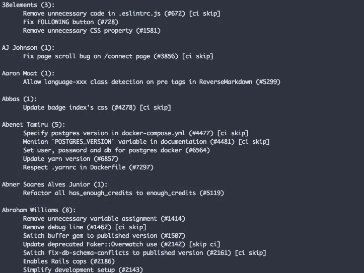
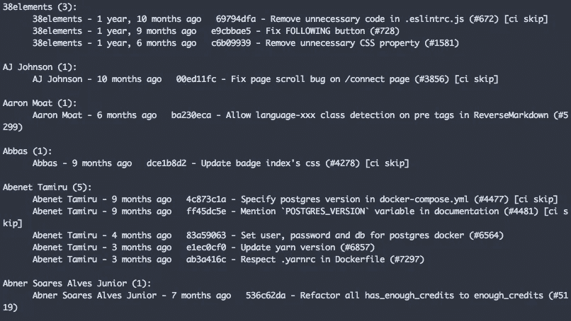
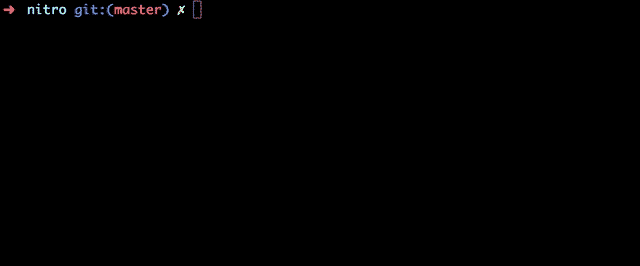

# 如何使用 git 作为站立工具

> 原文：<https://levelup.gitconnected.com/how-to-use-git-as-a-standup-tool-8e363013cd9a>


如果你每天都在做几个回购或在一个大团队中工作，那么继续跟踪正在做什么，谁在做哪个功能可能会令人生畏。

但幸运的是，Git 帮助我们跟踪回购中的变化，以便您可以在简单的命令中查看这些信息。

## 使用 git shortlog

Git shortlog 类似于 git log，但是提交将按作者和标题分组。

举个例子，

```
git shortlog
```



在上图中，您可以看到 git 日志按照作者姓名和提交号的数量进行分组。

这有助于您了解哪个作者参与了哪个提交。

## 使用日期范围

Shortlog 有许多选项。最重要的选项之一是使用日期范围。

```
git shortlog --after="1 week ago" --before="1 day"
```

`**--after**`包含比该日期更近的提交。

`**--before**`包括早于该日期的提交。

您也可以使用其他日期选项

```
git shortlog --after="yesterday" git shortlog --after="today" git shortlog --after="10 days ago" git shortlog --after="1 week ago"
```

## 使用提交范围

有时，您需要在指定的提交范围内查找历史记录。

```
git shortlog A..B git shortlog 143fd1fa..9215d04f
```

记住 **A** 提交散列应该比 **B** 提交散列旧

## 按文件过滤

Shortlog 还提供了一个仅过滤指定文件的选项。

```
git shortog -- one.txt
```

上述选项将从指定文件中过滤包含更改的提交。

```
git shortlog -- one.txt two.txt three.txt
```

您也可以指定多个文件。

## 格式化 git 短日志

您也可以使用 shortlog 的格式选项。格式选项与 git 日志相同。

使用

```
git shortlog --pretty=format:"%an - %ar%n %h - %s %n"
```



您可以在此查看其他格式选项

## Git 站立

为了让事情更简单，有一个工具叫做 [git-standup](https://github.com/kamranahmedse/git-standup)

Git standup 是一个开源工具，可以帮助你追踪你和你的团队都在做什么。它有各种选项，你可以玩它。



感谢你的阅读，希望你学到了新的东西:)

**你可以在这里找到我的其他 git 相关文章**

```
1\. [How to use git stash effectively](/how-to-use-git-stash-effectively-d4e04870cc2b)2\. [How to use git blame effectively](/how-to-use-git-blame-effectively-6228f3f7da5d)3\. [How to squash git commits](/how-to-squash-git-commits-9a095c1bc1fc)4\. [How to rewrite the latest commit with git amend](/how-to-rewrite-the-latest-commit-with-git-amend-48a8d5f27758)5\. [Useful tricks you might not know about git log](/useful-tricks-you-might-not-know-about-git-log-ed5ac32625ef)6\. [How git revert works](/how-git-revert-works-9b87b8b03dd3)7\. [How git cherry-pick works and how to use it effectively](/what-is-git-cherry-pick-and-how-to-use-it-effectively-665247192442)8\. [Automate repetitive tasks in Git](/automate-repetitive-tasks-with-custom-git-commands-76a4b71d262f)9\. [Useful tricks of git fetch and git pull](/how-to-use-git-fetch-and-git-pull-effectively-c6a4becfbc16)10\. [A very basic intro of Git](https://medium.com/@srebalaji/a-very-basic-intro-of-git-b9cab0e64153)
```

> 如果你已经来了这么久，那么我想你会对 Git 非常感兴趣。你可以订阅我的时事通讯 [GitBetter](https://gitbetter.substack.com/) 来获得 Git 的技巧、提示和高级主题。

# 分级编码

感谢您成为我们社区的一员！ [**订阅我们的 YouTube 频道**](https://www.youtube.com/channel/UC3v9kBR_ab4UHXXdknz8Fbg?sub_confirmation=1) 或者加入 [**Skilled.dev 编码面试课程**](https://skilled.dev/) 。

[](https://skilled.dev) [## 编写面试问题

### 掌握编码面试的过程

技术开发](https://skilled.dev)