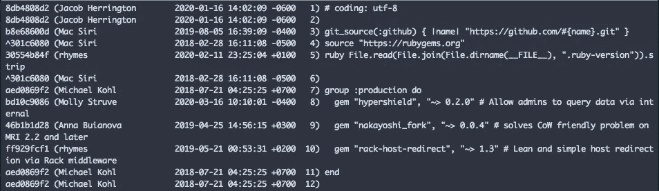
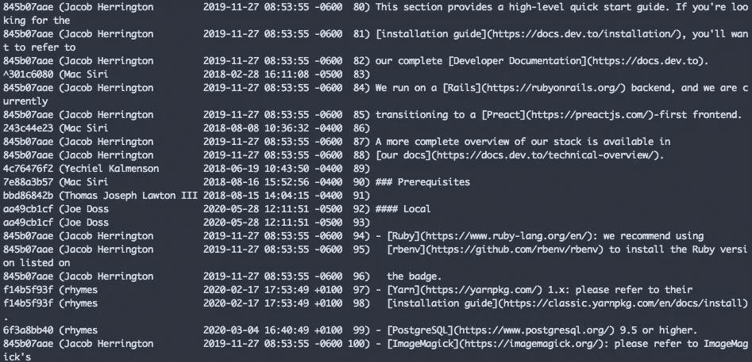
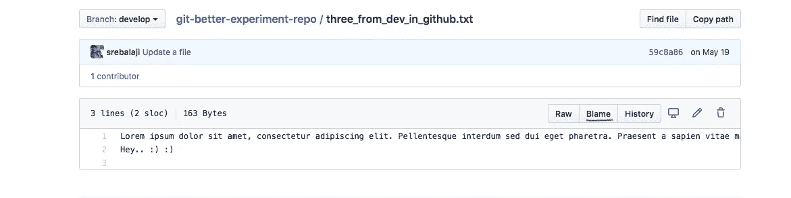
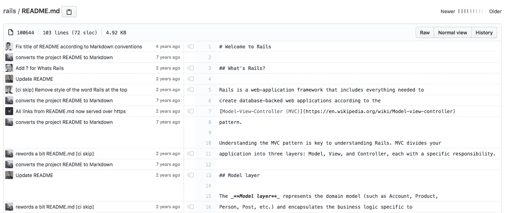
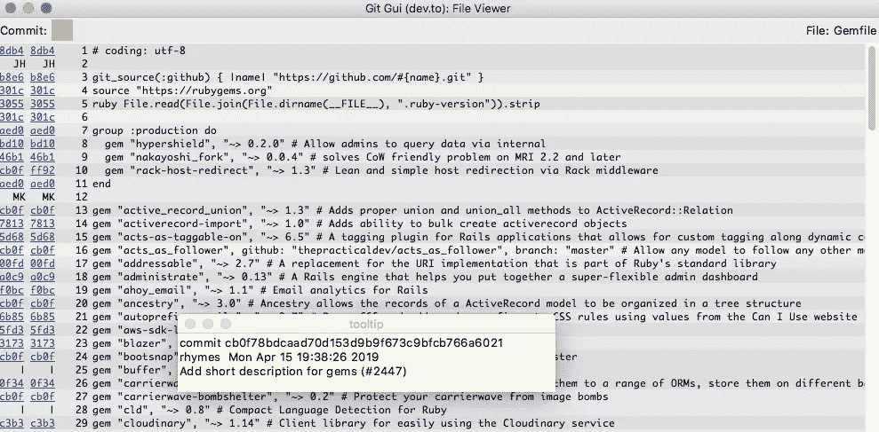

# 如何有效使用 git 责备

> 原文：<https://levelup.gitconnected.com/how-to-use-git-blame-effectively-6228f3f7da5d>


Git 责备用于查看文件中每一行的最后提交和最后修改的作者。

换句话说，使用 git blame，您可以看到与每一行相关的文件的整个 git 修订。

当您想知道哪个提交对更改负责以及哪个作者提交了这些更改时，Git 责备将会派上用场。

**用途**

```
git blame <file_name>
```



在上面的例子中，我对一个文件进行了指责。您可以看到文件中每一行的短提交散列、作者姓名和时间戳。

## 只归咎于有限的线范围

有时候，不需要怪整个文件，只需要在有限的行范围内怪就可以了。Git 责备为此提供了选择。

**-L** 将选择起点线和终点线。

```
git blame <file_name> -L 80,100
```

上面的命令将从第 80 行到第 100 行进行责备。



在上面的例子中，看到了起始行和结束行。

## 按提交时间戳责备

你也可以通过提交时间戳来责备

```
git blame <file_name> --since=3.days
```

该命令将责备超过 3 天的提交。

## Github 和 Gitlab 中的责备

在 Github 和 Gitlab 中有一个指责的选项。

如果你点击 Github 中的任何文件，你都可以看到责备选项。



使用该选项，您可以看到该文件的完整 git 修订版。

下面是 Github 中的一个责备的例子。



Git 责备是一个非常有效的工具，可以帮助您逐行了解文件的整个 git 历史。

这也有助于你找出你的同行中谁在制作中做出了突破性的改变，这样你就可以责备他们:P 只是开玩笑，不要这样做:)

Git 责备主要用于一些 GUI 工具。因为 raw 模式下的 git 责备可读性不是很好。

代码编辑器中也有扩展，比如 Sublime，VS 代码你可以配置。

**崇高—** 可以试试[饭桶怪扩展](https://packagecontrol.io/packages/Git%20blame)

**VS 代码—** 可以试试 [Git 镜头](https://marketplace.visualstudio.com/items?itemName=eamodio.gitlens)

除了这些扩展，还有另一种更好的方式来看待指责。您可以使用 **Git GUI** 工具。它预装了 Git，可以在流行的平台上运行。

```
git gui blame <file_name>
```



除了责备，Git GUI 还有其他选项。你也可以探索它们。

感谢你的阅读，希望你学到了新的东西:)

**你可以在这里找到我的其他 git 相关文章**

```
1\. [How to squash git commits](/how-to-squash-git-commits-9a095c1bc1fc)2\. [How to rewrite the latest commit with git amend](/how-to-rewrite-the-latest-commit-with-git-amend-48a8d5f27758)3\. [Useful tricks you might not know about git log](/useful-tricks-you-might-not-know-about-git-log-ed5ac32625ef)4\. [How git revert works](/how-git-revert-works-9b87b8b03dd3)5\. [How git cherry-pick works and how to use it effectively](/what-is-git-cherry-pick-and-how-to-use-it-effectively-665247192442)6\. [Automate repetitive tasks in Git](/automate-repetitive-tasks-with-custom-git-commands-76a4b71d262f)7\. [Useful tricks of git fetch and git pull](/how-to-use-git-fetch-and-git-pull-effectively-c6a4becfbc16)8\. [A very basic intro of Git](https://medium.com/@srebalaji/a-very-basic-intro-of-git-b9cab0e64153)
```

> 如果你已经来了这么久，那么我想你会对 Git 非常感兴趣。你可以订阅我的时事通讯 [GitBetter](https://gitbetter.substack.com/) 来获得 Git 的技巧、提示和高级主题。