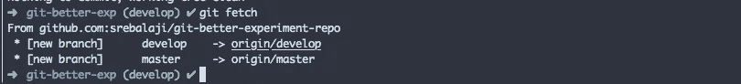
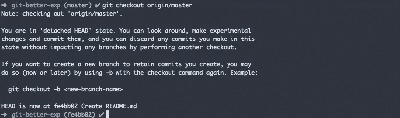
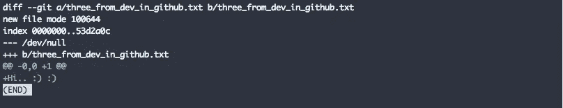
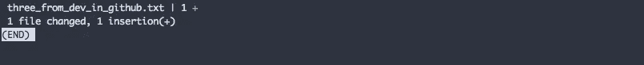
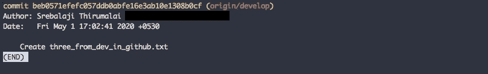
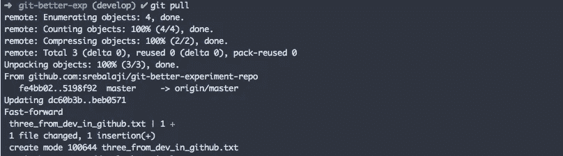

# 关于 git fetch 和 git pull 的有用技巧

> 原文：<https://levelup.gitconnected.com/how-to-use-git-fetch-and-git-pull-effectively-c6a4becfbc16>

如果您已经使用 Git 有一段时间了，那么您可能会使用`git fetch`和`git pull`。在本帖中，我们将介绍`git fetch`和`git pull`是如何工作的，并且我将分享一些你可以马上开始使用的技巧。

# git 获取如何工作


`git fetch`从所有分支下载所有最新提交，也从远程下载所有新分支，并将其保存在本地 repo **中，但不会将其合并到您正在处理的本地分支**。意味着`git fetch`永远不会改变你的工作状态。它是无害的。您可以多次提取，它不会改变或更新您的工作分支中的任何内容。

那么，为什么有用呢？`git fetch`帮助您查看遥控器中的更新内容。假设您正在本地回购中工作。与此同时，远程回购也发生了变化。如果您需要远程 repo 中的更改不受影响，这就是 git fetch 的用武之地。

**它从遥控器获取所有更改并将其存储在本地，但不会在本地合并这些更改**。简单。



在上图中，您可以看到创建了两个新分支`origin/develop`和`origin/master.`，这些分支将具有来自远程的更新的更改。但是这些变化不会影响到`master`和`develop`分支。

获取后，您可以查看遥控器中所做的更改。例如，查看`master`中所做的最新更改。

```
git checkout origin/master
```



使用上面的命令，您基本上是在检查 git 创建的用于存储来自远程的所有最新变更的**本地分支。**

要结帐到其他分支机构，您可以用您的分支机构名称替换`master`。

您可以使用命令`git log`从远程查看更新的提交。

`git fetch`的主要用例之一是在合并当前分支之前查看变更。你总是能够理解变化，事先解决冲突会很容易。

```
git diff develop origin/develop
```

上面的命令将向您展示 branch master 的本地更改和远程更改之间的差异。

换句话说，这将显示这两个分支之间的差异，从而显示来自`origin/develop`的所有更改，但不显示来自`develop`的更改。以便您可以了解新的更新。

你在哪个分行打电话并不重要。你可以在任何你喜欢的分支中调用这个命令。但是记得要事先`git fetch`。



```
git diff develop origin/develop -stat
```

该命令将只显示已更改的文件。



你可以使用另一个有用的技巧。

```
git log develop..origin/develop
```



这个命令将帮助您显示来自`origin/develop`的所有提交，但是不在`develop`分支中。通过这种方式，您可以知道有多少新的提交被添加到了远程`develop`分支，而这些提交在本地分支中并不存在。

试着跑

```
git log origin/develop..develop
```

现在您正在尝试查看来自`develop`(本地)的所有提交，但不在`origin/develop`(远程)中的提交。

记住所有这些事情，不要忘记`git fetch`之前。

# git pull 如何工作

我想我们大多数人都知道 git pull 是如何工作的。但是我会试着给它添加一些单词。

上面的命令会先先执行`git fetch`。然后它会执行工作目录中的`git merge`命令。这意味着如果您在主分支中，那么主分支中的远程更改将被合并到本地主分支中。



在上图中，您可以看到新的源分支被创建，然后来自远程的新更改被合并到分支`develop`。

```
git pull origin develop
```

此命令将只获取开发分支的远程更改，而不获取其他分支的远程更改。它还将远程更改合并到分支中。

默认情况下，git pull 将执行`git merge`。如果你想换基，可以试试。

```
git pull -rebase
```

如果你对 rebase 不够自信，不要担心，我会在另一篇文章中解释 rebase 的概念。

## 外卖的要点

1.  使用`git fetch`将所有远程更改下载到本地，而不影响您的流程。并且在合并或重设基础之前将远程改变与本地改变进行比较。这样会有很大帮助。
2.  `git diff <branch_name> origin/<branch_name>` —了解远程变化。请记住，第二个分支的所有变更都会显示出来，而第一个分支的变更会被忽略。这样你就能看出这两个分支的区别。
3.  `git log develop..origin/develop` —了解提交日志。如前所述，显示了两个分支之间的差异。
4.  `git pull` —记住它会先执行`git fetch`，然后调用`merge`命令。所以尽量经常用。

希望你从这篇文章中学到了一些东西:)

如果您有任何疑问，可以留下评论。

**你可以在这里找到我的其他 git 相关文章**

```
1\. [What is git cherry-pick and how to use it effectively](/what-is-git-cherry-pick-and-how-to-use-it-effectively-665247192442)2\. [Automate repetitive tasks in Git](/automate-repetitive-tasks-with-custom-git-commands-76a4b71d262f)3\. [A very basic intro of Git](https://medium.com/@srebalaji/a-very-basic-intro-of-git-b9cab0e64153)
```

## 如果你已经来了这么久，那么我想你会对 Git 非常感兴趣。你可以订阅我的时事通讯 [GitBetter](https://gitbetter.substack.com/) 来获得 Git 的技巧、提示和高级主题。