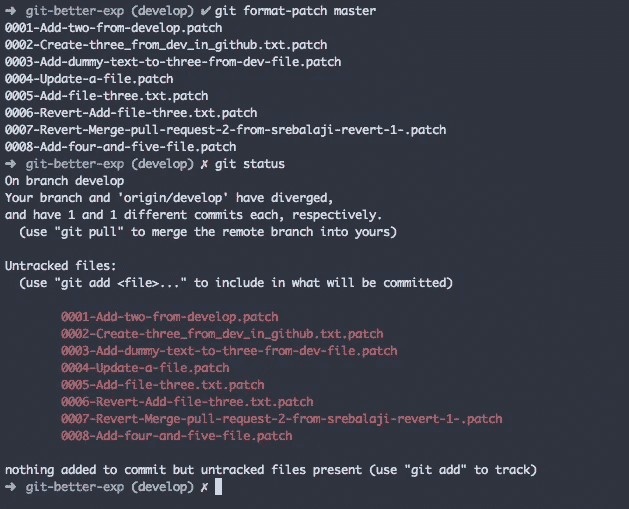
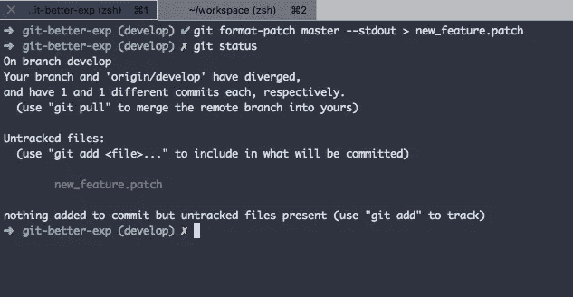
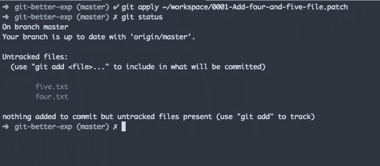
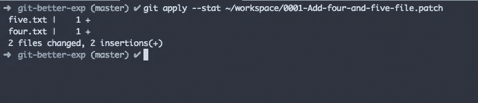

# 如何有效使用 git 补丁

> 原文：<https://levelup.gitconnected.com/how-to-use-git-patch-effectively-98650a631bdf>


Git 提供了创建补丁文件的选项。这些补丁文件包含可以在其他地方使用的更改。

例如，您可以在本地存储库中创建一个补丁文件。然后，您可以将它发送给其他人，以便在他们的本地使用该修补程序。

有些人还会创建一个补丁，以备后用。

## 创建 git 补丁

```
git format-patch <target-branch>
```



在上面的例子中，你可以看到我提到了 **master** 作为目标分支。所以 Git 将从当前分支(develop)获取所有在 master 之前的提交。

然后，它为每次提交创建一个补丁文件。如您所见，创建了八个补丁文件。

**为多次提交创建一个补丁文件**

```
git format-patch <target-branch> --stdout patch_name.patch
```



在上面的示例中，为所有提交创建了一个具有给定名称的补丁文件。

**从 git 创建补丁提交**

有时，您会对从选择性提交创建补丁感兴趣。在这种情况下，您可以使用

```
git format-patch -1 <commit-hash>
```

上面的命令将只考虑各自的提交散列来制作补丁。

## 应用 git 补丁

现在你知道如何创建一个补丁文件。让我们看看如何应用 git 补丁，如果你有一个的话。



您可以看到，我已经从指定路径应用了一个补丁文件。然后应用补丁文件中的更改。然后，您可以检查这些更改并提交。

```
git apply --stat <patch_file_path>
```

该命令不会应用补丁，但会显示更改状态。



**使用 git am**

该命令将应用补丁，并根据更改创建新的提交。与**应用**不同，它不仅仅用于预览更改。git am 将创建新的提交。

如果您想在不使用集中式 repo 的情况下与其他人共享代码，补丁是很有帮助的。备份你的作品以备后用也很有用。

感谢你的阅读，希望你学到了新的东西:)

**你可以在这里找到我的其他 git 相关文章**

```
1\. [How to use git stash effectively](/how-to-use-git-stash-effectively-d4e04870cc2b)2\. [How to use git blame effectively](/how-to-use-git-blame-effectively-6228f3f7da5d)3\. [How to squash git commits](/how-to-squash-git-commits-9a095c1bc1fc)4\. [How to rewrite the latest commit with git amend](/how-to-rewrite-the-latest-commit-with-git-amend-48a8d5f27758)5\. [Useful tricks you might not know about git log](/useful-tricks-you-might-not-know-about-git-log-ed5ac32625ef)6\. [How git revert works](/how-git-revert-works-9b87b8b03dd3)7\. [How git cherry-pick works and how to use it effectively](/what-is-git-cherry-pick-and-how-to-use-it-effectively-665247192442)8\. [Automate repetitive tasks in Git](/automate-repetitive-tasks-with-custom-git-commands-76a4b71d262f)9\. [Useful tricks of git fetch and git pull](/how-to-use-git-fetch-and-git-pull-effectively-c6a4becfbc16)10\. [A very basic intro of Git](https://medium.com/@srebalaji/a-very-basic-intro-of-git-b9cab0e64153)
```

> 如果你已经来了这么久，那么我想你会对 Git 非常感兴趣。你可以订阅我的时事通讯 [GitBetter](https://gitbetter.substack.com/) 来获得 Git 的技巧、提示和高级主题。