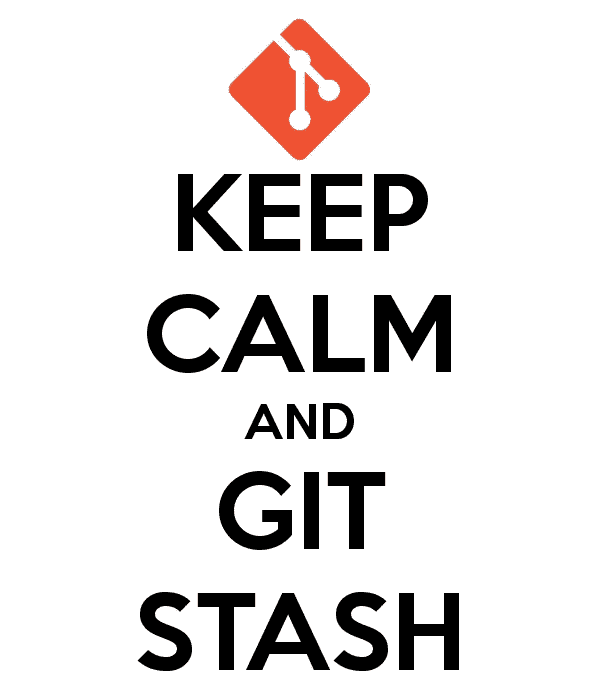
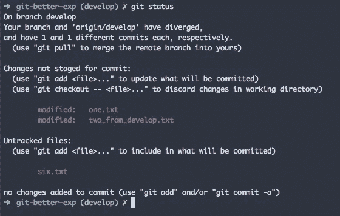
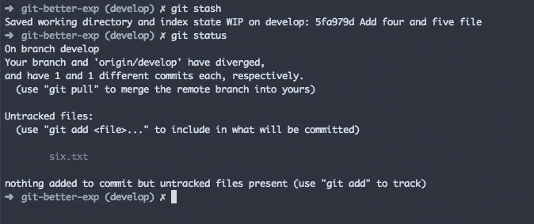
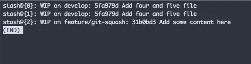
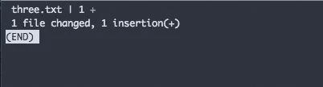
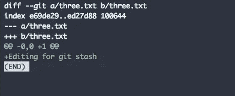
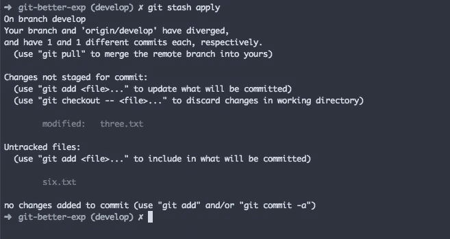

# 如何有效地使用 git stash

> 原文：<https://levelup.gitconnected.com/how-to-use-git-stash-effectively-d4e04870cc2b>



如果您使用 Git 有一段时间了，您可能会遇到 git stash。

Git stash 帮助您临时保存工作目录中的更改，这样您将获得一个干净的目录。然后，您可以在稍后的 git 工作流中应用这些更改。

让我们看一个例子



您可以看到工作目录中有一些变化。您可以使用 git stash 来保存所有的更改，这样工作目录就会很干净。



在存储之后，您可以看到工作目录中被跟踪文件的变更已经消失了。还要注意，未被跟踪的文件仍然存在。

这些保存的更改可以在将来访问和使用，或者永远保存起来。

默认情况下，stash 不会保存未跟踪的文件。但是如果你仍然需要隐藏你可以使用的未被追踪的文件

## 列出所有 git 仓库

您可以在 git 目录中多次使用 git stash。查看您所有的 git 仓库

```
git stash list
```



在上图中，您可以看到 git 仓库的列表。

每个存储都有一个名称、工作目录和 HEAD commit。

Git 存储名称和分支非常重要。这有助于你轻松识别藏匿。

请记住，隐藏工作就像堆栈。最新的库存将在顶部。

## 使用显示查看存储更改

查看已隐藏的更改将会很有用。

```
git stash show
```

上述命令将显示最新 stash@{0}中的更改



查看任何特定存储的变化

```
git stash show stash@{2}
```

要查看 stash 的差异变化，可以使用

```
git stash show -p git stash show stash@{10} -p
```



## 在工作目录中应用隐藏的更改

现在您知道了如何隐藏更改，让我们看看如何在工作目录中应用这些更改。

```
git stash apply
```

上述命令将获取最新的 stash@{0}并将其应用于工作目录。



在上图中，您可以看到最新存储中的更改已被应用。

要应用特定的存储，您可以使用

```
git stash apply stash@{5}
```

**使用 pop**

在工作目录中应用存储还有另一种选择。

```
git stash pop
```

此命令将应用最新存储的更改，并将从存储列表中删除该存储。

应用存储后，如果不再需要存储，请使用此命令。

使用**应用**当你需要应用存储时，你仍然不想从列表中删除存储。

## 删除一批货

```
git stash drop
```

这将删除最新的存储。

```
git stash drop stash@{10}
```

这将放弃特定的藏匿。

## 从 git stash 创建一个分支

```
git stash branch <branch_name> stash@{5}
```

这个命令将用指定的存储名称创建一个新的分支。这将像 **pop 一样从列表中删除隐藏。**

感谢你的阅读，希望你学到了新的东西:)

**你可以在这里找到我的其他 git 相关文章**

```
1\. [How to use git blame effectively](/how-to-use-git-blame-effectively-6228f3f7da5d)2\. [How to squash git commits](/how-to-squash-git-commits-9a095c1bc1fc)3\. [How to rewrite the latest commit with git amend](/how-to-rewrite-the-latest-commit-with-git-amend-48a8d5f27758)4\. [Useful tricks you might not know about git log](/useful-tricks-you-might-not-know-about-git-log-ed5ac32625ef)5\. [How git revert works](/how-git-revert-works-9b87b8b03dd3)6\. [How git cherry-pick works and how to use it effectively](/what-is-git-cherry-pick-and-how-to-use-it-effectively-665247192442)7\. [Automate repetitive tasks in Git](/automate-repetitive-tasks-with-custom-git-commands-76a4b71d262f)8\. [Useful tricks of git fetch and git pull](/how-to-use-git-fetch-and-git-pull-effectively-c6a4becfbc16)9\. [A very basic intro of Git](https://medium.com/@srebalaji/a-very-basic-intro-of-git-b9cab0e64153)
```

> 如果你来了这么久，我想你会对 Git 很感兴趣。可以订阅我的简讯[*GitBetter*](https://gitbetter.substack.com/)*获取 Git 的招数、技巧、高级话题。*