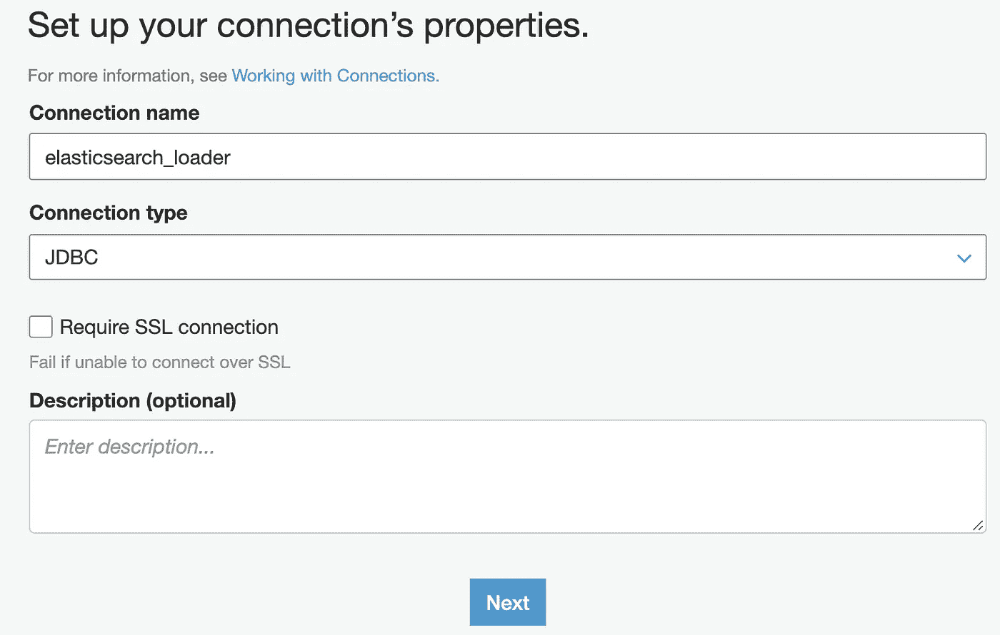
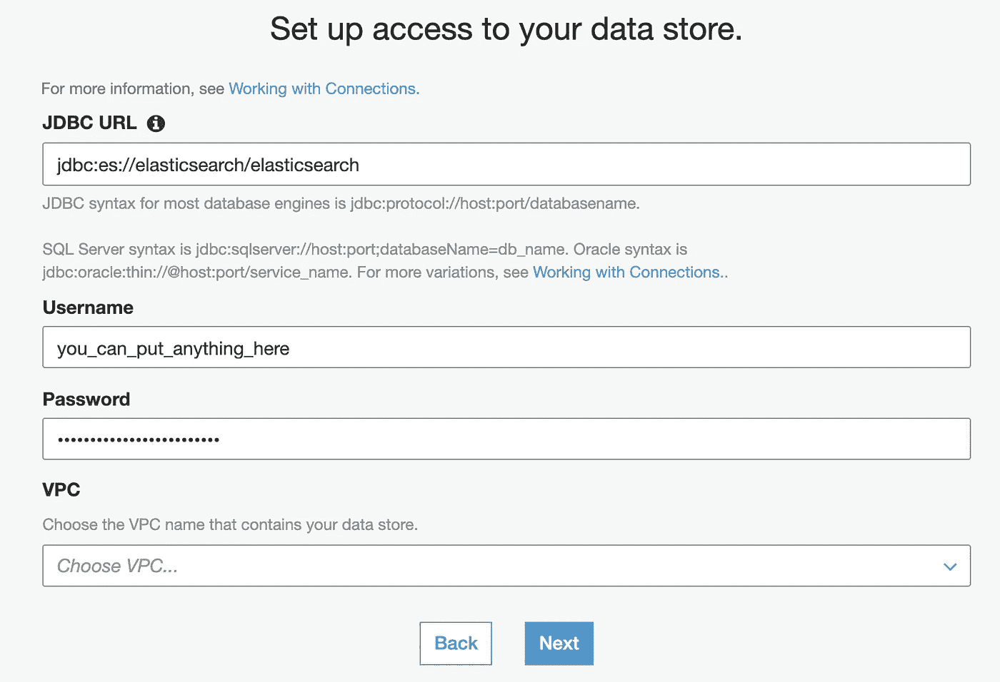
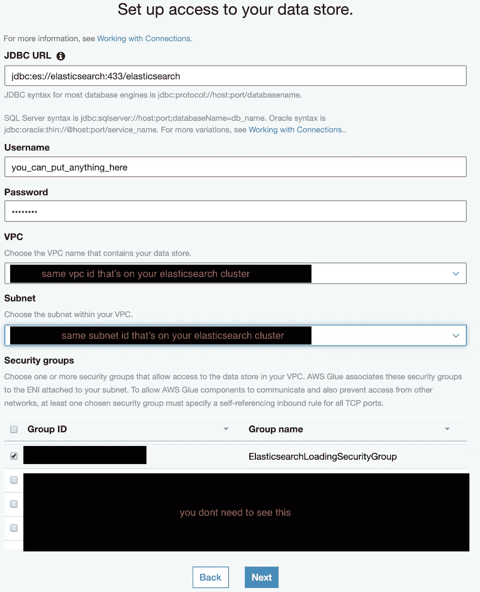
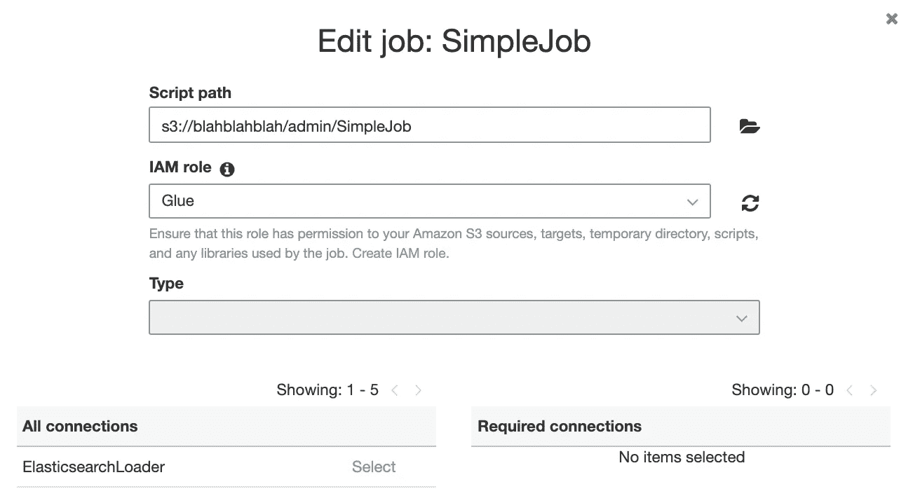
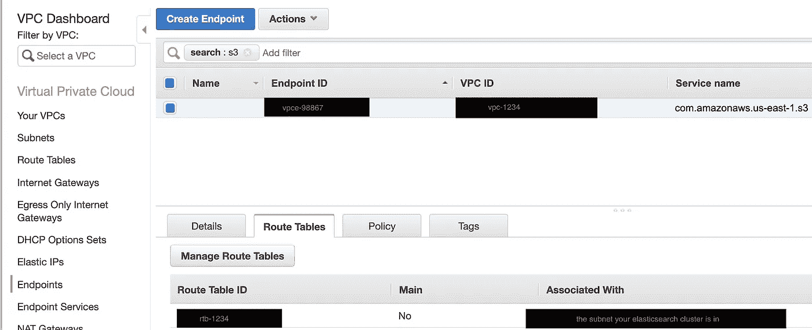

# 如何使用 Glue 将 S3 的数据加载到 VPC 的 AWS Elasticsearch 集群中

> 原文：<https://levelup.gitconnected.com/how-to-use-glue-to-load-data-from-s3-into-an-aws-elasticsearch-cluster-thats-in-your-vpc-fa883e73c403>

我写这篇文章是因为当我遇到这个问题时，网上似乎没有任何资源详细说明如何解决这个问题(不是在堆栈溢出，AWS 支持页面等)。希望即使你的问题不完全相同，这个文档仍然会有所帮助。此外，如果有任何问题，或者如果有任何事情我可以做得更容易，请让我知道！

此外，我将大量使用 AWS CLI 和 **jq** 命令来解析我从 CLI 获得的 json。所以确保你已经安装了 **jq** 。如果你有一台 mac，你可以像[这台](http://macappstore.org/jq/)一样安装它。

# 在 VPC 的子网内创建一个 Elasticsearch 集群(如果您已经有了这个集群，可以跳过这一部分)

我将假设您已经有一个可用的 VPC 和子网(因为创建一个已经超出了本文的范围！).我还假设您的 VPC 中可能已经有一个 Elasticsearch 集群，但出于本教程的目的，我将通过 AWS CLI 创建一个与我的子网关联的 AWS Elasticsearch 集群，尽管您可以使用 GUI 或 terraform(CLI 更简洁)。

```
aws es create-elasticsearch-domain \
   --domain-name my-cool-cluster \
   --access-policies file://policy.json \
   --vpc-options SubnetIds=subnet-123456 \
   --ebs-options EBSEnabled=true,VolumeType=standard,VolumeSize=10# Make sure your Elasticsearch cluster is attached to your subnet!
```

在我的 **policy.json** 中定义的访问策略如下所示:

```
{
  "Version": "2012-10-17",
  "Statement": [
    {
      "Effect": "Allow",
      "Principal": {
        "AWS": "*"
      },
      "Action": "es:*",
      "Resource": "arn:aws:es:*:*:domain/*/*"
    }
  ]
}
```

我把它做得非常开放，因为我不想在本教程中处理签名

# 接下来，创建一个自引用安全组

您需要创建一个自引用安全组。稍后您将使用这个安全组，方法是将它附加到 Elasticsearch 集群和 AWS Glue 连接(如果其中一些没有意义，请不要惊慌！).

在创建安全组之前，您必须获得您的 Elasticsearch 集群所在的 vpc id。您可以通过 AWS CLI 和 jq 命令行这样做:

```
VPC_ID=$(aws es describe-elasticsearch-domain-config \
             --domain-name my-cool-cluster \
             | jq -r .DomainConfig.VPCOptions.Options.VPCId)
```

执行一个 **echo $VPC_ID** 来确保命令成功。

像这样创建安全组:

```
aws ec2 create-security-group \
    --group-name ElasticsearchLoadingSecurityGroup \
    --description "Security group to allow loading into AWS" \
    --vpc-id $VPC_ID
```

您可能会想什么是自引用安全组？它是一个安全组，使用自己作为入口和出口规则的来源(基本上，来源就是该安全组所连接的任何实例)。

要为您的**ElasticsearchLoadingSecurityGroup**创建入口和出口规则，您需要获得安全组 id。您可以通过以下方式实现:

```
# sorry this is so uglySEC_GROUP_ID=$(aws ec2 describe-security-groups \
 --filter Name=vpc-id,Values=$VPC_ID Name=group-name,Values=ElasticsearchLoadingSecurityGroup \
             | jq -r .SecurityGroups[0].GroupId)
```

创建入口规则:

```
aws ec2 authorize-security-group-ingress \
    --group-id $SEC_GROUP_ID \
    --protocol tcp \
    --port 0-65535 \
    --source-group $SEC_GROUP_ID
```

创建出口规则:

```
aws ec2 authorize-security-group-egress \
    --group-id $SEC_GROUP_ID \
    --protocol tcp \
    --port 0-65535 \
    --source-group $SEC_GROUP_ID
```

现在，任何两个连接了该安全组的实例都将能够在所有 TCP 端口上自由通信。那么…现在让我们开始连接过程。

# 将安全组连接到您的弹性搜索集群

我们将使用 AWS CLI 来更新 Elasticsearch 集群的配置。

```
aws es update-elasticsearch-domain-config \
     --domain-name my-cool-cluster \
     --vpc-options SecurityGroupIds=$SEC_GROUP_ID
```

# 创建粘合连接

既然我们已经将它附加到 Elasticsearch 集群，我们还想将它附加到一个胶合连接上。但在此之前，我们必须先在 VPC 内部建立一个胶水连接！

关于这整个胶合连接考验的最令人困惑的部分是，你将创建胶合连接，但是你实际上不需要在你的代码中使用胶合连接。你只需要在 VPC 内创建一个胶合连接，这样你就可以把它附加到你的胶合工作上，这样你就可以在你的 VPC 内启动胶合工作了。我想这对我来说可能是最令人困惑的部分。当您创建粘合连接时，您实际上可以只输入假的配置，因为您甚至不会真正使用该粘合连接。只要确保胶水连接只是连接到 VPC！

我将在接下来的几个步骤中使用 GUI，因为 Glue AWS CLI 有点难用，也没有很好的文档。

你需要在 AWS 控制台中进入**粘合**服务，然后点击**连接**。您将被带到设置连接属性的页面。选择 **JDBC** 作为连接类型。



接下来，你基本上可以在 **JDBC** url 中放一个垃圾字符串，看起来像 **JDBC** 语法。我输入**JDBC:es//elastic search/elastic search**——你也可以！您也可以在用户名和密码输入框中输入任何内容。**先别打下一个！！！！**我会在这张截图后谈论 VPC！



你可以将 JDBC 的网址、用户名和密码放入垃圾中

接下来，让我们配置这个粘合连接的网络部分。对于 **VPC** 和**子网**，选择您的 Elasticsearch 集群所在的同一个 VPC 和子网。还记得我们在上面创建的自引用安全组吗？我们要将它附加到这个粘合连接上，所以在安全组下面，选择那个**ElasticsearchLoadingSecurityGroup**(或者你给它起的任何名字)。



# 创建弹性搜索加载胶合作业

让我们创建 Elasticsearch 加载胶合作业。我不会在本教程的代码，但只是向你展示胶水工作应该有属性。将加载到 Elasticsearch 中的实际 pyspark 代码将在我稍后链接的另一个教程中(因为编写加载到 Elasticsearch 中的实际 Pyspark 代码对我来说也是一项不简单的任务)。

创建作业并将粘合连接附加到作业(我在截图中也犯了一个错误，粘合连接的 elastic search loader 名称应该是 elasticsearch_loader，因为这是我们在创建粘合连接时命名的！我的错！)



ElasticsearchLoader 应该说 elasticsearch_loader，因为这是我们对粘合连接的命名。

如果你已经有了可以在本地加载到 Elasticsearch 的工作代码，那么一旦你上传了代码作为粘合作业，那么你就应该能够加载到 Elasticsearch 的这些配置中——然而，如果你是从 S3 读取，而你不能再从桶中读取，因为 S3 桶在公共网络上，而你的粘合作业在你的 VPC——那么请继续阅读，以找到解决这个问题的方法。

# **如果你读 S3 的作品有困难…**

如果您在从 S3 读取时遇到问题，那么您可以使用 S3 端点来解决这个问题。我假设您可能已经设置了一个 S3 端点。导航至 **VPC →终点**，然后选择您的 S3 终点。然后点击**路由表**。找到与您的 Elasticsearch 集群所在的子网相关联的**路由表 ID** ，然后为**路由表 ID** 复制该值。



然后返回到 **VPC** → **安全组**中的**elasticsearchloadingsecuritygroup**安全组，然后创建一个允许该路由表 ID 上所有 TCP 端口流量的入口和出口规则。