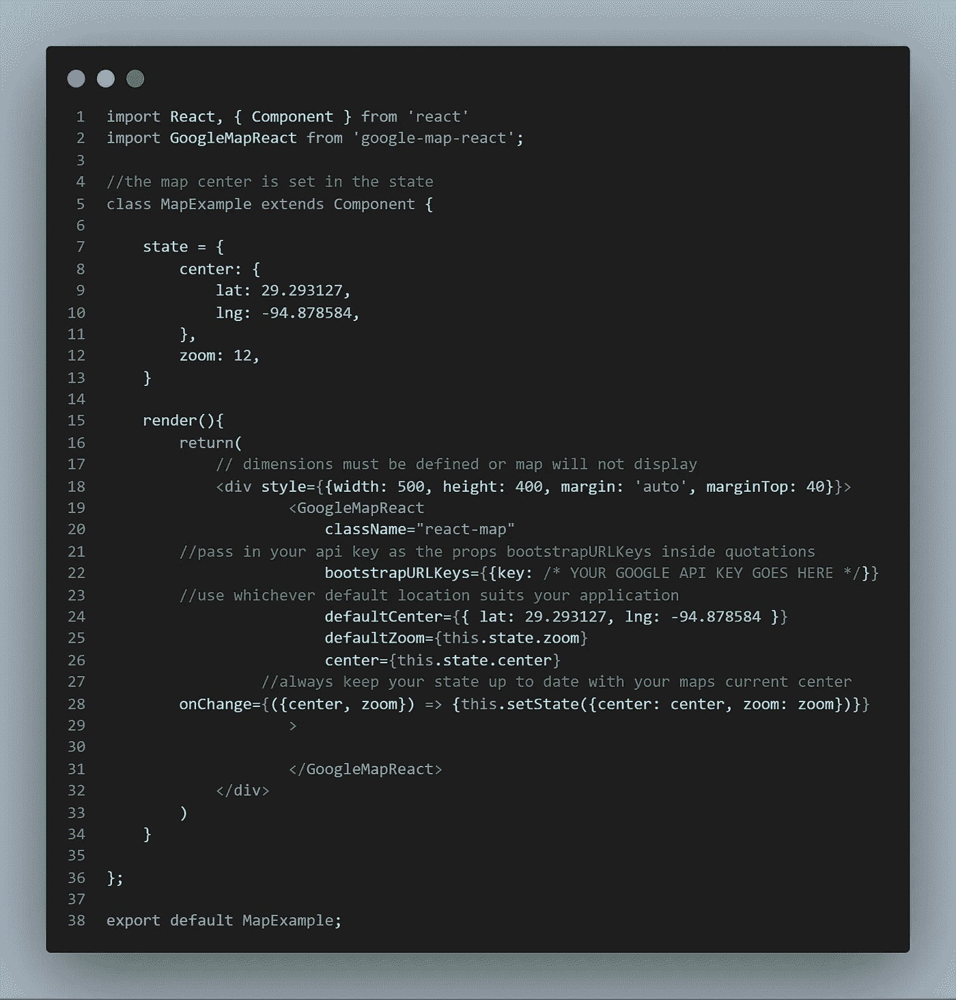
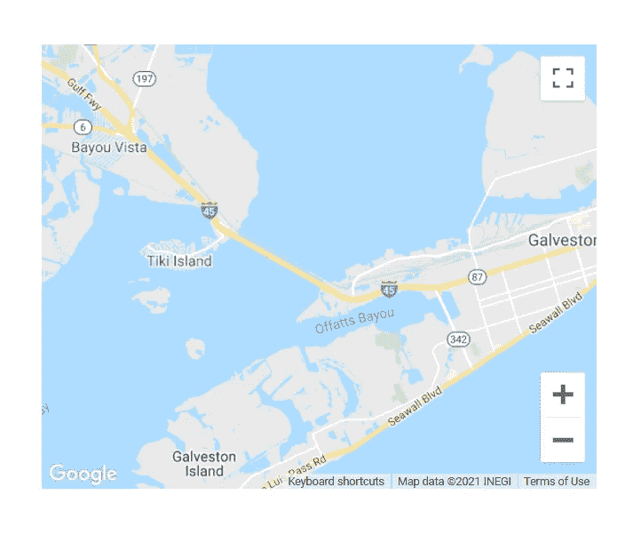
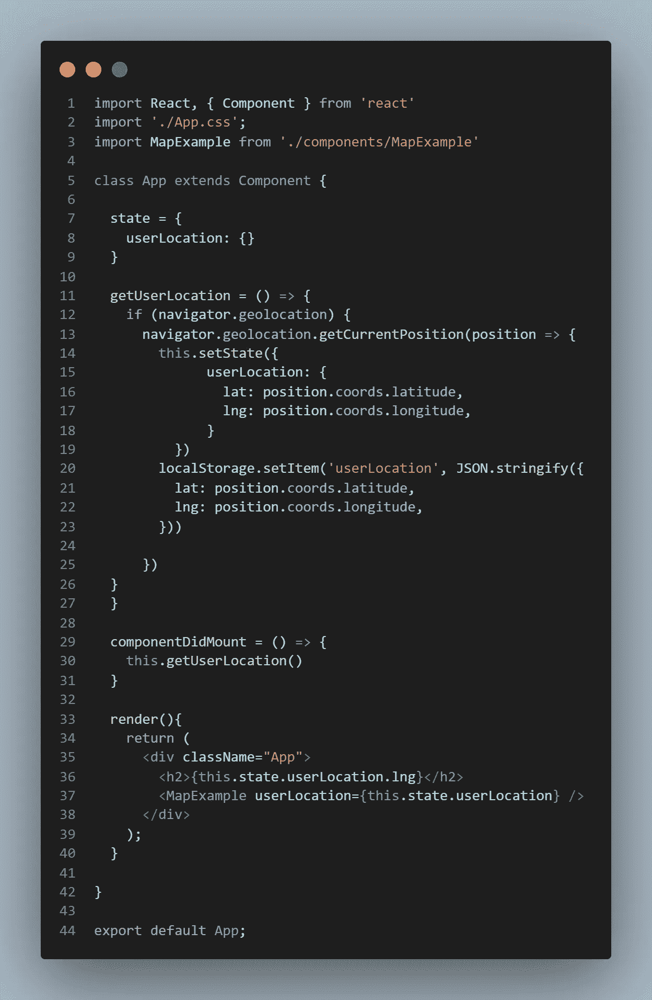
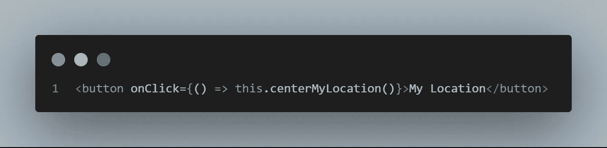
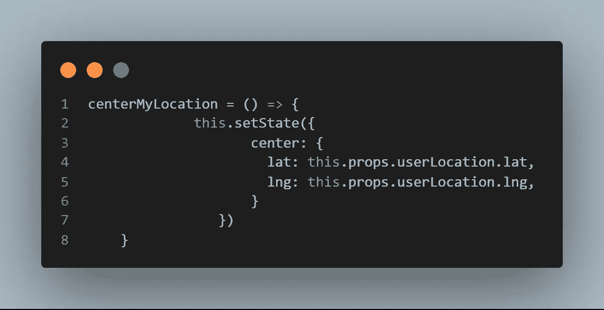
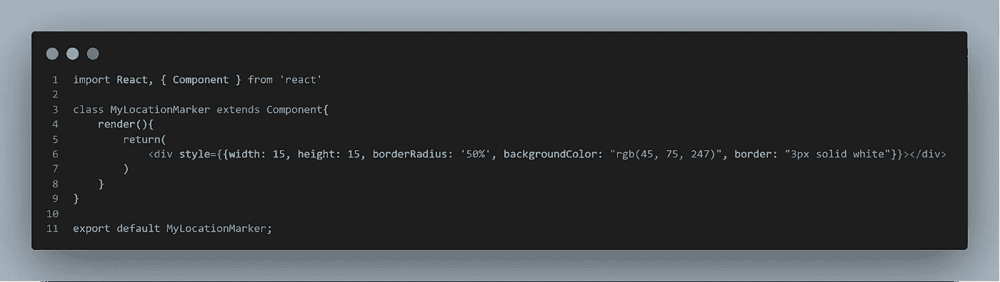
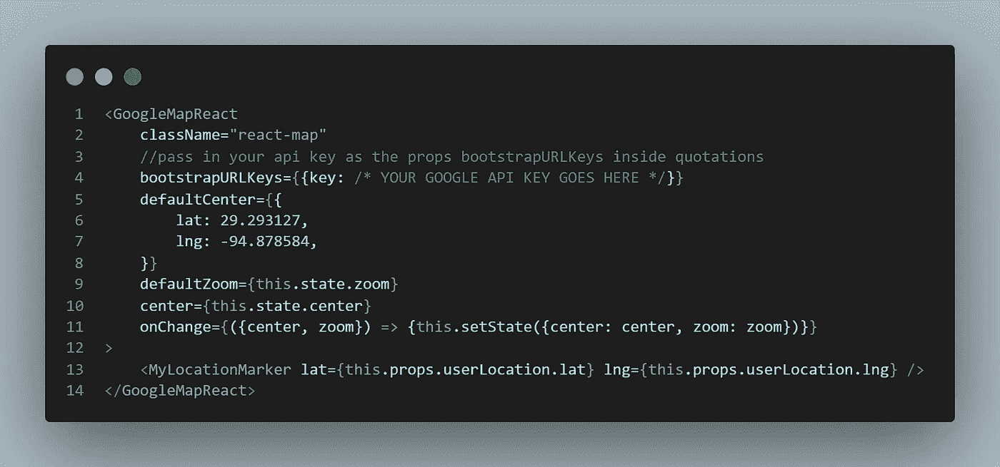
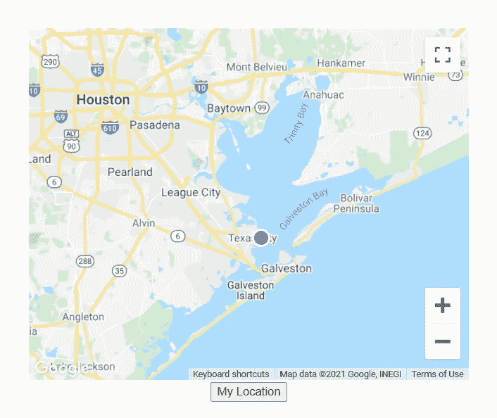
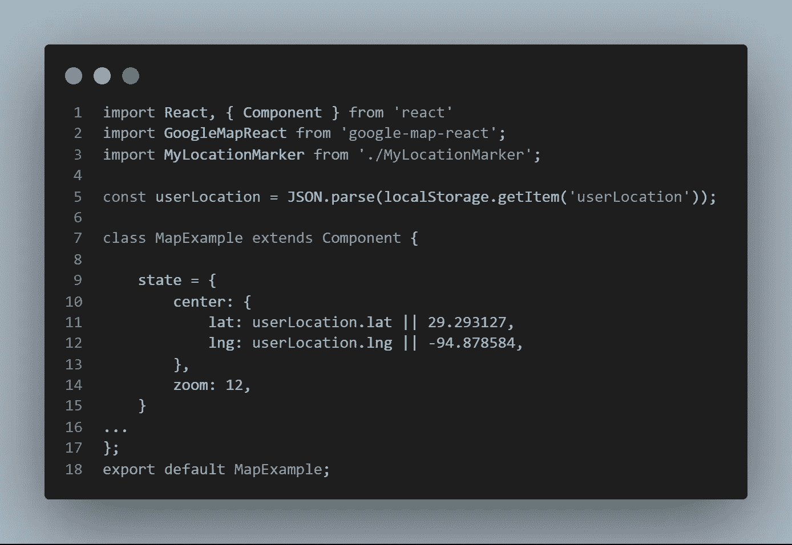

# 如何使用谷歌地图反应:第一部分

> 原文：<https://levelup.gitconnected.com/how-to-use-google-maps-react-57ba97ca897b>

当我决定做一个 React 钓鱼应用时，我知道让用户保存位置是至关重要的，因为像个白痴一样站在岸边和钓鱼的主要区别之一是知道在哪里(T2)钓鱼。

无论你是想在你钓到一条大鳟鱼的新钓鱼点放一根针，还是想为当地企业提供方向，或者显示房地产网站的搜索结果，在你的应用程序中添加一张地图都是非常强大的**。**

# **从这篇文章中可以期待什么**

**这是我在 React 应用程序中使用 **GoogleMapReact** 构建高功能动态地图系列的第一部分。假设您在本系列结束时已经熟悉 React，那么您应该能够创建自己的地图组件，并根据自己的需要为其提供定制的功能。到本文结束时，您应该有一个运行的地图，并能够使用自定义标记填充它。**

****GoogleMapReact** 让您可以访问 Google Maps API 的功能，还允许您在地图中呈现自定义的 React 组件。事实上，它会将任何具有 **lat** 和 **lng** 属性的组件渲染到地图上。这真是太棒了。**

# ****谷歌应用编程接口****

**要开始，您需要创建一个 Google API 项目。你可以在这里这样做[。一旦你创建了你的项目，启用 **Maps JavaScript API** 并获得一个 **API 密匙**。有很多关于如何做到这一点的资源，谷歌文档可以在这里找到](https://developers.google.com/workspace/guides/create-project)。一旦你有了你的 API 密匙，请保管好它，我们以后会用到它。**

# ****NPM 套餐****

**有许多名称相似的不同包，所以请确保您使用的是 **google-map-react** (而不是 react-google-maps 或 google-maps-react)。正确的包装可以在这里找到[。](https://www.npmjs.com/package/google-map-react)**

**通过运行以下命令在 react 应用程序中安装软件包:**

**`npm i google-map-react`**

# ****起床跑步****

**接下来，我们将创建自己的地图组件，在我们的应用程序中进行渲染。我们将在我们的 **MapExample** 组件中导入 **GoogleMapReact** 。此外，最初需要一些东西，以便地图能够正确显示和运行。**

****

# ****设置内嵌尺寸****

**设置 MapExample 组件的宽度和高度。作为所有谷歌地图的要求，导入的地图将填充其父组件的维度，但如果没有维度集，它将折叠到零。我用内联 CSS 设置尺寸，以确保它总是以设置的尺寸加载。**

# ****默认地图道具****

**在加载之前，谷歌地图会寻找它的**默认中心、中心**和**默认缩放**属性。d **efaultCenter** 和 **center** 应该返回一个具有 **lat** 和 **lng** 属性的对象，并且 **defaultZoom** 是一个整数。我从 12 开始。缩放整数越高，它被放大得越多。**

**在地图示例中，我将默认的 **lat** 和 **lng** 设置为我捕获所有这些斑点鳟鱼的地点。:)**

****

****中心**被设置为**本状态中心**，目前与**默认中心相同。你不希望将默认中心设置为州，因为谷歌地图不喜欢你改变默认属性，而且当你使用地图时，你会不断改变州的中心属性。****

# ****谷歌 API 键****

**在 GoogleMapReact 对象中，在 **bootstrapURLKeys** 中传递您的 API 键。传入一个对象，该对象的 key 属性设置为引用中的 API Key。**

# ****OnChange 状态更新****

**我们希望我们的状态总是反映地图中心的当前位置，这可以通过用抓取工具拖动地图来改变。幸运的是，onChange prop 内置了对当前**中心**和**缩放**属性的访问。在这个事件处理程序中，我们可以在每次地图改变时将状态更新到地图当前指向的位置。**

****

**现在我们已经建立并运行了地图，您的应用程序可能需要一些基本的功能。**

# ****获取用户的位置****

**接下来，我们在 MapExample 组件中放置一个按钮，单击该按钮将获取用户的位置，并将地图重新置于该位置的中心。**

**首先，我们在应用程序组件中获取用户的位置。然后我们通过 Props 将它传递给 MapExample 组件。我还将其保存到 localStor**

**年龄的原因，我稍后会进入。**

****

**在 MapExample 组件中，我们制作了一个调用 **centerMyLocation** 函数的按钮:**

****

**然后，MapExample 组件中的这个函数通过更新状态将地图置于用户位置的中心。**

****

# ****放置标记****

**正如我之前说过的，GoogleMapReact 最酷的事情之一是，它会将任何有 **lat** 和 **lng** 道具的组件渲染到地图上。您还可以创建具有满足您应用程序特定需求的功能的组件。所以让我们做一些标记吧！**

# ****我的位置标记****

**首先，我们将创建一个简单的 MyLocationMarker 组件，它在地图加载时自动显示用户的位置。我已经提供了一些内联 CSS 来使 div 变成蓝点。**

****

**从这里开始，我们所要做的就是将标记导入到 MapExample 中，并传入用户的 lat 和 lng 作为道具。**

****

**然后嘣！我们有用户的位置…**

****

**要让地图在加载时自动以用户的位置为中心，有几个选项。对于这个例子，我只是将用户的位置保存到 localStorage，并在 MapExample 组件中检索它。然后我用逻辑 OR 运算符将其设置为状态。**

****

# ****重新加盖****

**到目前为止，在本系列的第一部分中，我们已经学习了如何:**

*   **将 **google-map-react** 导入一个组件。**
*   **设置默认道具。**
*   **从 **onChange** 事件处理程序中访问映射属性。**
*   **获取用户的位置。**
*   **将标记组件设置到地图内用户的位置。**

**我希望这能帮助你更好地使用谷歌地图。在本系列的下一部分，我将介绍如何用信息气泡创建更多的功能标记组件。编码快乐！**