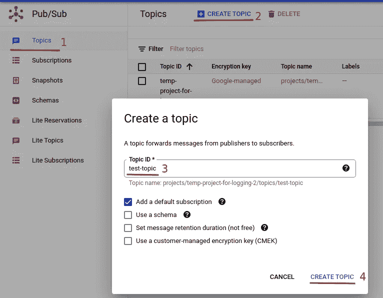

# 如何使用 Google Pub/Sub 在 Python 中构建异步消息传递系统

> 原文：<https://levelup.gitconnected.com/how-to-use-google-pub-sub-to-build-an-asynchronous-messaging-system-in-python-3b43094627dc>

## 了解一个简单而强大的云发布/订阅系统

Google 云平台上的 Pub/Sub(发布者/订阅者)服务是一个现代化的异步消息传递系统。它类似于开源的 Apache Kafka，但是使用起来简单得多。Pub/Sub 是 GCP 生态系统的一部分，因此与其他服务一起使用非常方便。你可以使用 Pub/Sub 将你的应用与云函数、数据流、Bigtable、云存储等进行集成。此外，Pub/Sub 有许多编程语言的客户端库，包括 Python。在本文中，我们将介绍 Pub/Sub 的基本概念，然后逐步说明如何在 Python 中使用它。


图片来自 [Pixabay](https://pixabay.com/photos/queue-playmobil-to-wave-655820/) 。

关键概念:

*   **发布者** —消息的生产者。
*   **订阅者**——消息消费者。
*   **异步** —事件的发生与事件的处理时间和方式无关。对于发布/订阅，发布者只发布消息，而不关心消息是否、如何以及何时被处理。通过这种方式，消息的发布和处理是分离的。
*   主题—GCP 上的一个抽象资源，出版商向其发布消息。我们不需要关心背后的技术细节，只需要知道题目的**名**即可。
*   **订阅** —与主题类似，订阅是一种抽象的 GCP 资源，它处理从特定主题到一些专用订阅者的消息流。
*   **推送发送类型** —发布/订阅自动将发布的消息推送给订阅者。云函数是推送机制的常见订户，因为发布/订阅可以自动触发云函数，如示例中所示。
*   **拉取传递类型** —订阅者必须自己从一个主题中拉取消息。

建议创建一个临时项目，在您完成本教程后可以将其删除，这样您就不会被进一步收费。如果你不知道如何在 GCP 上创建和删除一个项目，先看看这篇文章。

要在 Python 中发布和接收来自发布/订阅的消息，您需要创建一个具有“发布/订阅发布者”和“发布/订阅订阅者”角色的服务帐户:


创建服务帐户后，记得为它创建一个 JSON 密钥，稍后将在我们的 Python 代码中使用该密钥进行身份验证。

在 GCP 上创建服务帐户的逐步说明也包含在[上一篇文章](https://medium.com/codex/how-to-write-logs-to-google-cloud-logging-in-python-46e7b514c60b)中。

既然已经下载了服务帐户密钥，我们就可以用它来认证我们的 Python 应用程序了。

在我们可以向 Pub/Sub 发送消息之前，我们需要为它安装客户端库。建议[创建一个虚拟环境](https://medium.com/codex/how-to-create-virtual-environments-with-venv-and-conda-in-python-31814c0a8ec2)并在那里安装库，这样就不会搞乱系统库。为简单起见，我们将使用 [*conda*](https://medium.com/codex/how-to-create-virtual-environments-with-venv-and-conda-in-python-31814c0a8ec2) 来创建虚拟环境。为了更容易地以交互方式运行 Python 代码，我们还将安装 iPython:

```
(base) $ conda create --name gcp_pubsub python=3.10
(base) $ conda activate gcp_pubsub
(gcp_logging) $ pip install -U google-cloud-pubsub
(gcp_logging) $ pip install ipython
```

现在让我们为服务帐户密钥设置一个环境变量。这是推荐的方法，因为它使用授予服务帐户的角色来验证所有 gcloud 服务。

```
$ export **GOOGLE_APPLICATION_CREDENTIALS**=~/Downloads/service-account-key.json
```

环境变量的名称必须是**GOOGLE _ APPLICATION _ CREDENTIALS**否则将无法工作。Google SDK 使用这个环境变量进行身份验证。现在让我们开始使用 Python 中的 Pub/Sub。

**创建主题和订阅**。

在使用发布/订阅进行消息传递之前，我们应该先创建一个主题和一个订阅。你可以在本地或谷歌云控制台上用`gcloud`命令来完成。

您可以在本地运行`gcloud`命令来创建主题和订阅，如下所示:

```
$ **gcloud pubsub topics create test-topic**$ **gcloud pubsub subscriptions create test-subscription --topic test-topic**
```

或者，您可以在[谷歌云控制台](https://console.cloud.google.com/home/dashboard?project=temp-project-for-logging-2)上创建一个主题和订阅。首先，找到发布/订阅并启用 API(如果它还没有启用的话)。然后根据下面的说明创建一个主题和一个订阅。如果你没有以编程方式创建主题或订阅，你可能更喜欢在谷歌云控制台上创建它们，因为你可以在那里有更直接和更生动的控制。这些选项也可用于`gcloud`命令。然而，如果你是第一次接触 Pub/Sub，你会很难找到和使用它们。



在 Google Cloud 控制台上创建的主题有一个为它创建的默认订阅。如果需要，您可以创建一个新的，就像这里将要做的那样。选择刚刚创建的“测试主题”，打开“主题详情”。向下滚动到页面底部，您会看到“订阅”部分:


您只需要指定订阅 ID，所有其他选项都可以保留为默认值。对于您自己的实际案例，您可能希望根据您的需求对选项进行微调。特别是，我们将在这里创建一个“拉”类型的订阅，这意味着我们需要通过这个订阅从一个主题中显式地拉消息。稍后，我们将创建一个“推送”类型的订阅，将消息推送到云功能并自动触发它。


现在，您可以单击“创建”来创建订阅。

**创建一个发布者**。

既然已经创建了主题和订阅，我们就可以向主题发布消息，并通过订阅从主题接收消息。

您需要指定您的 GCP 项目 id 和上面创建的主题 ID。项目 ID 可以在 Google Cloud 控制台上找到，也可以通过`gcloud projects list`命令找到。


上述代码片段的要点:

*   我们需要使用*发布者*的`topic_path`方法来获得一个完全合格的主题字符串，看起来像`projects/project-id/topics/topic-id`。
*   *发布者*发送的消息必须是字节串。如果不是，它必须被编码成一个字节串。如果您对字符串编码/解码不清楚，请检查此处的[和](https://medium.com/codex/understand-the-encoding-decoding-of-python-strings-unicode-utf-8-f6f97a909ee0)。
*   发布消息时返回“*未来*”。您可以调用 *future* 的`result()`方法来返回刚刚发布的消息的消息 ID。

注意*未来*的`result()`方法阻塞，直到消息成功发送。您可以为`result()`设置超时参数。如果消息未在指定时间内发送，将引发`TimeoutError`异常。为了让你的代码更高效、更健壮，你可以给*未来*添加一个回调函数:

本部分的要点:

*   我们可以使用*未来*的`add_done_callback`方法给*未来*添加一个回调函数。顾名思义，在*未来*解析的时候会调用回调函数。这样，我们就可以使代码非阻塞。同样，解析*未来*的异常可以在回调函数中处理。注意`get_callback`函数不是真正的回调函数。它像一个工厂一样工作，并返回真正的回调函数，该函数将*未来*作为第一个参数。我们需要以这种方式返回回调函数，因为我们希望将消息传递给回调函数，以便在消息未成功发布时记录下来，这有助于调试。
*   *库的 ***期货*** 模块用于将所有*期货*一起解析。通过这种方式，我们可以异步发布消息，并且在发布消息时不会被阻塞或导致应用程序崩溃。*

***创建订户**。*

*现在一些消息已经由发布者发布了，我们可以创建一个订阅者来通过订阅使用来自该主题的消息:*

*订户的要点:*

*   *正如我们所看到的，我们需要指定一个订阅 id 来接收来自主题的消息。我们不能直接从一个主题接收消息。*
*   *我们需要使用`SubscriberClient`通过订阅接收来自某个主题的消息。*
*   *向订户添加了回调函数。当一些消息发布到主题并通过订阅可用时，回调函数将被自动调用。*
*   *我们需要在收到消息时“确认”消息。否则，消息将被再次传递。*
*   *我们使用一个`with`块来创建一个上下文管理器，当出现`TimoutError`异常时，它会自动关闭订阅者。*
*   *从技术上讲，在实践中，对于订阅者应用程序，我们不需要也通常不想为订阅者设置超时。订户应该在那里，只要有消息，就处理消息。*

*上面我们已经创建了一个 **Pull** 类型的订阅，这意味着我们需要显式地从订阅中提取消息。现在让我们创建一个**推送**类型的订阅，当任何消息发布时，它会将消息推送到某个地方，这里是一个云功能。*

*现在让我们创建一个云函数，你会看到它是如何工作的。云函数基础知识请参考[本文](https://medium.com/codex/learn-how-to-use-google-cloud-functions-in-python-with-a-simple-example-6a50a45603ae)。*

****

*云功能的要点:*

*   *给云函数起一个描述性的名字，选择一个离你最近的地区。*
*   ***重要的是，在“触发”部分，选择“云发布/订阅”作为触发类型，并选择您在**上面创建的主题 id。*

*然后，您可以单击“保存”，然后单击“下一步”进入下一步，编写 Python 代码来接收和处理消息。如果尚未启用“云构建”API，您可能需要启用它。因为，在引擎盖下，[云构建](https://medium.com/codex/build-a-docker-image-with-cloud-build-in-google-cloud-platform-5f6840af2c05)用于构建云函数的 docker 映像。*

**

*尤其是选择最新的 Python 3.x 作为运行时。如果您创建了多个函数，那么您需要为云函数选择一个入口点函数，当云函数被调用时，这个入口点函数将被调用。实际上，自动创建的伪代码对于这个演示来说已经足够了。在你的实际使用中，这里会有更复杂的逻辑。例如，当收到一些消息时，您可以向您的工作通道发送通知，或者使用 ***请求*** 模块调用后端 API。*

*一切设置好后，点击“部署”即可部署云功能。您需要等到部署云功能后，才能发布新消息。否则，他们不会触发云功能。*

*让我们再次运行上面的发布者代码来发布一些消息。*

*消息发布后，我们可以去云功能的“日志”查看收到的消息:*

**

*干杯！消息被“推”到云功能，并在那里使用。如果您没有注意到，我们没有创建**推送**类型的订阅。实际上，我们不必这样做，因为 Pub/Sub 会自动为我们创建一个:*

**

*在本文中，我们介绍了 Google 发布/订阅的基础知识。我们已经学习了如何创建主题和订阅。我们还学习了如何用 Python 创建简单的发布者和订阅者。此外，我们还介绍了如何创建一个由发布/订阅触发的云功能，为此我们在幕后创建了一个拉式订阅。我希望你喜欢这篇文章，并学到了很多东西。*

*相关文章:*

*   *[如何在 Python 中使用 Redis 进行缓存和发布/订阅](https://betterprogramming.pub/how-to-use-redis-for-caching-and-pub-sub-in-python-3851174f9fb0?source=your_stories_page----------------------------------------)*