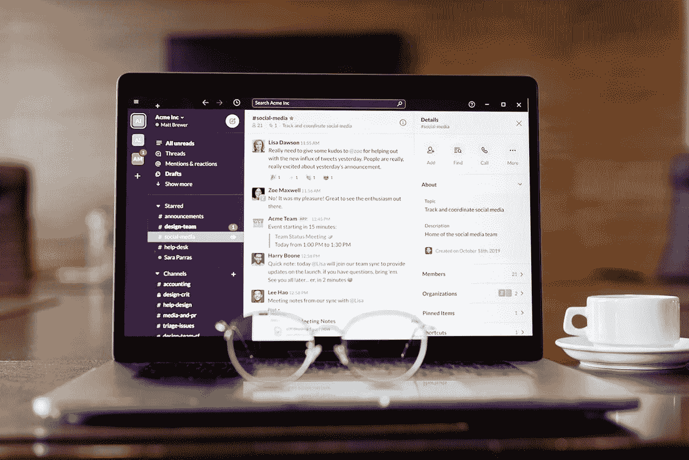
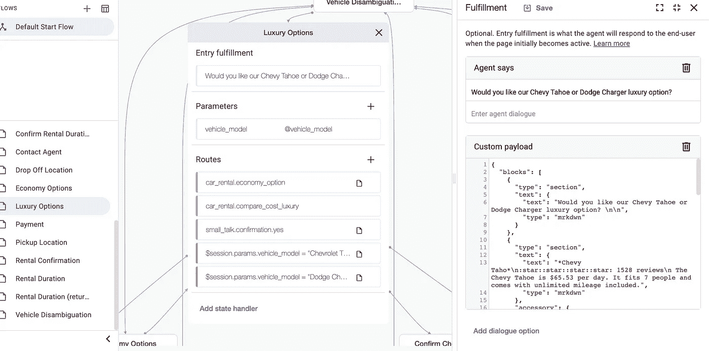
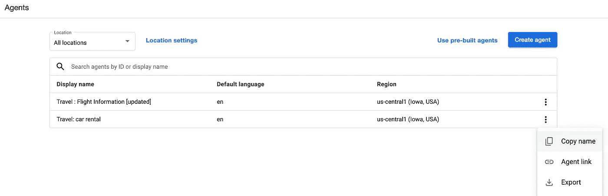
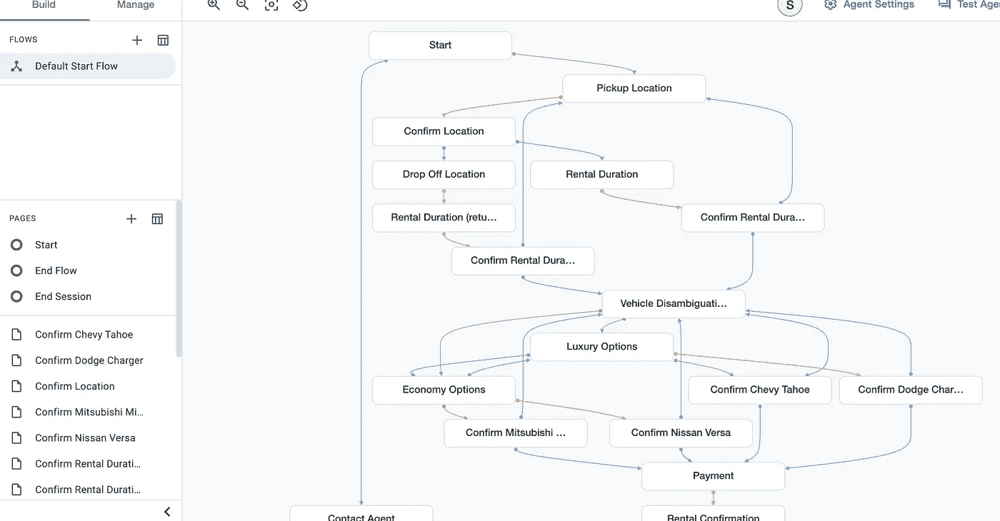
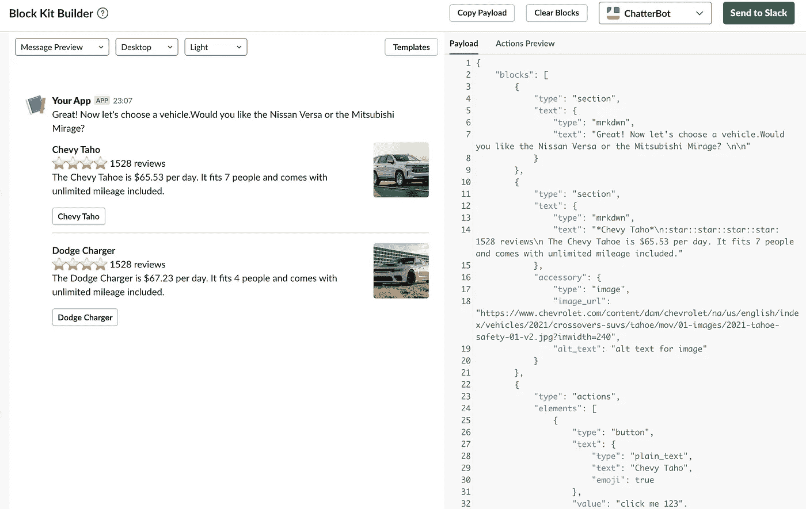
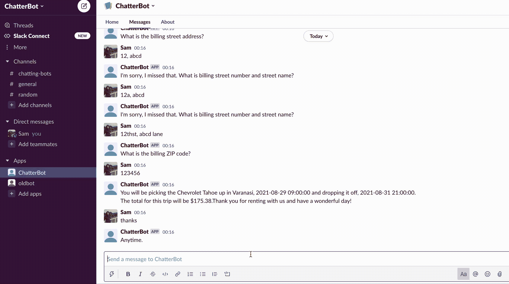

# 如何使用 Google 的 Dialogflow CX 制作一个 slack 聊天机器人

> 原文：<https://levelup.gitconnected.com/how-to-use-googles-dialogflow-cx-to-make-a-slack-chat-bot-9fe3e8ca2fcf>

## Dialogflow CX 概述以及如何使用 Slack。



米哈伊尔·尼洛夫摄于[佩克斯](https://www.pexels.com/photo/black-and-silver-laptop-computer-8284722/?utm_content=attributionCopyText&utm_medium=referral&utm_source=pexels)

聊天机器人是经营企业或写博客的人最重要的必备工具之一。聊天机器人不仅通过管理您的支持团队需要为每个客户提供的所有重复信息来节省时间和精力，而且通过快速回答问题和解决问题来提高客户满意度。

# 什么是对话流 CX？

对话流 CX 或客户体验，于 2020 年 12 月全面启动。

> 这是一种设计代理的新方法，采用状态机的方法来设计代理。这为您提供了对讨论的清晰明确的控制，以及卓越的最终用户体验和开发工作流。

让我们讨论 Dialogflow CX 附带的 3 个基本术语:

## 代理人

Dialogflow CX 代理是管理您的最终用户对话的虚拟代理。该代理通过自然语言处理将用户文本或音频转换为结构化数据，您的应用程序和服务可以在整个对话过程中理解这些数据。

## 流

人机交互可能很复杂，涉及各种主题。心流被用来指定这些主题和与之相关的对话路径。默认启动流程是每个代理的默认流程。

## 意图

一个[意图](https://cloud.google.com/dialogflow/cx/docs/concept/intent)将一个终端用户的意图分类为一个对话回合。与 [ES 意向](https://cloud.google.com/dialogflow/docs/intents-overview)相比，CX 意向已经被简化，使其成为一个更可重用的资源。



正在创建对话流 CX 代理

# Dialogflow CX 与 Dialogflow ES 有何不同？

CX 是一种高级代理类型，可以通过使用流、页面和状态处理程序来处理广泛或复杂的对话。

然而，ES 是一种标准的代理类型，最适合于小型到中型以及简单到中等复杂的代理，意图和上下文控制对话路径。

对话流 CX 和 ES 都使用意图，但是，在对话流 CX 意图可以重用。

在 Dialogflow CX 中，可以使用可视化编辑器更高效地设计对话路径和对话流。然而，Dialogflow ES 大多是基于文本的。

# 你如何让 Dialogflow CX 与你的 Slack 机器人一起工作？

Slack 是一个协作环境，这意味着你可能需要人们看到/访问某些信息。另一方面，你可能也想让一些无聊的对话保持私密。

您可以使用 dialog flow-slack integration SDK 来完成这两项工作，甚至更多。让我们看看如何设置一个 slack bot，并使用这个 SDK 制作一个代理，并将其连接到 slack bot。

## 克隆 SDK 的 GitHub 库

`git clone [https://github.com/Sampriti-Mitra/dialogflow-slack-sdk.git](https://github.com/Sampriti-Mitra/dialogflow-slack-sdk.git)`

## 在空闲时间设置 bot/使用现有的空闲 bot

[创建一个新的 slack 机器人，并给它起任何名字。现在，在设置页面上，转到基本信息，将机器人安装到工作区。](https://api.slack.com/apps?new_app=1)

## 设置 bot 凭据

Slack 发送一个报头**来验证 slack 发送的所有请求的秘密**。

**应用程序级令牌**允许您的应用程序使用适用于多个(或所有)安装的平台特性——例如，列出事件授权的[API](https://api.slack.com/apps/A02B3UUJCCV/event-subscriptions)。

Slack 应用的功能和权限由它请求的[范围](https://api.slack.com/scopes)控制。 **Bot 令牌作用域**是管理应用程序可以访问的内容的作用域。

1.  在 slack 上的 bot 设置页面，转到基本信息页面。向下滚动到应用凭据，并通过单击显示复制签名密码。现在将它复制到 SDK 的本地克隆中的 [token.go](https://github.com/Sampriti-Mitra/dialogflow-slack-sdk/blob/main/functions/config/token.go) 文件中的`SLACK_SIGNING_SECRET`。
2.  在同一页面上向下滚动到应用程序级令牌，然后单击生成令牌和范围按钮。添加两个可用范围`[**connections:write**](https://api.slack.com/scopes/connections:write)` 和`[**authorizations:read**](https://api.slack.com/scopes/authorizations:read)` **。**单击 Generate，现在复制令牌并将其粘贴到本地克隆中 token.go 中的 APP_TOKEN 中。
3.  现在转到 slack api 上的`Oauth & Permissions`页面，复制您的 **Bot 用户 OAuth 令牌**将`BOT_TOKEN`中的值粘贴到您本地的 token.go。

# 决定松弛模式

Slack 可以通过两种方式向后端服务器发送信息。通过请求 URL 或通过 web 套接字。

## 套接字模式

打开套接字模式将通过 WebSockets 连接路由应用程序的交互和事件，而不是将这些有效负载发送到请求 URL，这些 URL 是公共 HTTP 端点。

此设置适用于正在开发或需要部署在防火墙后的内部应用。它不适用于广泛分布的应用程序。

## 请求 URL

您的应用程序可以订阅在您选择的 URL 接收 Slack 中的事件通知(例如，当用户添加反应或创建文件时)。

在 SDK 中， [app.yaml](https://github.com/Sampriti-Mitra/dialogflow-slack-sdk/blob/main/app.yaml) 文件指定调用哪个 main.go， [root](https://github.com/Sampriti-Mitra/dialogflow-slack-sdk/blob/main/main.go) 中的那个(触发事件模式并接受来自 slack 的 http 请求)和 socket mode 目录中的 [main.go](https://github.com/Sampriti-Mitra/dialogflow-slack-sdk/blob/main/functions/socket_mode/main.go) 打开 web socket。

对于本文，让我们使用**请求 url** 和**订阅事件**来获取发送到应用程序的事件有效负载。

# 订阅事件

转到本地克隆的 SDK，转到 [app.yaml](https://github.com/Sampriti-Mitra/dialogflow-slack-sdk/blob/main/app.yaml) 文件。确保最后一行`#main: ./functions/socket_mode`被注释掉。

现在转到**事件订阅**选项卡，点击启用事件。暂时将请求 URL 保留为空，并在 Subscribe to bot events 中添加范围。添加**应用提及**和**消息. im** 范围。

转到 slack api 上的**交互性&快捷方式**选项卡并启用它。同样，将 URL 字段留空。

# 设置对话流 CX 代理

如果你还没有设置 GCP，你可以这样做，从[这里](https://github.com/Sampriti-Mitra/dialogflow-slack-sdk#gcp-setup)。复制项目 id 并将其添加到本地的 [token.go](https://github.com/Sampriti-Mitra/dialogflow-slack-sdk/blob/main/functions/config/token.go) 文件中。

进入 [Dialogflow CX](https://dialogflow.cloud.google.com/cx/projects) ，选择一个项目，或者新建一个项目。现在使用汽车租赁预建代理。复制代理名称并将其添加到本地 [token.go](https://github.com/Sampriti-Mitra/dialogflow-slack-sdk/blob/main/functions/config/token.go) 文件中。



从对话流 CX 代理复制代理名称

现在开新成立的汽车租赁代理。你应该能看到这样的东西。



Dialogflow CX 租车代理流程

在 [GCP 控制台](https://console.cloud.google.com/home/)上，选择项目并启用 Dialogflow API。现在转到左侧导航栏，GCP 控制台上的 API 和服务- >凭据页面。

单击创建凭据并添加服务帐户凭据。填写详细信息，并选择 Dialogflow 客户端 API 角色。现在点击创建凭证并下载。请按照此[自述文件](https://github.com/Sampriti-Mitra/dialogflow-slack-sdk#service-account-setup-gcp)获取更详细的说明。

您可以导出凭证导出`GOOGLE_APPLICATION_CREDENTIALS=<path-of-stored-credential>`或将其添加到克隆应用的 config 目录中。

# 如何在 App Engine 上托管服务器

App Engine 是一个完全托管的无服务器平台，用于创建和托管可扩展的应用程序。

> [App Engine](https://cloud.google.com/appengine/docs/standard/go/how-requests-are-handled) 运行应用程序的多个实例，每个实例都有自己的 web 服务器来处理请求。任何请求都可以路由到任何实例，因此来自同一个用户的连续请求不一定发送到同一个实例。一个实例可以同时处理多个请求。实例的数量可以随着流量的变化而自动调整。

要运行 App Engine，请确保您有一个 GCP 项目，或者创建一个。可以参考[这个](https://cloud.google.com/appengine/docs/standard/go/console)。还要确保设置了 Dialogflow API [身份验证](https://cloud.google.com/dialogflow/es/docs/quick/setup#auth)的项目凭证。

*   在终端上，cd 到克隆项目的根目录，然后`gcloud app deploy --project [project-id]`这将部署您的项目。`gcloud app --project [project-id] logs tail -s default` 查看日志。

App Engine 可能会在不同的实例中运行不同版本的应用程序，由于流量会在实例之间分开，因此如果任何[版本过时且未删除](https://stackoverflow.com/questions/34499875/how-to-automatically-delete-old-google-app-engine-version-instances)，它将会给出过时的响应，在这种情况下，我们需要手动删除该版本。

# 运行应用程序，并将 URL 复制到 slack API

*   将上面获得的 url 插入 slack 的事件 url。如果应用程序能够成功地使用质询参数进行响应，请求 URL 应该会获得批准。这基本上意味着 slack 向您的 URL 发送了一些请求，您需要用 challenge 参数进行响应，而您做到了！
*   将 url 插入到 slack api 的交互性和快捷方式选项卡中的请求 url 中。
*   在 slack 上，确保您需要订阅的 bot 事件都被选中。如果没有，则添加并保存它们。包括应用提及和消息

# 使用 Dialogflow CX 中的自定义有效负载在 slack 上添加交互元素

在 slack 上，我们可以选择使用[块套件](https://api.slack.com/block-kit) **布局块**和**块元素**来格式化文本和整合优雅的 UI 样式

你可以去[https://app.slack.com/block-kit-builder](https://app.slack.com/block-kit-builder)体验不同的显示文本的可能性，让它与用户互动。



Slack 的机器人工具包生成器

现在回到对话流 CX 控制台。在 Dialogflow CX 汽车租赁代理，进入豪华选项。单击条目实现，并将 block kit UI 代码粘贴到自定义有效负载中。


在“确认 Chevy Taho”页面中，转到“条目实现”并从 block kit UI 添加自定义有效负载。确认道奇充电器页面做同样的事情。

```
{
 “blocks”: [
 {
 “type”: “section”,
 “text”: {
 “text”: “The Chevy Tahoe is $65.53 per day. It fits 7 people and comes with unlimited mileage included.\n Would you like to proceed to payment?”,
 “type”: “mrkdwn”
 },
 “accessory”: {
 “alt_text”: “alt text for image”,
 “image_url”: “[https://www.chevrolet.com/content/dam/chevrolet/na/us/english/index/vehicles/2021/crossovers-suvs/tahoe/mov/01-images/2021-tahoe-safety-01-v2.jpg?imwidth=240](https://www.chevrolet.com/content/dam/chevrolet/na/us/english/index/vehicles/2021/crossovers-suvs/tahoe/mov/01-images/2021-tahoe-safety-01-v2.jpg?imwidth=240)",
 “type”: “image”
 }
 }
 ]
}
```

最后，我们准备在 slack 上测试我们的机器人。转到安装 slack bot 的工作区。转到机器人的主页->消息并开始聊天！

# 带 slack 演示的 Dialogflow CX



slack 上的 Dialogflow CX 汽车租赁代理

# App Engine 项目清理

对于[删除 app engine](https://medium.com/google-cloud/app-engine-project-cleanup-9647296e796a) 版本，可以做一个`gcloud app versions list`后跟`gcloud app versions delete <version-from-list>`。或者，如果你只是想停止应用程序而不删除它，你可以做`gcloud app versions stop $VERSION — quiet`。最后，如果您在上面单独创建了一个项目，您也可以删除整个项目(这也将删除项目拥有的所有其他服务)。

# 如何为 Github 上的 Dialogflow — Slack integration SDK 做出贡献

祝贺你成功创建了一个 Dialogflow CX 代理，并将其链接到你在 slack 上的工作区。

但是还有一个更好的消息！

您可以在 GitHub 上为这个开源的 dialog flow CX-Slack SDK repo 做出贡献，以添加更多功能！只需按照本参考[https://jarv.is/notes/how-to-pull-request-fork-github/](https://jarv.is/notes/how-to-pull-request-fork-github/)中的步骤。

祝贺你到达这篇文章的结尾。下次见！