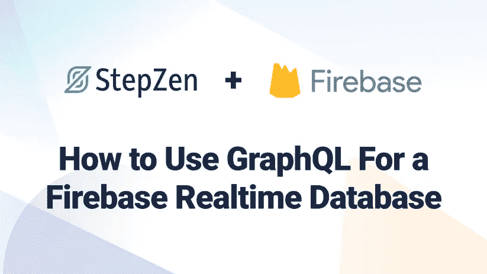
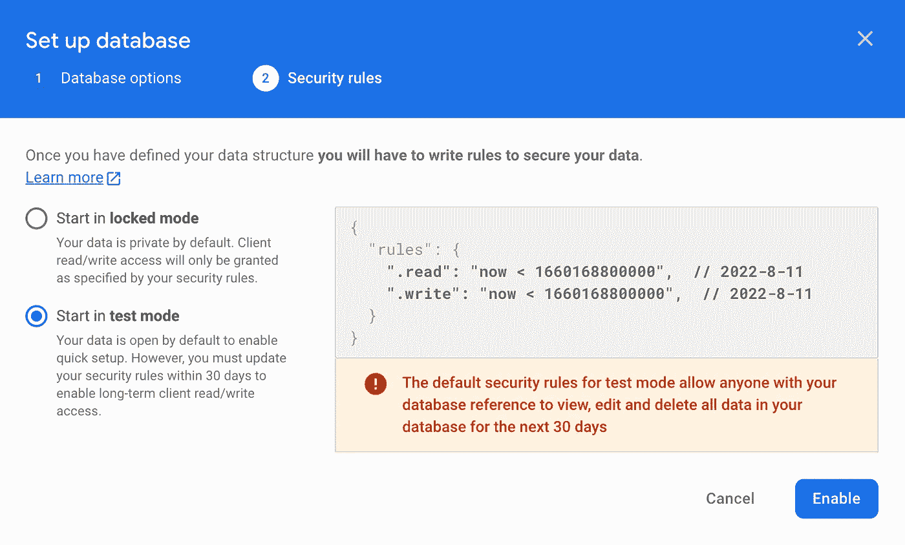
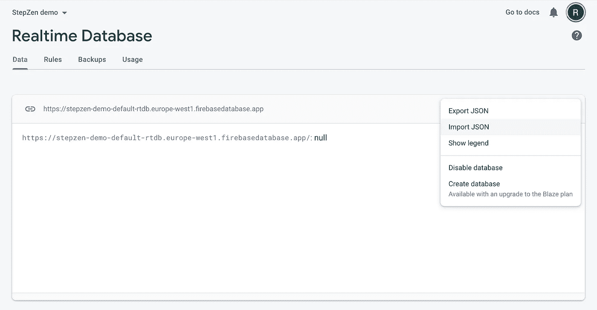
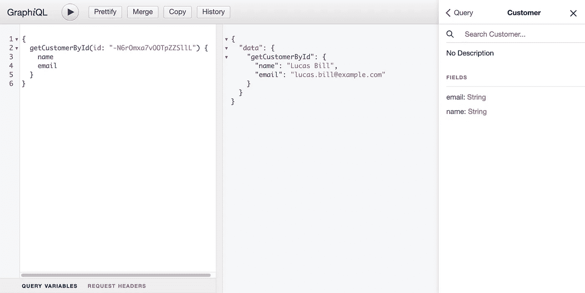
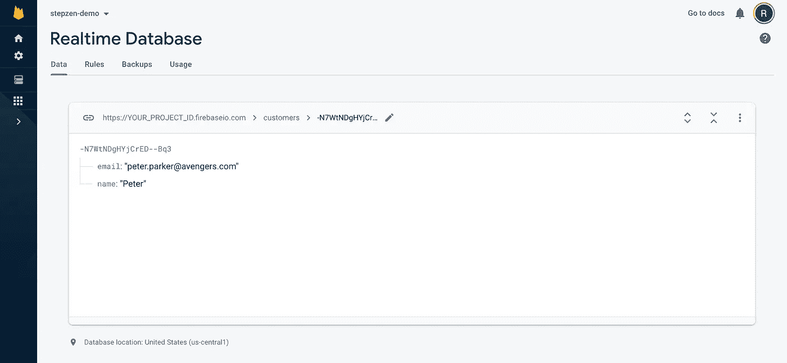

# 如何通过 StepZen 将 GraphQL 用于 Firebase 实时数据库

> 原文：<https://levelup.gitconnected.com/how-to-use-graphql-for-a-firebase-realtime-database-with-stepzen-be0336475787>



Firebase 实时数据库是一个托管在云中的 NoSQL 数据库。数据与所有平台(Web、iOS 和 Android)上的每个客户端实时同步。数据存储为 JSON，当您创建跨平台应用程序时，所有客户都可以共享这些数据。这可确保您的所有客户端始终拥有最新的可用数据，即使在离线时也是如此。

> 你可以在我们的 [Github 示例库](https://github.com/stepzen-dev/examples/tree/main/with-firebase)中找到本文的完整代码，或者在我们的 [Youtube 频道](https://www.youtube.com/watch?v=AJt_qV4KJhU)上观看视频演示。

Firebase 是谷歌的一个基于云的平台，允许你快速构建网络和移动应用。它提供身份验证、数据存储、监控、日志记录和部署服务。实时数据库是提供给开发者的服务之一。您可以使用 REST API 从 Firebase 实时数据库中访问数据。但是它缺少一个 GraphQL API，我们将使用 StepZen 来创建它。

## 建立 Firebase 实时数据库

使用 Firebase 服务的第一步是在 Firebase 控制台中创建一个免费帐户，如果您还没有的话。您会收到一个全新的 Firebase 应用程序，其唯一的 URL 以`firebaseio.com`结尾。此 URL 用于将数据存储和同步到应用程序的数据库，并对您的用户进行身份验证。

在 Firebase 控制台中，您需要创建一个新项目；姑且称之为“StepZen demo”。安装程序会询问您几个配置问题，出于演示目的，您可以忽略这些问题。几分钟后，您的新 Firebase 项目就准备好了，您可以通过使用页面左侧的导航添加一个实时数据库来继续。

当您按下“创建数据库”时，您需要选择要在其中创建数据库的区域。例如，美国、欧洲或亚洲。此外，您需要配置实时数据库的安全设置。首先，您需要启用“测试模式”,以便更容易地创建和读取我们的第一个数据:



按下“启用”按钮，您的数据库将在您选择的区域中创建。根据数据库所在的地区，URL 要么是`YOUR_FIREBASE_PROJECT_ID.firebaseio.com`(对于位于`us-central1`的数据库)要么是`YOUR_FIREBASE_PROJECT_ID.REGION.firebasedatabase.app`(对于所有其他位置的数据库)。

最后一步是向数据库添加数据，这可以从 Firebase 控制台或通过 REST API 来完成。为了将初始数据放入数据库，我们将使用 Firebase 控制台上传 JSON 文件`init.json`，您可以在 Github 存储库中找到这篇文章[的位置](https://github.com/stepzen-dev/examples/tree/main/with-firebase)。按下屏幕右侧的三个点，就可以选择“导入 JSON”。



上传数据后，您可以在 Firebase 控制台中看到，数据库中有客户和订单。就是这样。您的 Firebase 实时数据库已经准备就绪。在下一步中，我们将创建 StepZen GraphQL 模式。

## 生成一个 GraphQL 模式

您可以使用 REST API 从 Firebase 实时数据库中检索数据。获取单个客户的 curl 请求示例如下:

```
curl 'https://YOUR_FIREBASE_PROJECT_ID.firebaseio.com/customers/-N6rOmxa7vOOTpZZSllL.json'
```

使用 StepZen，我们可以使用相同的 curl 命令创建一个 GraphQL API 来检索相同的数据。首先，您需要使用以下命令安装 StepZen CLI:

```
npm i -g stepzen
```

并运行命令将 Firebase REST API 转换为 GraphQL。在这个命令中，您可以看到最初的 curl 与几个标志一起用来命名生成的查询和响应类型:

```
stepzen import curl 'https://YOUR_FIREBASE_PROJECT_ID.firebaseio.com/customers/-N6rOmxa7vOOTpZZSllL.json' --name customer --query-name getCustomerById --query-type Customer
```

> 注意，如果您还没有注册 StepZen，那么您的 GraphQL API 将部署在一个公共端点上。如果你打算存储敏感数据，我们建议[注册](https://stepzen.com/signup)，这样 API 密匙可以保护你的 GraphQL API 端点。

在 StepZen CLI 将 REST API 请求转换成 GraphQL 模式之后，已经创建了几个文件:

```
myproject
  |-- customer
      |-- index.graphql
  |-- index.graphql
  |-- stepzen.config.json
```

在文件`customer/index.graphql`中，您可以找到生成的 GraphQL 模式。

要部署这个 GraphQL 模式并查询您的新 GraphQL API，您需要运行

```
stepzen start
```

然后，StepZen CLI 部署 GraphQL 模式，并在终端中直接返回您的端点。当你还没有注册 StepZen 的时候，这看起来像`https://public***.stepzen.net/api/with-firebase/__graphql`。如果您有帐户，有两个端点可用。

*   一个本地主机终结点，包含 GraphiQL IDE 和
*   一个生产就绪的端点，可以通过提供 StepZen API 密钥来访问。

在[文档](https://stepzen.com/docs/connecting-frontends/connecting-to-stepzen)中了解更多关于不同端点的信息。

访问这个公共 URL(或者是`localhost`或者是从`https://public***`开始)允许您使用 GraphiQL 查询端点:



从这里，您可以查询 GraphQL API 并检查模式中的响应类型。

让我们在下一节中继续添加一个查询来一次获取所有客户。

## 转换 API 响应

除了获取单个客户，您还可以从 Firebase 实时数据库中获取所有客户。但是它有一个警告，一旦我们使用 REST API 获得数据，您就会知道。

获取这个列表的 curl 类似于我们在上一节中使用的请求:

```
curl 'https://YOUR_FIREBASE_PROJECT_ID.firebaseio.com/customers.json'
```

我们可以手动或通过运行另一个`stepzen import curl`命令将其添加到`customer/index.graphql`中的 GraphQL 模式。第二个选项有一个警告，因为导入的模式显示消息:

```
Result typed as JSON since it has fields ['-N6rOmxa7vOOTpZZSllL', ...] that are invalid graphql identifiers
```

对 REST API 的请求响应以不支持的格式返回 JSON。REST API 返回一个键值对列表，其中的字段名代表键，而不是数组。

因此，您需要[将这个对象](https://stepzen.com/docs/custom-graphql-directives/directives#transforms)转换成一个数组来获取客户列表。如果您已经使用 StepZen CLI 导入端点，那么您需要将`transforms`字段添加到`getCustomers`查询中。或者，如果还没有，可以将下面代码块中的`getCustomers`查询添加到`customers/index.graphql`中的模式中

```
type Query {
  getCustomerById(id: ID!): Customer
    @rest( 
      ##
    )
  getCustomers: [JSON]
    @rest(
      endpoint: "https://YOUR_FIREBASE_PROJECT_ID.firebaseio.com/customers.json"
      transforms: [{ pathpattern: [], editor: "objectToArray" }]
    )
}
```

这个查询的响应类型现在是`[JSON]`，因为 StepZen CLI 不能自动生成 GraphQL 类型，因为 GraphQL 不支持键值对列表。在您的端点的 GraphiQL IDE 上，您已经可以查询`getCustomers`的结果，但是您将不能选择任何字段。

因此，我们需要手动添加 GraphQL 响应类型。当您导入 Firebase REST API 端点以获得单个客户并为转换后的键值对添加第二个类型(类型为`CustomerList`)时，已经生成了类型`Customer`:

```
type Customer {
  email: String
  name: String
}

type CustomerList {
  name: ID
  value: Customer
}

type Query {
  getCustomerById(id: ID!): Customer
    @rest( 
      ##
    )
  getCustomers: [CustomerList]
    @rest(
      endpoint: "https://YOUR_FIREBASE_PROJECT_ID.firebaseio.com/customers.json"
      transforms: [{ pathpattern: [], editor: "objectToArray" }]
    )
}
```

> 注意，您也可以使用工具 [JSON2SDL](https://json2sdl.com/) 将 JSON 响应自动转换为 GraphQL SDL。

当您返回到 GraphQL 浏览器时，您现在还可以查询客户列表并确定 GraphQL API 应该返回的字段:

```
query {
  getCustomers {
    name
    value {
      email
      name
    }
  }
}
```

即使响应与前面的查询相同，您现在也可以完全控制返回哪些字段。如果您运行相同的查询并删除`value`中的字段`email`，那么将只返回客户的姓名。

在下一节中，我们将把客户信息与之前导入到 GraphQL 模式中的订单结合起来。

## 组合 GraphQL 中的数据

除了客户数据，Firebase 实时数据库中还有订单数据。为了将客户数据与订单数据结合起来，我们需要创建查询来从 Firebase 实时数据库中获取订单。

同样，您可以使用 StepZen CLI 将 REST API 转换为 GraphQL API。我们将从导入单个订单开始，以便自动生成退货类型:

```
stepzen import curl 'https://YOUR_FIREBASE_PROJECT_ID.firebaseio.com/orders/-N6rOvLXK2t39x-Bp0UP.json' --name orders --query-name getOrderById
```

这会将响应类型为`Order`的新查询`getOrderById`添加到`order/index.graphql`中的新模式中:

```
myproject
  |-- customer
      |-- index.graphql
  |-- order
      |-- index.graphql
  |-- index.graphql
  |-- stepzen.config.json
```

> 两个模式都在项目根的`index.graphql`中链接。

使用查询`getOrderById`您现在可以检索单个订单，例如:

```
{
  getOrderById(id: "-N6rOvLXK2t39x-Bp0UP") {
    carrier
    shippingCost
    customerId
  }
}
```

可以看到这个查询也返回了`customerId`。该字段引用我们数据库中的客户。使用`@materializer`指令，您可以使用这个值来检索客户，并将其链接到 or 的响应类型

```
type Order {
  carrier: String
  createdAt: Date
  customerId: String
  customer: Customer
    @materializer(
      query: "getCustomerById"
      arguments: [{ name: "id", field: "customerId" }]
    )
  shippingCost: Int
  trackingId: String
}
```

通过这一添加，您可以通过添加字段`customer`和您想要包含的子字段来检索每个订单的客户信息。


使用`@materializer`您可以在 GraphQL 模式中组合任何可用的数据进行查询。不仅包括来自同一个数据库的数据，还包括来自外部来源的数据——比如另一个数据库、第三方 REST APIs 等等。在下一节中，我们将添加逻辑来向 Firebase 实时数据库添加更多数据。

## 使用突变来添加和更新数据

最后，我们将使用 GraphQL 向 Firebase 实时数据库添加新数据。Firebase 的 REST API 允许你插入和更新数据。成功时，请求返回更新或插入值的 ID。

让我们通过将下面的变异和响应类型添加到`customer/index.graphql`中的 GraphQL 模式来尝试向数据库中插入一个新客户:

```
type Response {
  name: ID
}

type Mutation {
  insertCustomer(name: String!, email: String!): Customer
    @rest(
      endpoint: "https://$project_id.firebaseio.com/customers.json"
      method: POST
      postbody: """
      {
        "name": "{{.Get "name"}}",
        "email": "{{.Get "email"}}"
      }
      """
      configuration: "firebase_config"
    )
}
```

这种变异需要查询参数`name`和`string`，并使用`postbody`字段将它们的值传递给底层 REST API。这里使用语法`{{.Get "VARIABLE_NAME"}}`来获取传递给 GrapQL 查询的值。

当您使用以下查询时:

```
mutation {
  insertCustomer(name: "Peter", email: "peter.parker@avengers.com") {
    name
  }
}
```

响应看起来像这样:

```
{
  "data": {
    "insertCustomer": {
      "name": "-N7WtNDgHYjCrED--Bq3"
    }
  }
}
```

您可以验证名为“Peter”的客户是否已经添加了`getCustomerById`查询和返回的 ID。此外，您可以在 Firebase 控制台中找到这个新客户:



您不仅可以插入新数据，还可以更新现有数据。在更新特定字段或替换 ID 的整个 JSON 数据时，有两种选择。在本文中，我们将使用`PATCH`，因为`PUT`将覆盖指定位置的数据，包括任何子节点。

将下面的新变异添加到您在`customer/index.graphql`的模式中:

```
type Mutation {
  insertCustomer(name: String!, email: String!): Response
    @rest(
      ## ...
    )
  updateCustomerName(id: ID!, name: String!): Customer
    @rest(
      endpoint: "https://YOUR_PROJECT_ID.firebaseio.com/customers/$id.json"
      method: PATCH
      postbody: """
      {
        "name": "{{.Get "name"}}"
      }
      """
      configuration: "firebase_config"
    )
}
```

允许您更新客户的姓名。假设您想将我们刚刚创建的客户的姓名从“Peter”更改为“Peter Parker”，您可以这样做:

```
mutation {
  updateCustomerName(id: "-N7WtNDgHYjCrED--Bq3", name: "Peter Parker") {
    name
  }
}
```

> 注意，查询`updateCustomerName`的响应类型是`Customer`而不是`Response`，因为`PATCH`对 Firebase REST API 的请求返回更新后的值。

就是这样。现在，您已经为 Firebase 实时数据库创建了一个 GraphQL 模式。当您想将它投入生产时，不要忘记从 Firebase 为您的 REST API 端点启用认证。

## 结论

在本文中，我们使用 REST APIs 为 Firebase 实时数据库创建了一个 GraphQL API。这个 GraphQL API 允许您查询和变更数据，并在不同的实体之间进行组合。您可以在我们的 [Github 示例库](https://github.com/stepzen-dev/examples/tree/main/with-firebase)中找到完整的代码，并在我们的 [Youtube 频道](https://www.youtube.com/watch?v=AJt_qV4KJhU)上观看视频。我们很想听听你用 StepZen 和 Firebase 开始构建什么项目。加入我们的 [Discord](https://discord.com/invite/9k2VdPn2FR) 来了解我们社区的最新动态。

# 分级编码

感谢您成为我们社区的一员！在你离开之前:

*   👏为故事鼓掌，跟着作者走👉
*   📰查看[升级编码出版物](https://levelup.gitconnected.com/?utm_source=pub&utm_medium=post)中的更多内容
*   🔔关注我们:[Twitter](https://twitter.com/gitconnected)|[LinkedIn](https://www.linkedin.com/company/gitconnected)|[时事通讯](https://newsletter.levelup.dev)

🚀👉 [**加入升级人才集体，找到一份惊艳的工作**](https://jobs.levelup.dev/talent/welcome?referral=true)