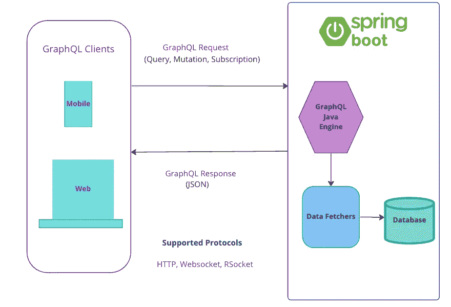
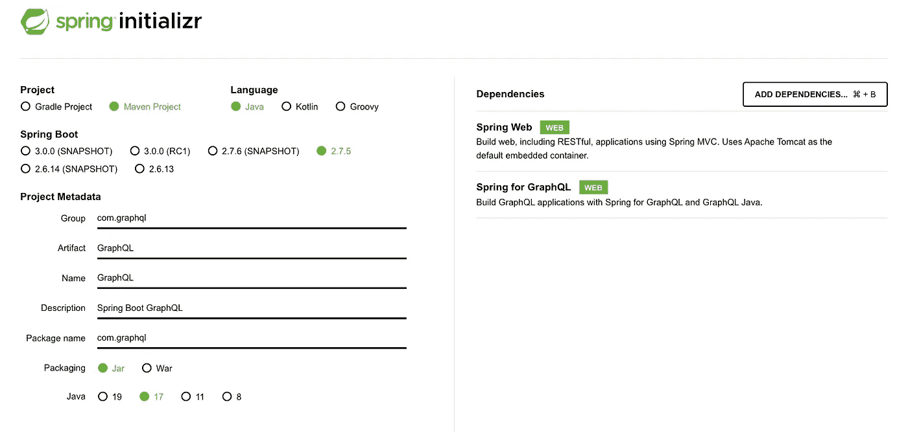
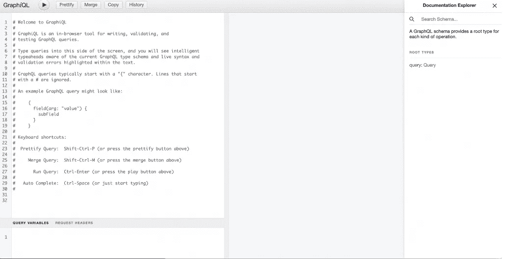

# 如何在 Spring Boot 中使用 GraphQL

> 原文：<https://levelup.gitconnected.com/how-to-use-graphql-with-spring-boot-7a4d66ed84d7>



在我之前的文章中，我已经深入的写过关于 GraphQL 的内容。在读这篇文章之前，请先看看这篇文章。

[](https://dineshchandgr.medium.com/do-you-know-about-graphql-the-query-language-for-api-s-4038660865be) [## 你知道 GraphQL 吗 API 的查询语言？

### 大家好。我们将会看到一种叫做 GraphQL 的有趣技术，它是一种开源数据查询…

dineshchandgr.medium.com](https://dineshchandgr.medium.com/do-you-know-about-graphql-the-query-language-for-api-s-4038660865be) 

在本文中，让我们看看如何将 GraphQL 用于 Spring boot。

Spring 为 GraphQL 技术提供了广泛的支持，建立一个 GraphQL Spring boot 应用程序非常容易。spring 应用程序团队和 GraphQL Java 团队合作开发了名为 Spring for GraphQL 的项目。这个项目的版本 1 发布于 2022 年 5 月 1 日。

Spring Boot 应用程序运行一个 GraphQL Java 引擎，该引擎使用模式读取请求并将其转换为 GraphQL 类型。然后，它使用数据提取器在数据库上执行 CRUD 操作。然后，它向客户机提供一个带有请求字段的 JSON 响应

# GraphQL 协议

Spring for GraphQL 支持 HTTP、WebSocket 和 RSocket 等协议上的请求。

## **1。HTTP**

Spring for GraphQL 同时提供了对 Spring MVC 和 Spring WebFlux 的支持。Spring MVC 依赖于阻塞 I/O，但是 Spring Webflux 致力于阻塞 I/O。

所有 GraphQL 请求都必须使用 HTTP Post 请求，并且请求体中包含查询或变异等 GraphQL 请求细节。对 GraphQL 请求的响应总是 200 (OK ),任何错误都将出现在 GraphQL 响应的 errors 部分

媒体类型的默认和首选选项是`"application/graphql+json"`，但也支持`"application/json"`，如规范中所述。

## 2.WebSocket

WebSocket 是一种高级协议，支持客户端和服务器之间的双向双工通信。这将使通信具有交互性，服务器可以将任何数据推送到客户端。

GraphQL 有一个名为 Subscription 的请求类型，客户端可以通过它实时接收来自服务器的数据。为了实现这一点，我们需要在 WebSocket 协议上使用 GraphQL，而不是使用 HTTP 协议。但是这个协议也可以用于常规请求，比如查询或突变

`GraphQlWebSocketHandler class`基于 [graphql-ws](https://github.com/enisdenjo/graphql-ws) 库中定义的协议处理 WebSocket 上的 GraphQL 请求

`GraphQlWebSocketHandler`有两个变种，一个是 Spring MVC，一个是 Spring WebFlux。

## **3。RSocket**

RSocket 是一个完全反应式的应用级二进制协议，可用于字节流传输，如 TCP、WebSocket、UDP 等。它提供网络上的应用程序流控制，以防止中断并提高弹性。

这个类通过 RSocket 请求来处理 GraphQL。

*   `Request-Response` —发送一条消息，接收一条回复—查询和变异作为请求响应处理
*   `Request-Stream` —发送一条信息，然后收到一连串的信息。GraphQL 订阅作为请求流处理。

在本文中，我们将着眼于仅使用 HTTP 协议来使用 **GraphQL，我将让您探索如何使用 WebSocket 和 RSocket 协议。**

## Spring Boot 需要的依赖

我们只需要使用 2 个依赖项来配合 Spring Boot 使用 GraphQL，即 Spring Web 和 Spring Boot GraphQL Starter。



```
<dependency>    
   <groupId>org.springframework.boot</groupId> 
   <artifactId>spring-boot-starter-graphql</artifactId>
</dependency>
 <dependency>
   <groupId>org.springframework.boot</groupId>
   <artifactId>spring-boot-starter-web</artifactId> 
</dependency>
```

Spring Boot GraphQL starter 提供了一种更快捷的方式来启动 GraphQL 引擎运行。它提供了所需的自动配置和基于注释的方法，这有助于我们关注约定而不是配置。

我们需要添加 Spring 数据 JPA 和 H2 依赖项来将数据存储在存储库中。我在这个例子中使用 H2 数据库，但是 GraphQL 是数据库不可知的，即任何数据库都可以使用它。

# 实现 GraphQL APIs

## 数据层

我们在数据层使用 Spring Data JPA 来执行 CRUD 操作。我们有一个名为 Book 的实体，我们为它定义了如下的类，用 isbn 作为主键。

1.  **实体类**

```
@Builder
@Getter
@Setter
@NoArgsConstructor
@AllArgsConstructor
@Entity
public class Book {
@Id
private String isbn;
private String title;
private String publisher;
private String[] authors;
private Date publishedDate;
}
```

**2。存储库类**

我们有 Book 实体类的存储库类，如下所示

```
package io.graphql.repository;
import org.springframework.data.jpa.repository.JpaRepository;
import org.springframework.stereotype.Repository;
import io.graphql.model.Book;
@Repository
public interface BookRepository extends JpaRepository<Book, String> {
}
```

## 服务层

服务层中有 BookService 类，如下所示。在这里的 **PostConstruct** 注释中，我们将数据填充到数据库中。

```
@Service
public class BookService {
@Autowired
private BookRepository bookRepository;

// load schema at application start up
@PostConstruct
private void loadSchema() throws IOException {
//Load Books into the Book Repository
 loadDataIntoDatabase();
}
private void loadDataIntoDatabase() {
//insert data into database 
}
public Book getBook(Integer id) {
 return bookRepository.findById(id);
}
public List<Book> getAllBooks() {
 return bookRepository.findAll();
}
public Book addBook(Book book) {
 return bookRepository.save(book);
}
public void deleteBook(Long isbn) {
Book book =   bookRepository.findById(isbn).orElseThrow(RuntimeException::new);
 bookRepository.delete(book);
}
}
```

## GraphQL 层

让我们看看 GraphQL 层。我们需要一个 GraphQL 模式，它只不过是 GraphQL 引擎可以理解的实体对象结构。

我们将为 Book 类创建模式。字段名在左边，类型在右边。有不同的数据类型，如 ID、String、Int、Float 和 Boolean。我们也可以使用引用对象类型和列表。

我们还列出了这个 Spring Boot 应用程序可以使用 GraphQL 执行的查询和变异操作。

我们必须在 **/src/main/resources** 文件夹下创建一个名为**books . graph QL**file**的文件，因为这是 Spring 扫描的默认位置。如果需要，我们甚至可以通过酒店改变位置**

```
type Book{
 isbn: String
 title: String
 publisher: String
 authors: [String]
 publishedDate: String
}
type Query{ 
  getAllBooks: [Book]
  getBook(id: String) : Book
}
type Mutation {
    addBook(author:String,name:String,publisher:String):Book
    deleteBook(id: Int!): Int!
}
```

## **Web 层**

**如上所述，我们将看到仅使用 HTTP 协议的 GraphQL 示例。因此，我们将在控制器类中使用 REST APIs。**

**我们需要对 GraphQL 查询操作使用 **QueryMapping** 注释，对变异使用 **MutationMapping** 注释(修改数据的 API)。**参数**注释用于映射来自 GraphQL 请求的输入字段。**

**我们这里有 4 个 API，即**

1.  **getBook**
2.  **获取所有书籍**
3.  **通讯录**
4.  **删除书籍**

```
@Controller
public class BookController {
@Autowired
BookService bookService;

@QueryMapping
public Book getBook(@Argument Integer isbn) {
return bookService.getBook(isbn);
}
@QueryMapping
public List<Book> allBooks() {
return bookService.getAllBooks();
}
@MutationMapping
public Book addBook(@Argument String author, @Argument String name, @Argument String publisher) {
Book book = Book.builder().author(author).name(name).publisher(publisher).price(price).build();
return bookService.saveBook(book);
}
@MutationMapping
public String deleteBook(@Argument Long isbn {
bookService.deleteBook(isbn);
return "Book deleted";
}
}
```

# **图形 QL**

**GraphQL 是 graph QL 的集成开发环境(IDE)。这是一个强大的工具，提供语法高亮、智能感知自动完成、自动文档等功能**

**使用 GraphQL，我们可以很容易地创建 graph QL 请求**

**要在 Spring Boot 应用程序中启用 GraphiQL，我们只需在 **application.properties** 文件中使用以下属性**

```
spring.graphql.graphiql.enabled=true
```

**然后，我们需要启动 Spring Boot 应用程序，然后使用 URL[http://localhost:8080/graphiql](http://localhost:8080/graphiql)加载 GraphiQL，如下所示**

****

****输入和输出****

**下面的查询调用上面控制器中的 allBooks API。尽管 Book 类有 5 个字段，但我们只要求 2 个。响应总是在 JSON 中**

```
#returns only the 2 fields for allBooks query
query {
   allBooks{
        title
        publishedDate
  }      
}
```

**可以提出另一个请求来添加额外的字段**

```
#returns only the 3 fields for allBooks query
query {
   allBooks{
        isbn
        title
        publishedDate
   }
}
```

```
#returns only the 3 field for book query based on isbn
query {
   getBook(id:"isbn"){
        isbn
        title
        publishedDate
       }
}
```

**我们现在发出一个突变请求，将图书数据添加到数据库中。我们只要求 2 个领域的 isbn 和名称作为回应**

```
mutation {
    addBook(
        author : "xxx"
        name: "yyy"
        publisher: "test"
    ){
        isbn
        name
    }
}
```

**我们可以通过一个突变请求调用删除 API，如下所示**

```
mutation {
     deleteBook(isbn:2)
   }
```

# **摘要**

**在本文中，我们了解了 Spring for GraphQL 项目以及 Spring boot 中支持 GraphQL 的三种协议——HTTP、Websocket 和 RSocket。我们深入研究了如何通过 HTTP 协议将 GraphQL 与 Spring Boot 结合使用。最后，我们通过查看图表来结束本文**

**希望你喜欢这篇文章，感谢阅读**

```
If you like to get more updates from me, 
please follow me on Medium and subscribe to email alert.

If you are considering to buy a medium membership, 
please buy through my referral link 
```

**[https://dineshchandgr.medium.com/membership](https://dineshchandgr.medium.com/membership)**