# 如何使用。groupby()有效地作为数据科学家

> 原文：<https://levelup.gitconnected.com/how-to-use-groupby-effectively-as-a-data-scientist-9e1d931e1619>

作为一名数据科学家，使用正确的工具和技术来充分利用数据是非常重要的。Pandas 库是一个非常棒的数据操作、分析和可视化工具，也是任何数据科学家工具箱中必不可少的一部分。然而，有效地使用熊猫是一个挑战，这会导致时间和精力的浪费。幸运的是，有一些最佳实践可以帮助数据科学家充分利用他们的熊猫体验。从使用矢量化操作到利用内置函数，这些最佳实践将帮助数据科学家使用 Pandas 快速准确地分析和可视化数据。了解并应用这些最佳实践将有助于数据科学家提高工作效率和准确性，从而更快地做出更好的决策。


由[马丁·桑切斯](https://unsplash.com/@martinsanchez?utm_source=medium&utm_medium=referral)在 [Unsplash](https://unsplash.com?utm_source=medium&utm_medium=referral) 上拍摄的照片

在本文中，我们将使用如何使用**。groupby()** 根据特定特性的值有效地对数据帧的条目进行分组。**。groupby()** 方法应用于数据帧，并根据特征对其进行分组。然后，我们可以对分组的对象应用一些简单或更复杂的函数。对于每一个从事表格或结构化数据工作的**数据科学家**来说，这是一个非常重要的工具，因为它将帮助你更容易、更有效地操作数据。

## 目录:

1.  **为什么我们需要高效的编码？**
2.  **与一起使用的常用功能。groupby()**
3.  **缺失值插补使用。groupby() &。变换()**
4.  **数据过滤使用。groupby() &。过滤器()**

## 您可以在 GitHub 知识库中找到本文中使用的代码和数据集:

[](https://github.com/youssefHosni/Efficient-Python-for-Data-Scientists) [## GitHub-youssefHosni/面向数据科学家的高效 Python

### 作为数据科学家学习如何编写高效的 python 代码如何编写 Python 干净的代码[文章]编写高效…

github.com](https://github.com/youssefHosni/Efficient-Python-for-Data-Scientists) 

如果你想免费学习数据科学和机器学习，看看这些资源:

*   免费互动路线图，自学数据科学和机器学习。从这里开始:[https://aigents.co/learn/roadmaps/intro](https://aigents.co/learn/roadmaps/intro)
*   数据科学学习资源搜索引擎(免费)。将你最喜欢的资源加入书签，将文章标记为完整，并添加学习笔记。[https://aigents.co/learn](https://aigents.co/learn)
*   想要在导师和学习社区的支持下从头开始学习数据科学吗？免费加入这个学习圈:【https://community.aigents.co/spaces/9010170/】T2

**如果你想在数据科学&人工智能领域开始职业生涯，但不知道如何开始。我提供数据科学指导课程和长期职业指导:**

*   长期师徒:[https://lnkd.in/dtdUYBrM](https://lnkd.in/dtdUYBrM)
*   辅导课程:[https://lnkd.in/dXeg3KPW](https://lnkd.in/dXeg3KPW)

***加入*** [***中等会员***](https://youssefraafat57.medium.com/membership) ***计划继续无限制学习。如果你使用下面的链接，我会收到一小部分会员费，不需要你额外付费。***

[](https://youssefraafat57.medium.com/membership) [## 加入我的介绍链接媒体-优素福胡斯尼

### 阅读 Youssef Hosni(以及媒体上成千上万的其他作家)的每一个故事。您的会员费直接支持…

youssefraafat57.medium.com](https://youssefraafat57.medium.com/membership) 

# 1.为什么我们需要高效的编码？

高效代码是指执行速度更快、计算内存更少的代码。在本文中，我们将使用 **time()** 函数来测量计算时间。这个函数测量当前时间，所以我们将在代码执行前和执行后把它赋给一个变量，然后计算差值，就知道代码的计算时间。下面的代码显示了一个简单的例子:

```
import time
# record time before execution
start_time = time.time()
# execute operation
result = 5 + 2
# record time after execution
end_time = time.time()
print("Result calculated in {} sec".format(end_time - start_time))
```

让我们看一些应用高效代码方法将如何提高代码运行时间和降低计算时间复杂性的例子:我们将计算从零到一百万的每个数字的平方。首先，我们将使用 list comprehension 来执行这个操作，然后使用 for 循环重复相同的过程。

第一次使用列表理解:

```
#using List comprehension 

list_comp_start_time = time.time()
result = [i*i for i in range(0,1000000)]
list_comp_end_time = time.time()
print("Time using the list_comprehension: {} sec".format(list_comp_end_time -
list_comp_start_time))
```


现在我们将使用 for 循环来执行相同的操作:

```
# Using For loop

for_loop_start_time= time.time()
result=[]
for i in range(0,1000000):
  result.append(i*i)
for_loop_end_time= time.time()
print("Time using the for loop: {} sec".format(for_loop_end_time - for_loop_start_time))
```


我们可以看到它们之间有很大的差异，我们可以用百分比来计算它们之间的差异:

```
list_comp_time = list_comp_end_time - list_comp_start_time
for_loop_time = for_loop_end_time - for_loop_start_time
print("Difference in time: {} %".format((for_loop_time - list_comp_time)/
list_comp_time*100))
```

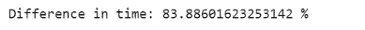

这里有另一个例子来展示编写高效代码的效果。我们想计算从 1 到 100 万的所有连续数字的总和。有两种方法第一种是使用蛮力，我们将一个接一个地增加到一百万。

```
def sum_brute_force(N):
  res = 0
  for i in range(1,N+1):
    res+=i
  return res

# Using brute force
bf_start_time = time.time()
bf_result = sum_brute_force(1000000)
bf_end_time = time.time()

print("Time using brute force: {} sec".format(bf_end_time - bf_start_time))
```

另一个更有效的方法是用公式来计算。当我们想计算从 1 到一个数的所有整数的和时，比如说 N，我们可以把 N 乘以 N+1，然后除以 2，这样就会得到我们想要的结果。这个问题实际上在 19 世纪就交给了德国的一些学生，一个名叫卡尔-弗里德里希·高斯的聪明学生设计了这个公式来在几秒钟内解决这个问题。

```
def sum_formula(N):
  return N*(N+1)/2

# Using the formula
formula_start_time = time.time()
formula_result = sum_formula(1000000)
formula_end_time = time.time()

print("Time using the formula: {} sec".format(formula_end_time - formula_start_time))
```

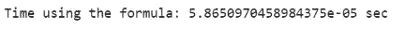

运行这两种方法后，我们实现了超过 160，000%的巨大改进，这清楚地表明了为什么我们需要高效和优化的代码，即使对于简单的任务也是如此。

# 2.与一起使用的常用函数。groupby()

应用于聚合组的最简单方法之一是**。计数()。**在下面的例子中，我们将把它应用于餐馆数据集。首先，我们根据顾客是否吸烟对餐馆数据进行分组。然后，我们应用**。**计数()方法。我们获得了吸烟者和不吸烟者的人数。

```
restaurant = pd.read_csv('restaurant_data.csv')

restaurant_grouped = restaurant.groupby('smoker')
print(restaurant_grouped.count())
```

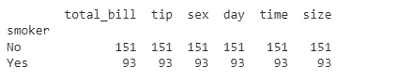

毫不奇怪，我们得到的所有特征的结果都与**相同。count()** 方法统计每组在每个特征中出现的次数。因为我们的数据中没有缺失值，所以所有列中的结果应该是相同的。

根据特定特性的值对数据帧的条目进行分组后，我们可以应用我们感兴趣的任何类型的**转换**。这里，我们将应用 z 得分，这是一种归一化变换，即每个值与平均值之间的距离除以标准差。这是统计学中非常有用的变换，通常在标准化测试中与 z 测试一起使用。要将这种转换应用于分组对象，我们只需调用。transform()方法包含我们定义的 lambda 转换。

这次，我们将根据**餐**的类型分组:是晚餐还是午餐？由于 z 得分转换是与组相关的转换，因此生成的表只是原始表。对于每个元素，我们减去平均值，然后除以它所属组的标准偏差。我们还可以看到，数值变换只应用于数据帧的数值特征。

```
zscore = lambda x: (x - x.mean() ) / x.std()

restaurant_grouped = restaurant.groupby('time')

restaurant_transformed = restaurant_grouped.transform(zscore)
restaurant_transformed.head()
```

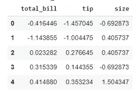

虽然 **transform()** 方法大大简化了事情，但它真的比使用原生 Python 代码更有效吗？正如我们之前所做的，我们首先对数据进行分组，这次是根据性别进行分组。然后，我们应用之前应用的 z 分数变换，测量其效率。我们在这里省略了测量每个操作时间的代码，因为您对此已经很熟悉了。我们可以看到，通过使用 transform()函数，我们实现了巨大的速度提升。除此之外，我们只使用一行代码来执行感兴趣的操作。

```
restaurant.groupby('sex').transform(zscore)

mean_female = restaurant.groupby('sex').mean()['total_bill']['Female']
mean_male = restaurant.groupby('sex').mean()['total_bill']['Male']
std_female = restaurant.groupby('sex').std()['total_bill']['Female']
std_male = restaurant.groupby('sex').std()['total_bill']['Male']

for i in range(len(restaurant)):
  if restaurant.iloc[i][2] == 'Female':
    restaurant.iloc[i][0] = (restaurant.iloc[i][0] - mean_female)/std_female
  else:
    restaurant.iloc[i][0] = (restaurant.iloc[i][0] - mean_male)/std_male
```

# 3.缺失值插补使用。groupby() &。转换()

既然我们已经看到了为什么以及如何在一个分组的熊猫对象上使用 **transform()** 函数，我们将处理一个非常具体的任务，即输入缺失值。

在我们实际了解如何使用**变换()**函数进行缺失值插补之前，我们将了解每组中我们感兴趣的变量中有多少缺失值。我们可以在下面看到每个“**时间”**特征的数据点数，它们是 176+68 = 244。

```
prior_counts = restaurant.groupby('time')
prior_counts['total_bill'].count()
```

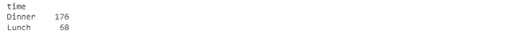

接下来，我们将创建一个 **restaurant_nan** 数据集，其中使用下面的代码将 10%随机观察的总账单设置为 **NaN** :

```
import pandas as pd
import numpy as np

p = 0.1 #percentage missing data required

mask = np.random.choice([np.nan,1], size=len(restaurant), p=[p,1-p])
restaurant_nan = restaurant.copy()
restaurant_nan['total_bill'] =  restaurant_nan['total_bill'] * mask
```

现在，让我们打印每个“**时间”**特征中的数据点数，我们可以看到它们现在是 155+62 = 217。由于我们拥有的总数据点是 244 个，那么丢失的数据点是 24 个，相当于 10%。

```
prior_counts = restaurant.groupby('time')
prior_counts['total_bill'].count()
```

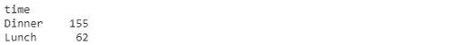

在统计了数据中缺失值的数量后，我们将展示如何用特定于组的函数来填充这些缺失值。最常见的选择是均值和中位数，选择与数据的偏斜度有关。正如我们之前所做的，我们使用 **fillna** ()函数定义了一个 **lambda** 转换，用它的组平均值替换每个缺失值。和以前一样，我们根据用餐时间对数据进行分组，然后通过应用预定义的转换来替换缺失的值。

```
# Missing value imputation

missing_trans = lambda x: x.fillna(x.mean())
restaurant_nan_grouped = restaurant_nan.groupby('time')['total_bill']
restaurant_nan_grouped.transform(missing_trans)
```

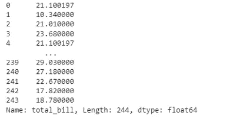

正如我们所看到的，索引 0 和索引 4 处的观察值完全相同，这意味着它们的缺失值已被它们组的均值所取代。

此外，我们可以看到使用这种方法的计算时间是 0.007 秒。

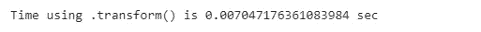

让我们将其与传统方法进行比较:

```
start_time = time.time()
mean_din = restaurant_nan.loc[restaurant_nan.time =='Dinner']['total_bill'].mean()
mean_lun = restaurant_nan.loc[restaurant_nan.time == 'Lunch']['total_bill'].mean()

for row in range(len(restaurant_nan)):
  if restaurant_nan.iloc[row]['time'] == 'Dinner':
    restaurant_nan.loc[row, 'total_time'] = mean_din
  else:
    restaurant_nan.loc[row, 'total_time'] = mean_lun
print("Results from the above operation calculated in %s seconds" % (time.time() - start_time))
```

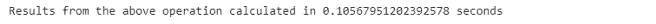

我们可以看到使用**。transform()** 应用于分组对象的函数比执行此任务的原生 Python 代码执行速度更快。

# 4.使用进行数据过滤。groupby() &。过滤器()

现在我们将讨论如何使用？ **filter()** 对分组的熊猫对象执行功能。这允许我们根据一些特定的条件，只包括这些组的一个子集。

通常，在根据特定特征对数据帧的条目进行分组之后，我们感兴趣的是基于某些条件只包括那些组的子集。过滤条件的一些示例包括缺失值的数量、特定要素的平均值或组在数据集中的出现次数。

我们感兴趣的是在支付给服务员的平均金额超过 20 美元的日子里，找到给小费的平均金额。**。filter()** 函数接受对每个组的数据帧进行操作的**λ**函数。在本例中，lambda 函数选择“total_bill”并检查 **mean()** 是否大于 20。如果 lambda 函数返回真，则计算小费**平均值()**。如果我们比较提示的总平均值，我们可以看到两个值之间存在差异，这意味着过滤正确执行。

```
restaurant_grouped = restaurant.groupby('day')
filter_trans = lambda x : x['total_bill'].mean() > 20
restaurant_filtered = restaurant_grouped.filter(filter_trans)
```

```
print(restaurant_filtered['tip'].mean())
```

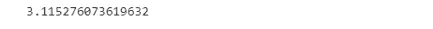

```
print(restaurant['tip'].mean())
```

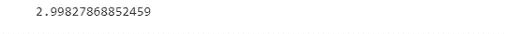

如果我们试图在不使用 **groupby()** 的情况下执行这个操作，我们最终会得到这个低效的代码。首先，我们使用 list comprehension 来提取数据帧中涉及平均膳食超过 20 美元的日期的条目，然后使用 for 循环将它们添加到一个列表中并计算平均值。这可能看起来非常直观，但正如我们所见，这也是非常低效的。

```
t=[restaurant.loc[restaurant['day'] == i]['tip'] for i in restaurant['day'].unique()
  if restaurant.loc[restaurant['day'] == i]['total_bill'].mean()>20]
restaurant_filtered = t[0]

for j in t[1:]:
  restaurant_filtered=restaurant_filtered.append(j,ignore_index=True)
```

# 参考

[用 pandas 编写高效代码教程，第 4 章](https://app.datacamp.com/learn/courses/writing-efficient-code-with-pandas)

***感谢阅读！如果你喜欢这篇文章，请务必:***

*   **👏为这个故事鼓掌(50 次)并跟我来👉**
*   **📰查看我的媒体档案中的更多内容**
*   **🔔关注我:**[**LinkedIn**](https://www.linkedin.com/in/youssef-hosni-b2960b135/)**|**[**Medium**](https://medium.com/@youssefraafat57)**|**[**Twitter**](https://twitter.com/Youssef70125494)**|**[**GitHub**](https://github.com/youssefHosni)
*   *🚀👉* ***加入*** [***中等会员***](https://youssefraafat57.medium.com/membership) ***计划继续无限制学习。如果你使用下面的链接，我会收到一小部分会员费，不需要你额外付费。***

[](https://youssefraafat57.medium.com/membership) [## 加入我的介绍链接媒体-优素福胡斯尼

### 阅读 Youssef Hosni(以及媒体上成千上万的其他作家)的每一个故事。您的会员费直接支持…

youssefraafat57.medium.com](https://youssefraafat57.medium.com/membership)