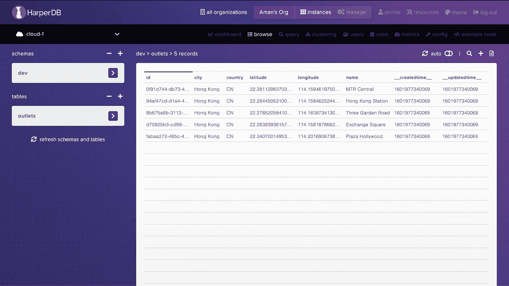
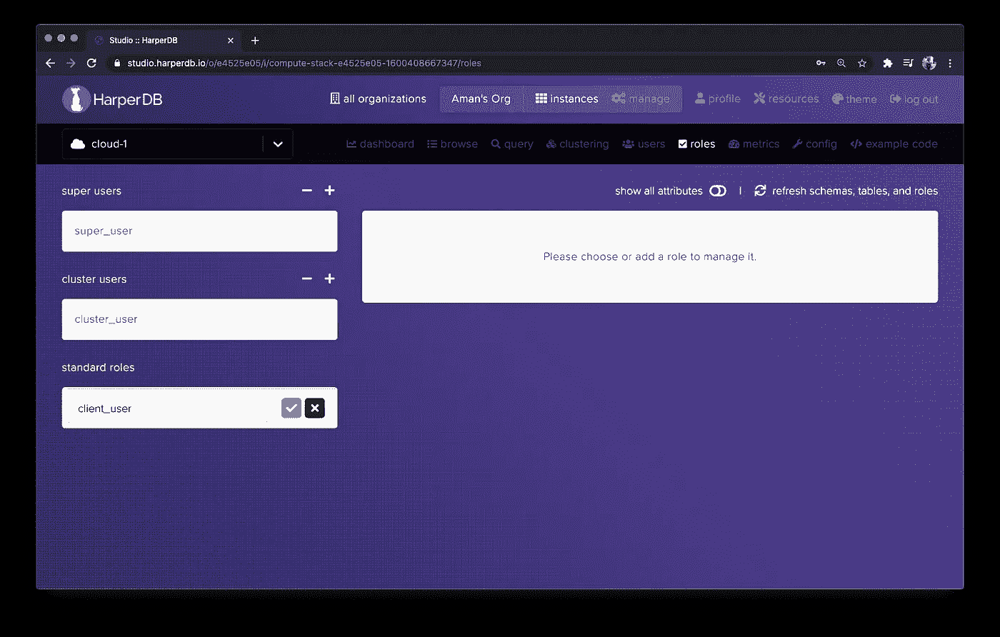
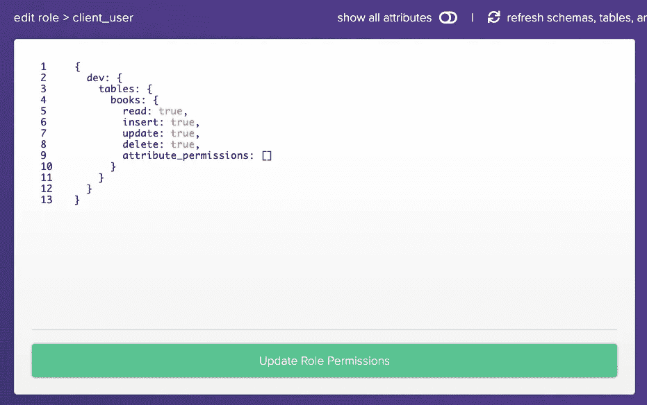
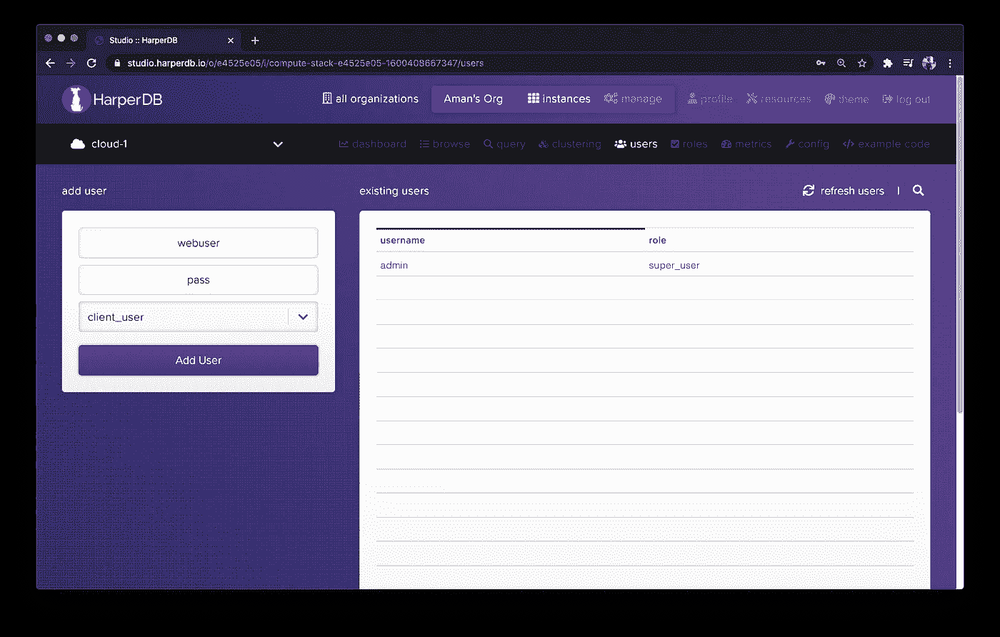
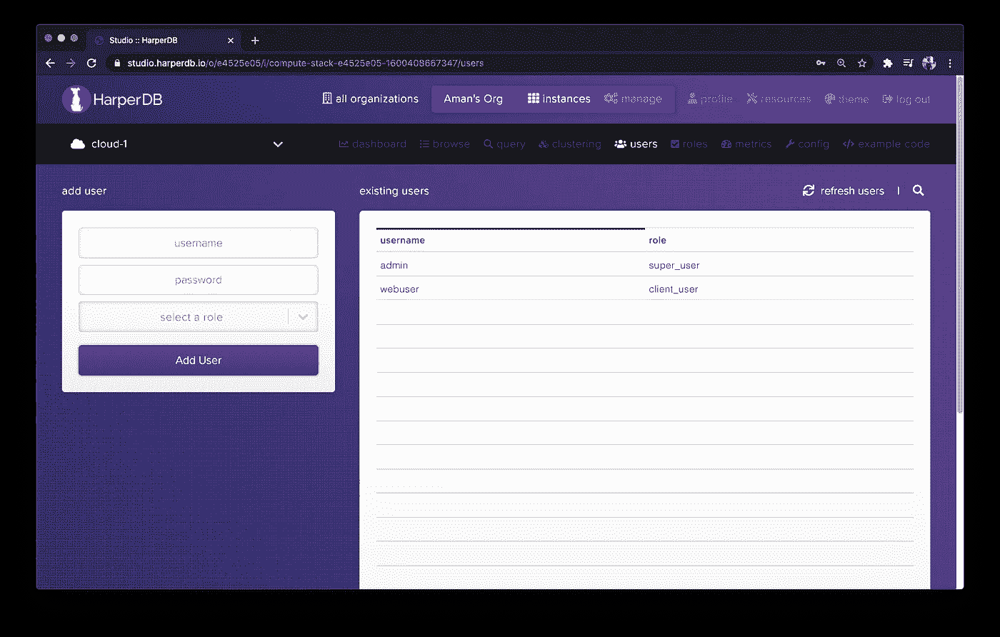
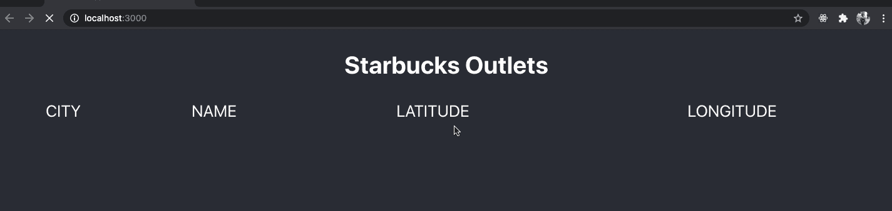
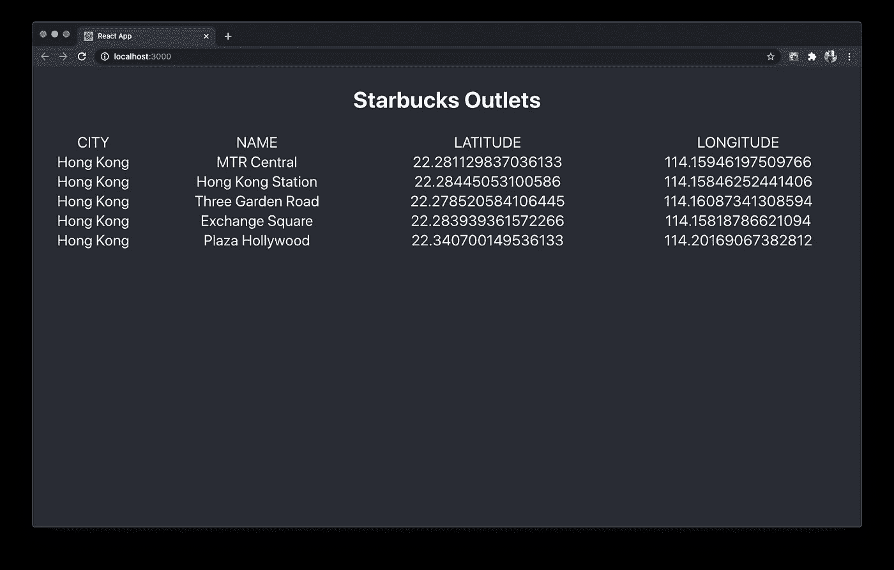
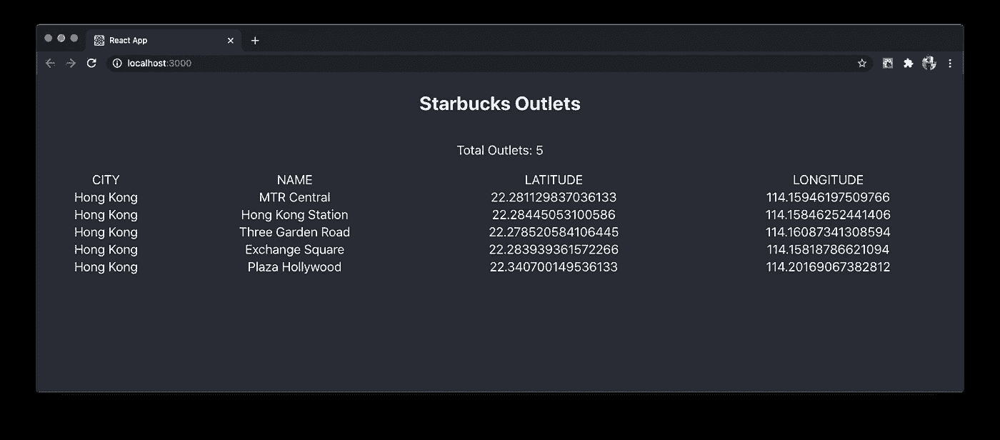

# 如何将 HarperDB 实例与 React 挂钩一起使用

> 原文：<https://levelup.gitconnected.com/how-to-use-harperdb-instance-with-react-hooks-9af81848548e>

[HarperDB Cloud](https://harperdb.io/developers/get-started/?utm_source=amanmittal) 是一个数据库服务，支持针对 CRUD 操作的 SQL 和 NoSQL 查询。它只需要最少的配置就可以开始，而且它的领域不仅限于使用 Node.js 等服务器端技术构建 REST APIs。

HarperDB 提供了一种在客户端应用程序中直接访问数据库云实例的方法。它有一个内置的 HTTP API，允许我们直接查询数据。

在本文中，让我们看看如何配置 HarperDB 云数据库实例，并通过在 Reactjs 应用程序中查询数据库来获取数据。HarperDB 提供了一个名为`[useHarperDB](https://github.com/HarperDB/harperdb-sdk-react)`的 React 钩子来简化我们的工作。

# HarperDB 实例术语表

这篇文章将使用 HarperDB 数据库的一个类似实例，它是我们在上一篇文章**中使用 Node.js 的 **REST API 方法构建的。请看**上的帖子如何设置云实例** [**这里**](https://amanhimself.dev/blog/build-rest-api-with-nodejs-harperdb#setting-up-an-instance-of-harperdb-cloud) 。这样，您将拥有一个填充了数据字段的表格。****

**上述数据库实例中的模式称为`dev`。HarperDB 中的模式是必需的。它相当于表的集合。没有现有的模式，就不能创建新表；没有表，就不能在 HarperDB 实例中添加或更新数据。**

**在模式下，有一个添加一个或多个表的选项。在上面的实例中，已经创建了一个名为`outlets`的表。该表的每一行数据都有一个唯一的标识符`id`。**

**在右边，您会发现表格中的数据。请注意两个时间戳字段。每当有新行添加到表中时，HarperDB 都会自动插入它们，并自动维护它们。**

*   **`__createdtime__`:记录插入数据时的时间戳。**
*   **`__updatedtime__`:记录任意数据字段最后一次更新时的时间戳。**

********

**一旦建立了云实例，确保使用 React 项目和库的版本`16.8.0+`。**

# **入门指南**

**首先创建一个新的 React 应用程序。在本文中，我们将使用 React 应用程序来构建示例应用程序。打开终端窗口并执行以下命令:**

**现在您可以启动开发服务器来查看 React 应用程序的运行情况。进入终端窗口，执行命令`yarn start`。您将在 URL 处的浏览器窗口中获得以下输出:`[http://localhost:3000/](http://localhost:3000/.)` [。](http://localhost:3000/.)**

****

# **创建具有自定义角色的用户**

**默认情况下，在 HarperDB 云实例中创建的用户是超级用户。它具有查询和添加数据的管理权限，以及从现有模式创建和删除表以及创建和删除新模式的权限。在客户端应用程序中，我们不希望有超级用户。由于大多数客户端应用程序都是公共的，所以使用默认用户从来都不是一个好方法。**

**解决这个问题的方法是创建一个新用户，该用户有权只在数据表内执行 CRUD 操作。HarperDB 提供了一种定义自定义用户角色以及使用该角色创建新用户的方法。**

**首先打开你的云实例，从菜单栏转到标签`roles` [。](https://harperdbhelp.zendesk.com/hc/en-us/articles/360051486534-Managing-Role-Permissions)**

****

**在这里，您可以定义一个新的标准角色来创建一个自定义角色。咱们这个新角色，`client_user`。**

****

**创建新角色后，实例会提示我们可以将权限分配给具有该角色的任何用户。现在，您可以为这个特定角色配置对表和模式的访问。现在只有一个模式，其中只有一个数据表。对于本例，让我们保留默认配置，并按下按钮 Update Role Permissions 继续。**

****

**更新权限后，转到菜单栏中`roles`旁边的`users`选项卡。这用于添加具有刚刚创建的自定义角色的新用户。从下拉菜单中选择角色`client_user`。**

****

**单击“添加用户”按钮添加新用户。**

****

**现在，我们可以在客户端 React 应用程序中使用这个自定义用户来查询表`outlets`中的数据。**

# **在 React 中集成 HarperDB**

**`use-harperdb`钩子带有一个`HarperDBProvider`,用于将 React 应用程序或`App`组件的实例包装在`index.js`文件中。这是在数据库实例上执行 CRUD 操作所必需的。**

**在`src/index.js`文件中添加以下导入语句:**

**为了在数据库实例上执行任何 CRUD 操作，提供者需要 db 实例 URL、用户名和与该用户相关联的密码。我们将利用环境变量来增加这些值。**

**使用以下变量在 React 项目的根目录下创建一个名为`.env`的新文件。这些变量的值在`[]`中作为描述被提及，但是您必须替换方括号和您自己的值。**

**Create React App 读取任何以`REACT_APP`为前缀的环境变量。我们可以不使用第三方库，直接使用这些环境变量为`HarperDBProvider`提供必要的属性。**

**就是这样。我们已经成功地将 React 应用程序配置为使用 HarperDB 数据库实例。**

# **从 HarperDB 查询数据**

**为了查询 React 应用程序中数据库实例的数据，`useHarperDB`钩子提供了这样做的元素。**

**打开`App.js`文件，从`use-harperdb`导入钩子。让我们还设置一个基本的 UI 来显示获取的数据。**

**使用任何挂钩的规则是，它们只能在功能组件内部使用。`useHarperDB`钩子给出一个包含元素的数组来查询作为数组返回的`data`。它还提供:**

*   **`loading`您可以让用户知道查询是否正在运行，数据是否尚未加载**
*   **`error`确定查询数据时是否有错误**
*   **`refresh`该功能允许提取数据**

**要从数据库实例中查询数据，请在钩子内传递对象。**

**在`App.js`文件中添加以下代码片段查询，从数据库中获取所有数据。**

**在上面的代码片段中，当您不想显式使用`refresh`函数时，传递的`interval`的第二个属性是可选的。它接受以毫秒为单位的值。**

**让我们通过在`App`组件中使用`if/else`语法为`loading`和`error`添加一些 JSX。**

**在很短的时间内，您可能会看到正在显示加载消息。**

****

**此外，如果您将`interval`作为第二个属性传递，您可能会注意到，每隔 5 秒，React 应用程序就会自动刷新网页。要停止这种行为，您可以删除`interval`属性。**

**现在使用 JavaScript 的`map`函数，让我们映射`data`的数组并显示内容。如果数据被提取，这意味着它存在，我们可以很容易地映射到数组。添加以下代码片段来代替注释。**

**返回浏览器窗口，您将获得以下结果:**

****

**也可以只使用`useHarperdb`钩子和`data`数组进行查询。添加以下查询以从数据库中获取商店或记录的总数。**

**要显示总计数，添加修改从`App`渲染的 JSX 组件:**

**这是此步骤后的输出:**

****

# **结论**

**钩子是 React 世界中的一个很好的补充，它们当然帮助我们编写更少的代码。这篇文章的目的是向您介绍`useHarperDB`钩子，以及如何将它集成到 React 应用程序中，以便从云中托管的数据库中获取数据。**

## **进一步阅读**

**- [HarperDB 文档](https://harperdb.io/developers/documentation/overview/?utm_source=amanmittal)**

**- [HarperDB 开发者示例](https://harperdb.io/developers/developer-examples/?utm_source=amanmittal)包括 React、Websocket、Python 等教程。**