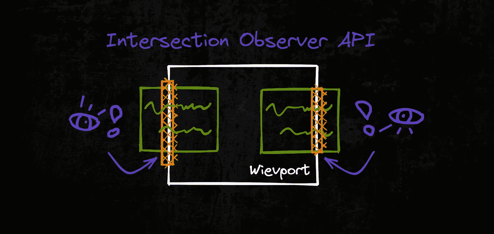
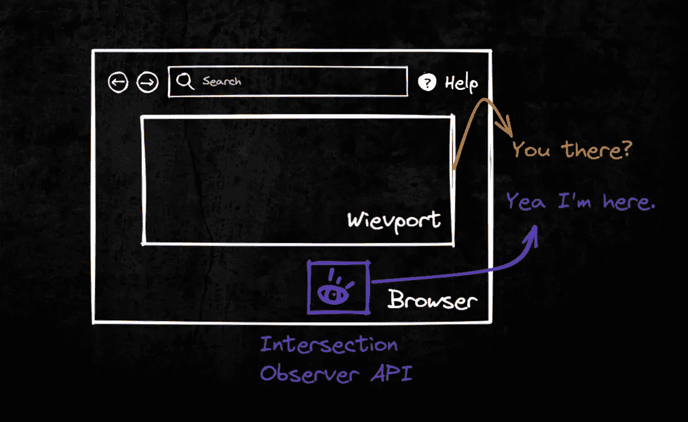
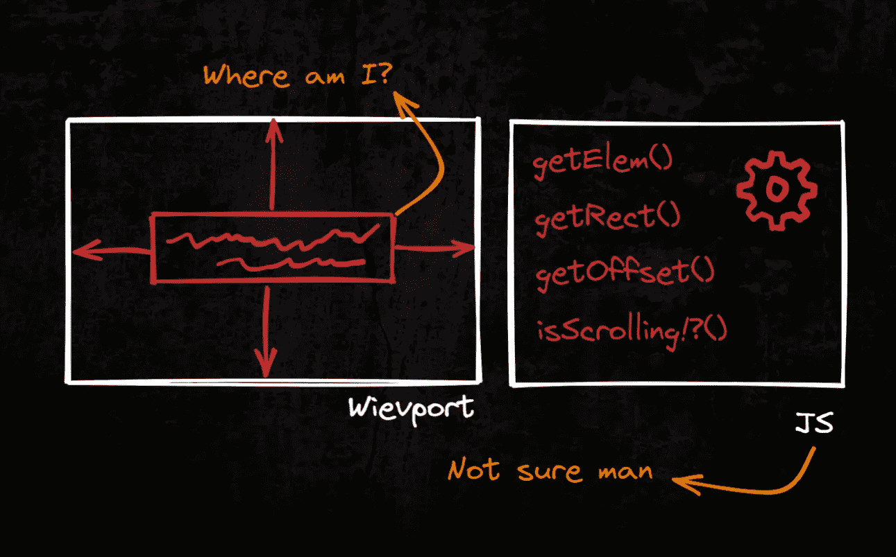
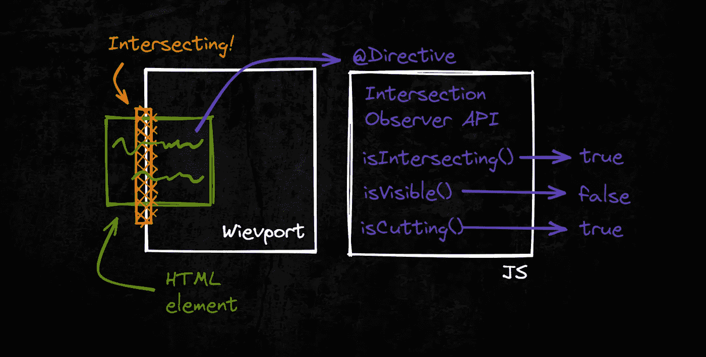
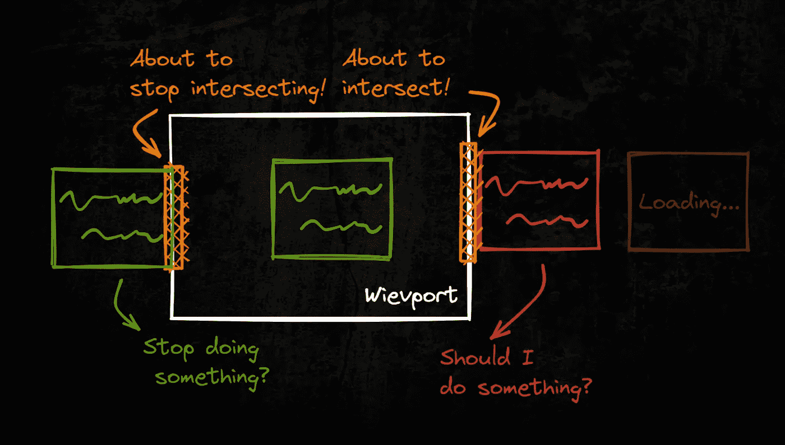
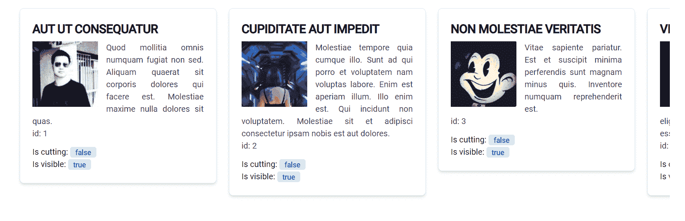
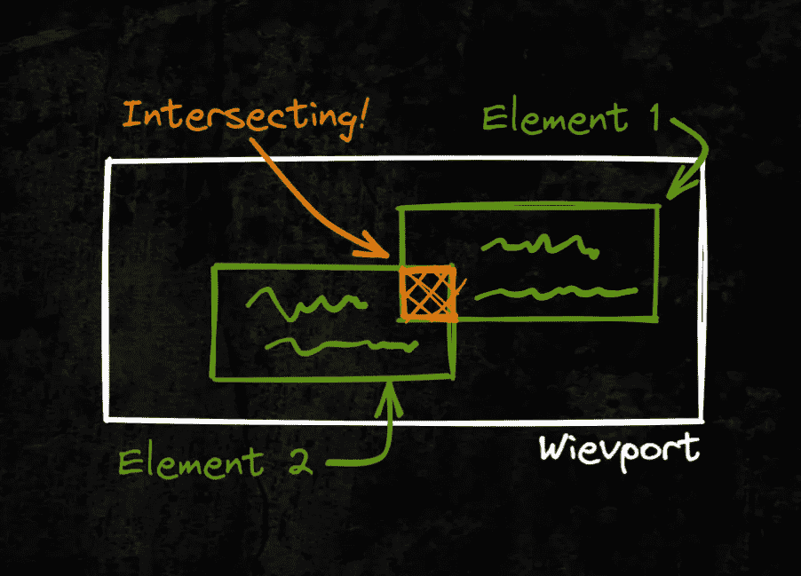
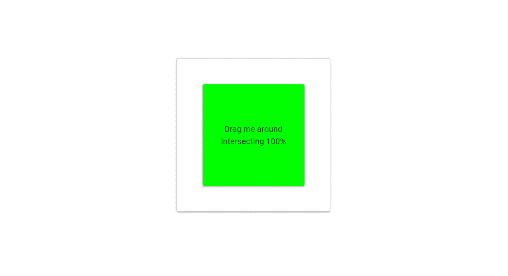

# 如何使用交叉点观察器 API

> 原文：<https://levelup.gitconnected.com/how-to-use-intersection-observer-api-with-a-directive-e86f0253c207>

它是什么，如何用实际例子来使用它，为什么它很棒！😎

我真的很兴奋告诉你这个！

[交集观察器 API](https://developer.mozilla.org/en-US/docs/Web/API/Intersection_Observer_API) 提供了一种异步观察目标元素与祖先元素或顶层文档的[视窗](https://developer.mozilla.org/en-US/docs/Glossary/Viewport)交集变化的方法。

> 历史上，检测元素的可见性或两个元素相对于彼此的相对可见性一直是一项困难的任务，其解决方案不可靠，并且容易导致浏览器和用户正在访问的网站变得缓慢。随着网络的成熟，对这类信息的需求也在增长。

尽管这篇文章举例说明了如何在 Angular 框架中实现这一点，但是这些知识对于任何框架都是极好的。这是一个 Web API，所以如果你的东西在浏览器中运行，你可以使用交叉点观察器 API！还有很多更酷的 API 在外面[【1】](https://developer.mozilla.org/en-US/docs/Web/API)。

# 为什么这很酷？😎

通常，当我们想要检测我们何时看到某物(或者我们看到了多少)——我们倾向于查询元素，然后询问它们的坐标。通过结合滚动事件从边界框中读取坐标，并通过一些计算，我们得出我们所看到的结论。类似这样的[【2】](https://stackoverflow.com/questions/9607252/how-to-detect-when-an-element-over-another-element-in-javascript)或者那样的[【3】](https://stackoverflow.com/questions/46822870/how-to-detect-if-one-div-touches-another-div)。

因为 JS 是在单线程上运行的，所以代价可能会很高。随着元素数量的增加，花费在查询和计算上的资源也在增加。

使用交叉点观察器 API，相同的典型计算被抽象到 API[【4】](https://github.com/GoogleChromeLabs/intersection-observer/blob/main/intersection-observer.js#L542)中。您得到的是一个漂亮的 JSON，其中包含有观察者观察的元素的位置和交叉点的数据。不需要询问数据，API 可以通过 Observables 直接给你。

现在，我并不是说交叉点观察器 API 将会取代一切，但它更具性能[【5】](https://css-tricks.com/an-explanation-of-how-the-intersection-observer-watches/#aa-performance-intersection-observer-versus-scroll-events)，也许只是你知识库中的又一个工具。

## **更少的开销，更高的性能。**

# 简而言之，它是如何工作的？🤔

你用`observe()`将元素传递给交集观察者 API，用`unobserve()`或者`disconnect()`观察移除它们。

**可以观察到两件事。**目标元素与设备的视窗或指定元素相交。出于交叉点观察器 API 的目的，该指定元素被称为根元素。

API 负责跟踪您传递给它的元素。交叉点观察器 API 进行回调，并为您提供大量关于交叉点的元数据(包括`boundingClientRect`)。它相交了多长时间(`time`)、相交了多少百分比(`intersectionRatio`)等等...

## API 跟踪元素并发出更新。

# 如何实施？

## 指示的

> 用属性指令改变 DOM 元素和角度组件的外观或行为。

例如，您可以构建自己的基于 API 返回数据发出值的方法。我们使用指令[【6】](https://angular.io/guide/attribute-directives)将观察者附加到元素上。该指令然后发出信息。我们消费这些信息，并根据这些信息做出一些反应。

您还可以在服务中或通过 Decorators 使用交叉点观察器 API。但是指令方法的美妙之处在于它被应用到你附加它的地方。此外，当元素被破坏时，交叉点观察器 API 也会被破坏——这意味着没有泄漏！

## 可以以多种方式使用和实现。

# 可能性#1:目标元素与设备的视口相交。无限滚动和动画。

例如，使用交叉点观察器 API，我们将:

1.  根据用户是否会看到结果来执行任务或动画过程；
2.  进入/退出动画；
3.  无限滚动——数据的惰性加载；

可在 [StackBlitz](https://stackblitz.com/github/Nurech/intersection-observer-example?file=src%2Fapp%2Fdirectives%2Fintersection-observer.directive.ts) 上查看示例。

# 可能性#2:一个目标元素与另一个元素相交。

例如，使用交叉点观察器 API，我们将:

1.  高速率求交比(但只在 1%的变化上)。
2.  更改色调以反映相交率。

交叉点观察器 API 不能告诉你重叠的像素的确切数目或者具体是哪些像素；然而，它涵盖了更常见的用例“如果它们相交于大约 *N* %,我需要做些什么。”

但是想象一些拖放动作。

可在 [StackBlitz](https://stackblitz.com/github/Nurech/intersection-observer-example?file=src%2Fapp%2Fdirectives%2Fintersection-observer.directive.ts) 上查看示例。

该指令可以在下面的要点中看到，在 [GitHub repo](https://github.com/Nurech/intersection-observer-example) 中，或者在 [Stackblitz](https://stackblitz.com/github/Nurech/intersection-observer-example?file=src%2Fapp%2Fdirectives%2Fintersection-observer.directive.ts) 上直播。

感谢阅读！👏👏👏