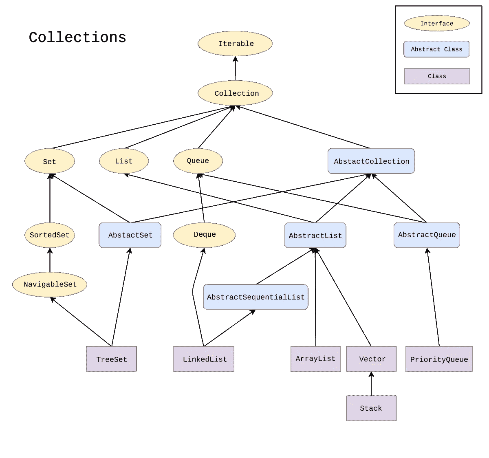

# 如何在多线程环境中安全地使用 Java 集合

> 原文：<https://levelup.gitconnected.com/how-to-use-java-collections-safely-in-multi-threaded-environments-83c94be57ab8>

**Collections** 是一个 Java 框架，它提供了各种实用程序类，实现了一些众所周知的数据结构，比如映射、列表和集合。几乎所有的高级编程语言都提供了这些数据结构的某种实现，Java 也不例外。熟悉的类如 **ArrayList** 、 **HashMap** 和 **HashSet** 都是这个框架的一部分。

在单线程环境中使用它们是微不足道的，但在多线程应用中我们需要小心，因为大多数这些类没有内部同步，这意味着它们在默认情况下不是线程安全的。

# 什么是线程安全？

对象的线程安全意味着同时从多个线程访问/修改该对象不会使其处于不一致的状态。有许多方法可以实现这一点，最简单的方法之一是**互斥**这意味着一次只有一个线程可以与一个对象交互。通过将读/写操作放在一个**锁**之后，该锁在任何给定时间只能被一个线程获取，潜在的竞争条件被消除，从而实现线程安全。

# **异常:堆栈**、**向量**、**属性**、**哈希表**

让我们先把这些解决掉。当我说集合框架中的大多数实现都不是线程安全的时候，我说的是这些坏孩子。是的，这些是线程安全的。

堆栈、向量、属性和哈希表类都在 Java 1.0 中实现，因此它们大多被认为是遗留类。如果您查看它们的实现，您会发现它们都是在对象级同步的。下面是**栈**的实现，它使用 **synchronized** 关键字为所有操作锁定整个对象。

# 为什么不在默认情况下同步它们呢？

“为什么他们在实现最早的集合时会考虑到线程安全，而在后来却放弃了这一理念？”你可能会问。嗯，答案其实很简单:**同步的成本。**

同步并不便宜，因此默认情况下将它嵌入到每个集合中会剥夺开发人员的自由。因此，现在大多数集合都是为了优化单线程应用程序中的吞吐量而编写的。

那么，如果在多线程应用程序中使用非线程安全集合，会发生什么呢？

# *并发修改异常*

收集是**快速失败**。快速失效意味着一旦检测到意外情况，操作就会终止。非线程安全集合通过保存一个名为 **modCount** 的变量来实现这一点。该变量负责跟踪对该对象所做的修改。如果在操作过程中 modCount 以某种方式增加，就会抛出 ConcurrentModificationException 来通知您。但是，您不应该依赖于处理这个异常，因为这不是检测并发修改的可靠方法。抛出这个异常只是为了帮助开发人员发现问题，并让他们知道他们可能需要考虑一些额外的同步。

# **如何在多线程应用中使用集合？**

Collections framework 实际上提供了一种将常规集合转换为同步集合的方法:

同步是通过将所提供的集合放入一个包装类来实现的，该包装类只是保存一个**互斥体**，并在每次操作之前锁定它。这也是对象级同步，这意味着在执行任何类型的操作之前，整个集合都是锁定的。

**迭代器是** **还是** **不同步！**如果你想使用迭代器遍历集合，你需要手动同步它们。请记住，智能 for 循环也在幕后使用迭代器，因此同样适用。

虽然对象级同步可能适用于大多数应用程序，但它是实现线程安全的强力方式。它效率不高，并且会产生读/写争用。幸运的是，我们有更好的选择。

# java.util .并发包

这个包提供了多种实现来尽可能高效地实现集合中的并发性。不依赖于对象级同步，而是使用更复杂的方法来处理并发性。

让我们来看一些例子:

*   **并发哈希表** Java 中的哈希表将数据存储在称为**段**的哈希块中。默认情况下，创建一个 HashMap 有 32 个段。ConcurrentHashMap 只锁定段而不是整个对象，对每个段使用不同的互斥体。这提供了多个线程来同时访问不同的段。读取操作根本没有被锁定。
*   **CopyOnWriteArrayList**
    保持一个内部数组来存储元素。当你添加一个元素到列表中时，所有的东西都被复制，新元素被附加到列表的末尾。然后，这个新列表被分配给内部数组。该方法允许您安全地遍历列表，因为即使有更新，也会为它创建一个新数组。如果需要定期更新列表，复制会带来巨大的开销，所以只有在很少需要添加/删除元素时才应该使用这种方法。

**推荐人:**

 [## 并发收款

### Java 教程是为 JDK 8 编写的。本页中描述的示例和实践没有利用…

docs.oracle.com](https://docs.oracle.com/javase/tutorial/essential/concurrency/collections.html)  [## 线程安全

### 线程安全是一个适用于多线程代码的计算机编程概念。线程安全代码只操纵…

en.wikipedia.org](https://en.wikipedia.org/wiki/Thread_safety)  [## 构建更好的散列表

### Brian Goetz 深入研究了 ConcurrentHashMap 的代码，并研究了它如何实现出色的吞吐量和并发性…

www.ibm.com](https://www.ibm.com/developerworks/java/library/j-jtp08223/index.html)