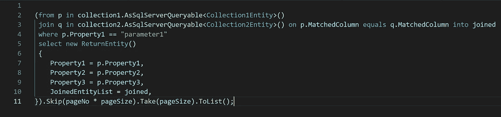
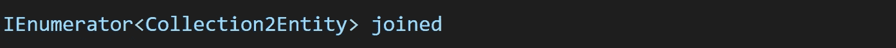
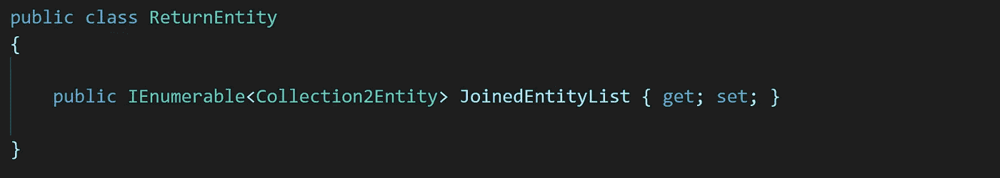
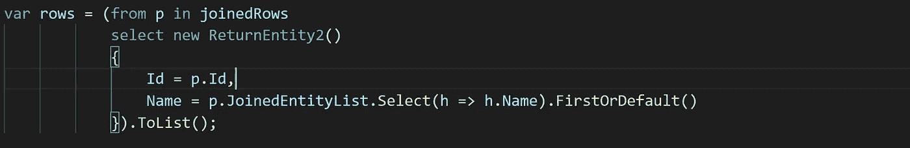
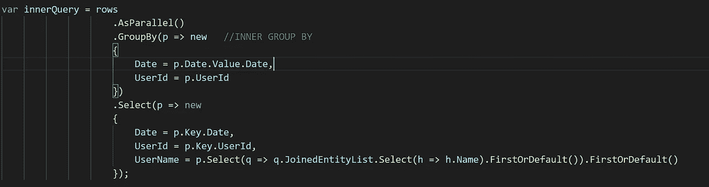

# 如何在 MongoDB C#驱动程序中使用连接

> 原文：<https://levelup.gitconnected.com/how-to-use-joins-with-the-mongodb-c-driver-30f42fc4d005>

我没有找到一篇完全展示如何做到这一点的完整故事的文章。而且，新手可能很难搞清楚这一点。当你很匆忙，没有时间搞清楚所有事情的时候，希望这可以缩短这个过程。

以下是您实际执行“加入”的方式:

这里要记住的是“加入”的类型实际上是:

*   至少在这个时候，没有其他方法或形式可以让它工作。
*   我试过了所有的“其他方法”。它们都不工作(至少在我写这篇文章的时候)。

因此，这将是“收集这些数据”的实体。请注意，您可能无法将 IEnumerable 转换为 Select 中的列表。

我有额外的要求，因为我需要在我的“结果集”中只需要 Collection2Entity 的一个属性。下面是如何提取的:

或者事情会变得很糟糕，就像在这里一样，但这很好:

我只是想提供一些更复杂的用法，一旦你能够检索到 MongoDB 所指的“Lookup”。

*如果您喜欢这篇文章，请访问我们的赞助商，他为构建了下一代应用开发框架。净:*

 [## “鹦鹉螺”号

### 编辑描述

nautilus2k.netlify.app](https://nautilus2k.netlify.app/)