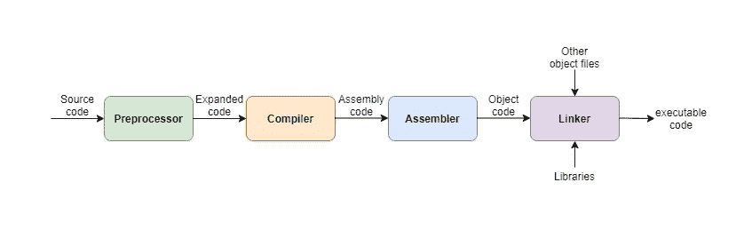
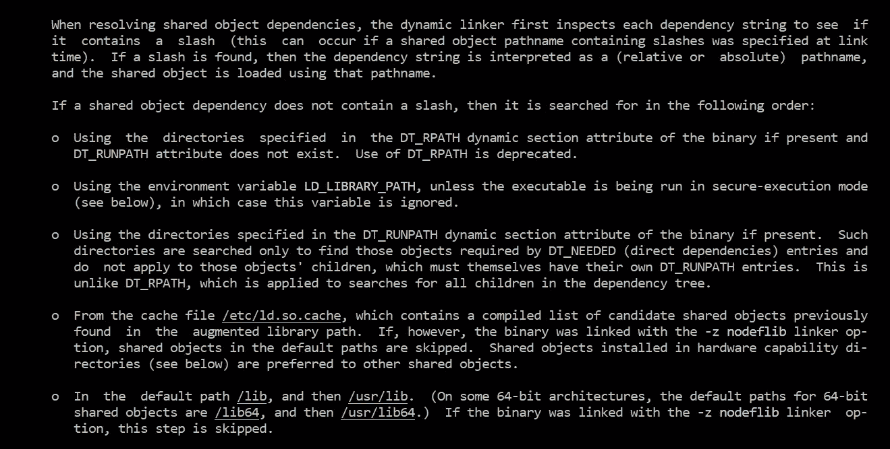

# 如何在 Linux C 程序中使用库

> 原文：<https://levelup.gitconnected.com/how-to-use-libraries-in-linux-c-program-d907c8528f9c>

# 背景

在你学会并理解了如何在 Linux 中编写小的 C 程序之后(也就是说你知道 C 语言的语法以及如何用`gcc`来编译你的程序)，你会想要有一些冒险来编写更强大更大的程序。要成为一名伟大的软件工程师，你需要这种探索的激情，对吗？

要编写一个更大的程序，你不能从头开始构建一切。这意味着您需要在您的程序中导入和使用他人开发的库。

对于 Linux C 编程的新开发者来说，整个库的处理可能是一个谜，这需要关于`gcc compiler`、`Linux system`、`GNU conventions`等等的知识。在这篇文章中，我将关注这个话题，并把所有这些拼凑在一起。读完这篇文章后，我希望你可以放心大胆地将开源世界的共享库添加到你的程序中。

**注**:为了更清楚地说明讨论，本文基于这个演示 github [app](https://github.com/baoqger/handle-c-library-demo-linux) 。我的演示应用程序是从斯蒂芬·阿文韦德的原始[回购](https://opensource.com/article/20/6/linux-libraries)中派生出来的。谢谢你。

这个演示应用程序的代码逻辑非常简单，所以我不会在本文中逐行审查代码，这不是本文的目标。

# 静态库与共享库

一般来说，有两种类型的图书馆:`Static`和`Shared`。

*   **静态库**:简单来说就是普通对象文件的集合；按照惯例，静态库以`.a`后缀结尾。该集合是使用`ar`命令创建的。例如，在演示应用程序中，我们像这样构建静态库:

在我们的例子中，静态库将安装在子目录`./lib/static`中，并命名为`libmy_static.a`。

当应用程序链接到一个静态库时，该库的代码成为生成的可执行文件的一部分。因此，您无需任何进一步的设置或配置就可以运行该应用程序。这是静态库的最大优势，您将在下一节看到它是如何工作的。

静态库不像以前那样经常使用，因为`shared library`有更多的优势。

*   **共享库**:以`.so`结尾，表示**共享对象**。当应用程序启动时，共享库被加载到内存中。如果多个应用程序使用同一个共享库，共享库将只加载一次。在我们的演示应用程序中，共享库构建如下:

共享库`libmy_shared.so`安装在`./lib/shared`子目录下。注意，共享库是为`gcc`构建的，有一些特殊的选项，比如`-fPIC`和`-shared`。详细的，你可以查看 gcc 的文档。

# 命名约定

一般来说，共享库的名字遵循这样的模式:`lib` +库名+ `.so`。当然，版本信息非常重要，但是在本文中，我们忽略版本问题。

# 链接库

构建完库后，下一步您需要将库导入到应用程序中。对于我们的 app，源代码是如下的`demo/main.c`文件:

注意，我们导入了三个`header file`库。下一个问题是如何构建演示应用程序。

让我们回忆一下一个 C 程序的构建过程如下:



编译过程

这是一个两步过程:`compile`和`link`。首先将`main.c`的源代码文件编译成一个目标文件，比如说`main.o`文件。在这一步，关键的事情是告诉`gcc`在哪里可以找到库的`header file`。接下来，将`main.o`目标文件链接到我们的库:`libmy_static.a`和`libmy_shared.so`。`gcc`需要知道它应该链接的库的名称以及在哪里可以找到这些库，对吗？

这些信息可以由以下三个选项定义:

*   `I`:增加头文件的包含目录，
*   `l`:库名
*   `L`:库的目录

在我们的例子中，构建演示应用程序的`make`命令如下:

由于我们有两个库:`libmy_static.a`和`libmy_shared.so`，基于我们上面提到的命名约定，库名的`-l`选项应该是 **my_static** 和 **my_shared** 。我们可以为每个库使用两个`-l`选项。

对于`-L`选项，我们需要提供找到库的目录路径。我们可以使用相对于演示源代码文件的路径`../lib/shared`和`../lib/static`。对吗？同样的规则也适用于包含头文件的`-I`选项。

运行`make demo`命令，你就可以成功地构建库链接在一起的演示应用了。

# 文件系统放置约定

正如我上面所展示的，库被放在这个项目的子目录中。这样不方便别人导入你的库。大多数开源软件倾向于遵循`GNU`标准。`GNU`标准推荐在分发源代码时默认安装`/usr/local/lib`中的所有库和`/usr/local/include`中的所有头文件。因此，让我们再添加一个`make`命令，将库文件和头文件安装到基于 GNU 约定的目录中:

为此，您可以在我的开源项目中找到类似的 make 命令。

好处是`gcc`编译器(也来自 GNU，遵循相同的约定)默认会在这两个目录中寻找库:`/usr/local/lib`和`/usr/local/include`。所以不需要设置`-L`和`-I`选项。例如，在我们运行上面的`make install`命令并将库安装到系统目录中后，您可以如下构建演示应用程序:

了解`GNU`约定可以让你的开发更容易吧？

然后下一步让我们通过简单地调用`./my_app`来运行演示应用程序，但是您会得到下面的错误消息:

```
./my_app: error while loading shared libraries: libmy_shared.so: cannot open shared object file: No such file or directroy
```

发生什么事了？

# 动态连接器

当我们启动一个可执行文件时，Linux 内核会自动运行`dynamic linker`(或者动态加载器)。这个动态链接器依次查找并加载程序使用的所有其他共享库。

事实上，Linux 系统中的可执行文件通常是`[ELF](https://linux-audit.com/elf-binaries-on-linux-understanding-and-analysis/)`格式，缩写为`Executable and Linkable Format`。ELF 可执行文件包含链接信息，动态链接器只是读取这些信息来加载共享库。

在 Linux 系统中，动态链接器的名字是`ld.so`

根据上面的错误信息，我们可以说动态链接器找不到共享库。我们可以通过运行`ldd`命令来验证这一点，该命令用于打印命令行上指定的每个程序或共享对象所需的共享对象(共享库)。


ldd

显然，我们的共享库`libmy_shared.so`没有找到。我们需要看看`ld.so`是如何工作的。找到这些信息的最好方法是运行`man`命令。我们可以在`ld.so`手册文档中获得以下信息:



ld.so

根据这张截图，我们可以通过三种方式解决这个问题:

*   将共享库安装到目录:`/lib`或`/usr/lib`
*   通过追加包含我们库的目录路径来编辑环境变量`LD_LIBRARY_PATH`
*   更新缓存文件`/etc/ld.so.cache`

根据我的测试，前两种方法可以很好地工作，但我个人推荐使用第三种方法，这是一种更系统的注册库的方法。

# 寄存器库

为了注册一个新的库，我们需要使用命令`ldconfig`来配置动态链接器运行时绑定。

`ldconfig`是如何工作的？它会搜索一些特定目录下的`.so`库文件，搜索结果会更新到动态链接器的缓存文件`/etc/ld.so.cache`。

而`ldconfig`会看的目录之一就是`/etc/ld.so.conf`。在我们的 Ubuntu 系统中，它实际上是一个如下的文件:


ld.so.conf

它扩展到`ld.so.conf.d`中的所有`.conf`文件，在我的例子中，有一个默认文件`libc.conf`，如下所示:


libc.conf

请注意，`/usr/local/lib`是在文件中定义的，那么`ldconfig`将会搜索。所以这个目录中的库。

正如我们在上一节提到的，`/usr/local/lib`只是安装基于 GNU 惯例的共享库的地方。对吗？

因此，我们可以简单地运行`ldconfig`命令，而没有任何选项来**注册一个新库**(确保该库安装在该目录中):


在上面的截图中，你可以看到运行`sudo ldconfig`命令前后的变化。(`ldconfig -p`将列出当前从缓存文件中读取的库文件`/etc/ld.so.cache`)。注册库后，添加到动态链接器的缓存文件中，对吗？让我们用`ldd`再次验证一下:


ldd-结果

可以找到我们新的共享库！然后我们也可以成功运行应用程序。

# 摘要

在本文中，我们讨论了几个重要的工具，如`ld.so`、`ldd`、`ldconfig`和`gcc`，它们帮助您构建和导入共享库。另一件事是`GNU`定义这些工具行为的惯例或标准。