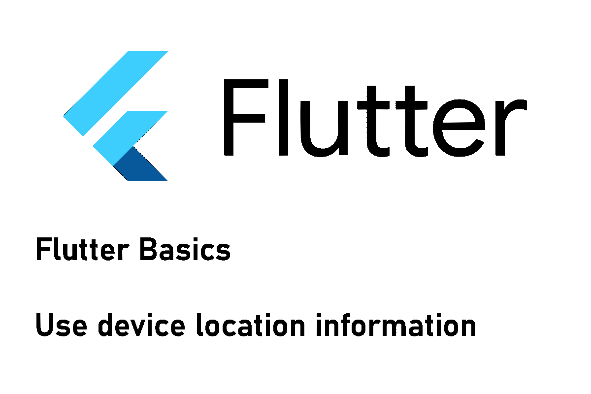

# 如何在你的 Flutter 应用中使用定位服务

> 原文：<https://levelup.gitconnected.com/how-to-use-location-services-in-your-flutter-application-582189b2cae7>

## 导航变得简单！

## 在本文中，我们将了解定位服务，以及如何在我们的 Flutter 应用程序中获取设备的当前位置。



位置信息可以用在各种 app 场景中。也许你想向用户展示他们感兴趣的地方，或者引导他们去某个特定的地方。无论哪种方式，您都需要访问设备的当前位置。我会告诉你如何完成这项任务。

## 设置

第一步是安装软件包。在 [pub.dev](https://pub.dev/) 有很多可用的包，但是我将用最流行的一个来演示步骤: [location](https://pub.dev/packages/location) 。所有软件包的设置过程应该非常相似，但是代码可能会略有不同。

不确定如何安装软件包？有关说明，请查看以下文章。

[](https://xeladu.medium.com/how-to-install-packages-in-your-flutter-app-e7f7e62711ee) [## 如何在你的 Flutter 应用中安装包

### 这篇短文展示了如何将包添加到一个 Flutter 应用程序中，这样你就可以使用现有的代码并加速…

xeladu.medium.com](https://xeladu.medium.com/how-to-install-packages-in-your-flutter-app-e7f7e62711ee) 

我们还需要为我们的应用程序添加功能，以便操作系统和用户可以批准位置请求。

对于 Android，转到`android/app/src/main/AndroidManifest.xml`并将功能`<uses-permission android:name="android.permission.ACCESS_FINE_LOCATION" />`或`<uses-permission android:name="android.permission.ACCESS_COARSE_LOCATION" />`添加到文件中。第一种更准确，但也需要更多的电池电量。条目应该在`<manifest>`标签内，而不是在`<application>`标签内。

对于 iOS，转到`ios/Runner/Info.plist`并在`<dict>`节点中添加以下代码。

```
<key>NSLocationWhenInUseUsageDescription</key>
<true/>
```

## 密码

下面是一个初始化插件的简单代码示例。例如，你可以在主应用程序状态的`initState()`方法中调用它。

执行以下步骤:

🔹检查设备**位置服务**是否启用
🔹检查位置服务的使用许可**是否被授予**🔹将**当前位置**输出到调试控制台

❗如果定位服务被禁用，您将被要求激活它们

❗如果使用许可还没有被授予，你会被要求在 Android 上。iOS 总是会询问应用程序的启动情况。如果您拒绝使用，将不会再次提示您。若要更改设置，你必须转到你的手机设置并启用此应用的权限。

要获得关于位置变化的连续信息，可以添加一个监听器。

```
location.onLocationChanged.listen((LocationData loc) {
	print("${loc.latitude} ${loc.longitude}");
});
```

## 结论

在本文中，我向您展示了如何设置和使用位置数据。配置一开始可能有点棘手，但是位置数据的可能性是无穷无尽的。

如果你喜欢这篇文章，我会很高兴得到掌声👏(你知道可以拍几次吗？😎)另外，如果你还没有跟上我，我也很感激。

🌲 [linktr.ee](https://linktr.ee/xeladu) | ☕ [咖啡](https://www.buymeacoffee.com/xeladu) |🎁[捐赠](https://www.paypal.com/donate/?hosted_button_id=JPWK39GGPAAFQ) |💻GitHub |🔔[订阅](https://xeladu.medium.com/subscribe)

顺便说一下:如果你还没有 Medium 会员，我推荐你使用[│我的推荐链接◀](https://medium.com/@xeladu/membership) ,因为它可以让你访问 Medium 上的所有内容，并以一小部分费用支持我，而不需要你支付任何额外费用。谢谢大家！✨

## 相关故事

[](/flutter-app-from-scratch-part-4-implementing-logic-and-styling-the-user-interface-c08d2304b399) [## Flutter 应用程序第 4 部分——实现逻辑和设计用户界面

### 如何从头开始构建 Flutter 应用程序系列的第 4 部分。本文涵盖了通知的实现…

levelup.gitconnected.com](/flutter-app-from-scratch-part-4-implementing-logic-and-styling-the-user-interface-c08d2304b399) [](/send-push-notifications-from-a-flutter-app-to-devices-with-firebase-9c84ce58fe30) [## 从 Flutter 应用程序向安装了 Firebase 的设备发送推送通知

### 以下是向具有 Firebase Cloud 功能和 Firebase Cloud 的设备发送自定义推送通知的指南…

levelup.gitconnected.com](/send-push-notifications-from-a-flutter-app-to-devices-with-firebase-9c84ce58fe30) [](https://medium.com/codex/my-top-5-flutter-extensions-for-vs-code-f36936518ff8) [## 我对 VS 代码的 5 大颤振扩展

### 以下是我一直在使用的 Visual Studio 代码的 5 大 Flutter 扩展。

medium.com](https://medium.com/codex/my-top-5-flutter-extensions-for-vs-code-f36936518ff8)