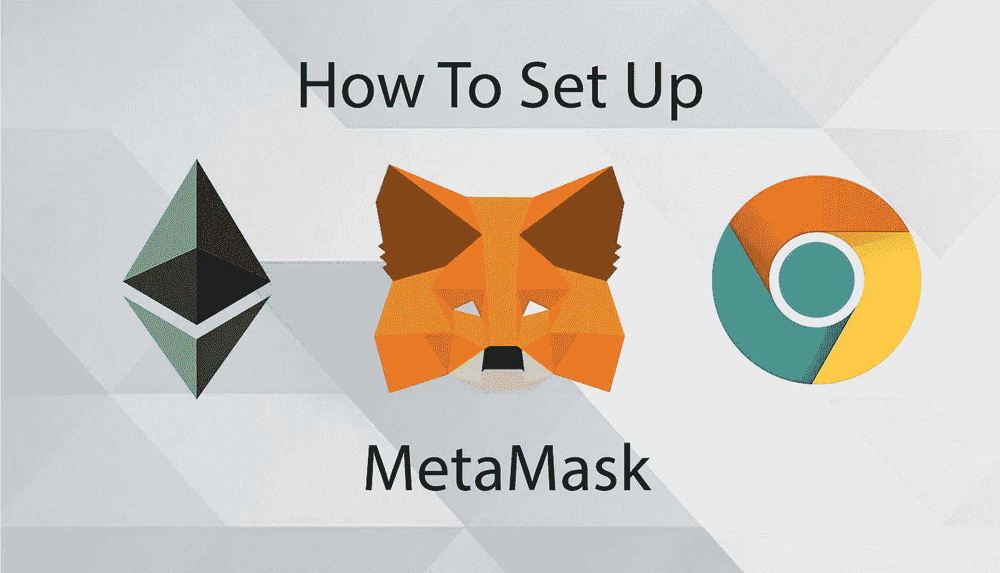
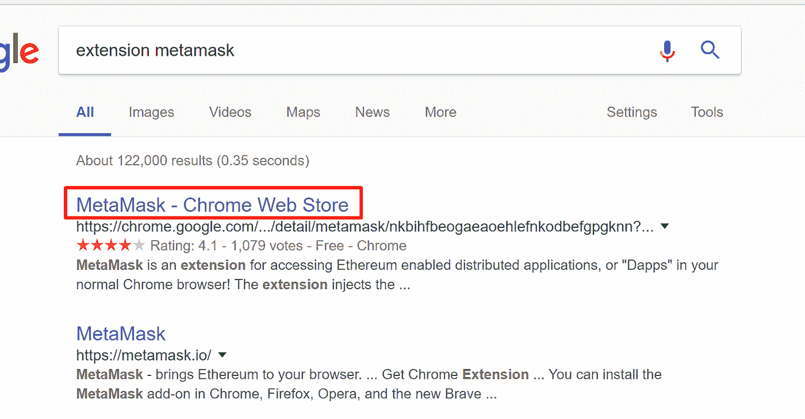
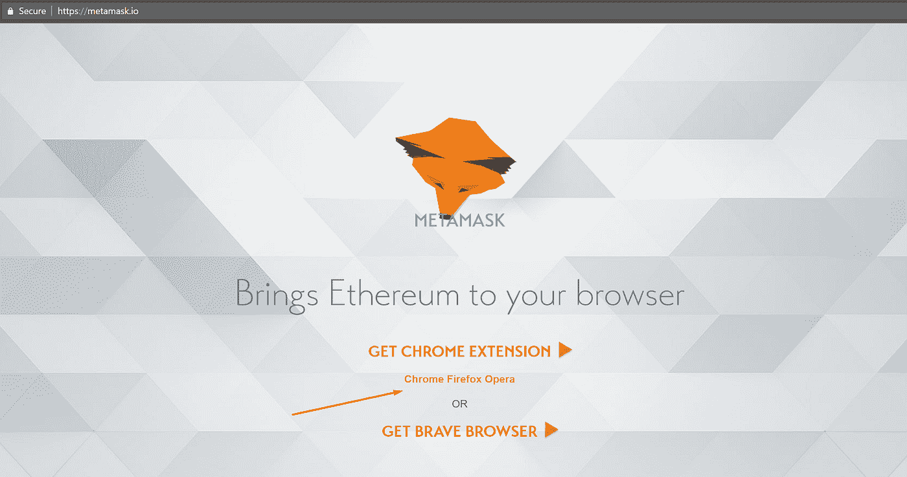
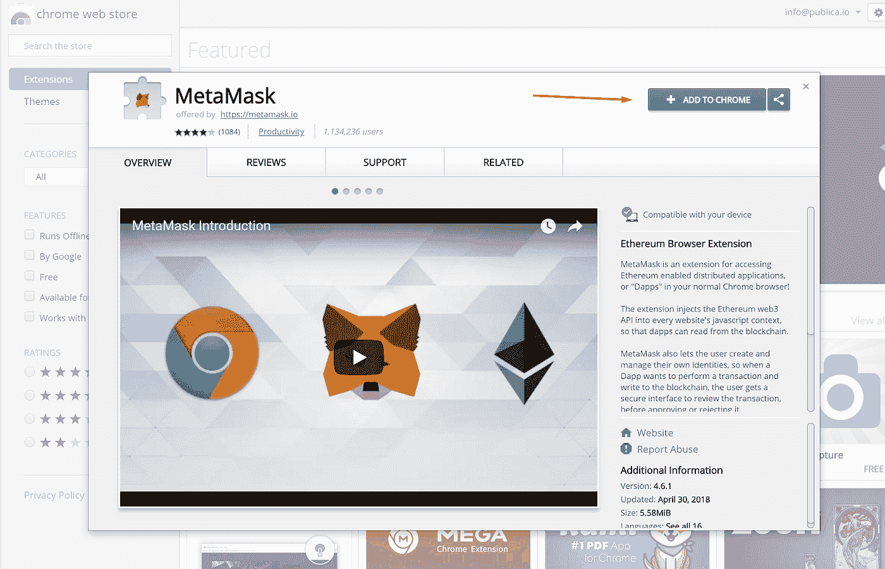
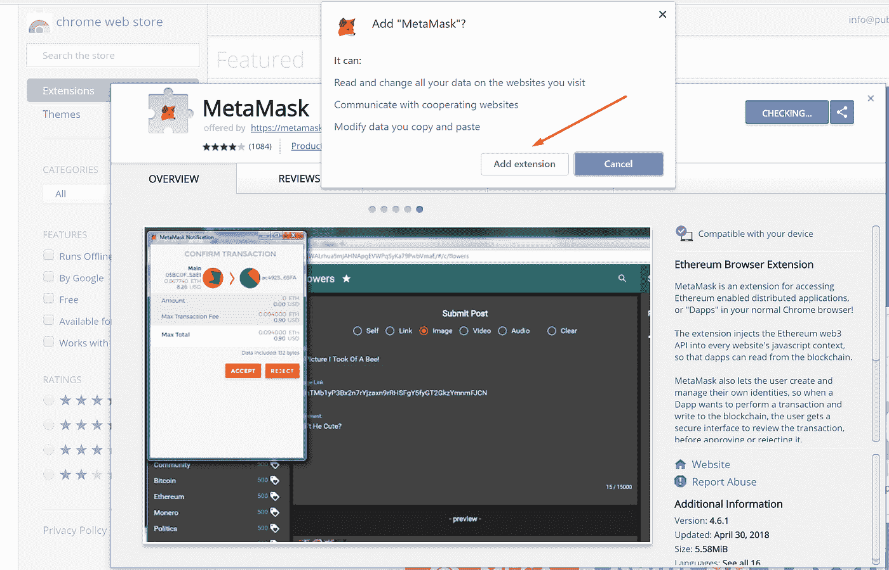
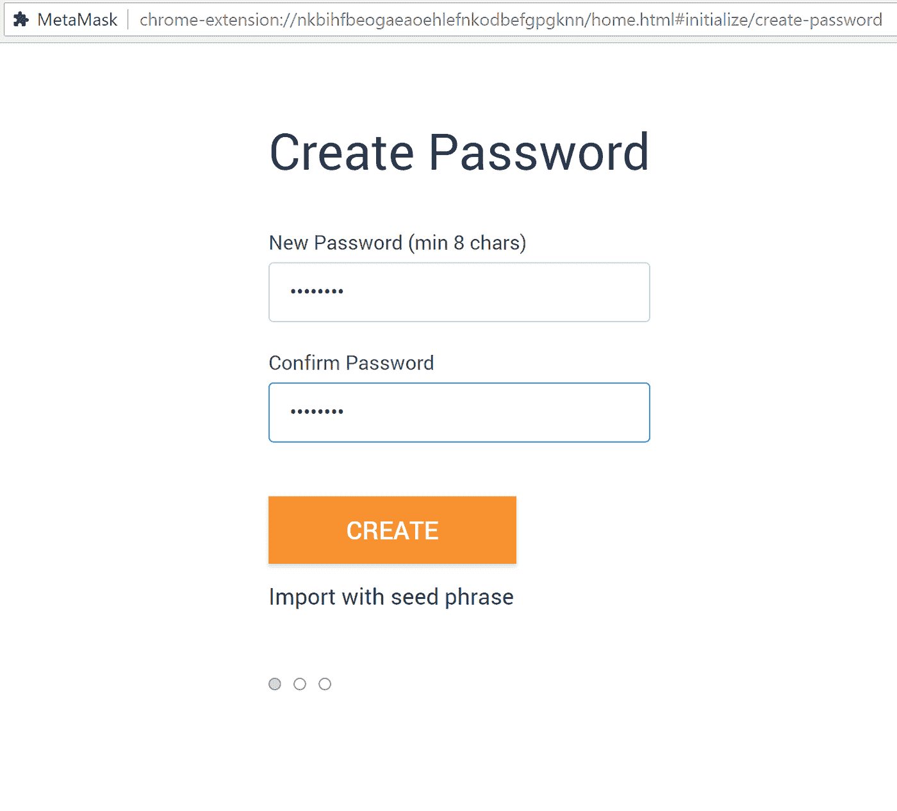
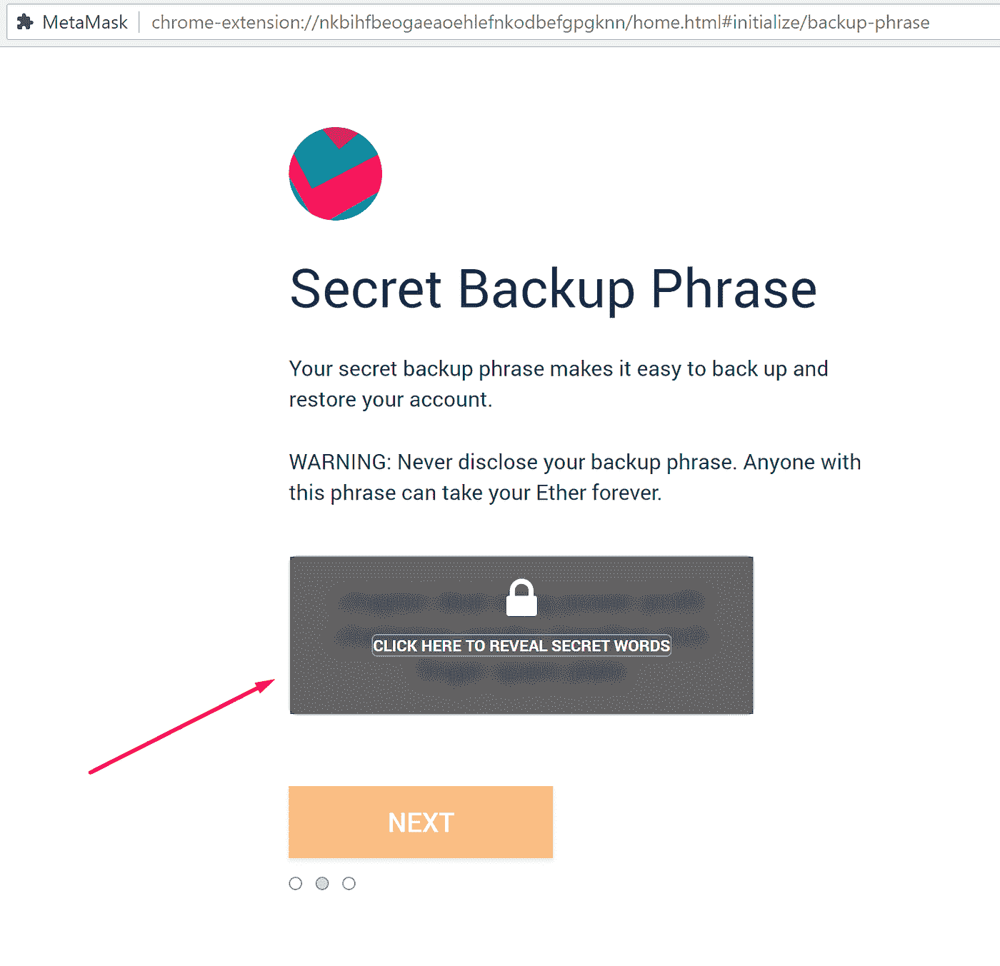
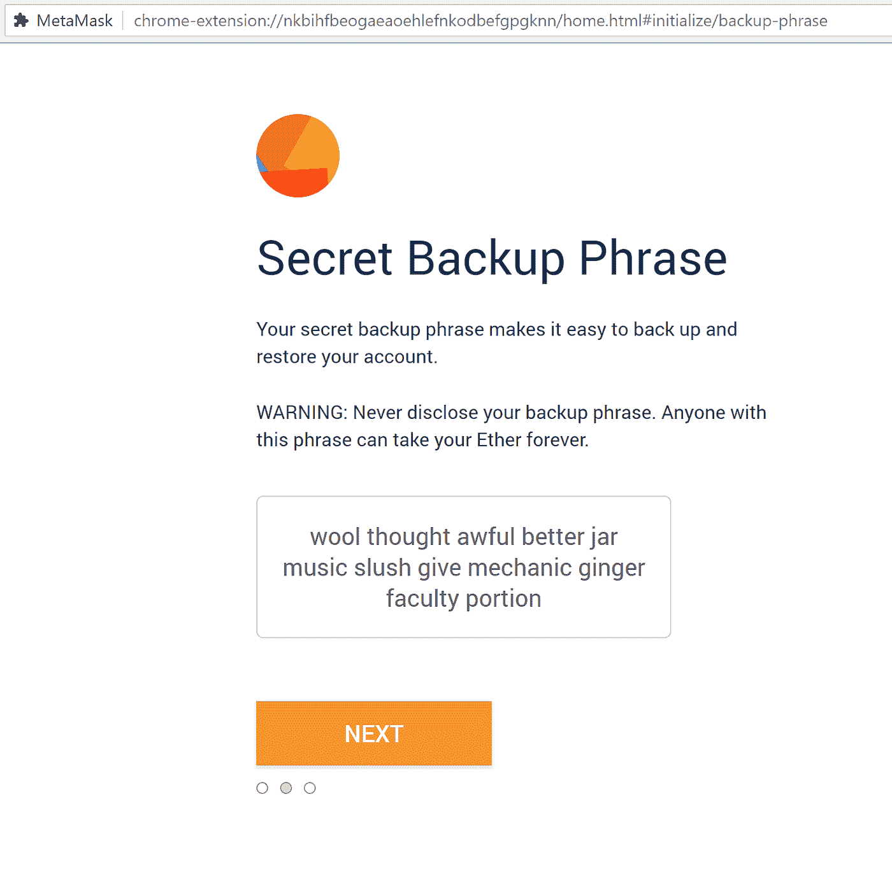
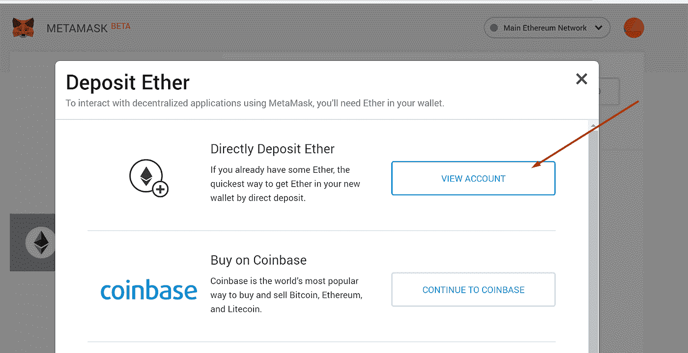

# 如何使用元掩码:分步指南

> 原文：<https://levelup.gitconnected.com/how-to-use-metamask-a-step-by-step-guide-f380a3943fb1>

MetaMask 是最流行的浏览器扩展之一，可以用来存储你的以太坊和其他 [ERC-20 代币](/how-to-create-a-cryptocurrency-token-15a898e2bb8d)。该扩展免费且安全，允许网络应用程序读取以太坊的区块链并与之交互。

## **第一步。在浏览器上安装 MetaMask。**

要创建一个新的钱包，你必须先安装扩展。根据你的浏览器，有不同的市场可以找到它。大多数浏览器的商店都有 MetaMask，所以不难看出，但不管怎样，这里有 [Chrome](https://chrome.google.com/webstore/detail/nkbihfbeogaeaoehlefnkodbefgpgknn) 、 [Firefox](https://addons.mozilla.org/en-US/firefox/addon/ether-metamask/) 和 [Opera](https://addons.opera.com/en/extensions/details/metamask/) 。

在本教程中，我将使用谷歌浏览器作为例子，但同样的步骤也适用于不同的浏览器。如果由于某种原因，上面的链接对您不起作用，只需在您最喜欢的搜索引擎上搜索 MetaMask Extension，您就可以在那里找到它。

*   点击**安装 MetaMask** 作为谷歌 Chrome 扩展。
*   点击**添加到 Chrome** 。
*   点击**添加扩展**。

在你的浏览器上安装扩展就是这么简单，继续阅读下一步来弄清楚如何创建一个帐户。

## **第二步。创建账户**。

*   点击右上角的扩展图标打开 MetaMask。
*   要安装最新版本，请点击**立即尝试**。
*   **点击继续**。
*   系统将提示您创建新密码。**点击创建**。

*   通过**点击下一步**继续并接受使用条款。

**点击透露密语**。您将看到一个 12 个单词的种子短语。这真的很重要，通常以数字方式存储不是一个好主意，所以慢慢来，把它写下来。

*   通过按顺序选择以前生成的短语来验证您的机密短语。**点击确认**。

仅此而已；现在您已经成功创建了元掩码帐户。已经为您创建了一个新的以太坊钱包地址。它正等着你存入资金，如果你想学习如何做到这一点，请看下面的下一步。

## **步骤三。存放资金。**

*   点击**查看账户**。

*   您现在可以看到您的公共地址并与其他人共享。MetaMask 提供了一些购买硬币的方法，但是你也可以用不同的方法来购买；你只需要你的地址。

元掩码扩展将始终出现在您浏览器的工具栏中，为您继续进入加密世界做好准备。正如您从这些步骤中看到的，它很容易访问，也很容易使用。送币也很直观；有一个大的发送按钮，其余的很容易理解。但是万一发生了什么问题，你需要恢复你的帐户，你有这个选择。首先，您必须备份它，让我们来看看如何做到这一点。

> 学习**最佳交易策略**，提升你的交易水平！

成交量分析可以说是世界上最好的交易策略之一，已经被证明是有效的。点击[此链接](https://volumeprofileformula.com/vpf-sales-funnel?affiliate_id=3864458)开始使用。

# **如何使用 seed 短语备份和恢复您的钱包？**

假设你换了浏览器或者电脑，想重新连接钱包；下面是怎么做的。首先，您必须找到您的种子短语，您应该在开始时存储它。

*   点击**账户图标**。
*   **点击设置**。
*   找到**显示种子词**并点击它。
*   输入您的密码。

现在将秘密种子短语保存在某个地方，最好不要以数字方式保存。现在备份完成了，你要做的就是学习恢复过程。

*   打开 Metamask 并使用帐户种子短语点击**导入。**
*   输入您的种子短语。
*   创建一个新的强密码。
*   **点击恢复**。

仅此而已；现在，您已经按照这些简单的步骤成功地恢复了您的帐户。就您的钱包管理而言，您现在已经完全准备好迎接加密世界了。

# 结束语

Metamask 是你通往去中心化 web 的桥梁，你必须明白如何仔细准备。希望这篇文章已经帮助你们中的一些人找到了他们需要的答案，如果你对这个过程有疑问，不要犹豫，在下面留下你的评论。我会回应你们所有人。

如果你对这篇文章有任何问题或建议，不要犹豫，在评论区留下回复。喜欢你读的东西吗？为什么不关注我的媒体简讯，这样你就不会错过我未来的任何文章了？很简单，点击[这里](https://kgabeci.medium.com/subscribe)，输入你的邮箱地址，按订阅。

你喜欢阅读媒体上的文章吗？考虑成为会员，有很多功能，你将获得所有创作者的内容，每月只需 5 美元。用[这个链接](https://kgabeci.medium.com/membership)，你也帮我出点小提成；点击成为会员，并输入您的信息。

# 分级编码

感谢您成为我们社区的一员！升级正在改变技术招聘。 [**在最好的公司**找到你最完美的工作](https://jobs.levelup.dev/talent) **。**

 [## 提升——改变招聘流程

### 🔥让软件工程师找到他们热爱的完美角色🧠寻找人才是最痛苦的部分…

作业. levelup.dev](https://jobs.levelup.dev/talent)