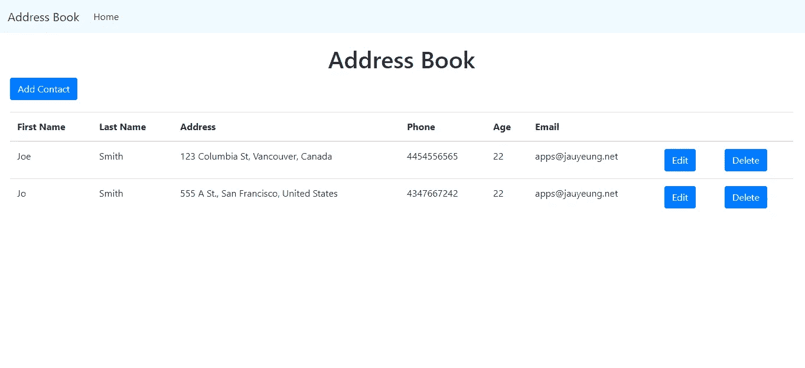
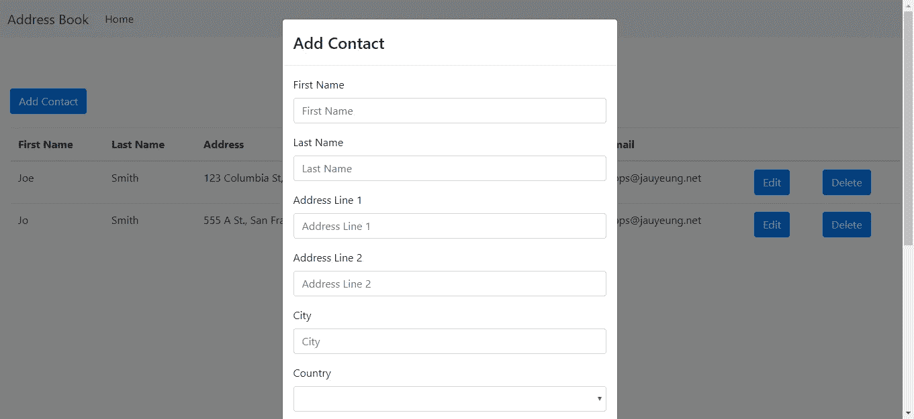
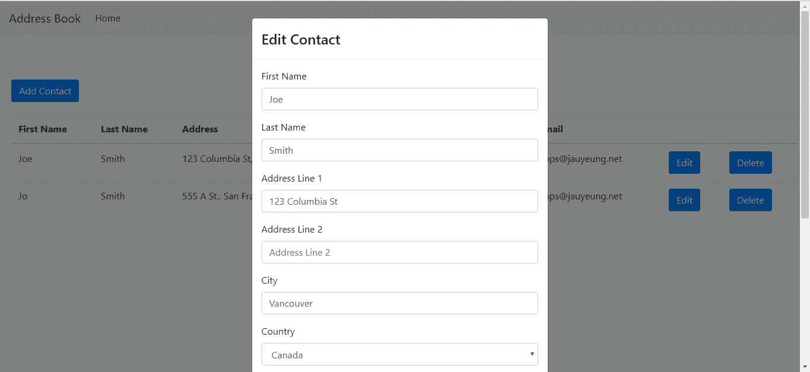

# 如何在 Angular 应用中使用 MobX 进行简单的状态管理

> 原文：<https://levelup.gitconnected.com/how-to-use-mobx-for-easy-state-management-in-your-angular-app-78e482407da8>



Angular 是一个用于构建 web 应用程序的综合前端框架。它有很多很棒的特性，比如基于组件的架构、父组件和子组件之间的通信、路由、控制路由访问的保护、共享代码的服务以及易于开发的 TypeScript。然而，它没有附带的一个大功能是应用程序的全局状态管理。

MobX 是一个简单的状态管理库。它允许任何引用 MobX 存储的代码观察值，并在值改变时触发改变。该存储区还公开了可用于设置值的函数。

要使用 MobX，您只需将存储导入到您想要使用它的组件中，因此在 NgRX/store 之前没有要添加的样板文件。这意味着状态管理比 NgRX/store 简单得多。MobX 不需要调度函数和减速器。

Angular 和 MobX 配合得非常好，因为有了 MobX-Angular 库。

在本文中，我们将构建一个在后端存储联系人的地址簿应用程序。我们使用 MobX-Angular 在组件之间共享数据。对于样式，我们使用 Ngx-Boostrap 库来样式化应用程序。

我们首先通过运行`npm i -g @angular/cli`来安装 Angular CLI。接下来，我们运行`ng new address-book-app`为我们的地址簿应用程序创建文件。一定要选择包括路线和 SCSS 的样式。

接下来，我们安装一些我们需要使用的库。我们用 MobX 和 MobX-Angular 进行状态管理，用 Ng2-Validation 进行表单验证，用 Ngx-Bootstrap 进行样式化。

安装完所有的库之后，我们运行一些命令来创建更多的代码文件。

```
ng g component contactForm
ng g component homePage
ng g class contactStore
ng g service contacts
ng g class exports
```

这将为我们的主页、联系表单和向服务器发送 HTTP 请求的服务创建文件，

现在在`contact-form.component.ts`，我们把:

```
import { Component, OnInit, Input, Output, SimpleChanges } from '[@angular/core](http://twitter.com/angular/core)';
import { COUNTRIES } from '../exports';
import { contactStore } from '../contact-store';
import { EventEmitter } from '[@angular/core](http://twitter.com/angular/core)';
import { ContactsService } from '../contacts.service';
import { NgForm } from '[@angular/forms](http://twitter.com/angular/forms)';[@Component](http://twitter.com/Component)({
  selector: 'app-contact-form',
  templateUrl: './contact-form.component.html',
  styleUrls: ['./contact-form.component.scss']
})
export class ContactFormComponent implements OnInit {
  contactData: any = <any>{};
  countries = COUNTRIES;
  store = contactStore;
  [@Input](http://twitter.com/Input)('edit') edit: boolean;
  [@Input](http://twitter.com/Input)('contact') contact: any = <any>{};
  [@Output](http://twitter.com/Output)('contactEdited') contactEdited = new EventEmitter(); constructor(
    private contactsService: ContactsService
  ) { } ngOnInit() {
  }ngOnChanges(changes: SimpleChanges) {
    if (this.contact) {
      this.contactData = Object.assign({}, this.contact);
    }
  } getPostalCodeRegex() {
    if (this.contactData.country == "United States") {
      return /^[0-9]{5}(?:-[0-9]{4})?$/;
    } else if (this.contactData.country == "Canada") {
      return /^[A-Za-z]\d[A-Za-z][ -]?\d[A-Za-z]\d$/;
    }
    return /./;
  } getPhoneRegex() {
    if (["United States", "Canada"].includes(this.contactData.country)) {
      return /^[2-9]\d{2}[2-9]\d{2}\d{4}$/;
    }
    return /./;
  } saveContact(contactForm: NgForm) {
    if (contactForm.invalid) {
      return;
    } if (this.edit) {
      this.contactsService.editContact(this.contactData)
        .subscribe(res => {
          this.getContacts();
        })
    }
    else {
      this.contactsService.addContact(this.contactData)
        .subscribe(res => {
          this.getContacts();
        })
    }
  } getContacts() {
    this.contactsService.getContacts()
      .subscribe(res => {
        this.store.setContacts(res);
        this.contactEdited.emit();
      })
  }}
```

这是联系人表单的逻辑。我们创建了一些函数，分别根据国家、`getPostalCodeRegex` 和`getPhoneRegex`来获取电话和邮政编码的正则表达式。我们还有一个保存联系人和保存后获取联系人的功能，分别是`saveContact`和`getContacts`功能。我们需要`ngOnChanges`生命周期处理程序来获取一个已有的联系人，如果它被传入的话。

每当我们获取联系人时，我们调用`this.store.setContacts`，其中`this.store`是我们将创建的 MobX 商店，它将最新的联系人数组设置到该商店。

在`contact-form.component.html`中，我们添加:

```
<form #contactForm="ngForm" (ngSubmit)="saveContact(contactForm)">
  <div class="form-group">
    <label>First Name</label>
    <input
      type="text"
      class="form-control"
      placeholder="First Name"
      #firstName="ngModel"
      name="firstName"
      [(ngModel)]="contactData.firstName"
      required
    />
    <div *ngIf="firstName.invalid && (firstName.dirty || firstName.touched)">
      <div *ngIf="firstName.errors.required">
        First Name is required.
      </div>
    </div>
  </div>
  <div class="form-group">
    <label>Last Name</label>
    <input
      type="text"
      class="form-control"
      placeholder="Last Name"
      #lastName="ngModel"
      name="lastName"
      [(ngModel)]="contactData.lastName"
      required
    />
    <div *ngIf="lastName?.invalid && (lastName.dirty || lastName.touched)">
      <div *ngIf="lastName.errors.required">
        Last Name is required.
      </div>
    </div>
  </div> <div class="form-group">
    <label>Address Line 1</label>
    <input
      type="text"
      class="form-control"
      placeholder="Address Line 1"
      #addressLineOne="ngModel"
      name="addressLineOne"
      [(ngModel)]="contactData.addressLineOne"
      required
    />
    <div
      *ngIf="
        addressLineOne?.invalid &&
        (addressLineOne.dirty || addressLineOne.touched)
      "
    >
      <div *ngIf="addressLineOne.errors.required">
        Address line 1 is required.
      </div>
    </div>
  </div> <div class="form-group">
    <label>Address Line 2</label>
    <input
      type="text"
      class="form-control"
      placeholder="Address Line 2"
      #addressLineTwo="ngModel"
      name="addressLineTwo"
      [(ngModel)]="contactData.addressLineTwo"
    />
  </div> <div class="form-group">
    <label>City</label>
    <input
      type="text"
      class="form-control"
      placeholder="City"
      #city="ngModel"
      name="city"
      [(ngModel)]="contactData.city"
      required
    />
    <div *ngIf="city?.invalid && (city.dirty || city.touched)">
      <div *ngIf="city.errors.required">
        City is required.
      </div>
      <div *ngIf="city.invalid">
        City is invalid.
      </div>
    </div>
  </div> <div class="form-group">
    <label>Country</label>
    <select
      class="form-control"
      #country="ngModel"
      name="country"
      [(ngModel)]="contactData.country"
      required
    >
      <option *ngFor="let c of countries" [value]="c.name">
        {{ c.name }}
      </option>
    </select>
    <div *ngIf="country?.invalid && (country.dirty || country.touched)">
      <div *ngIf="country.errors.required">
        Country is required.
      </div>
    </div>
  </div> <div class="form-group">
    <label>Postal Code</label>
    <input
      type="text"
      class="form-control"
      placeholder="Postal Code"
      #postalCode="ngModel"
      name="postalCode"
      [(ngModel)]="contactData.postalCode"
      required
      [pattern]="getPostalCodeRegex()"
    />
    <div
      *ngIf="postalCode?.invalid && (postalCode.dirty || postalCode.touched)"
    >
      <div *ngIf="postalCode.errors.required">
        Postal code is required.
      </div>
      <div *ngIf="postalCode.invalid">
        Postal code is invalid.
      </div>
    </div>
  </div> <div class="form-group">
    <label>Phone</label>
    <input
      type="text"
      class="form-control"
      placeholder="Phone"
      #phone="ngModel"
      name="phone"
      [(ngModel)]="contactData.phone"
      required
      [pattern]="getPhoneRegex()"
    />
    <div *ngIf="phone?.invalid && (phone.dirty || phone.touched)">
      <div *ngIf="phone.errors.required">
        Phone is required.
      </div>
    </div>
  </div> <div class="form-group">
    <label>Age</label>
    <input
      type="text"
      class="form-control"
      placeholder="Age"
      #age="ngModel"
      name="age"
      [(ngModel)]="contactData.age"
      required
      [range]="[0, 200]"
    />
    <div *ngIf="age?.invalid && (age.dirty || age.touched)">
      <div *ngIf="age.errors.required">
        Age is required.
      </div>
      <div *ngIf="age.invalid">
        Age must be between 0 and 200.
      </div>
    </div>
  </div> <div class="form-group">
    <label>Email</label>
    <input
      type="text"
      class="form-control"
      placeholder="Email"
      #email="ngModel"
      name="email"
      [(ngModel)]="contactData.email"
      required
      email
    />
    <div *ngIf="email?.invalid && (email.dirty || email.touched)">
      <div *ngIf="email.errors.required">
        Email is required.
      </div>
      <div *ngIf="email.invalid">
        Email is invalid.
      </div>
    </div>
  </div>
  <button type="submit" class="btn btn-primary">Submit</button>
</form>
```

这是联系方式本身。`email`指令由`ng2-validation`提供，用于验证电子邮件。同样，`[range]=”[0, 200]”`输入也由同一库提供，用于验证数字范围。

接下来我们在主页上工作。在`home-page.component.ts`中，我们添加:

```
import { Component, OnInit, TemplateRef } from '[@angular/core](http://twitter.com/angular/core)';
import { BsModalService, BsModalRef } from 'ngx-bootstrap/modal';
import { ContactsService } from '../contacts.service';
import { contactStore } from '../contact-store';[@Component](http://twitter.com/Component)({
  selector: 'app-home-page',
  templateUrl: './home-page.component.html',
  styleUrls: ['./home-page.component.scss']
})
export class HomePageComponent implements OnInit { modalRef: BsModalRef;
  store = contactStore;
  edit: boolean;
  contacts: any[] = [];
  selectedContact: any = <any>{};
  constructor(
    private modalService: BsModalService,
    private contactsService: ContactsService
  ) { } openModal(addTemplate: TemplateRef<any>) {
    this.modalRef = this.modalService.show(addTemplate);
  } openEditModal(editTemplate: TemplateRef<any>, contact) {
    this.selectedContact = contact;
    this.modalRef = this.modalService.show(editTemplate);
  } closeModal() {
    this.modalRef.hide();
    this.selectedContact = {};
  } ngOnInit() {
    this.contactsService.getContacts()
      .subscribe(res => {
        this.store.setContacts(res);
      })
  } deleteContact(id) {
    this.contactsService.deleteContact(id)
      .subscribe(res => {
        this.getContacts();
      })
  } getContacts() {
    this.contactsService.getContacts()
      .subscribe(res => {
        this.store.setContacts(res);
      })
  }
}
```

我们有`getContacts`函数来获取联系人，`deleteContact`函数来删除联系人，以及`openModal` / `openEditModal`函数来分别打开添加联系人和编辑联系人模式。`closeModal`功能用于关闭从`ContactFormComponent`发出的`contactEdited`事件的模态。

每当我们获得联系人时，我们调用`this.store.setContacts`来将最新的联系人数组设置到存储中。

接下来，在`home-page.component.html`中，我们添加:

```
<div class="home-page" *mobxAutorun>
  <h1 class="text-center">Address Book</h1>
  <button
    type="button"
    class="btn btn-primary"
    (click)="openModal(addTemplate)"
  >
    Add Contact
  </button> <div class="table-container">
    <table class="table">
      <thead>
        <tr>
          <th>First Name</th>
          <th>Last Name</th>
          <th>Address</th>
          <th>Phone</th>
          <th>Age</th>
          <th>Email</th>
          <th></th>
          <th></th>
        </tr>
      </thead>
      <tbody>
        <tr *ngFor="let c of store.contacts">
          <td>{{ c.firstName }}</td>
          <td>{{ c.lastName }}</td>
          <td>
            {{ c.addressLineOne }}, {{ c.city }},
            {{ c.country }}
          </td>
          <td>{{ c.phone }}</td>
          <td>{{ c.age }}</td>
          <td>{{ c.email }}</td>
          <td>
            <button
              type="button"
              class="btn btn-primary"
              (click)="openEditModal(editTemplate, c)"
            >
              Edit
            </button>
          </td>
          <td>
            <button
              type="button"
              class="btn btn-primary"
              (click)="deleteContact(c.id)"
            >
              Delete
            </button>
          </td>
        </tr>
      </tbody>
    </table>
  </div>
</div><ng-template #addTemplate>
  <div class="modal-header">
    <h4 class="modal-title pull-left">Add Contact</h4>
  </div>
  <div class="modal-body">
    <app-contact-form
      (contactEdited)="closeModal()"
      [edit]="false"
    ></app-contact-form>
  </div>
</ng-template><ng-template #editTemplate>
  <div class="modal-header">
    <h4 class="modal-title pull-left">Edit Contact</h4>
  </div>
  <div class="modal-body">
    <app-contact-form
      (contactEdited)="closeModal()"
      [edit]="true"
      [contact]='selectedContact'
    ></app-contact-form>
  </div>
</ng-template>
```

我们有一个表格来显示联系人列表。`*ngFor=”let c of store.contacts”`指令位于`tr`标签中，用于遍历联系人，将他们存储在我们的 MobX 存储中。

`ng-template`组件是由`ngx-bootstrap`提供的模态。我们有`addTemplate`用于使用联系人表单添加联系人，还有`editTemplate`用于显示相同的表单进行编辑。

在`home-page.component.scss`中，我们添加:

```
.home-page {
    padding: 20px;
}.table-container {
    margin-top: 20px;
}
```

在`app-routing.module.ts`中，我们通过运行 Angular CLI 向导时包含路由来获得，我们输入:

```
import { NgModule } from '[@angular/core](http://twitter.com/angular/core)';
import { Routes, RouterModule } from '[@angular/router](http://twitter.com/angular/router)';
import { HomePageComponent } from './home-page/home-page.component';const routes: Routes = [
  { path: '', component: HomePageComponent },
];[@NgModule](http://twitter.com/NgModule)({
  imports: [RouterModule.forRoot(routes)],
  exports: [RouterModule]
})
export class AppRoutingModule { }
```

这允许用户导航到主页。

在`app.component.html`中，我们将现有代码替换为:

```
<nav class="navbar navbar-expand-lg navbar-light bg-light">
  <a class="navbar-brand" href="#">Address Book</a>
  <button
    class="navbar-toggler"
    type="button"
    data-toggle="collapse"
    data-target="#navbarSupportedContent"
    aria-controls="navbarSupportedContent"
    aria-expanded="false"
    aria-label="Toggle navigation"
  >
    <span class="navbar-toggler-icon"></span>
  </button> <div class="collapse navbar-collapse" id="navbarSupportedContent">
    <ul class="navbar-nav mr-auto">
      <li class="nav-item active">
        <a class="nav-link" href="#">Home </a>
      </li>
    </ul>
  </div>
</nav>
<router-outlet></router-outlet>
```

在这里，我们添加了引导导航栏，用于显示应用程序标题和导航链接。

接下来在`app.module.ts`中，我们将现有代码替换为:

```
import { BrowserModule } from '[@angular/platform-browser](http://twitter.com/angular/platform-browser)';
import { NgModule } from '[@angular/core](http://twitter.com/angular/core)';
import { FormsModule } from '[@angular/forms](http://twitter.com/angular/forms)';
import { HttpClientModule } from '[@angular/common](http://twitter.com/angular/common)/http';
import { AppRoutingModule } from './app-routing.module';
import { AppComponent } from './app.component';
import { HomePageComponent } from './home-page/home-page.component';
import { ContactFormComponent } from './contact-form/contact-form.component';
import { ModalModule } from 'ngx-bootstrap/modal';
import { CustomFormsModule } from 'ng2-validation'
import { MobxAngularModule } from 'mobx-angular';
import { ContactsService } from './contacts.service';[@NgModule](http://twitter.com/NgModule)({
  declarations: [
    AppComponent,
    HomePageComponent,
    ContactFormComponent
  ],
  imports: [
    BrowserModule,
    AppRoutingModule,
    FormsModule,
    HttpClientModule,
    CustomFormsModule,
    ModalModule.forRoot(),
    MobxAngularModule
  ],
  providers: [
    ContactsService
  ],
  bootstrap: [AppComponent]
})
export class AppModule { }
```

这包括我们用于构建应用程序的所有库以及我们生成的代码。

然后我们创建 MobX 商店。在`contact-store.ts`中，我们添加:

```
import { observable, action } from 'mobx-angular';class ContactStore {
    [@observable](http://twitter.com/observable) contacts = [];
    [@action](http://twitter.com/action) setContacts(contacts) {
        this.contacts = contacts;
    }
}export const contactStore = new ContactStore();
```

店面很简单。它有一个我们用`observable`装饰器装饰的`contacts`数组，这样当我们在代码中引用它时，它将总是被更新。`setContacts`函数让我们设置`contacts`数组的值，该值将被传播给引用它的任何代码，因为我们在它前面有`observable`装饰器。`action`装饰器意味着我们指定函数能够更新商店中的`observable`值。

我们导出商店的实例，我们在组件中引用`contactStore`的地方使用它。

接下来在`contact.service.ts`中，我们添加:

```
import { Injectable } from '[@angular/core](http://twitter.com/angular/core)';
import { HttpClient } from '[@angular/common](http://twitter.com/angular/common)/http';
import { environment } from 'src/environments/environment';[@Injectable](http://twitter.com/Injectable)({
  providedIn: 'root'
})
export class ContactsService {constructor(
    private http: HttpClient
  ) { } getContacts() {
    return this.http.get(`${environment.apiUrl}/contacts`);
  } addContact(data) {
    return this.http.post(`${environment.apiUrl}/contacts`, data);
  } editContact(data) {
    return this.http.put(`${environment.apiUrl}/contacts/${data.id}`, data);
  } deleteContact(id) {
    return this.http.delete(`${environment.apiUrl}/contacts/${id}`);
  }
}
```

这让我们向后端发出 HTTP 请求来操作联系人。

在`exports.ts`中，我们添加:

```
export const COUNTRIES = [
    { "name": "Afghanistan", "code": "AF" },
    { "name": "Aland Islands", "code": "AX" },
    { "name": "Albania", "code": "AL" },
    { "name": "Algeria", "code": "DZ" },
    { "name": "American Samoa", "code": "AS" },
    { "name": "AndorrA", "code": "AD" },
    { "name": "Angola", "code": "AO" },
    { "name": "Anguilla", "code": "AI" },
    { "name": "Antarctica", "code": "AQ" },
    { "name": "Antigua and Barbuda", "code": "AG" },
    { "name": "Argentina", "code": "AR" },
    { "name": "Armenia", "code": "AM" },
    { "name": "Aruba", "code": "AW" },
    { "name": "Australia", "code": "AU" },
    { "name": "Austria", "code": "AT" },
    { "name": "Azerbaijan", "code": "AZ" },
    { "name": "Bahamas", "code": "BS" },
    { "name": "Bahrain", "code": "BH" },
    { "name": "Bangladesh", "code": "BD" },
    { "name": "Barbados", "code": "BB" },
    { "name": "Belarus", "code": "BY" },
    { "name": "Belgium", "code": "BE" },
    { "name": "Belize", "code": "BZ" },
    { "name": "Benin", "code": "BJ" },
    { "name": "Bermuda", "code": "BM" },
    { "name": "Bhutan", "code": "BT" },
    { "name": "Bolivia", "code": "BO" },
    { "name": "Bosnia and Herzegovina", "code": "BA" },
    { "name": "Botswana", "code": "BW" },
    { "name": "Bouvet Island", "code": "BV" },
    { "name": "Brazil", "code": "BR" },
    { "name": "British Indian Ocean Territory", "code": "IO" },
    { "name": "Brunei Darussalam", "code": "BN" },
    { "name": "Bulgaria", "code": "BG" },
    { "name": "Burkina Faso", "code": "BF" },
    { "name": "Burundi", "code": "BI" },
    { "name": "Cambodia", "code": "KH" },
    { "name": "Cameroon", "code": "CM" },
    { "name": "Canada", "code": "CA" },
    { "name": "Cape Verde", "code": "CV" },
    { "name": "Cayman Islands", "code": "KY" },
    { "name": "Central African Republic", "code": "CF" },
    { "name": "Chad", "code": "TD" },
    { "name": "Chile", "code": "CL" },
    { "name": "China", "code": "CN" },
    { "name": "Christmas Island", "code": "CX" },
    { "name": "Cocos (Keeling) Islands", "code": "CC" },
    { "name": "Colombia", "code": "CO" },
    { "name": "Comoros", "code": "KM" },
    { "name": "Congo", "code": "CG" },
    { "name": "Congo, The Democratic Republic of the", "code": "CD" },
    { "name": "Cook Islands", "code": "CK" },
    { "name": "Costa Rica", "code": "CR" },
    {
        "name": "Cote D\"Ivoire", "code": "CI"
    },
    { "name": "Croatia", "code": "HR" },
    { "name": "Cuba", "code": "CU" },
    { "name": "Cyprus", "code": "CY" },
    { "name": "Czech Republic", "code": "CZ" },
    { "name": "Denmark", "code": "DK" },
    { "name": "Djibouti", "code": "DJ" },
    { "name": "Dominica", "code": "DM" },
    { "name": "Dominican Republic", "code": "DO" },
    { "name": "Ecuador", "code": "EC" },
    { "name": "Egypt", "code": "EG" },
    { "name": "El Salvador", "code": "SV" },
    { "name": "Equatorial Guinea", "code": "GQ" },
    { "name": "Eritrea", "code": "ER" },
    { "name": "Estonia", "code": "EE" },
    { "name": "Ethiopia", "code": "ET" },
    { "name": "Falkland Islands (Malvinas)", "code": "FK" },
    { "name": "Faroe Islands", "code": "FO" },
    { "name": "Fiji", "code": "FJ" },
    { "name": "Finland", "code": "FI" },
    { "name": "France", "code": "FR" },
    { "name": "French Guiana", "code": "GF" },
    { "name": "French Polynesia", "code": "PF" },
    { "name": "French Southern Territories", "code": "TF" },
    { "name": "Gabon", "code": "GA" },
    { "name": "Gambia", "code": "GM" },
    { "name": "Georgia", "code": "GE" },
    { "name": "Germany", "code": "DE" },
    { "name": "Ghana", "code": "GH" },
    { "name": "Gibraltar", "code": "GI" },
    { "name": "Greece", "code": "GR" },
    { "name": "Greenland", "code": "GL" },
    { "name": "Grenada", "code": "GD" },
    { "name": "Guadeloupe", "code": "GP" },
    { "name": "Guam", "code": "GU" },
    { "name": "Guatemala", "code": "GT" },
    { "name": "Guernsey", "code": "GG" },
    { "name": "Guinea", "code": "GN" },
    { "name": "Guinea-Bissau", "code": "GW" },
    { "name": "Guyana", "code": "GY" },
    { "name": "Haiti", "code": "HT" },
    { "name": "Heard Island and Mcdonald Islands", "code": "HM" },
    { "name": "Holy See (Vatican City State)", "code": "VA" },
    { "name": "Honduras", "code": "HN" },
    { "name": "Hong Kong", "code": "HK" },
    { "name": "Hungary", "code": "HU" },
    { "name": "Iceland", "code": "IS" },
    { "name": "India", "code": "IN" },
    { "name": "Indonesia", "code": "ID" },
    { "name": "Iran, Islamic Republic Of", "code": "IR" },
    { "name": "Iraq", "code": "IQ" },
    { "name": "Ireland", "code": "IE" },
    { "name": "Isle of Man", "code": "IM" },
    { "name": "Israel", "code": "IL" },
    { "name": "Italy", "code": "IT" },
    { "name": "Jamaica", "code": "JM" },
    { "name": "Japan", "code": "JP" },
    { "name": "Jersey", "code": "JE" },
    { "name": "Jordan", "code": "JO" },
    { "name": "Kazakhstan", "code": "KZ" },
    { "name": "Kenya", "code": "KE" },
    { "name": "Kiribati", "code": "KI" },
    {
        "name": "Korea, Democratic People\"S Republic of", "code": "KP"
    },
    { "name": "Korea, Republic of", "code": "KR" },
    { "name": "Kuwait", "code": "KW" },
    { "name": "Kyrgyzstan", "code": "KG" },
    {
        "name": "Lao People\"S Democratic Republic", "code": "LA"
    },
    { "name": "Latvia", "code": "LV" },
    { "name": "Lebanon", "code": "LB" },
    { "name": "Lesotho", "code": "LS" },
    { "name": "Liberia", "code": "LR" },
    { "name": "Libyan Arab Jamahiriya", "code": "LY" },
    { "name": "Liechtenstein", "code": "LI" },
    { "name": "Lithuania", "code": "LT" },
    { "name": "Luxembourg", "code": "LU" },
    { "name": "Macao", "code": "MO" },
    { "name": "Macedonia, The Former Yugoslav Republic of", "code": "MK" },
    { "name": "Madagascar", "code": "MG" },
    { "name": "Malawi", "code": "MW" },
    { "name": "Malaysia", "code": "MY" },
    { "name": "Maldives", "code": "MV" },
    { "name": "Mali", "code": "ML" },
    { "name": "Malta", "code": "MT" },
    { "name": "Marshall Islands", "code": "MH" },
    { "name": "Martinique", "code": "MQ" },
    { "name": "Mauritania", "code": "MR" },
    { "name": "Mauritius", "code": "MU" },
    { "name": "Mayotte", "code": "YT" },
    { "name": "Mexico", "code": "MX" },
    { "name": "Micronesia, Federated States of", "code": "FM" },
    { "name": "Moldova, Republic of", "code": "MD" },
    { "name": "Monaco", "code": "MC" },
    { "name": "Mongolia", "code": "MN" },
    { "name": "Montenegro", "code": "ME" },
    { "name": "Montserrat", "code": "MS" },
    { "name": "Morocco", "code": "MA" },
    { "name": "Mozambique", "code": "MZ" },
    { "name": "Myanmar", "code": "MM" },
    { "name": "Namibia", "code": "NA" },
    { "name": "Nauru", "code": "NR" },
    { "name": "Nepal", "code": "NP" },
    { "name": "Netherlands", "code": "NL" },
    { "name": "Netherlands Antilles", "code": "AN" },
    { "name": "New Caledonia", "code": "NC" },
    { "name": "New Zealand", "code": "NZ" },
    { "name": "Nicaragua", "code": "NI" },
    { "name": "Niger", "code": "NE" },
    { "name": "Nigeria", "code": "NG" },
    { "name": "Niue", "code": "NU" },
    { "name": "Norfolk Island", "code": "NF" },
    { "name": "Northern Mariana Islands", "code": "MP" },
    { "name": "Norway", "code": "NO" },
    { "name": "Oman", "code": "OM" },
    { "name": "Pakistan", "code": "PK" },
    { "name": "Palau", "code": "PW" },
    { "name": "Palestinian Territory, Occupied", "code": "PS" },
    { "name": "Panama", "code": "PA" },
    { "name": "Papua New Guinea", "code": "PG" },
    { "name": "Paraguay", "code": "PY" },
    { "name": "Peru", "code": "PE" },
    { "name": "Philippines", "code": "PH" },
    { "name": "Pitcairn", "code": "PN" },
    { "name": "Poland", "code": "PL" },
    { "name": "Portugal", "code": "PT" },
    { "name": "Puerto Rico", "code": "PR" },
    { "name": "Qatar", "code": "QA" },
    { "name": "Reunion", "code": "RE" },
    { "name": "Romania", "code": "RO" },
    { "name": "Russian Federation", "code": "RU" },
    { "name": "RWANDA", "code": "RW" },
    { "name": "Saint Helena", "code": "SH" },
    { "name": "Saint Kitts and Nevis", "code": "KN" },
    { "name": "Saint Lucia", "code": "LC" },
    { "name": "Saint Pierre and Miquelon", "code": "PM" },
    { "name": "Saint Vincent and the Grenadines", "code": "VC" },
    { "name": "Samoa", "code": "WS" },
    { "name": "San Marino", "code": "SM" },
    { "name": "Sao Tome and Principe", "code": "ST" },
    { "name": "Saudi Arabia", "code": "SA" },
    { "name": "Senegal", "code": "SN" },
    { "name": "Serbia", "code": "RS" },
    { "name": "Seychelles", "code": "SC" },
    { "name": "Sierra Leone", "code": "SL" },
    { "name": "Singapore", "code": "SG" },
    { "name": "Slovakia", "code": "SK" },
    { "name": "Slovenia", "code": "SI" },
    { "name": "Solomon Islands", "code": "SB" },
    { "name": "Somalia", "code": "SO" },
    { "name": "South Africa", "code": "ZA" },
    { "name": "South Georgia and the South Sandwich Islands", "code": "GS" },
    { "name": "Spain", "code": "ES" },
    { "name": "Sri Lanka", "code": "LK" },
    { "name": "Sudan", "code": "SD" },
    { "name": "Suriname", "code": "SR" },
    { "name": "Svalbard and Jan Mayen", "code": "SJ" },
    { "name": "Swaziland", "code": "SZ" },
    { "name": "Sweden", "code": "SE" },
    { "name": "Switzerland", "code": "CH" },
    { "name": "Syrian Arab Republic", "code": "SY" },
    { "name": "Taiwan, Province of China", "code": "TW" },
    { "name": "Tajikistan", "code": "TJ" },
    { "name": "Tanzania, United Republic of", "code": "TZ" },
    { "name": "Thailand", "code": "TH" },
    { "name": "Timor-Leste", "code": "TL" },
    { "name": "Togo", "code": "TG" },
    { "name": "Tokelau", "code": "TK" },
    { "name": "Tonga", "code": "TO" },
    { "name": "Trinidad and Tobago", "code": "TT" },
    { "name": "Tunisia", "code": "TN" },
    { "name": "Turkey", "code": "TR" },
    { "name": "Turkmenistan", "code": "TM" },
    { "name": "Turks and Caicos Islands", "code": "TC" },
    { "name": "Tuvalu", "code": "TV" },
    { "name": "Uganda", "code": "UG" },
    { "name": "Ukraine", "code": "UA" },
    { "name": "United Arab Emirates", "code": "AE" },
    { "name": "United Kingdom", "code": "GB" },
    { "name": "United States", "code": "US" },
    { "name": "United States Minor Outlying Islands", "code": "UM" },
    { "name": "Uruguay", "code": "UY" },
    { "name": "Uzbekistan", "code": "UZ" },
    { "name": "Vanuatu", "code": "VU" },
    { "name": "Venezuela", "code": "VE" },
    { "name": "Viet Nam", "code": "VN" },
    { "name": "Virgin Islands, British", "code": "VG" },
    { "name": "Virgin Islands, U.S.", "code": "VI" },
    { "name": "Wallis and Futuna", "code": "WF" },
    { "name": "Western Sahara", "code": "EH" },
    { "name": "Yemen", "code": "YE" },
    { "name": "Zambia", "code": "ZM" },
    { "name": "Zimbabwe", "code": "ZW" }
]
```

这样我们就有了一个国家列表，可以在我们的联系表单中找到这些国家。

在`environment.ts`中，我们添加:

```
export const environment = {
  production: false,
  apiUrl: '[http://localhost:3000'](http://localhost:3000')
};
```

这允许我们与后端对话。

然后在`index.html`中，我们有:

```
<!DOCTYPE html>
<html lang="en">
  <head>
    <meta charset="utf-8" />
    <title>Angular Address Book App</title>
    <base href="/" /><meta name="viewport" content="width=device-width, initial-scale=1" />
    <link rel="icon" type="image/x-icon" href="favicon.ico" />
    <link
      href="[https://maxcdn.bootstrapcdn.com/bootstrap/4.0.0/css/bootstrap.min.css](https://maxcdn.bootstrapcdn.com/bootstrap/4.0.0/css/bootstrap.min.css)"
      rel="stylesheet"
    />
  </head>
  <body>
    <app-root></app-root>
  </body>
</html>
```

这将默认标题改为我们自己的，并添加了引导 CSS。

为了运行我们的应用程序，我们使用位于[https://github.com/typicode/json-server](https://github.com/typicode/json-server)的 JSON 服务器包来创建一个简单的后端，而无需编写任何代码。运行`npm i -g json-server`进行安装。

我们在根文件夹中创建一个名为`db.json`的文件，并添加:

```
{
  "contacts": []
}
```

这将自动生成我们之前在`contacts.service.ts`中指定的路线。

然后我们运行`json-server --watch db.json`来启动我们的后端，运行`ng serve`来启动我们的应用程序。

所有工作完成后，我们得到:

