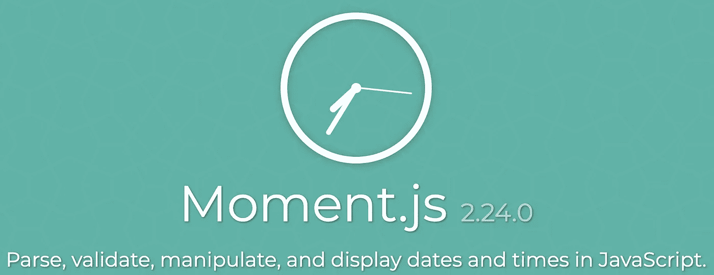

# 用 Moment.js 用普通 JavaScript 创建实时更新时钟

> 原文：<https://levelup.gitconnected.com/how-to-use-moment-js-to-create-a-live-updating-clock-in-vanilla-javascript-20ae33ef2fd1>

由 [Unsplash](https://unsplash.com/s/photos/clock?utm_source=unsplash&utm_medium=referral&utm_content=creditCopyText) 上的 [chuttersnap](https://unsplash.com/@chuttersnap?utm_source=unsplash&utm_medium=referral&utm_content=creditCopyText) 拍摄

> 我浪费了时间，现在时间也在浪费我。-威廉·莎士比亚

T 时间的概念是我们日常处理的最复杂和最普遍的事情之一。它控制着我们的日常生活，我们的活动，我们的工作，我们变老的方式，我们与世界互动的方式，以及这之间的一切。

作为程序员和开发人员，我们在心中对时间有着特殊的位置:我们喜欢在定时编码面试中流汗时时间飞逝的方式，我们喜欢在大型项目中时间(和我们的截止日期)飞逝时发出的可爱的嗖嗖声。

一个如此贴近我们心灵的概念应该有一个伟大的软件表现，对吗？多亏了我们开发伙伴的工作，我们已经有了多个免费代码包，它们为我们做了大部分工作——其中最健壮的是 JavaScript 中的 [Moment.js](https://momentjs.com/) 。

伙计们，谢谢你们及时的消息！

Moment.js 的人已经为我们做了编码方面的繁重工作，但我们今天在这篇文章中要讨论的是如何让他们的代码显示在你的个人 web 应用程序上，以及如何让它以秒、分、小时或你喜欢的任何方式动态更新，所有这些都不需要使用框架。

## 实时时钟是一种伟大而简单的方式，可以增加前端 web 应用程序的趣味，并让用户有所关注。

让我们从描述我们的网站开始。假设我们有一个简单的单页面应用程序，左边有一个侧边栏，右边有一个主“body”div，它将根据左边被单击的内容显示信息。像这样:

比方说，为了增加趣味，我们想在左上角侧边栏标题的图标下添加一个时钟(如上例)。为了做到这一点，我们需要做一些事情。

1.  从[他们的网站](https://momentjs.com/)下载或安装 Moment.js。这需要下载他们的。js 文件并把它放在你的项目目录下，或者使用 NPM/Yarn/等。如果您使用 React 或其他框架，可以使用终端命令将它安装到您的项目中。因为我们使用的是普通的 JavaScript，所以我们将使用前者。
2.  确保 Moment.js 在你的 HTML 索引页面上被调用，通过一个 *<脚本>* 标签。
3.  稍微阅读一下 [Moment.js 文档](https://momentjs.com/docs/)，了解一下你想如何使用他们的代码。这相当复杂，所以我们将保持简单的美国式日期和 HH:MM:SS 格式的显示。

现在我们可以开始让它显示在我们的页面上了！

首先，因为我们知道*我们想要时钟去哪里*，让我们在 JavaScript 文件中获取 DOM 上的那个元素，并设置它来附加我们的 Moment.js 代码。我们的侧栏 *< div >* 已经被硬编码到我们的 HTML 中，如下所示:

所以我们知道下一步是在我们的。js 文件如下:

然后，当我们使用*将我们的侧边栏信息*呈现到*中，即 *< div >* 。innerHTML* ，我们添加了一个额外的 *< div >* 来包含我们的时钟:

现在我们已经准备好为 DOM 敲响警钟了！这是有趣的部分。👍

时钟的实际呈现和更新将分两步完成。首先，我们将创建一个回调函数，当调用该函数时，它将呈现我们刚刚在上面呈现的 clock-div*
*中的时钟:

这看起来很复杂，但是我们唯一不熟悉的是 Moment.js 语法——它只是按照我们之前选择的方式来设计时钟显示的样式。你可以在他们的网站上阅读所有不同的时钟格式化方法。

现在，我们将在 JavaScript 文件的底部调用这个函数，它位于我们可能依赖的任何其他核心特性或渲染函数的下方(在本例中是 *renderSidebar()* 函数):

但是等等！我们在这里还没有完成。如果我们让它保持原样，你会看到你美丽的时钟呈现在你想要的地方，除了…它没有更新。啊哦！我们希望在页面上有这个特性的全部原因是为了有一个动态的、更新的时钟来吸引用户的注意力，而不是一个只显示用户刷新页面的时间的时钟。

谢天谢地，这是一个简单的修复。我们将使用一个名为 *setInterval()* 的 JavaScript 特性，它将允许我们按照我们设置的时间增量永久地重新运行同一个函数。在我们的渲染函数被调用后，让我们添加以下代码行:

这就是全部了！ *setInterval()* 的第一个参数告诉它再次运行哪个回调函数，后面的数字是在运行它之前要等待多长时间，以毫秒为单位。我们现在已经创建了一个计时器，每隔 **1 秒**重新呈现我们的时钟，用户将简单地看到时钟按照他们期望的方式滴答走。如果我们愿意，我们可以从时钟中删除秒显示，让它每分钟更新一次，或者每小时更新一次。

滴答，你这个疯狂的钻石。

感谢您阅读本教程。我希望你能从你的项目中学到一些新的有趣的东西，无论是个人的、专业的还是其他的。不要再浪费一秒钟了，出去享受一些有趣的编程吧！