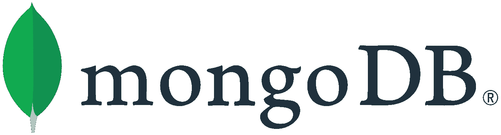

# 如何在 PHP 中使用 MongoDB

> 原文：<https://levelup.gitconnected.com/how-to-use-mongodb-with-php-db0956eb5e6b>

## 让我们给数据库模式更多的自由



资料来源:mongodb.com

对于许多应用程序来说，MongoDB 是一个很好的选择。在 PHP 世界中，我们还可以尝试一些不仅仅是 LAMP 堆栈的东西，给我们的数据库模式更多的自由。PHP 最流行的对象关系映射器(ORM)之一是 Doctrine，它恰好也是 MongoDB 的对象文档映射(ODM)的一个非常好的实现。我们不会详细讨论 NoSql 和 Sql 数据库的优缺点，而是看看如果我们已经决定使用 Mongo，如何构建一个非常简单的应用程序。

> 完整的源代码可在以下存储库中找到:

[](https://github.com/jkapuscik2/mongo-shopping-cart) [## jkapuscik2/mongo 购物车

### 在 GitHub 上创建一个帐户，为 jkapuscik2/mongo 购物车的开发做出贡献。

github.com](https://github.com/jkapuscik2/mongo-shopping-cart) 

我们需要创建一个带有 REST API 的购物车应用程序，它将允许我们:

*   向目录中添加新产品
*   更新产品名称
*   创建新的购物车
*   添加和删除购物车中的产品
*   记录产品添加到购物车的时间

我们还有一系列要求:

*   产品的价格必须为正数，并有指定的欧元、波兰兹罗提或美元货币
*   我们只能在一个篮子里有一个给定类型的单一产品，同时不超过 4 个产品

我们将使用 Symfony 框架，因为它很好地集成了 ODM 原则。我们可以通过运行以下命令来安装该库并生成基本配置:

```
composer config extra.symfony.allow-contrib truecomposer require doctrine/mongodb-odm-bundle
```

我们将访问一个数据库，就像我们在理论上访问一个 ORM 一样。我们在模型中使用注释来指示哪些类变量应该被持久化。在我们的`Product`中，我们提供名称、价格和货币作为构造函数参数。不需要太多的逻辑，所以这个类非常简单。

默认情况下，集合与使用它的模型同名。我们可以通过在`Document`注释中提供`collectionName`参数来定制这种行为。我们还可以在一个集合中存储多个不同的模型，因为 MongoDb 在数据库模式方面非常灵活。

`Product`接收执行数据正确性的验证值对象。我们不会在这里讨论这些的实现细节，可以在 [Github](https://github.com/jkapuscik2/mongo-shopping-cart) 上找到。

教条 ODM 使乐观锁定变得极其简单。该机制将通过比较`version`属性来确保没有人和我们同时修改模型。我们所要做的就是放置一个单独的`[@ODM](http://twitter.com/ODM)\Version`注释。

购物车的模型有点复杂，因为我们必须确保与添加和删除产品相关的所有规则都得到满足。我们可以在 Mongo 中存储对产品集合的引用，或者使用嵌入式文档。每种方法都有其优点和缺点。我们必须存储新产品添加的时间戳，这样嵌入的文档会更适合我们。而且，会更有效率。

我们正在使用关于产品的数据，并创建一个单独的`ShoppingCartItem`嵌入式文档。

我们可能遇到的问题是集合之间的数据同步。当有人更改产品名称时，它不会自动传播，我们会在购物篮中看到一个过时的名称。我们必须创建自己的机制来确保数据的一致性。

我们坚持使用教条文档管理器的模型。我们可以为每个模型使用一个定制的存储库，或者使用一个具有基本功能的内置存储库。为了简单起见，我们将坚持使用后者。如果我们需要更多的定制，我们将不得不在`@ODM\Document`注释中添加`repositoryClass`参数。

MongoDB 在许多用例中证明了自己非常有用，可以很好地与 PHP 配合使用。对于 PHP 项目中最常见的数据库引擎(如 MySql 或 PostgreSQL)来说，这无疑是一个有趣的选择。

## 参考资料:

[](https://www.doctrine-project.org/projects/doctrine-mongodb-odm/en/2.0/tutorials/getting-started.html#getting-started) [## 入门-教条 MongoDB 对象文档映射器(MongoDB ODM)

### 教条是一个项目，旨在以一种非干涉的方式处理你的领域模型的持久性。非关系型…

www.doctrine-project.org](https://www.doctrine-project.org/projects/doctrine-mongodb-odm/en/2.0/tutorials/getting-started.html#getting-started) [](https://symfony.com/doc/master/bundles/DoctrineMongoDBBundle/index.html) [## doctrinemongodbundle(Symfony 捆绑文档)

### MongoDB 对象文档映射器(ODM)的原理和工作方式与 Doctrine2 ORM 非常相似。在其他…

symfony.com](https://symfony.com/doc/master/bundles/DoctrineMongoDBBundle/index.html)