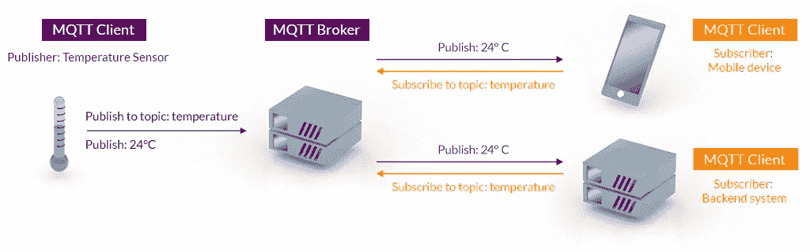
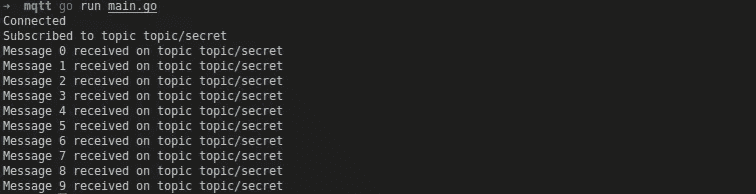

# 如何在 Go 中使用 MQTT

> 原文：<https://levelup.gitconnected.com/how-to-use-mqtt-with-go-89c617915774>

## 使用较差的网络连接任何类型的设备。


如果您以前使用过 IoT，那么您可能听说过或者甚至使用过 MQTT。当我们谈论远程设备之间交换消息时，它是首先想到的协议之一。

该协议由安迪·史丹福-克拉克和阿尔伦·尼珀于 1999 年发明，通过卫星连接石油管道。由于远程网络的带宽可能没有那么好(特别是那些时候)，所以需要一个轻量级的、最小开销的协议。

根据 [MQTT 规范](http://docs.oasis-open.org/mqtt/mqtt/v3.1.1/mqtt-v3.1.1.html):

> MQTT 是一个客户端服务器发布/订阅消息传输协议。它重量轻、开放、简单，并且被设计成易于实现。这些特性使它非常适合在许多情况下使用，包括受限环境，如机器对机器(M2M)和物联网(IoT)环境中的通信，在这些环境中需要少量代码和/或网络带宽非常宝贵。

MQTT 协议旨在实现这些目标:

*   **效率**:客户通常很小，没有多少资源。
*   轻量级:消息头很小，以优化网络带宽。
*   **可靠传递**:对于设备来说，确保消息被传递是很重要的。
*   **双向**:客户端和服务器都可以发送消息。
*   **数据不可知**:发送的消息格式无关紧要。
*   **会话**:许多物联网设备通过不可靠的网络连接，因此减少重新连接客户端的时间非常重要。
*   **安全性**:使用 TLS 加密消息很容易。

# 体系结构

MQTT 是一个[发布-订阅](https://en.wikipedia.org/wiki/Publish%E2%80%93subscribe_pattern)协议。也就是说，客户端发送消息(或发布它)而不直接知道谁将接收该消息，如果有人接收的话。同样，另一个客户端可以接收(或订阅)消息，而不知道是哪个设备发送的。

为此，必须存在一个服务器(或代理)来管理所有的连接以及将哪个消息发送给每个订阅者。



来源:[mqtt.org](https://mqtt.org/)

这样，为了发送或接收消息，发布者和订阅者只需要知道代理地址。另一个优点是，代理可以为发布时不在线的客户端传递消息。

# 转到客户端

让我们在 Go 中创建一个简单的应用程序，使用 MQTT 发送和接收消息。

> **注**:本教程使用的 Go 版本为 1.15.8 linux/amd64。

它使用`[paho.mqtt.golang](https://github.com/eclipse/paho.mqtt.golang)`作为 MQTT 客户端库，所以安装它:

```
go get github.com/eclipse/paho.mqtt.golang
```

为了测试我们的应用程序，我们需要一台服务器。你有两个选择:

*   安装您自己的，例如使用 [Mosquitto](https://mosquitto.org/) 。
*   或者使用公共服务器。你可以在这里找到可用公共服务器的列表[。如果您使用公共服务器，请记住不要发送任何敏感数据。](https://github.com/mqtt/mqtt.org/wiki/public_brokers)

> **注意**:对于这个教程，我使用的是公共服务器`[test.mosquitto](http://test.mosquitto.org/)`。

第一步是定义客户机选项，如代理、端口、客户机 id、用户名等。这是通过`mqtt.NewClientOptions`完成的。所有需要的选项将取决于您使用的代理。

在这种情况下，您还可以设置想要处理的回调。我们将设置三个回调:

1.  `OnConnect`:客户端连接到服务器时。
2.  `OnConnectionLost`:客户端与服务器断开连接时。
3.  `MessageHandler`:从服务器接收到消息时。

在所有的配置都设置好之后，我们调用`mqtt.NewClient`来创建选项。

要连接，只需调用`client.Connect()`。连接过程是在后台完成的，所以我们必须等待并确保不存在错误。

## 签署

客户端可以订阅代理中的主题。客户端将只接收发送到该主题的消息。

要订阅，调用带有三个参数的方法`client.Subscribe`:

*   `topic`:带有要订阅主题的字符串。
*   `qos`:服务质量。它必须是 0(最多一次)、1(至少一次)或 2(恰好一次)。
*   `callback`:接收到本主题消息时调用的函数。它可以是`nil`,所以只调用默认的处理程序。

## 出版

要发送消息(发布)，我们需要使用方法`client.Publish`。它接收四个参数:

*   `topic`:要发布主题的字符串。
*   `qos`:服务质量(与`Subscribe`相同的值)。
*   `retained`:布尔值，表示消息是否必须由服务器保留。It `true`，主题的最后一条消息将发送给每一个新订阅者。
*   `payload`:实际消息。

这是一个完整的代码，可以订阅一个主题并发布 10 条消息。

运行之后，您应该会得到如下输出。



图片作者。

# 加密

一些经纪人使用 TLS 来增加安全性。我们需要用服务器要求的证书创建一个`tls.Config`。

并通过方法`SetTLSConfig`将该配置添加到选项中。完整的代码如下。

> **注意**:对于 mosquitto 测试服务器，我们需要他们的证书才能连接到服务器。这里可以下载[。](http://test.mosquitto.org/ssl/mosquitto.org.crt)

# 结论

MQTT 协议非常简单，但是功能强大。只需几行代码，您就可以实现一个客户端并开始使用它。

如果您需要向资源有限的设备发送数据，MQTT 是一个完美的协议。