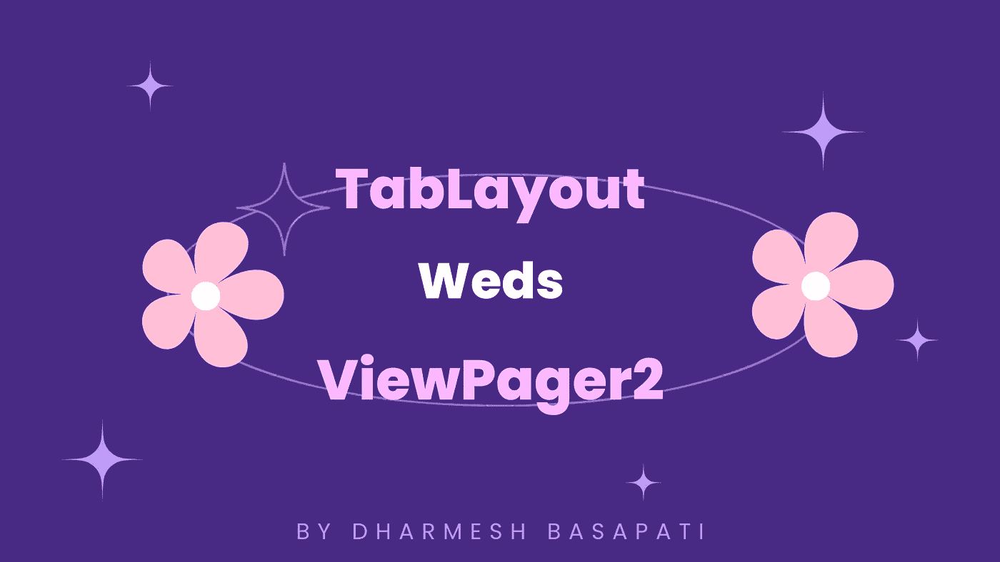

# 如何在带有 TabLayout 的 ViewPager2 中使用多个片段

> 原文：<https://levelup.gitconnected.com/how-to-use-multiple-fragments-in-viewpager2-with-tablayout-2a625d97f2>

## ANDROID |查看页面 2

作者创建的图像

作为一名 Android 开发人员，我们都知道处理多个片段有多困难，当它们需要在 ViewPager 或 TabLayout 中绑定在一起时也是如此。

这是在支持 TabLayout 的 ViewPager2 中添加多个片段的最简单方法之一

让我们开始吧:

## 步骤 1:在 XML 文件中添加 TabLayout 和 ViewPager2

要开始这个过程，只需在各自的 XML 文件中添加 TabLayout 和 ViewPager2。给他们 id，以便以后在我们的 Kotlin 文件中使用。

## 步骤 2:创建片段以保存在 ViewPager2 中

现在下一步是最显而易见的一步，即创建您的片段类和它们各自的设计文件，您想要使用它们并将其添加到 ViewPager2 中用于滑动目的。

## 步骤 3:添加 FragmentStateAdapter 类的时间—来自 ViewPager2

您可以在 activity 类之外创建这个适配器，或者只在 activity 类内部创建这个适配器**，以便将您的多个片段与您的 view page 2**和 TabLayout 绑定在一起。

可以包含任意数量的片段，但是要确保在适配器的 **getItemCount()** 方法中更新总计数。

## 步骤 4:用 view page 2 设置您的适配器，并用 view page 2 附加您的 TabLayout

这里将使用**tablayoutdeciator**方法将您的 TabLayout 附加到 ViewPager2。

您还可以看到如何在 ViewPager2 适配器变量中设置您创建的 **ScreenSlidePagerAdapter** 。

## 步骤 5:是时候在 TabLayoutMediator lambda 中给你的标签添加一些标题或图标了

正如你所看到的，我们有两个参数**标签**和**位置**，我们可以用它们来设置每个标签的标题或图标。

## 结论，

只是想和大家分享一下在我们最新的 ViewPager2 中添加多个片段的最快最简单的方法，支持 TabLayout。

让我知道这个教程是否对你有所帮助，或者只是和一些急需的人分享。

# 在那之前，

> *如果你喜欢这个故事，并且想在 Medium 上阅读我和各种顶级作家写的成千上万个这样的故事，你可以成为 Medium 会员，每月只需支付* ***5 美元*** *。如果您愿意支持我的写作，* [***使用我的推荐链接***](https://dharmeshbasapati.medium.com/membership) *，我将免费获得您的一部分会员资格。*

太棒了！！！