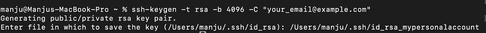
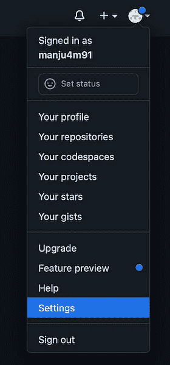
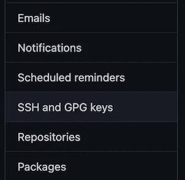
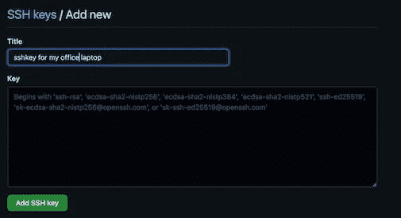

# 如何在一台机器上使用多个 GitHub 帐户

> 原文：<https://levelup.gitconnected.com/how-to-use-multiple-github-accounts-from-a-single-machine-35f6ca248519>


照片由[安吉拉 M](https://unsplash.com/@mangelinka) 拍摄。来自 [Unsplash](https://unsplash.com/photos/OVGrZBZIhzo)

如果你正在阅读这篇文章，这意味着你知道在工作和个人 GitHub 账户之间切换的痛苦。在本文中，我们将通过几个简单的步骤学习如何在一台机器上使用多个 GitHub 帐户。

我们将使用 SSH 协议来连接 GitHub 帐户。我假设你已经在用一个 GitHub 账号工作了，姑且称之为“工作账号”。而现在你想同时使用你的第二个 GitHub 账号，姑且称之为“个人账号”。事不宜迟，我们从第一步开始。

# 1.生成新的 SSH 密钥

首先为您的个人 GitHub 帐户生成一个新的 SSH 密钥。使用以下命令，将`your_email@example.com`替换为您实际的个人 GitHub 帐户电子邮件。这将创建一个新的 SSH 密钥，使用提供的电子邮件作为标签。

```
ssh-keygen -t rsa -C "*your_email@example.com*"
```

然后会提示您“输入保存密钥的文件路径”。复制并粘贴路径到你的`.ssh`文件夹，后跟文件名`id_rsa_mypersonalaccount.`

```
/Users/*<YOUR_USERNAME>*/.ssh/id_rsa_mypersonalaccount
```



为您的个人帐户生成 SSH 密钥

接下来，系统会提示您输入安全密码，在这一步之后，您的新 ssh 密钥将出现在您的`.ssh`文件夹中。

# 2.将 SSH 密钥添加到 GitHub 帐户

现在将上一步中生成的新 ssh 密钥添加到您的个人 GitHub 帐户中。

## 将 SSH 公钥复制到剪贴板

在 MAC 上:

```
pbcopy < ~/.ssh/id_rsa_mypersonalaccount.pub
```

在 Windows 上:

```
clip < ~/.ssh/id_rsa_mypersonalaccount.pub
```

在 Linux 上:

```
cat ~/.ssh/id_rsa_mypersonalaccount.pub
```

## 将复制的 ssh 密钥添加到您的 Github 帐户

1.  在任何浏览器上访问您的 GitHub 帐户。
2.  在您的 GitHub 帐户页面的右上角，点击您的个人资料照片，然后点击**设置**。
3.  在用户设置工具条中，点击 **SSH 和 GPG 键**。
4.  点击**新建 SSH 密钥或添加 SSH 密钥**。
5.  将您的密钥粘贴到“**密钥**”字段中。您可以为“**标题**字段中的关键字提供任何有意义的名称。
6.  点击**添加 SSH 密钥**，该密钥将会成功添加到您的 GitHub 账户中。



将 SSH 密钥添加到 GitHub 帐户的步骤

# 3.添加 SSH 配置文件

接下来，我们将为不同的主机添加 SSH 配置规则，说明哪个身份文件用于哪个域。

SSH 配置文件应该可以在`~/.ssh/`路径下找到。如果`config`文件已经存在，则编辑该文件，否则创建一个新文件。

将以下配置添加到此`~/.ssh/config`文件。

**账号 1(工作)**是**默认**的 GitHub 账号。您的默认 Github 帐户将会像之前一样正常工作。

“**账号 2(个人)**”与主机**g*ithub . com-mypersonalaccount***”是针对你的个人 GitHub 账号。当您想要克隆一个存储库或者为本地存储库设置远程源时，您将使用它。

# 4.为本地存储库设置远程 URL

当使用默认的 GitHub 帐户时，命令将保持不变。例如，您可以使用以下命令从您的默认 GitHub 帐户克隆一个存储库。

```
git clone git@github.com:work_account_name/repo_name.git
```

当您想从您的第二个 GitHub 帐户(个人帐户)使用存储库时，使用`github.com-mypersonalaccount` host 来访问存储库。

要从您的个人 GitHub 帐户克隆存储库:

```
git clone git@github.com-mypersonalaccount:mypersonalaccount/repo_name.git
```

您可以使用`git remote -v`验证新的远程 URL

# 5.设置 GitHub 配置用户名和电子邮件

GitHub 从提交描述附带的电子邮件 id 中识别任何提交的作者。我们必须确保在处理本地 GitHub 库时使用正确的用户名和电子邮件。

对于您的个人 GitHub 帐户，将您的本地存储库的用户名和电子邮件设置为正确的个人 GitHub 帐户。

```
git config user.name "your_personal_account_username"
git config user.email "your_email@example.com"
```

要验证是否设置了正确的配置，请使用`git config --list`

现在你可以在一台机器上使用多个 GitHub 账户了。

“生活变得简单多了，不用担心每次你想在你的个人 GitHub 项目上工作时切换 GitHub 账户。”