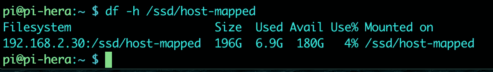

# 如何在 Kubernetes 集群中使用 NFS—配置 NFS 服务器。

> 原文：<https://levelup.gitconnected.com/how-to-use-nfs-in-kubernetes-cluster-configuring-the-nfs-server-1bf4116641d4>

顾名思义，Kubernetes 环境应该是无状态的。这样，您可以扩展您的应用程序，滚动升级，并重启崩溃的应用程序连续没有任何问题。

不幸的是，除了一些无服务器的应用程序，我们几乎需要一直保存数据。

在大多数情况下，数据必须保留到给定应用程序、pod 甚至群集的生命周期之后。为了实现这一点，Kubernetes 用户需要使用一个持久卷。

我们在 Kubernetes 中有多种选择，从节点中的本地存储到云卷。

在本系列中，我将描述使用 NFS 创建这些持久卷的 3 种不同方式。

这个题目超级广泛，所以我把内容分在以下几篇文章之间:

1.  **配置 NFS 服务器(此服务器)**
2.  [方法一——将 NFS 硬盘映射到每个节点的本地文件夹](https://fabiofernandesx.medium.com/how-to-use-nfs-in-kubernetes-cluster-method-1-4071724af37c)。
3.  [方法 2—通过永久卷配置直接连接到 NFS 服务器](https://fabiofernandesx.medium.com/how-to-use-nfs-in-kubernetes-cluster-method-2-73df4efb4c00)
4.  [创建一个存储类，通过声明自动创建一个持久卷](https://fabiofernandesx.medium.com/how-to-use-nfs-in-kubernetes-cluster-storage-class-ed1179a83817)。

# 一般注意事项

## 源代码

本文中使用的所有文件都发布在这个 GitHub 资源库中:[https://github.com/fabiofernandesx/k8s-volumes](https://github.com/fabiofernandesx/k8s-volumes)。如果您发现需要修复或添加的东西，可以随意克隆它，甚至打开一个拉请求。

## 家庭实验室

对于本系列文章，我将使用我的 raspberry pi Kubernetes 集群，但是这些命令应该可以在任何环境下工作，包括云和虚拟机。如果你对如何创建一个 raspberry pi k8s 集群感兴趣，你可以在这里找到它:[又一个 Raspberry Pi k8 的集群](https://medium.com/swlh/yet-another-raspberry-pi-k8s-cluster-ea05fb48e9a8)，或者如果你对如何使用虚拟机器创建这个集群感兴趣，你可以看看这个:[准备虚拟机器来运行 Kubernetes](https://fabiofernandesx.medium.com/preparing-virtual-box-vms-to-run-kubernetes-a31c7c851566) 。

# 配置 NFS 服务器

首先要做的是配置 NFS 服务器。我们想要导出 5 个端点:

*   /ssd/host-mapped —它将是本地磁盘中的一个文件夹，用于在集群中演示如何在每个节点上使用“映射”文件夹创建一个永久卷。
*   /ssd/direct —它也是一个文件夹，将用于演示如何创建直接访问 NFS 服务器的 PV，而无需先将文件夹映射到节点。
*   /SSD/dynamic—NFS 服务器本地磁盘中的另一个文件夹，它将被用作我们对群集的主要“最快”源。它将通过集群内的存储类使用动态 PV 创建。
*   /mnt/usb3/dynamic —这是一个插入 NFS 服务器 usb3 端口的外部驱动器，已装载并导出供群集使用。这将是另一个动态 PV 创建(通过存储类)，并将为我们的集群目的提供“中速”,具有更大的空间 tho。
*   /mnt/usb2/dynamic —与上一个类似，不同之处在于它将通过 usb2 连接，提供较慢的速度和 1TB 的空间。我不确定我会在这里分配什么，一些不常用的数据，可能是 docker 映像或备份。

所以，少说多做，让我们开始通过 ssh 连接到 NFS 服务器`***$ ssh pi@192.168.2.30***`

然后，让我们安装外部驱动器。运行:`***$ sudo fdisk -l***`我们可以检查我们的驱动器安装在哪里。如您所见，我将 usb3 3TB 驱动器连接到/dev/sdb，将 usb2 1TB 驱动器连接到/dev/sdc


如果您的外部驱动器是新的，您可以使用命令`***$ sudo mkfs.ext4 /dev/sdb***`和`***$ sudo mkfs.ext4 /dev/sdc***` ***在那里创建一个分区。***

我的不是新的，但我想从头开始，不在乎丢失那里的数据。


现在，让我们将它安装到我们在计划中选择的路径。在我的例子中,/mnt/usb3 位于/dev/sdb 上，而/mnt/usb2 位于/dev/sdc 上

我们要去 1。创建文件夹— `***$ sudo mkdir /mnt/usb2***`，2。将 pi 用户设置为文件夹的所有者`***$ sudo chown -R pi:pi /mnt/usb2***`，3 挂载它`***$ sudo mount /dev/sdc /mnt/usb2***`

您可以使用命令`***$ df -ha /dev/sdc***`验证挂载是否成功


好了，现在，我们需要在启动时自动挂载它。我们将配置“fstab”来做这件事，但是首先，我们需要使用 blkid `***$ sudo blkid***`找到我们的磁盘的唯一 id


在结果中间挖掘，你会发现 sdb 和 sdc 的 id。现在我们需要在引用这些磁盘 id 的 fstab 文件中配置挂载。

使用您选择的文本编辑器编辑 fstab，例如。`***$ sudo nano /etc/fstab***` 并在文件末尾添加新的挂载(带有您在 blkid 中找到的 id)。在我的例子中，这些线是这样的:

```
UUID=1a594e47-fcd5–41d5–8c55–174469983711 /mnt/usb3 ext4 defaults 0 0
UUID=2fd11a1f-4c26-4631-87b0-5b9b0d2b4c5a /mnt/usb2 ext4 defaults 0 0
```


然后，让我们重新启动系统，验证自动挂载是否有效。我们可以用命令检查它。`***$ df -ha /dev/sd****`


PS。:请注意，我们的外部驱动器分别更改为 sda 和 sdb，但由于我们是基于 UUID 安装的，所以这不成问题，并且驱动器安装在正确的位置

最后，我们可以配置 NFS 服务器来共享它。首先，让我们安装 NFS 服务器软件包:

```
***$ sudo apt-get install nfs-kernel-server -y***
```

并编辑文件/etc/exports 以导出我们想要共享的所有端点。只是快速刷新一下我们的记忆，我们想要共享(NFS 导出)这些文件夹:

*   /SSD/主机映射
*   /固态硬盘/直接
*   /固态硬盘/动态
*   /mnt/USB 3/动态
*   /mnt/usb2/dynamic

编辑导出文件:`***$ sudo nano /etc/exports***`并包括以下几行:

```
/ssd/host-mapped *(rw,no_root_squash,insecure,async,no_subtree_check,anonuid=1001,anongid=1001)
/ssd/direct *(rw,no_root_squash,insecure,async,no_subtree_check,anonuid=1002,anongid=1002)
/ssd/dynamic *(rw,no_root_squash,insecure,async,no_subtree_check,anonuid=1003,anongid=1003)
/mnt/usb3/dynamic *(rw,no_root_squash,insecure,async,no_subtree_check,anonuid=1004,anongid=1004)
/mnt/usb2/dynamic *(rw,no_root_squash,insecure,async,no_subtree_check,anonuid=1005,anongid=1005)
```


然后，启动 NFS 服务器`***$ sudo exportfs -ra***`

我们现在将在群集节点中安装 NFS，并在每个节点上映射 SSD/主机映射。

通过 ssh 连接到每个节点并安装 nfs-common `***$ sudo apt-get install nfs-common -y***`。

创建文件夹，将所有权传递给 pi 用户，并编辑 fstab 以自动挂载它:

```
***sudo mkdir -p /ssd/host-mapped
sudo chown -R pi:pi /ssd/host-mapped
sudo nano /etc/fstab***
```

编辑导出文件:`***$ sudo nano /etc/exports***`并包含以下行(将服务器 IP 更改为您的 NFS 服务器 IP):

```
192.168.2.30:/ssd/host-mapped  /ssd/host-mapped nfs rw 0 0
```

重启节点并使用`***$ df -h /ssd/host-mapped***`检查挂载


对所有节点重复这些步骤:



这就是 NFS 的部分。在下一篇文章中，我们将开始配置我们的持久卷，并使用这些 NFS 配置发布一个简单的网站来存储网站文件。