# 如何在 Kubernetes 集群中使用 NFS—方法 1。

> 原文：<https://levelup.gitconnected.com/how-to-use-nfs-in-kubernetes-cluster-method-1-4071724af37c>

在[上一篇文章](https://fabiofernandesx.medium.com/how-to-use-nfs-in-kubernetes-cluster-configuring-the-nfs-server-1bf4116641d4)中，我们开始了使用 NFS 服务器将我们应用程序的数据存储到 Kubernetes 集群的旅程。

我们现在有一个 k8s 集群在网络中运行，一个 NFS 服务器配置了我们需要访问的端点。在本文中，我将向您展示通过持久卷访问 NFS 的第一种方法。

# 一般注意事项

## 文章系列

本文是关于 Kubernetes 使用 NFS 服务器作为持久性卷来源的系列文章的一部分。以下是本系列的文章列表:

1.  [配置 NFS 服务器](https://fabiofernandesx.medium.com/how-to-use-nfs-in-kubernetes-cluster-configuring-the-nfs-server-1bf4116641d4)
2.  **方法 1 —将 NFS 驱动器映射到每个节点(本节点)的本地文件夹。**
3.  [方法 2 —通过永久卷配置直接连接到 NFS 服务器](https://fabiofernandesx.medium.com/how-to-use-nfs-in-kubernetes-cluster-method-2-73df4efb4c00)
4.  [创建存储类，通过声明自动创建持久卷](https://fabiofernandesx.medium.com/how-to-use-nfs-in-kubernetes-cluster-storage-class-ed1179a83817)。

## 源代码

本文中使用的所有文件都发布在这个 GitHub 资源库中:[https://github.com/fabiofernandesx/k8s-volumes](https://github.com/fabiofernandesx/k8s-volumes)。如果您发现需要修复或添加的东西，可以随意克隆它，甚至打开一个拉请求。

## 家庭实验室

对于本系列文章，我将使用我的 raspberry pi Kubernetes 集群，但是这些命令应该可以在任何环境下工作，包括云和虚拟机。如果你对如何创建一个 raspberry pi k8s 集群感兴趣，你可以在这里找到它:[又一个 Raspberry Pi k8 的集群](https://medium.com/swlh/yet-another-raspberry-pi-k8s-cluster-ea05fb48e9a8)，或者如果你对如何使用虚拟机器创建这个集群感兴趣，你可以看看这个:[准备虚拟机器来运行 Kubernetes](https://fabiofernandesx.medium.com/preparing-virtual-box-vms-to-run-kubernetes-a31c7c851566) 。

# 将 NFS 驱动器映射到每个节点的本地文件夹中。

这种方法基本上包括将 NFS 端点直接映射到每个节点内的物理文件夹中，并使用持久卷来访问该本地文件夹。

如果我们不能使用永久卷，它们就没有任何意义。因此，对于这个演示，我正在创建简单的网站(只有 HTML 和一些 CSS)。然后，我将在我们的集群中创建持久卷，并用 Nginx 容器声明这些卷。

在这个系列文章中，我将展示和使用前三个网站；毕竟，除了 NFS 端点，其他两个需要相同的配置。

我开始创建我们的网站。它们本质上是相同的，只是标题和文本不同。

可以在 Github 库[这里](https://github.com/fabiofernandesx/k8s-volumes)找到。

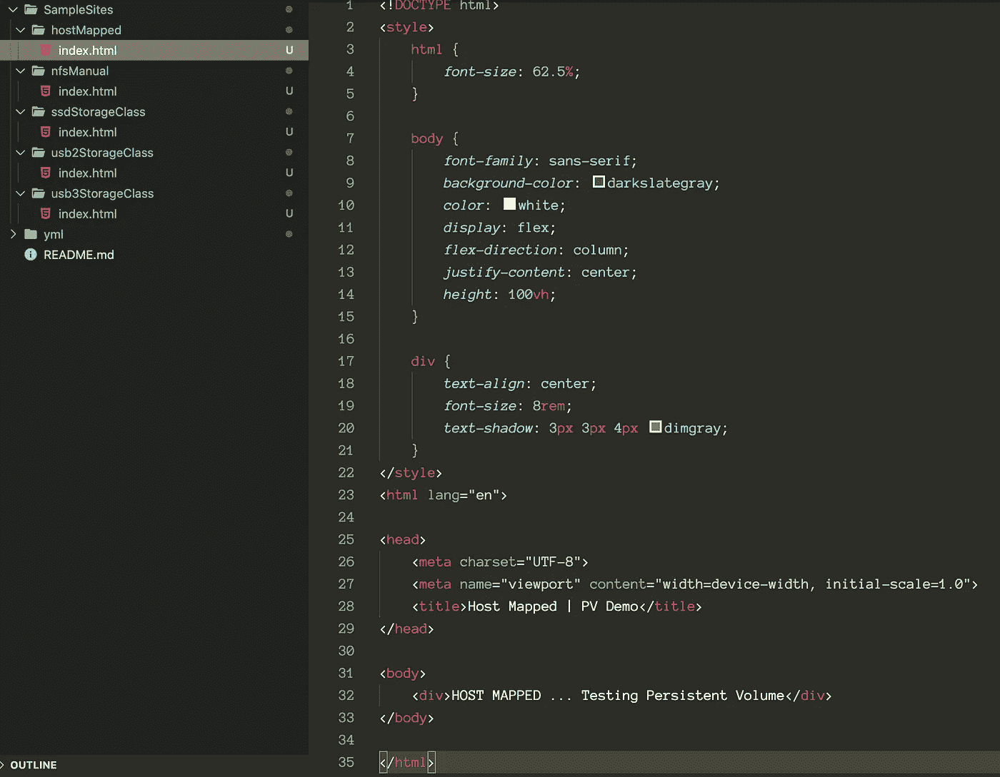

好了，现在让我们开始创建持久卷。请记住，PV 与名称空间无关，所有持久卷都是在名称空间之外创建的，任何应用程序都可以声明一个 PV。但是我们会成功的。

让我们创建第一个卷文件。它将使用已经在所有节点`/ssd/host-mapped`中映射的文件夹(如果您需要关于如何进行此映射的更多信息，请参见这里的)并创建一个 10MB 的卷供我们的应用程序使用。

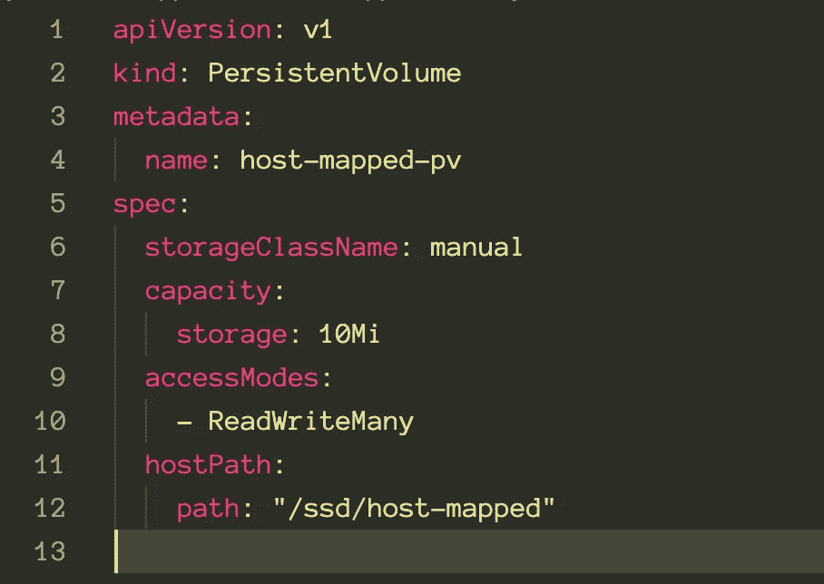

注意我们使用的是`storageClassName: manual`,它没有任何意义，你可以随意标记。在这种情况下，它将帮助 k8s 将索赔与最合适的持久卷相匹配。

现在，只需运行`kubectl apply`命令并用`kubectl get pv`检查 PV

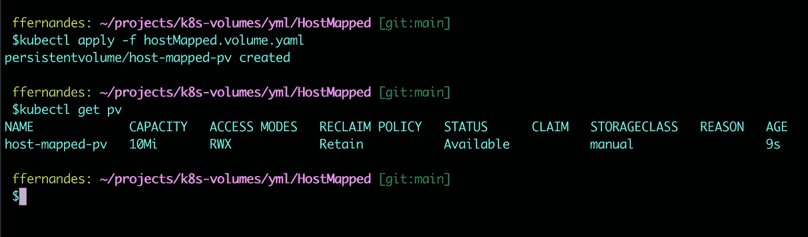

正如您在图像中看到的，卷已创建，但尚未绑定到任何东西(一旦我们创建了声明，就会绑定到任何东西)

为了使这个 PV 可用，我们需要为我们的应用程序声明这个空间。与 PV 不同，永久卷声明(PVC)可以是名称空间的一部分。然后，让我们首先为这个演示创建一个命名空间，然后创建一个 PVC 来使用这个 10MB 的可用存储空间。

我们可以通过命令来创建名称空间，但我更喜欢创建单独的文件，以使一切都有良好的文档记录并易于理解。我们可以将多个配置放在一个文件中，但是现在我将展示如何在单独的文件中创建所有内容。

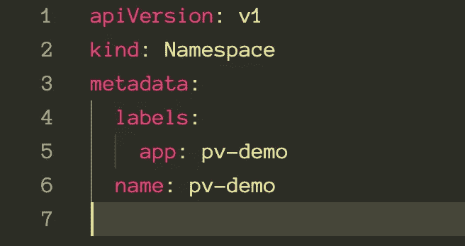

如您所见，名称空间 yml 文件是“不言自明的”

同样的事情再次发生，运行`kubectl apply`命令，然后`kubectl get namespaces`检查它是否被创建

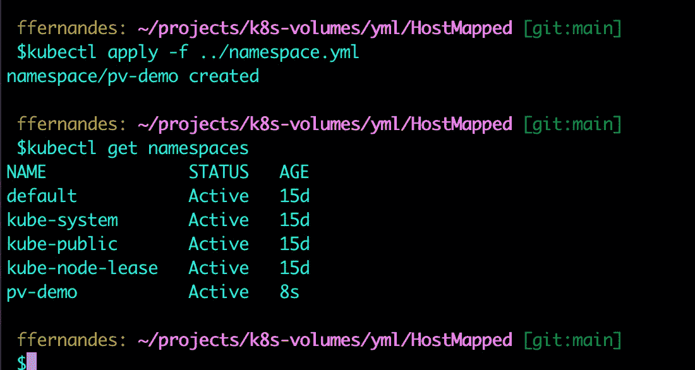

现在我们可以在这个名称空间下创建一个 PVC:

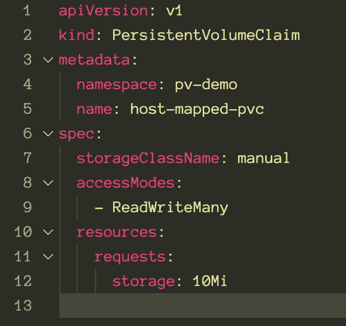

应用该文件并重新检查 PV。PV 必须与我们的索赔绑定。

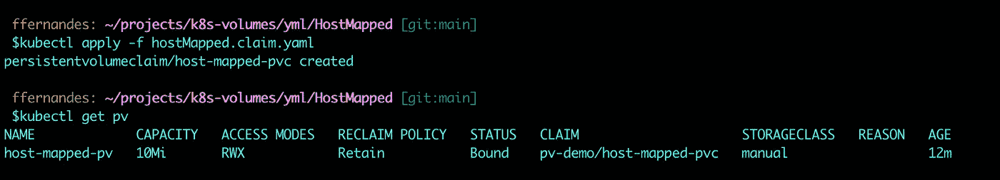

同样的事情从另一方面来说，寻找 PVC 的信息:

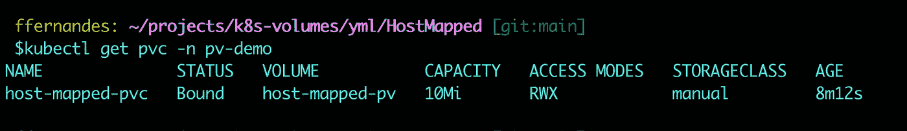

现在，我们准备创建一个容器来使用这个 PVC。我们将创建一个指向该文件夹的 Nginx 应用程序，然后将我们的 HTML 复制到那里。

该网站必须在这一点上可用。

以下是站点应用程序部署 yml 文件:

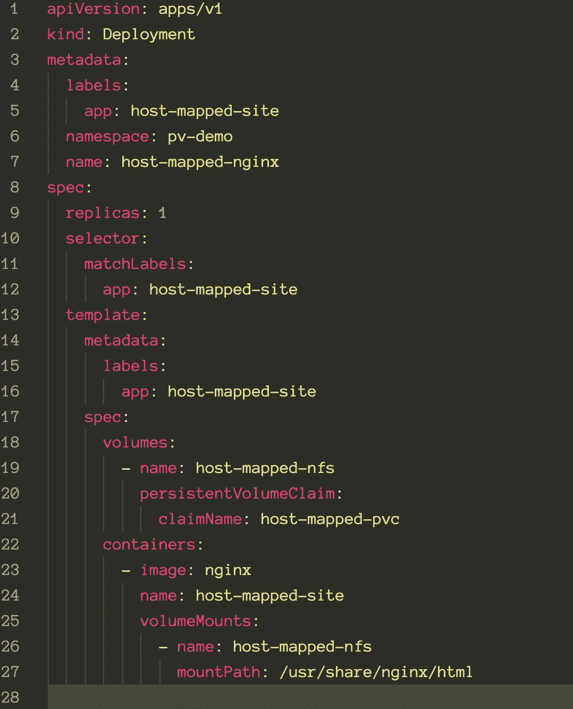

只是比别人啰嗦一点。让我来引导您浏览内容:

第 1–7 行:基本内容，这里我使用一个部署配置，位于名为 host-mapped-ngnix 的 pv-demo 名称空间下。我还添加了一个标签 host-mapped-site，它将成为该配置文件其余部分的链接。

第 9 行:我告诉 k8s 只部署这个容器的一个副本

第 18–21 行:我正在设置要使用的卷声明，并给它命名

第 22–27 行:是容器本身，我们想要使用什么样的映像(在本例中是 Nginx)，什么样的卷挂载，以及它在容器中的映射方式。所以我们告诉大家，主机映射 pvc 中的所有内容都将被映射为容器中的一个文件夹`/usr/share/nginx/html`。

这正是我们发布页面所需要的；Nginx 会转到这个文件夹显示默认网站。

我们还可以在容器中映射另一个文件夹，比如配置和图像到同一个 PVC 或另一个 PVC。在我们的例子中，我们只需要一个地方来存储一个简单的 HTML，但是你得到了这个想法。

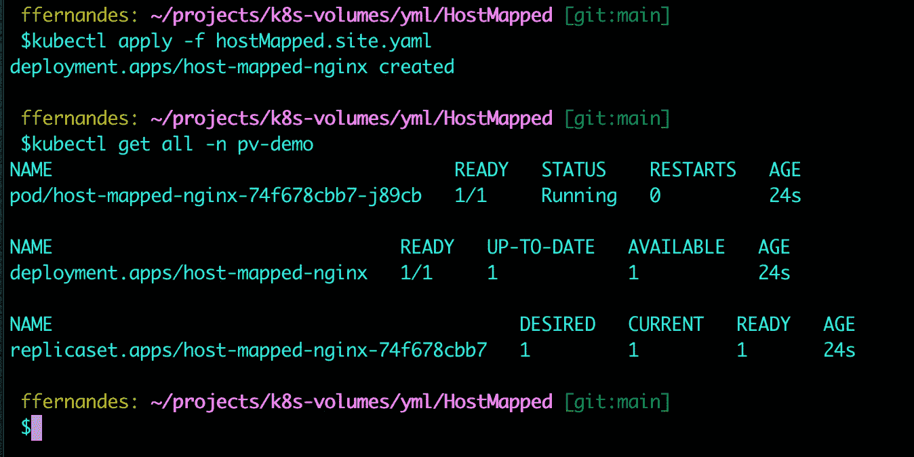

如上图所示，部署、副本集和 pod(容器)已经创建并运行。

最后一步是将我们的页面复制到 NFS 服务器的文件夹中。你可以按你想的方式做。在这里，我将使用 SCP 通过命令行直接创建这个副本。

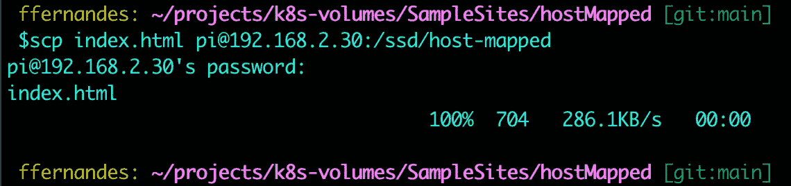

虽然这不是持久卷的范围，我们仍然需要 2 个以上的文件，使网站可见，并证明它正在工作。

这个拼图的第一块是服务。k8 的集群通过网络服务连接。它有很多优点，但我不想在这里过于深入的理论。

无论如何，我们需要这个服务基本上运行在 pod(或多个 pod)之上，它将把所有的传入流量(内部)定向到正确的容器。

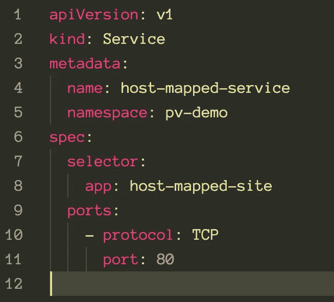

配置文件很简单，是一个名为 host-mapped-service 的服务，与之前使用的名称空间相同。

这里重要的细节是选择器部分；注意，我使用的是在部署配置文件中定义的应用程序名称，以及我们希望流量流动的协议和端口。

你知道这个练习，用`kubectl apply -f`命令应用这个文件:

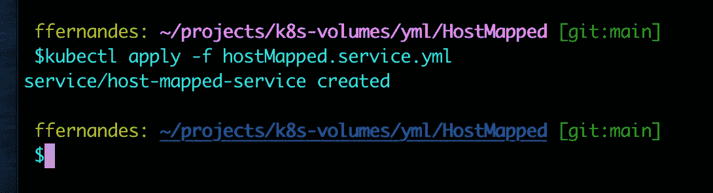

现在，我们需要配置入口，使我们的网站完全工作。

要配置我们的入口文件，我们首先需要知道负载平衡器正在使用什么外部 IP。输入 kubectl get services -A，您将能够看到在所有名称空间中发布的服务。

与我们相关的是负载平衡器的类型，然后检查分配给它的外部 IP。在我的例子中是主节点的 IP:192 . 168 . 2 . 101

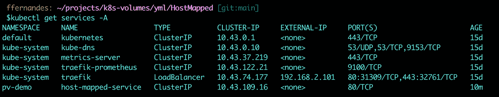

如你所见，我使用的是随 k3s 安装的默认负载平衡器应用程序:traefik。这个信息很重要，因为入口配置文件需要特定于它。

我不打算用一个“招数”来规避 DNS 配置；毕竟，我的集群没有暴露在本地网络之外，所以这里不允许使用 DNS。

但是我们有 [nip.io](http://nip.io) 。基本上，你可以用<或>创建一个“即时”DNS。<你要路由的 IP>. nip . io

对于这个例子，我使用[主机映射. 192.168.2.101.nip.io](http://host-mapped.192.168.2.101.nip.io) 来访问我的负载平衡器，它可以使用额外的信息(主机映射)将流量定向到集群内我的主机映射服务，然后定向到响应我的应用程序的 pod 和容器。

有时候解释比展示更难。如果你有任何问题或者想澄清某一点，请告诉我。

最终的入口配置文件应该是这样的:

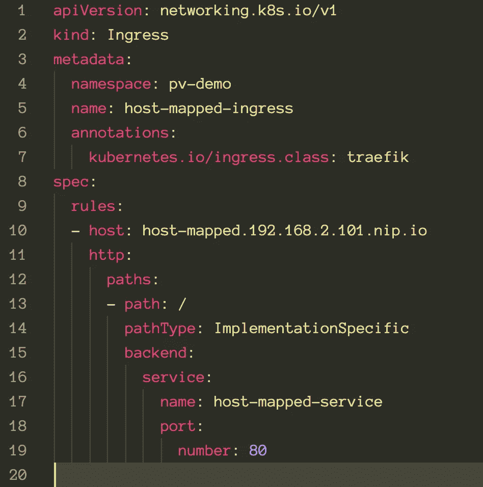

基本上，我告诉集群将任何对[主机映射. 192.168.2.101.nip.io](http://host-mapped.192.168.2.101.nip.io) 的调用重定向到端口 80 的主机映射服务。

让我们应用它，我们的网站应该是可见的。

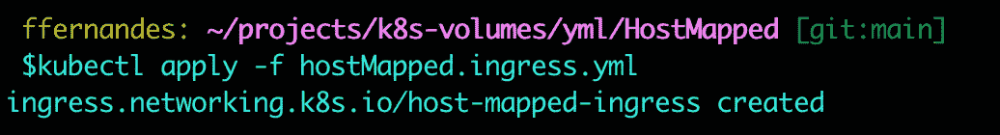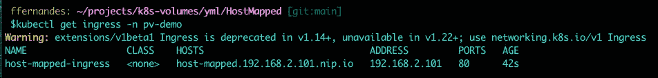

一切都好；在浏览器中输入[http://host-mapped.192.168.2.101.nip.io/](http://host-mapped.192.168.2.101.nip.io/)应该会指引我们到那个网站。

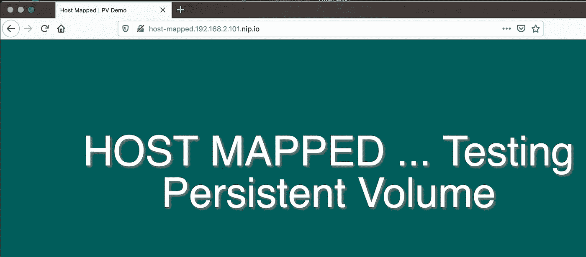

这就是在 Kubernetes 中使用 NFS 服务器和持久卷的第一种方式。

这种方法非常好，但是有一些缺点:

*   如果您更改了 NFS 服务器中的任何内容，您必须单独配置节点(通过命令和编辑文件)
*   对于每个需要永久卷的应用程序，您必须手动配置它。

我们的下一个方法消除了第一项。