# 如何在 Kubernetes 集群中使用 NFS—方法 2。

> 原文：<https://levelup.gitconnected.com/how-to-use-nfs-in-kubernetes-cluster-method-2-73df4efb4c00>

在[上一篇文章](/how-to-use-nfs-in-kubernetes-cluster-method-1-4071724af37c)中，我们讨论了使用 NFS 服务器在 Kubernetes 集群中存储应用数据的最常见方法之一。

该方法的一个缺点是，在创建永久卷之前，必须在每个节点中手动配置文件夹映射。管理起来很繁琐，有时甚至比应该管理的还要复杂

本文将展示连接到 NFS 服务器的第二种方法，只通过持久性卷配置。

# 一般注意事项

# 文章系列

本文是关于 Kubernetes 使用 NFS 服务器作为持久性卷来源的系列文章的一部分。以下是本系列的文章列表:

1.  [配置 NFS 服务器](https://fabiofernandesx.medium.com/how-to-use-nfs-in-kubernetes-cluster-configuring-the-nfs-server-1bf4116641d4)
2.  [方法一——将 NFS 硬盘映射到每个节点的本地文件夹](/how-to-use-nfs-in-kubernetes-cluster-method-1-4071724af37c)
3.  **方法 2 —通过永久卷配置(本例)直接连接到 NFS 服务器**
4.  [创建存储类，通过声明自动创建持久卷](https://fabiofernandesx.medium.com/how-to-use-nfs-in-kubernetes-cluster-storage-class-ed1179a83817)。

# 源代码

本文中使用的所有文件都发布在这个 GitHub 资源库中:[https://github.com/fabiofernandesx/k8s-volumes](https://github.com/fabiofernandesx/k8s-volumes)。如果您发现需要修复或添加的东西，可以随意克隆它，甚至打开一个拉请求。

# 家庭实验室

对于本系列文章，我将使用我的 raspberry pi Kubernetes 集群，但是这些命令应该可以在任何环境下工作，包括云和虚拟机。如果你对如何创建一个 raspberry pi k8s 集群感兴趣，你可以在这里找到它:[又一个 Raspberry Pi k8 的集群](https://medium.com/swlh/yet-another-raspberry-pi-k8s-cluster-ea05fb48e9a8)，或者如果你对如何使用虚拟机器创建这个集群感兴趣，你可以看看这个:[准备虚拟机器来运行 Kubernetes](https://fabiofernandesx.medium.com/preparing-virtual-box-vms-to-run-kubernetes-a31c7c851566) 。

# **通过永久卷配置直接连接到 NFS 服务器**

好了，让我们看看使用 NFS 服务器在 k8s 集群中创建持久卷的第二种方法。

这里我们需要更改的唯一配置是 PV 配置本身。让我们快速回顾一下 k8 的对象配置，我们需要使用持久卷来部署一个简单的网站:

1.  持久卷配置—在这里，我们在磁盘中分配一个空间供我们的应用程序使用(申请)。它可以是本地驱动器、云中的虚拟空间，或者在我们的例子中，是由 NFS 服务器共享的端点。
2.  名称空间—除了不能有名称空间的永久卷之外，所有其他对象都可以有名称空间。因此，对于一个更好的组织来说，在名称空间中对事物进行分组总是好的。
3.  永久声明—此配置将永久卷“绑定”到声明。该声明将被部署使用。
4.  部署——是应用程序本身，在我们的例子中，是一个 Nginx 应用程序来演示持久性卷的使用。这种配置利用了声明。
5.  服务——随着我们的应用程序的运行，我们需要向外界公开它。该服务将请求发送到容器中。
6.  入口——它基本上是我们应用程序的入口点。我们可以配置一个端口服务，将端口直接暴露在服务配置中。但是最常见的情况是使用 DNS 和 ingress。

以下是 PV 配置文件:

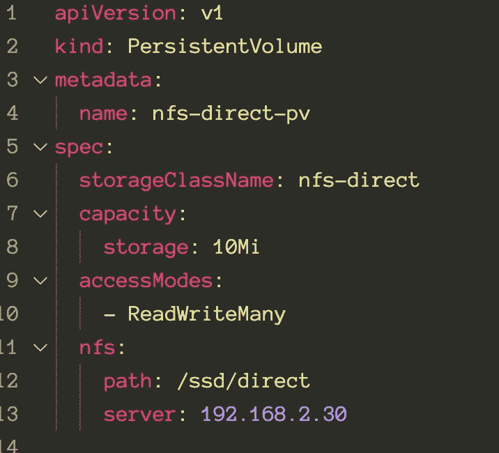

如您所见，唯一的区别是我们将它直接指向 NFS 服务器，而不是主机中的映射/装载。我还为存储类使用了不同的名称，以确保匹配的声明是我们想要的。这里的任何名称(不同于我们之前使用的名称)都可以。

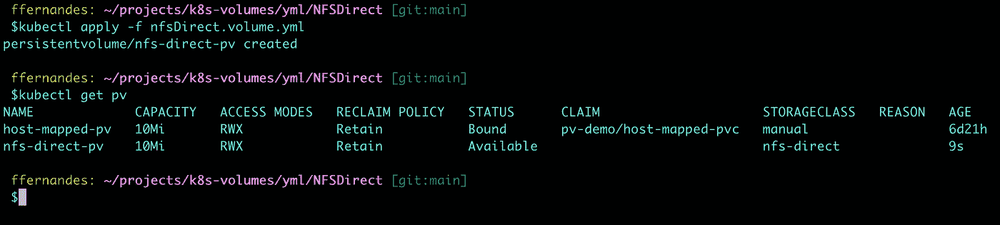

其他部分与我们在第一种方法中创建的部分非常相似(注意存储类名)

聚氯乙烯:

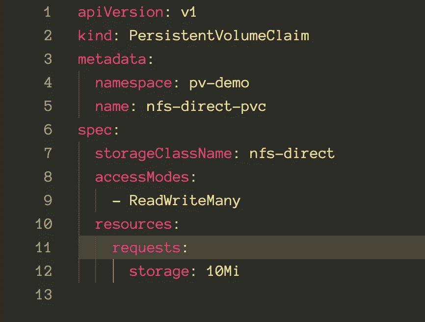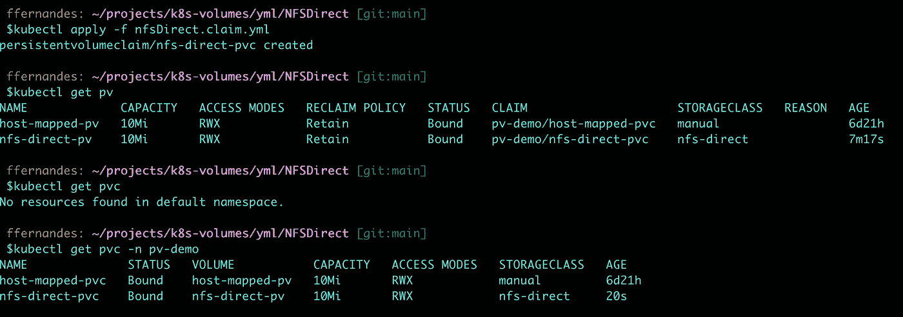

部署文件:

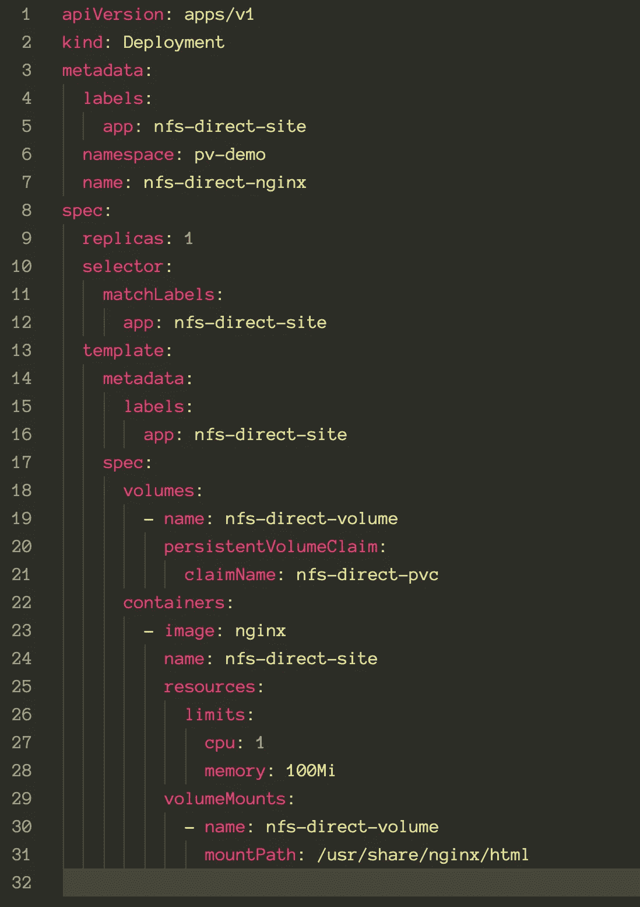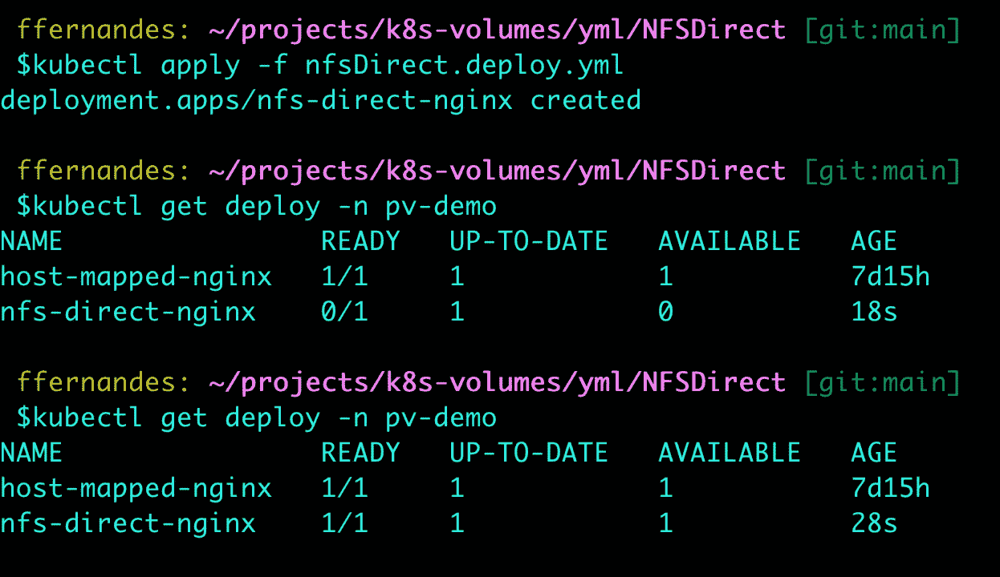

该服务:

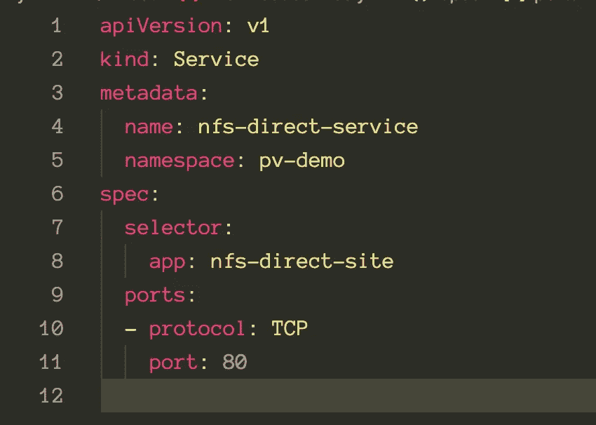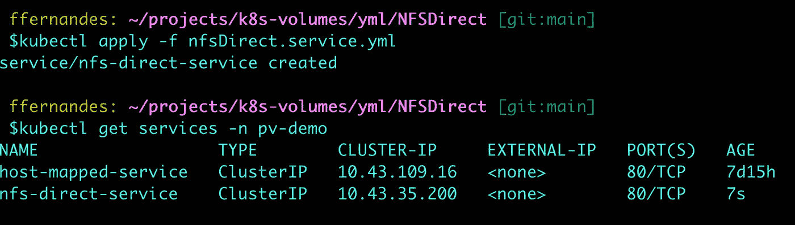

最后，入口:

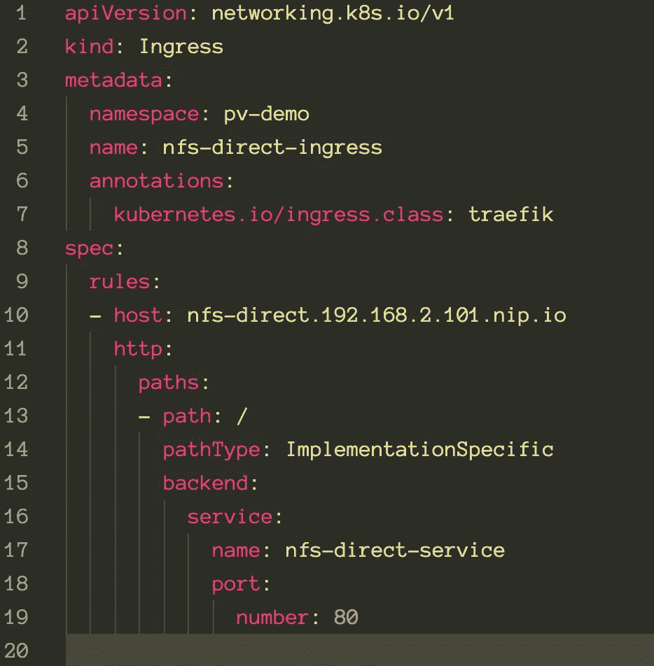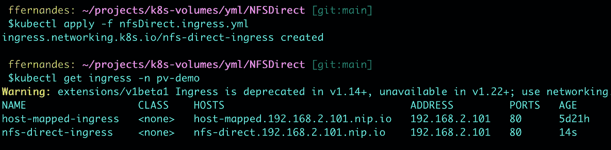

如果出了问题，仔细看看例子；由于配置文件过于相似，很容易忘记更改名称、选择器或应用程序名称。请注意，有时当我们在两个配置中使用相同的名称时，k8 会造成混乱，我们需要手动删除并重新创建实例才能使其工作。

在将文件应用到集群之前，最好对其进行多次检查。

在此之后，唯一还缺少的就是将 HTML 文件复制到 NFS 服务器，并且该站点应该在入口文件中配置的地址可访问:[NFS-direct . 192 . 168 . 2 . 101 . nip.io](http://nfs-direct.192.168.2.101.nip.io/)(我们使用我在上一篇文章中描述的相同的 nip . io 技巧，[如果您不知道它是什么，请查看此处](/how-to-use-nfs-in-kubernetes-cluster-method-1-4071724af37c))。

同样，我使用 scp 命令通过 ssh 发送文件，但是您可以选择任何方法将文件复制到 NFS 共享文件夹中。

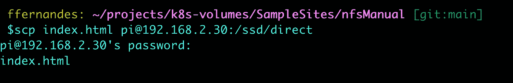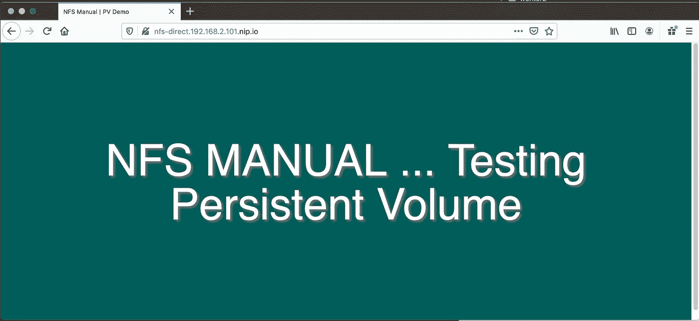

仅此而已。在下一篇文章中，我们将展示通过存储类来完成这些操作的最“自动化”的方法，从而结束这个系列。这样，我们甚至不再需要创建永久卷。声明配置将自动触发持久卷的创建。