# 如何在 Kubernetes 集群存储类中使用 NFS

> 原文：<https://levelup.gitconnected.com/how-to-use-nfs-in-kubernetes-cluster-storage-class-ed1179a83817>

在[上一篇文章](/how-to-use-nfs-in-kubernetes-cluster-method-2-73df4efb4c00)中，我们讨论了仅通过持久卷配置连接到 NFS 服务器。

结合我们在本文的[中看到的直接节点映射到 NFS 的方法，这种方法是使用 Kubernetes 的 NFS 服务器最常用的方式。](/how-to-use-nfs-in-kubernetes-cluster-method-1-4071724af37c)

在本系列的第三篇也是最后一篇文章中，我将向您展示如何自动化部分工作，创建一个持久卷。

从长远来看，它节省了大量的工作，但是在初始配置时需要更多的工作。

您将在互联网上看到的大多数创建自定义存储类的教程都使用脚本或 helm 包安装。为了继续本系列的模式，我将向您展示如何仅使用 yml 配置文件来实现这一点。这将使事情变得更加费力，但我相信您将学到比运行命令更多的东西。

# 一般注意事项

# 文章系列

本文是关于 Kubernetes 使用 NFS 服务器作为持久性卷来源的系列文章的一部分。以下是本系列的文章列表:

1.  [配置 NFS 服务器](https://fabiofernandesx.medium.com/how-to-use-nfs-in-kubernetes-cluster-configuring-the-nfs-server-1bf4116641d4)
2.  [方法 1 —将 NFS 驱动器映射到每个节点的本地文件夹](/how-to-use-nfs-in-kubernetes-cluster-method-1-4071724af37c)
3.  [方法 2 —通过永久卷配置直接连接到 NFS 服务器](/how-to-use-nfs-in-kubernetes-cluster-method-2-73df4efb4c00)
4.  **创建一个存储类，通过声明自动创建一个持久卷。(这一个)**

# 源代码

本文使用的所有文件都发布在这个 GitHub 资源库中:[https://github.com/fabiofernandesx/k8s-volumes](https://github.com/fabiofernandesx/k8s-volumes)。如果您发现需要修复或添加的东西，可以随意克隆它，甚至打开一个拉请求。

# 家庭实验室

对于本系列文章，我将使用我的 raspberry pi Kubernetes 集群，但是这些命令应该可以在任何环境下工作，包括云和虚拟机。如果你对如何创建一个 raspberry pi k8s 集群感兴趣，你可以在这里找到它:[又一个 Raspberry Pi k8 的集群](https://medium.com/swlh/yet-another-raspberry-pi-k8s-cluster-ea05fb48e9a8)，或者如果你对如何使用虚拟机器创建这个集群感兴趣，你可以看看这个:[准备虚拟机器来运行 Kubernetes](https://fabiofernandesx.medium.com/preparing-virtual-box-vms-to-run-kubernetes-a31c7c851566) 。

# 通过自定义存储类连接到 NFS 服务器

首先我们说的是自动化，每次需要我们 k8s 集群对外做一些事情的时候，都需要一些特殊的配置来处理安全部分。

这里我们要做的第一件事是设置服务帐户和角色绑定。我们将使用 RBAC(基于角色的访问控制)来完成这一配置。

我们需要 5 种配置来使这个安全部分工作:

1.  服务帐户(向其授予权限)
2.  集群角色
3.  群集角色绑定
4.  作用
5.  角色绑定

这看起来太多了，但是您最终可以将所有配置放在一个 60 行的文件中。您可以将所有内容放在同一个文件中，用 3 个破折号分隔每个配置，如下所示:

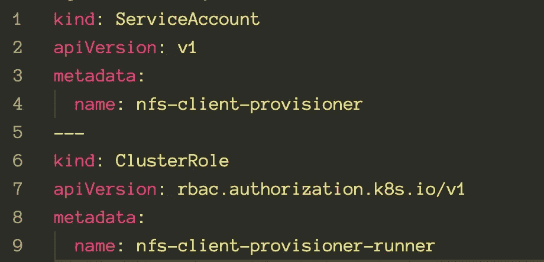

无论如何，我将“一个接一个”地创建配置，以便更容易地调查可能的错误。我建议你也这样做，至少第一次是这样。

一旦一切正常，您就可以将所有的配置文件合并成一个文件，并以这种方式存储它。

从服务帐户开始:

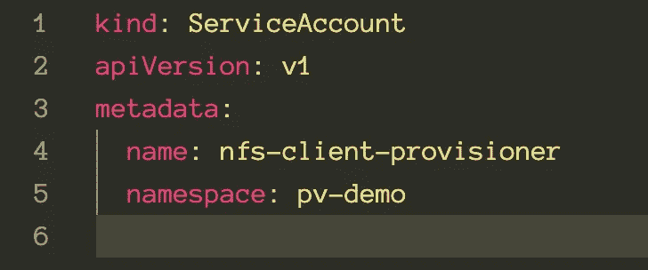

这里没什么特别的；只是另一种 k8s 类型的配置—“种类”

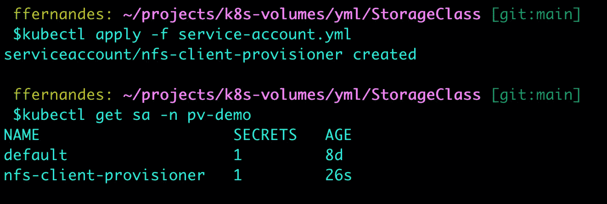

群集角色:

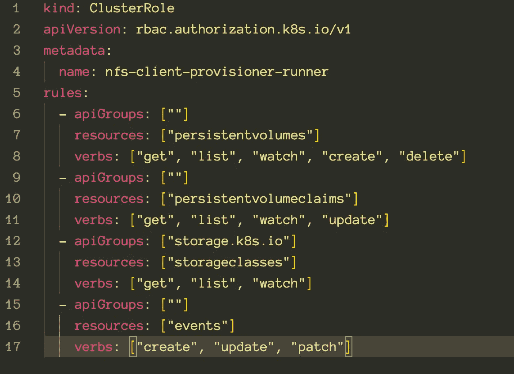

我不会详细介绍每个资源的含义，您只需阅读配置文件就可以了解一点，如果您想深入了解，我推荐 k8s 文档(那里有很多不同的场景)

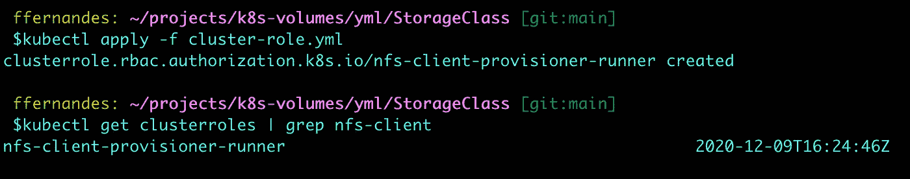

群集角色绑定:

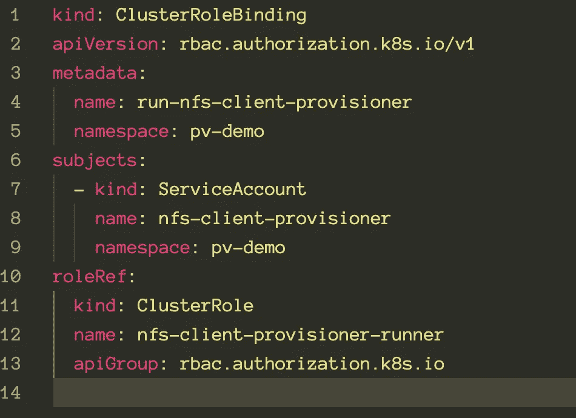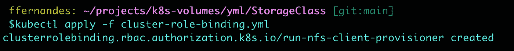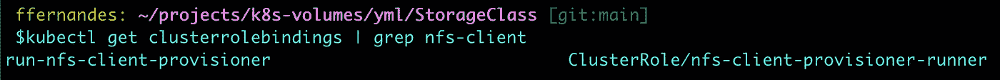

这可能有点单调乏味，但是一个接一个地执行这些命令并检查一切是否正常运行总是好的，正如您在图片中看到的那样。如果出现问题，您只需要几行配置就可以调查并找到错误。

角色:

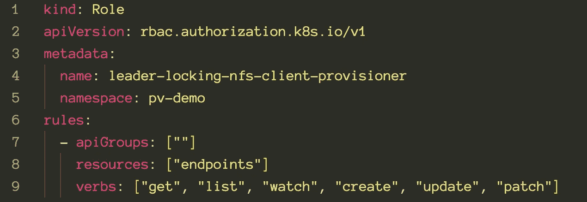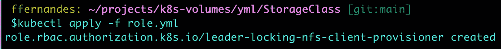

Ant 角色绑定:

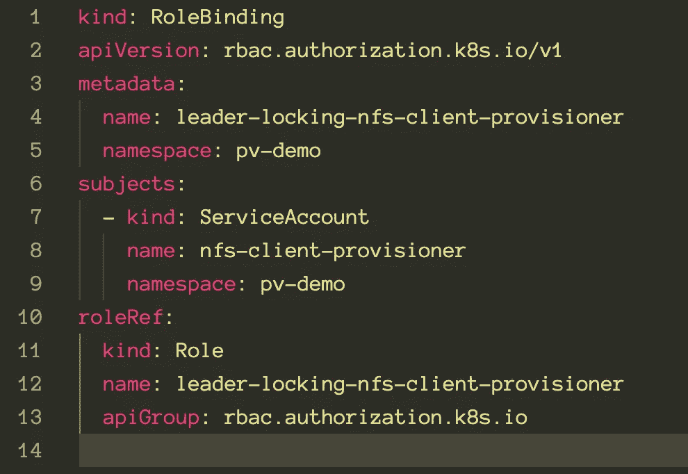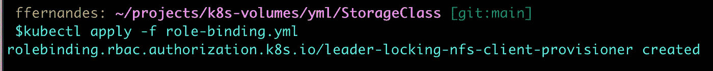

现在，我们需要的与安全相关的一切都被创造出来了。我们可以使用以下命令来检查是否所有东西都在那里:

```
kubectl get clusterrole,role,clusterrolebindings,rolebindings -o custom-columns='KIND:kind,NAME:metadata.name,SERVICE_ACCOUNTS:subjects[?(@.kind=="ServiceAccount")].name'-n pv-demo | grep nfs-client
```

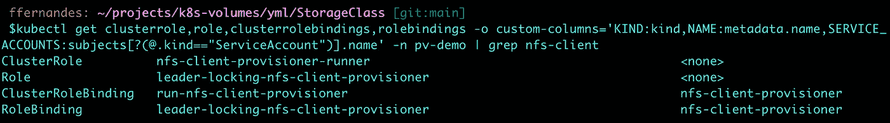

现在，让我们部署存储类。

如果我们正在使用 provisioner 插件，我们可以将其添加到配置中的 provisioner 参数中，类似于`kubernetes.io/aws-ebs`或`kubernetes.io/azure-file`，但我们没有针对 NFS 的插件。所以用像`mysite.com/nfs`这样的词来代替。我正在使用我的一个域名。

我还将其创建为“ssd-nfs-storage”，因为我想为我的外部驱动器创建其他存储类。因为配置是相同的，所以我在这里不包括这些。

这是存储级配置文件:

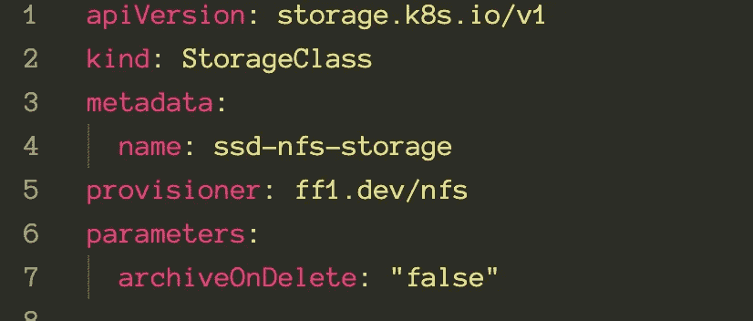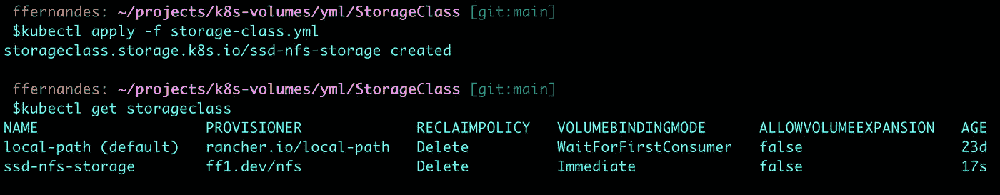

我们需要部署置备程序；工作人员将负责与我们的 NFS 服务器通信，在那里创建文件夹，然后将新的 PV 配置到集群中。

请注意，我在这里使用的是 arm 映像，但是如果您的情况是这样的话，同样的插件也有 x86 版本。

如果你想更好地理解这张图片的作用，你可以在这里找到它的来源:

[https://github . com/kubernetes-retired/external-storage/tree/master/NFS-client](https://github.com/kubernetes-retired/external-storage/tree/master/nfs-client)

以下是部署配置文件:

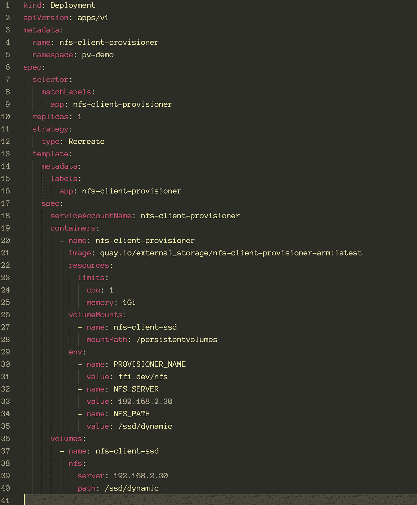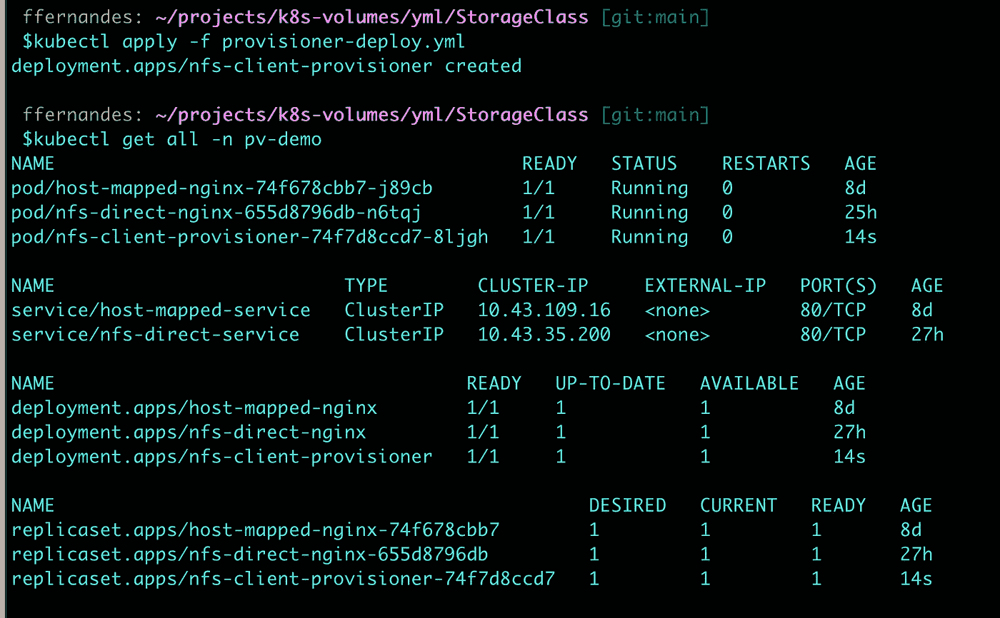

下一步将向我们展示到目前为止我们在这里配置的一切是否正常。我们将使用我们全新的存储类别创建一个批量声明。让我们开始吧。

文件如下:

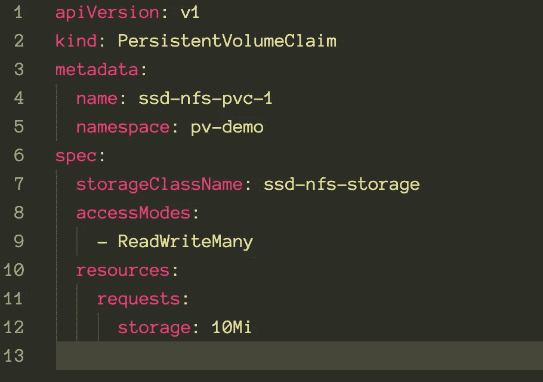

以及命令:

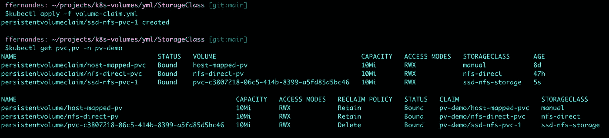

请注意，PV 是自动创建的，具有唯一的 ID。让我们用 ssh 连接我们的 NFS 服务器，检查那里是否创建了一些东西。

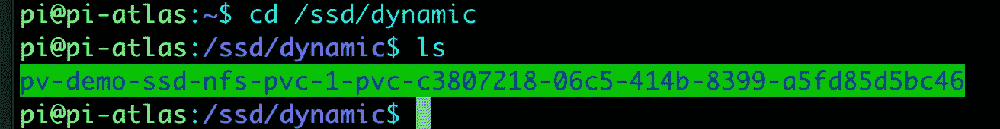

看看在我们的根文件夹中为存储类创建的文件夹。它是名称空间、PVC 名称和 PV 名称的合并。

然后，让我们将 index.html 复制到这个奇怪的文件夹中，并配置我们网站的其余部分。

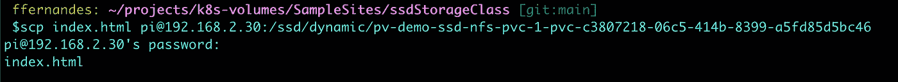

一切就绪。现在我们需要像在以前的文章中一样配置应用程序本身。这次我使用一个文件来配置站点的其余部分(部署、服务和入口):

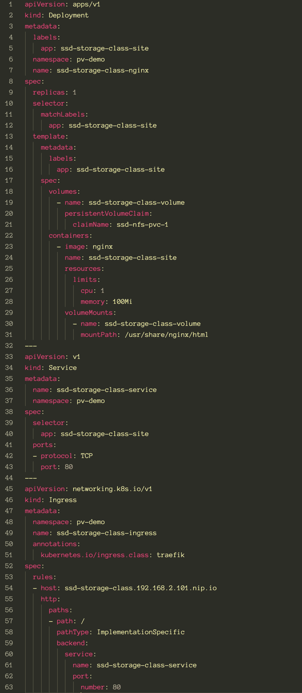

让我们应用它并检查是否一切正常。

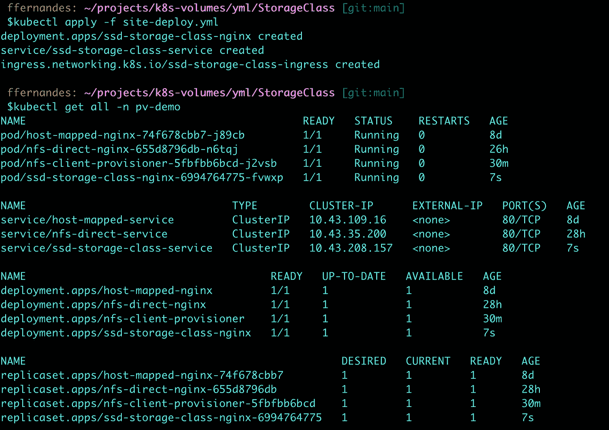

这就是我们在 pv-demo 名称空间下运行的所有部署和服务。我们现在只需要在浏览器中尝试一下，我们的工作就在这里完成了:

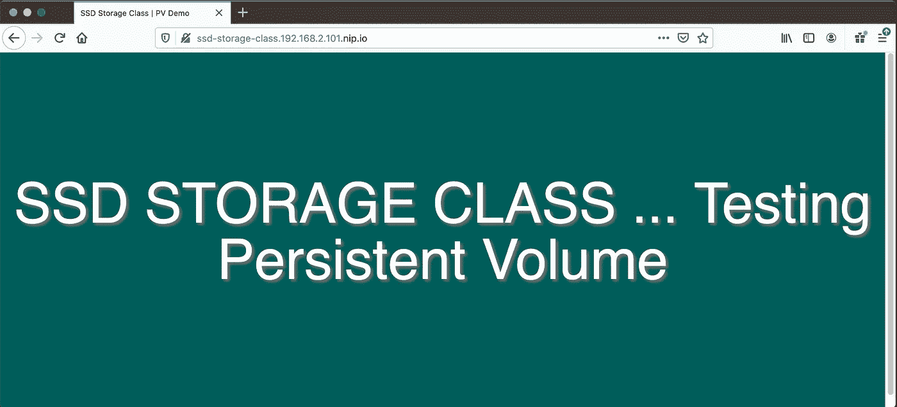

就是这样。如果你有任何问题让我知道。

我希望您已经了解了更多关于 k8s 和持久性卷的知识。再见！