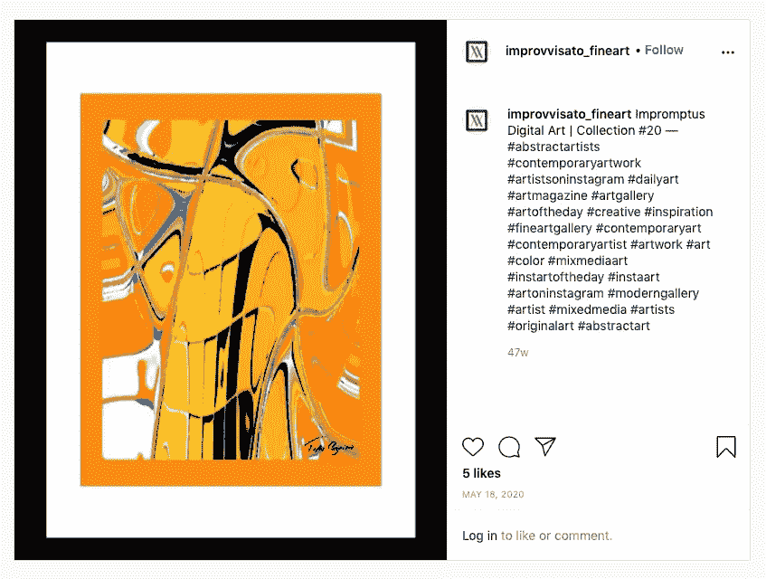

# 如何利用 NFT 技术发行限量版数码照片

> 原文：<https://levelup.gitconnected.com/how-to-use-nft-technology-to-issue-a-limited-edition-run-of-digital-prints-d06575d1fc23>

## 使用区块链技术管理物理艺术真实性的真实应用程序

Gabriela Gomez 在 [Unsplash](https://unsplash.com/s/photos/art?utm_source=unsplash&utm_medium=referral&utm_content=creditCopyText) 上拍摄的照片

当我买下自己的第一张限量版印刷品时，我迈出了作为艺术收藏家的第一步。

我选择这件作品是因为我喜欢它的外观以及与主题的相关性——这是艺术家罗布·琼斯创作的乐队 [The Raconteurs](https://www.theraconteurs.com) 的限量版巡演海报。它的稀有价值对我来说是第二重要的，但我的母亲——她自己也是一位有成就的艺术家——告诉我，限量版的印刷品值得多花一点钱。于是我照做了。

几年后，我不知道它的价值是高于还是低于我支付的价格。如果它的价值上升了，那么它是仅有的 100 本真迹之一这一事实就应该有所值了吧？

*也许有几把跑丢了或者毁了？
他们中的一个可能出现在好莱坞照片的背景中？艺术家可能已经成名或停止创作，从而提高了对他们作品的需求？*

这些事件中的任何一件都可能增加我的印刷品的价值。如果我决定卖掉它，那么我需要证明它的真实性——这时候事情就有点棘手了。

# 证明艺术品的真实性

我推测得越多，我就越想在网上搜索一下我的作品到底值多少钱。与此同时，我突然想到，我几乎没有证据来证明它的稀有性或出处。

在我的收件箱里，有一封购买的电子邮件收据。我知道密封在相框里的是最初出售它的画廊的手写收据(我从另一位收藏家那里买的，他是第一个拥有它的人)。印刷品的一角有手写的铅笔签名，对角有一个数字(10/100)，表示这是限量版的一部分。

但我只有这些了。不是很多，是吗？

如果受到质疑，或者奇迹般地证明它现在价值数千英镑，我不会特别放心地向潜在买家捍卫它的独特性和真实性。

如果我有一个数字的，无可辩驳的唯一的令牌来证实物理的东西。

*要是我有一个和印刷品对应的 NFT 就好了。*

# 不可替换的令牌

如果你对艺术或区块链技术稍有兴趣，你可能会遇到不可替代代币(NFT)的想法。它们是在区块链上(通常，但不仅仅是在以太坊网络上)铸造、存储和维护的唯一数字令牌。每一个 NFT 都对应着数字创作——图像、文本、视频等等。

如果你感兴趣的话，我已经写了一些关于 NFTs 的文章，可能有助于填补空白。在这些作品中，我讲述了它们是什么，它们如何代表下一个革命性的艺术媒介 T2，T4，如何创造你自己的 T5，我创造了一些自己的 T7 作为实验。

当有人购买 NFT 作品时，他们购买的是与原作相对应的数字唱片的所有权。一个流行的误解(也是我自己的一个误解)是认为 NFT 对应于原始艺术品本身的所有权——文本、图像、视频或音频文件，或者代码。It *也可以*对应这些，但是 it *不一定要*。

## 令牌的所有权，不一定是艺术品的所有权

当我创建我的 NFT 时，我决定将原始的数字图像文件与令牌一起出售，我的意图是将原始的原始图像文件发送给买家，并在交易完成后从我存储它的所有地方删除它。

这仍然是我的意图，我应该补充说，如果你想买一个[我已经创造了](https://opensea.io/collection/tzh-creations)！

在铸造 NFT 的过程中，我创造了数字令牌本身，它存储在区块链中，未来所有权的变化将被记录下来，因为它将出售给买家，并转移到他们的保管下。如果买家再次出售，记录将进一步更新。

*   数字图像的 NFT 并不阻止图像文件本身被其所有者和其他决定创建他们自己的副本的人多次拷贝、复制和打印。事实上，我怀疑这种保护存在于公共领域的图像的壮举能否完成——想想今天世界上有多少蒙娜丽莎的复制品(数字版和印刷版)，官方的还是其他的？
*   一条推文的 NFT，比如创始人杰克·多西发出的第一条推文就是代表互联网历史上某个时刻的 NFT。这并不意味着购买它的人拥有它，以至于他们可以通过将它嵌入到一篇文章中来阻止像我这样的人复制它(正如我在下面所做的)。
*   莱昂国王专辑的 [NFT 并不意味着令牌的所有者将拥有数字音频文件的唯一所有权，或者他们可以阻止其他人收听和欣赏它，或者阻止乐队表演它。买家拥有原创的 NFT，这本身被认为对 KOL 超级粉丝来说具有艺术价值——乐队拥有音乐。](https://www.nme.com/news/music/kings-of-leon-have-generated-2million-from-nft-sales-of-their-new-album-2899349)

NFT 位于区块链，它本身就是买卖的对象。它永远无可辩驳地记录了与艺术品相对应的标记的所有权从其被铸造的那一刻起的变化。

那条推文(不是 NFT)卖了 290 万美元(来源:[推特](https://twitter.com/jack/status/20?s=20)

## NFT 不仅仅是一个象征

也就是说，这是 NFT 创造者的礼物，让它捆绑更多。例如，莱昂国王乐队包括粉丝奖金，如为拥有 NFT 的人提供演唱会的前排门票。

这就是 NFT 的概念变得令人困惑的地方。

特别是对于数字图像，购买 NFT 似乎毫无意义——为什么要为一个图像文件的所有权付费呢？这个图像文件可以很容易地、不受控制地进行数字复制和多次打印。

答案在于所有权的状态——被无可辩驳地记录为原始物品的所有者，即使存在其他副本。但 NFT 也可以用来确认艺术品的物理表现的真实性，如数字图像的限量版“官方”印刷。对于传统艺术家来说，这似乎是在出售他们的数字艺术品时创造非功能性艺术的更有说服力的用例之一。

# 限量版印刷品的 NFTs

在收到一封回复我的“ [how to](/the-exact-process-i-used-to-create-and-sell-my-own-nft-art-on-the-ethereum-blockchain-698d9c59a2fe) ”文章的电子邮件后，我开始进一步了解这个概念。一位巴西的创作者联系我，提议合作销售他使用 NFTs 的原创数字艺术的限量版印刷品——我很荣幸能够探索这个机会。你可以在 Instagram (improvvisato_fineart)上查看他们令人敬畏的抽象艺术作品:

来源:[insta gram 上的 improvvisato _ fine art](https://www.instagram.com/p/CAVUrcYDxtD/?igshid=1j414pe78ahx3)

在对 NFTs 用于跟踪和管理实体艺术品限量版印刷的方式做了一些研究后，我认为它是这样工作的:

1.  创作者决定他们希望为某一特定创作提供多少“印刷品”——在这种情况下，是一幅图像(例如，一幅数字艺术品的 10 张限量版)。
2.  为运行中的每个预期项目生成一个 NFT(因此，10 个 NFT)
3.  每幅 NFT 作品都作为一个单独的令牌出售(10 幅中的 1 幅，10 幅中的 2 幅，以此类推)，列出来明确说明 NFT 的所有权使所有者有权获得该艺术品的编号和经认证的实物印刷品，以及将其记录为原件的 NFT。
4.  一旦 NFT 出售，所有权转移到买家(并记录在区块链上)——与 NFT 相关联的智能合约确认这一转移，并将其写入 NFT 的记录。
5.  创作者和拥有者可以在他们之间进行协调，以便在对他们中的每一个合适的时候生产物理艺术品。如果新的所有者想展示这件作品，他们可能希望这件事立即完成，或者如果他们购买这件艺术品是作为投机投资，他们可能希望推迟。

同样的原则可以很容易地应用于除数字艺术之外的任何创作。它基于这样一个前提，即创作者希望为他们的客户提供伴随他们的 NFT 的实际艺术内容，但也希望正式限制正在流通的官方副本的数量。

为了清楚起见，仍然很难限制在官方副本之上制作数字艺术品的非官方副本——正如我为了包含这件作品而包含了上面艺术品的截图一样，一旦数字图像文件被发布到互联网上，就没有办法阻止其他人使用和重用它。

不同的是，NFT 提供了一种手段来控制*官方*复制品的发行，并在收藏家和投机者在公开市场上交易时跟踪这些复制品的所有权和流动——通过 NFT 和他们的区块链记录。

[TT 先生](https://unsplash.com/@mrtt?utm_source=unsplash&utm_medium=referral&utm_content=creditCopyText)在 [Unsplash](https://unsplash.com/s/photos/art?utm_source=unsplash&utm_medium=referral&utm_content=creditCopyText) 上的照片

# 创作者的利益

使用这种方法对创建者的好处包括那些更普遍地适用于 NFTs 的好处，但是也有增强的好处:

1.  他们享受与粉丝联系的机会——NFT 为创作者和欣赏他们作品的人提供了一条联系和沟通的渠道，即使那些人是投机者而不是真正的粉丝。
2.  NFT 提供了一个分类账，保证了限量版项目的真实性，因为它记录了(该版本的每个实例)在任何时间点谁拥有它。以这种方式，如果(使用前面提到的例子)任何拥有非官方拷贝的人创建他们自己的拷贝并转售这些拷贝，声称它们是真实的，这就没有关系了。区块链提供了真正合法拷贝的所有权的完整且不可辩驳的记录。不拥有相应的 NFT，你就不拥有官方艺术品，不管你是否拥有它的复制品。
3.  它使创作者能够从未来的销售中受益——在铸造过程中，创作者可以很容易地规定销售收入的百分比，如果 NFT 在未来再次出售，这些收入将分配给他们。这作为智能合同的一部分被写入，并在每次出售 NFT 时自动执行。它不需要创作者密切关注每一件作品来监控这一点，并要求他们的版税。
4.  它不会阻止他们的作品被数字化地创作或复制，但它会阻止其他人将这些复制品视为真品。
5.  这让他们专注于他们擅长的事情——创造。

## 所有者的利益

1.  NFT 提供了一个不变的令牌，确认他们拥有艺术品本身，如果他们希望验证真实性，以便在以后出售。
2.  它允许他们与创造者联系并注册他们的支持。
3.  在上述例子中，所有者理论上可以推迟请求物理拷贝，直到将来的某个时间。然后创造者成为物质表现的保管者，直到拥有者想要它。

以我之前的限量版印刷品为例。

如果我在我的加密钱包里放了一幅与这幅画相关的 NFT 作品，那么证明它的真实性并把它卖给有眼光的买家就容易多了。他们会通过我对相关 NFT 的所有权来认可我对实物艺术品的所有权。NFT 本身将包含在它的区块链记录中，从它的创造者，到第一个所有者，然后到我的所有权的移动。

潜在买家不会依赖手写收据来证明真实性。通过购买印刷品，并作为交易的一部分获得与之相关的 NFT 的所有权，他们就无可争议地拥有了真品。

# 案例研究:西格娜·皮尔斯——一位视觉、数码和行为艺术家

当我听到 Signe Pierce 在 [A16Z 播客](https://podcasts.apple.com/gb/podcast/crypto-creators-on-art-galleries-to-tokenized-collectibles/id842818711?i=1000499812572)上接受采访时，我看到了她的创造性作品。她通过基金会交易所出售自己的数码作品，包括限量版的[摄影作品。](https://foundation.app/blog/signe-pierce)

基金会让艺术家创作的 NFT 能够像在交易所一样进行交易(而不是像在 OpenSea 那样，使用类似于易贝的模式拍卖 NFT)。Signe 可以发布一系列与艺术品限量版相对应的 NFT，然后在 Foundation 上进行交易。每一次 NFT 的买卖，作为 NFT 的创造者，森娜都会从销售收入中得到一份分成。她将与 NFT 的所有者直接联系，创建与他们的 NFT 相对应的独特的实体印刷，并在生产时，他们接管实体艺术品。

她仍然在画廊出售传统的限量版印刷品，但这些印刷品定价不同，面向不同的市场。她营销和销售其作品的方法根据不同市场部门的偏好而变化。最终结果是，她的作品尽可能广泛地接触到消费者，她通过每一个销售渠道获得了经济补偿。这使她能够创建和销售各种各样的媒体，如下所示:

来源:[推特](https://twitter.com/withFND/status/1379616656763199489?s=20)

# 外卖食品

区块链技术仍然相对较新，其在 NFT 空间的应用潜力仍在不断涌现和发展。这项技术的可用性并不一定能保证那些能够从它的使用中获益的潜在用户会立即开始这样做。它的用例需要逐渐出现并被采用。其中许多几乎肯定会与传统渠道交叉和重叠。

随着越来越多的人看到区块链非功能性测试的潜力并理解其潜在的应用，这种重叠可能是使用和接受增加的手段。

NFTs 与通过限量版印刷品营销和销售数字艺术品的传统手段结合使用就是这种使用的一个很好的例子。这种增长有多快，还有待观察，但我认为良好的潜力是存在的。

如果你喜欢阅读这样的故事，并且愿意支持 Medium 上的作家，考虑注册成为 Medium 会员。一个月 5 美元，给你无限的故事。如果你注册使用我的链接，我会赚一小笔佣金。

 [## 阅读托比·黑兹伍德(以及媒体上成千上万的其他作家)的每一个故事

### 作为一个媒体会员，你的会员费的一部分会给你阅读的作家，你可以完全接触到每一个故事…

tobyhazlewood.medium.com](https://tobyhazlewood.medium.com/membership) 

注:*本文仅供参考。不应将其视为财务或法律建议。在做任何重大财务决定之前，先咨询财务专家。*

## [如果你喜欢这篇文章，我希望你能加入我的电子邮件列表。](http://bit.ly/TobyHazlewoodList)