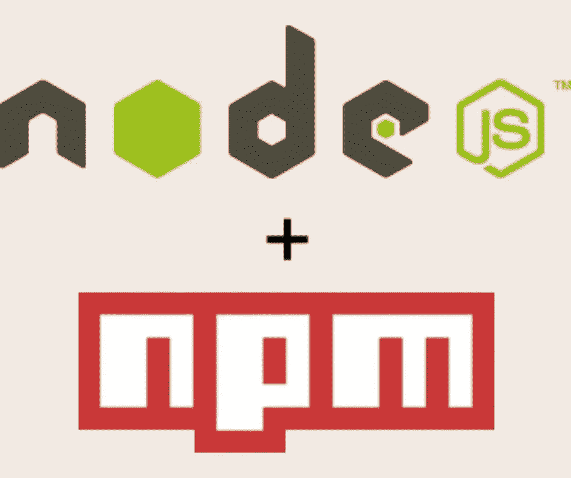

# 如何使用 npm/yarn/Node.js package.json 脚本作为您的构建工具

> 原文：<https://levelup.gitconnected.com/how-to-use-npm-yarn-node-js-package-json-scripts-as-your-build-tool-f4bf87e85af5>



与 Node.js 平台捆绑在一起的是包管理工具 *npm* 的一个被低估的特性。npm 的主要目的是访问运行在 Node.js 上的一个非常大的软件包库，但是它包含一个特性，即`scripts`标签，它本身非常强大。有了这个标记，就有可能使用任何命令行实用程序来构建复杂的数据操作系统。

使用`scripts`标签，我们可以在一个`package.json`文件中记录命名的命令。例如，`deploy`脚本可能使用`rsync`将文件上传到服务器。这个标签本身并不十分强大，尽管有了它我们可以运行任何命令行工具。但是，npm 资源库中的一些可用工具可以用来在`scripts`部分构建复杂的处理架构。再加上可用 Node.js 包的庞大库，我们就有了一个强大的环境来实现构建系统、web 发布系统，甚至远至训练机器学习模型的系统。

`package.json`中的`scripts`标签由 *npm* 项目引入。它的主要用途是支持包安装、其他包管理任务和简单的项目脚本，如启动服务器的方法。主要目标是 Node.js 包或应用程序作者。

仅仅因为这是设计目标并不意味着我们不能将`scripts`标签用于其他目的。运行任何命令行工具的能力，以及使用允许您构建复杂处理层次结构的插件的能力，给了我们强大的组合。

与其使用`package.json`来开发 Node.js 包、应用程序或服务器，不如让我们考虑一个不同类型的项目。例如，您已经构建了一个 Docker 容器，并且想要自动构建它并将其发布到 Docker 存储库中。您可以编写一个 shell 脚本、一个 Makefile，或者您可以用 npm 和`package.json`实现发布过程。这需要将`docker login`、`docker build`和`docker push`命令记录到`package.json`的`scripts`部分。您可能需要支持在 Windows、Linux 和 macOS 机器上运行构建，有一个 Node.js 工具可以帮助跨平台运行命令。

使用`package.json`或许多其他工具，可以自动完成这项任务和许多其他任务。选择权在你。本文将向您介绍如何将`package.json`用于其主要设计目标之外的目的。

对于那些已经在使用 Node.js 平台的人来说，这是最有意义的，无论是编写 Node.js 包或应用程序，还是使用 Node.js 中编写的工具。这些人可能已经在使用`package.json`文件，并且可以很容易地将该文件扩展为构建工具。

TL；DR 如果你已经知道如何使用`package.json`和 npm，你可能会觉得接下来的几节很无聊。这篇文章让读者从零开始，以防他们从未见过这些材料。

# 什么是`package.json`和 npm/Yarn 生态系统

使用`package.json`的一个很大的吸引力是 Node.js、npm 和 Yarn 本身就支持它。触手可及的不仅仅是一个强大的编程平台，而是一个庞大的 Node.js 包生态系统。

正如我们刚才所说的，有三个领域`package.json`是重要的。首先，Node.js 使用它来描述包目录。其次，它用于 npm/Yarn 生态系统中的包装管理。第三，它被包或应用程序作者用于与他们的项目相关的脚本。

在本节中，我们先快速讨论前两个，然后再深入讨论第三个。

# Node.js 在`package.json`里找什么？

`package.json`文件是为 Node.js 开发的，但是 Node.js 只使用了现代`package.json`的一小部分内容。例如:

```
{
     "name": "example-package-json",
     "type": "commonjs",
     "main": "./path/to/main.js"
}
```

大概就是这样。

上下文是 Node.js 将单个 JavaScript 文件视为*模块*，并且它可以将正确构建的目录视为*模块*。在 Node.js 文档中查找作为模块的*文件夹。使目录成为模块的一个东西是`package.json`文件。Node.js 运行时在该文件中查找非常少的字段。除了这里显示的三个字段，还有一个字段`exports`，它是`main`字段的替代字段。*

# `package.json`NPM 或者 Yarn 找什么？

正如我们所说，包管理器应用程序(npm、Yarn 等)向`package.json`添加了大量字段。这些字段涵盖包管理、依赖关系管理以及用于打包或项目管理的脚本。

运行命令`npm help package.json`显示附加`package.json`字段的列表。

字段`description`、`version`、`repository`、`keywords`、`author`、`license`、`bugs`和`homepage`是显示在 *npmjs* 上的套餐列表上的数据示例。 *com* 网站。这些是我们之前提到的*包管理*的例子。

与`dependencies`和`devDependencies`字段一样，`version`字段也用于依赖关系管理。这些字段在安装软件包时使用，软件包管理器(npm/Yarn)读取这些字段中的条目以安装软件包。`version`字段通告每个包的每个实例的版本号，而`dependencies`字段指定要使用的可接受的版本号。通过这种方式，软件包管理器可以下载所需软件包的正确版本。依赖项字段也可以指向 npm 注册中心之外的包，比如来自 Git 存储库或任意 URL 的包。这些是我们之前提到的*依赖管理*的例子。

*项目管理*的主要机制是`scripts`域。我们将在本文的剩余部分深入探讨这个问题。`scripts`字段是为包开发者或应用开发者服务而发明的。运行`npm help scripts`获取该字段的描述。在阅读时，要特别注意预定义的脚本。

# 创建一个`package.json`文件

首先，让我们学习如何使用 npm(或 Yarn)创建一个`package.json`。很简单:

```
$ mkdir example1
$ cd example1
$ npm init -y
Wrote to /Volumes/Extra/nodejs/npm-build-scripts/example1/package.json:{
  "name": "example1",
  "version": "1.0.0",
  "description": "",
  "main": "index.js",
  "scripts": {
    "test": "echo \"Error: no test specified\" && exit 1"
  },
  "keywords": [],
  "author": "David Herron <[david@davidherron.com](mailto:david@davidherron.com)>",
  "license": "ISC"
}
```

这是制造一个`package.json`最快的方法。去掉`-y`选项，你会被问一些关于项目的问题，使用这个选项时，每个选项都采用默认值。

您可以设置一些 npm 配置设置，以帮助用正确的值自动填充生成的`package.json`:

*   `npm config set init.author.name "..."` -设置作者姓名
*   `npm config set init.author.email ...@...` -设置作者的电子邮件地址
*   `npm config set init.author.url https://...` -设置作者主页的网址
*   `npm config set init.license ...` -设置要使用的默认许可证

要了解配置设置，运行`npm help 7 config`。

一旦你有了`package.json`，你就可以前进了。

# 熟悉`package.json`中的`scripts`标签

`package.json`的脚本部分包含一个命名脚本列表。当 npm 生成这个文件时，如上所示，它包含一个`test`脚本。它是这样运行的:

```
$ npm run test > example1@1.0.0 test /Users/David/nodejs/npm-build-scripts/example1 
> echo "Error: no test specified" && exit 1 Error: no test specified npm 
ERR! code ELIFECYCLE 
...
```

这个脚本运行一个`echo`命令，然后运行`exit 1`。最后是什么让 npm 认为发生了错误。

我们也可以将此作为`npm test`运行，省去`run`。这是因为 npm 有几个与 npm 子命令对应的预定义脚本名称:

*   `npm test` -运行一个测试脚本
*   `npm start` -运行命令启动服务器
*   `npm restart` -运行命令重启服务器
*   `npm stop` -运行命令停止正在运行的服务器

对于任何其他脚本，它作为`npm run script-name`执行。运行`npm help scripts`给出了更多关于如何解释的信息。预烘焙脚本旨在处理*生命周期事件*，这意味着它们在 Node.js 应用程序中安装、使用或开发 Node.js 包的特定阶段执行。

# 使用前脚本和后脚本

该机制支持基本的控制流。考虑:

```
"scripts": {
    "test": "echo \"Error: no test specified\" && exit 1",
    "prestart": "echo 'Pre-start runs before start'",
    "start": "echo 'START'",
    "poststart": "echo 'Post-start runs after start'"
},
```

顾名思义，对于名为 *foo* 的脚本， *prefoo* 脚本在 *foo* 之前运行， *postfoo* 脚本在 *foo* 之后运行。看起来是这样的:

```
$ npm start> example1@1.0.0 prestart /Users/David/nodejs/npm-build-scripts/example1
> echo 'Pre-start runs before start'Pre-start runs before start> example1@1.0.0 start /Users/David/nodejs/npm-build-scripts/example1
> echo 'START'START> example1@1.0.0 poststart /Users/David/nodejs/npm-build-scripts/example1
> echo 'Post-start runs after start'Post-start runs after start
```

如果想要无限循环，将`poststart`改为:

```
"poststart": "echo 'Post-start runs after start' && npm run start"
```

由于脚本中的文本被视为 Unix shell 脚本，并且命令结构`cmd && cmd`一个接一个地运行命令，这使得`poststart`脚本再次运行`start`。哪个...再次执行整个`prestart` / `start` / `poststart`序列。

# 向脚本传递参数

可以从`npm`命令行向脚本传递参数。考虑:

```
"withargs": "echo ARGS"
```

然后我们运行这个:

```
$ npm run withargs -- Hello World> example1@1.0.0 withargs /Users/David/nodejs/npm-build-scripts/example1
> echo ARGS "Hello" "World"ARGS Hello World
```

`--`之后的所有内容都在已执行脚本的命令行上传递。

# 使用壳牌管道

由于脚本使用 Unix shell 脚本语法，这包括构建管道。

考虑:

```
"pipeline": "echo one two three four | wc"
```

如果您已经做到这一步，您可能知道`wc`命令打印标准输入的字数。这是我能想到的第一个微不足道的管道例子。让我们看看这是如何运行的:

```
$ npm run pipeline > example1@ 1.0 .0 pipeline /Users/David/nodejs/npm-build-scripts/example1 
> echo one two three four | wc 1 4 19
```

是的，输入是一行，四个单词，十九个字符，就像`wc`命令所说的那样。这是一个微不足道的例子，但是在这里你当然可以构建和使用无数不同的管道。

这些琐碎的例子是为了让你熟悉一些可能性。记住这一点，让我们看一些更全面的例子。

# 一个接一个地运行一系列脚本

在 Unix 命令行中，我们可以执行`cmd && cmd && cmd`来连续运行一系列命令。在`package.json`脚本中，我们已经看到我们可以做同样的事情来一个接一个地运行一组命令。考虑如何在`package.json`脚本中使用`&&`实现多步骤流程。

在一个名为`build-site`的新目录下，启动一个新项目(运行`npm init -y`)。在该目录中安装这些软件包:

在`package.json`中添加这些`script`标签:

```
$ npm install lessc mustache html-minifer --save
```

然后考虑在`build-site`目录中是另一个目录`site`，其中包含一个名为`style.less`的文件，该文件包含一个用 LESS 语法编写的样式表，以及一个要呈现到名为`index.html`的文件中的 Mustache 模板。

在`package.json`中添加这些`script`标签:

```
"scripts": {
    "build-site": "npm run less && npm run render && npm run deploy",
    "less": "lessc site/style.less build/style.css",
    "render": "mustache data.json site/index.mustache build/index.html",
    "deploy": "cd build && rsync --archive --delete --verbose ./ [user-name@remote-host.com](mailto:user-name@remote-host.com):docroot-directory/"
},
```

我们不会占用空间向您展示单个文件，所以请想象这些文件是存在的，并且具有合理的内容。`build-site`标签描述了一个多阶段过程，其中每个阶段是另一个脚本命令。第一阶段使用`lessc`编译样式表，第二阶段使用`mustache`呈现模板，使用`html-minifier`缩小 HTML，最后一阶段使用`rsync`部署到服务器。

如果我们模拟一些数据，如下所示:

```
$ mkdir site
$ touch site/style.less site/index.mustache
$ echo '{}' >data.json
$ mkdir build
```

再次，假装这里有真实的文件。例如，`data.json`可能是我们在这个过程的另一个阶段运行的数据库查询的结果。

我们可以像这样运行构建:

```
$ npm run build-site> build-site@1.0.0 build-site /Users/David/nodejs/npm-build-scripts/build-site
> npm run less && npm run render  && npm run deploy> build-site@1.0.0 less /Users/David/nodejs/npm-build-scripts/build-site
> lessc site/style.less build/style.css> build-site@1.0.0 render /Users/David/nodejs/npm-build-scripts/build-site
> mustache data.json site/index.mustache | html-minifier -o build/index.html> build-site@1.0.0 deploy /Users/David/nodejs/npm-build-scripts/build-site
> cd build && rsync --archive --delete --verbose ./ [user-name@remote-host.com](mailto:user-name@remote-host.com):docroot-directory/...
```

将每个阶段分成自己的`scripts`条目是一个很好的做法。这样，我们可以单独运行阶段，如果需要调试一个阶段，同时也使每个脚本更容易阅读。想象一下，如果你把所有的东西都写在一行，T2 的剧本会是什么样子。当你想到这个就不寒而栗的时候，赞美 npm(和 Yarn)让你使用这个技术。

# 使用`npm-run-all`改进顺序脚本执行

`build-site`的例子很有趣，因为它指向使用`package.json`构建复杂流程的能力。显然级数可以扩大。例如，我们建议可以从数据库查询中生成`data.json`,我们可以轻松地编写一个定制的 Node.js 脚本来执行该查询。还有其他工具可以考虑，比如使用 TypeScript 编译器从 TypeScript 源代码生成 JavaScript 文件。或者使用 lint 工具来确保生成的代码是干净的。并且可能需要一些图像处理步骤。当然，网站可以有多个页面来呈现。

一个问题是`build-site`脚本本身有点笨拙。我们实现的想法越多，这个脚本就变得越来越笨拙，直到变得完全不可管理。幸运是，有一个工具`npm-run-all`，可以简化设置。

有关文件，请参见:[https://www.npmjs.com/package/npm-run-all](https://www.npmjs.com/package/npm-run-all)

为了进行试验，将`build-site`目录复制为`build-site-2`，然后运行以下命令:

然后将脚本部分重写为:

```
$ cd build-site-2
$ npm install npm-run-all --save-dev
```

这样就干净一点了。`build-site`脚本更容易阅读，而且因为它更紧凑，所以有更大的发展空间。就其本身而言，这些都是小胜利，但`npm-run-all`的另一个特点将使它成为更大的胜利。具体来说:*通配符*

将脚本更改为:

```
"scripts": {
    "build-site": "npm-run-all build:less build:render build:deploy",
    "build:less": "lessc site/style.less build/style.css",
    "build:render": "mustache data.json site/index.mustache | html-minifier -o build/index.html",
    "build:deploy": "cd build && rsync --archive --delete --verbose ./ [user-name@remote-host.com](mailto:user-name@remote-host.com):docroot-directory/"
},
```

这样就干净一点了。这个脚本更容易阅读，而且因为它更紧凑，所以有更大的发展空间。就其本身而言，这些都是小胜利，但是`npm-run-all`的另一个特点将使它成为更大的胜利。具体来说:*通配符*

将脚本更改为:

```
"build-site": "npm-run-all build:*",
```

如您所料，`build:*`模式匹配以`build`开头的每个脚本名。

其工作方式是，`npm-run-all`从`package.json`读取所有脚本，并使用 glob 风格的模式匹配来选择要运行的脚本。使用一个星号，它运行这里显示的模式的“子脚本”，但是它不运行像`build:render:index`这样的“子子脚本”。要运行 sub-sub 脚本，请使用“globstar”或`build:**`。

最终的脚本执行如下所示:

```
$ npm run build-site> build-site@1.0.0 build-site /Users/David/nodejs/npm-build-scripts/build-site-2
> npm-run-all build:* > build-site@1.0.0 build:less /Users/David/nodejs/npm-build-scripts/build-site-2
> lessc site/style.less build/style.css > build-site@1.0.0 build:render /Users/David/nodejs/npm-build-scripts/build-site-2
> mustache data.json site/index.mustache | html-minifier -o build/index.html > build-site@1.0.0 build:deploy /Users/David/nodejs/npm-build-scripts/build-site-2
> cd build && rsync --archive --delete --verbose ./ user-name@remote-host.com:docroot-directory/
```

和以前差不多，但是`build-site`脚本现在更容易管理了。我们可以在`build`组中添加或删除脚本，而不必编辑`build-site`脚本。

# 并行脚本执行

有了`npm-run-all`，我们不再局限于一步接一步的顺序执行。它还可以并行运行这些步骤，这在某些情况下可能很有用。为此，只需在命令行中添加`--parallel`选项。

在我们的`build-site`示例中，构建步骤彼此独立，不必按顺序运行。这意味着我们可以添加`-parallel`，就像这样:

```
$ npm-run-all --parallel build:*
```

我们将在下一节看到一个使用这个特性的实际例子。

# 使用`onchange`在文件改变时自动重建

刚刚描述的简单的“*构建 HTML 页面*”场景可以有几个方向。一个常见的方向是自动监视源文件，并重建任何被更改的文件。编码器将编辑网站代码，保存更改，自动重建发生，并在网络浏览器中重新加载屏幕。这是迭代开发的正常编辑-构建-测试循环。

例如，如果这是一个实际的项目，HTML 页面可能包含一个 Vue.js 或 React 客户端到一个后端服务。与应用程序相关的文件中的任何编辑都应该触发重建。

让我们停止假装，做一些真正的文件，但让它保持简单和简洁。

创建一个工作目录:

```
$ mkdir build-site-3 
$ cd build-site-3 
$ cp ../build-site-2/package.json .
```

这给了我们一个已知的上一节的起点。在`package.json`中，删除`build:deploy`脚本，因为我们实际上不需要它。然后安装这些软件包:

*onchange* 包是一个工具，用于查看文件集，并根据对这些文件的更改运行命令。我们将用它来触发自动重建。文件见:[https://www.npmjs.com/package/onchange](https://www.npmjs.com/package/onchange)

*live-server* 包是一个简单的 web 服务器，支持在文件改变时自动重新加载浏览器页面。文件见:[https://www.npmjs.com/package/live-server](https://www.npmjs.com/package/live-server)

在我们了解如何使用这些包之前，让我们创建几个简单的源文件来使用。

创建一个`site`目录，并在该目录下创建一个名为`index.mustache`的文件:

```
<html>
<head>
    <title>{{ title }}</title>
    <link rel="stylesheet" href="/style.css">
</head>
<body>
    <h1>{{ title }}</h1>
    <form>
        <label for="labelFibonum" class="form-label">{{ fibolabel }}</label>
        <input type="text" class="form-control" id="inputFibonum">
    </form>
    <div id="fiboVal"></div>
    <script src="/fibocalc.js"></script>
</body>
</html>
```

我们所拥有的是一个微不足道的 HTML 页面，我们可以用 Mustache 处理它来生成一个`index.html`。我们将从 JSON 文件中提取一些文本值。我们将使用 JSON 文件作为一个简单的 I18N 实现，让我们在 JSON 中存储文本字符串，并用不同的 JSON 文件替换不同的语言。在`fibocalc.js`中，我们将编写一个小的 JavaScript 应用程序来计算斐波那契值。用户将在输入字段中输入一个数字，代码将看到该值并计算相应的斐波那契数。

在父目录中，在`package.json`旁边，创建一个名为`labels.en.json`的文件:

```
{
    "title": "Fibo Calculator",
    "fiboLabel": "Enter a number to calculate Fibonacci number"
}
```

我们将使用这个文件作为简单的国际化(I18N)方法。处理模板时，`title`和`fibolabel`的值成为`title`和`fibolabel`变量。因此，当我们运行`mustache`命令时，这些值将从这个文件中提取出来，并插入到渲染输出中。我们还需要修改`build:render`脚本来引用`labels.en.json`而不是`data.json`。

在`site`目录中添加一个名为`fibocalc.js`的文件，包含:

```
document.addEventListener("DOMContentLoaded", function() {let input = document.getElementById('inputFibonum');
    let display = document.getElementById('fiboVal');input.oninput = function(e) {
        let entered = e.target.value;
        let fibonum = Number.parseInt(entered);
        if (Number.isNaN(fibonum)) {
            display.textContent = `ERROR: Non-number entered ${entered}`;
        } else {
            let fiboval = fibonacciLoop(fibonum);
            display.textContent = `Fibonacci ${fibonum} = ${fiboval}`;
        }
    } function fibonacciLoop(n) {
        let fibos = [];
        fibos[0] = 0;
        fibos[1] = 1;
        fibos[2] = 1;
        for (let i = 3; i <= n; i++) {
            fibos[i] = fibos[i-2] + fibos[i-1];
        }
        return fibos[n];
    }
});
```

我们在这里使用纯 JavaScript/DOM 代码，而不是像 jQuery 这样的框架。其外部包装相当于 jQuery `$(document).ready`构造，目的是在运行 JavaScript 之前等待页面完成加载。

在 JavaScript 中，我们得到了`#inputFibonum`和`#fiboVal`元素的句柄。对于`#inputFibonum`,我们设置了一个`oninput`处理函数，使得任何输入到输入域的字符都可以调用这个函数。

在处理程序中，我们试图将文本解析为整数。如果失败，我们在`#fiboVal`显示区输出一条错误信息。否则，我们运行一个简单的斐波那契计算，并在显示区域显示结果。

为了完善它，在`site`中添加一个名为`style.less`的文件，包含:

```
#fiboVal {
    border: 3px dashed red;
}
```

这将在显示区域周围抛出一个小边框。

我们现在有了一个简单的小型浏览器端应用程序，以及一个从`site`到`build`目录呈现文件的构建过程。既然我们在本节开始时讨论了自动重建，那么让我们来关注一下。

`onchange`命令接受一个要监视的文件名模式列表和一个要运行的命令。例如:

```
$ onchange 'site/**.less' -- npm run build:less
```

这将监视`site`目录中任何`.less`文件的变化，并运行`build:less`脚本。

记住这一点，让我们将`package.json`中的`scripts`部分改为:

```
"scripts": {
    "build-site": "npm-run-all build:*",
    "build:less": "lessc site/style.less build/style.css",
    "build:render": "mustache labels.en.json site/index.mustache | html-minifier -o build/index.html",
    "build:js": "cp site/fibocalc.js build",
    "preview": "cd build && live-server --port=3333 ",
    "watch": "npm-run-all --parallel watch:* preview",
    "watch:less": "onchange 'site/**.less' -- npm run build:less",
    "watch:js": "onchange 'site/**.js' -- npm run build:js",
    "watch:html": "onchange 'labels.en.json' 'site/**.mustache' -- npm run build:render"
},
```

这些`build`脚本和我们之前的差不多。我们添加了一个`build:js`脚本，它简单地将文件复制到构建目录中。该脚本可以做更多的事情，例如使用 Babel 将现代 ES2019 代码转换为可以在任何浏览器上运行的 ES5 代码。

`preview`脚本运行`build`目录中的`live-server`工具。这是一个简单的 web 服务器，包括自动实时重载。它监视提供给 web 浏览器的文件，一旦检测到变化，就会使浏览器重新加载页面。

然后我们有了`watch`的剧本。`watch:*`脚本遵循刚才提到的模式，其中`onchange`命令监视某些文件，然后运行相应的`build:*`脚本。

例如，运行`npm run watch:js`然后编辑`fibocalc.js`。每次编辑时，都会打印以下内容:

```
> build-site@1.0.0 build:js /Users/David/nodejs/npm-build-scripts/build-site-3 
> site/fibocalc.js build
```

换句话说，在每次编辑时，`build:js`脚本都会被执行，就像`watch:js`脚本所说的那样。

`watch`脚本本身使用了`npm-run-all --parallel`选项。这样做是为了同时运行每个`watch:*`脚本和`preview`脚本。这样，我们可以自动重建源文件，并自动重新加载浏览器。

然后，我们可以运行这个:

```
$ npm run watch> build-site@1.0.0 watch /Volumes/Extra/nodejs/npm-build-scripts/build-site-3
> npm-run-all --parallel watch:* preview > build-site@1.0.0 watch:less /Volumes/Extra/nodejs/npm-build-scripts/build-site-3
> onchange 'site/**.less' -- npm run build:less > build-site@1.0.0 watch:html /Volumes/Extra/nodejs/npm-build-scripts/build-site-3
> onchange 'labels.en.json' 'site/**.mustache' -- npm run build:render > build-site@1.0.0 watch:js /Volumes/Extra/nodejs/npm-build-scripts/build-site-3
> onchange 'site/**.js' -- npm run build:js > build-site@1.0.0 preview /Volumes/Extra/nodejs/npm-build-scripts/build-site-3
> cd build && live-server --port=3333 Serving "/Volumes/Extra/nodejs/npm-build-scripts/build-site-3/build" at http://127.0.0.1:3333
Ready for changes
```

这将启动并行运行的脚本。`live-server`流程告诉我们已经准备好进行变革。

`live-server`还会自动打开一个浏览器标签，您会看到:


嗯，在输入栏中输入`55`后你会看到。

现在，编辑`site/fibocalc.js`,修改如下:

```
display.textContent = `Fibonacci CHANGE ${fibonum} = ${fiboval}`;
```

一旦保存了更改，就会在您的终端中打印出来:

```
> build-site@1.0 .0 build:js /Volumes/Extra/nodejs/npm-build-scripts/build-site-3 
> cp site/fibocalc.js build Change detected /Volumes/Extra/nodejs/npm-build-scripts/build-site-3/build/fibocalc.js
```

首先，`onchange`检测到 JavaScript 文件发生了变化，并运行了`build:js`脚本。第二，`live-server`检测到`site/fibocalc.js`改变，导致浏览器重新加载。输入要计算的新数字，消息将变为:

```
Fibonacci CHANGE 55 = 139583862445
```

取消更改后，同样自动重建事件会发生，消息也会更改回来。

例如，编辑`labels.en.json`,修改如下:

```
"title": "Fibo Calculator - Hi Mom!",
```

检测到更改后，将运行以下程序:

```
> build-site@1.0.0 build:render /Volumes/Extra/nodejs/npm-build-scripts/build-site-3
> mustache labels.en.json site/index.mustache | html-minifier -o build/index.htmlChange detected /Volumes/Extra/nodejs/npm-build-scripts/build-site-3/build/index.html
```

然后，就像变魔术一样，浏览器显示了这条消息: *Fibo 计算器——嗨，妈妈！*再做一次更改，那些命令再次运行，浏览器自动更新匹配。

我们在本节和上一节中演示的是，`npm-run-all`让我们在`package.json`文件中构建脚本执行的多维层次结构。好吧，也许称之为*多维*是愚蠢的，但是我们在二维空间中有很多自由来构建复杂的命令执行层次。这是因为我们可以处理并行和顺序任务执行。

# npm 配置设置和环境变量

npm 的另一个特性是配置设置。我不知道我要展示的东西在纱线上是否也一样。我们已经查看了几个配置设置，并看到它用于自定义 npm 的行为。一个有趣的细节是配置值在`package.json`脚本中作为环境变量可用。

在开始本节之前，运行以下命令:

```
$ mkdir build-site-4 
$ -r build-site-3/site build-site-3/package.json build-site-3/.gitignore build-site-4 
$ cd build-site-4 
$ npm install
```

这给了我们一个干净的工作区域来做下面的实验。

当 npm 执行一个脚本时，它会在其环境中设置许多值。`package.json`中的每个字段都被设置为以`npm_package_`开头的环境变量。我们可以通过向`scripts`部分添加以下内容来探索这一点:

```
"env": "env"
```

`env`脚本让您看到可用的变量。运行这个命令，您会看到很多都有前缀`npm_config_`

让我们考虑我们的构建脚本中可能想要覆盖的两件事情。第一个是文件`labels.en.json`，我们认为它是一个简单的国际化实现。为此，我们将并行文件命名为`labels.ro.json`(罗马尼亚语)或`labels.fr.json`(法语)。第二个配置值是用于预览服务器的端口号。

让我们把重点放在后者上。

在`package.json`中，我们可以这样输入值:

```
"config" : { 
    "port" : "8080" 
}
```

我们可以在环境中看到它:

```
$ npm run env | grep port...
npm_package_config_port=8080
...
```

这意味着`package.json`的`config`部分中的条目显示为带有前缀`npm_package_config_`的环境变量。

可以通过运行以下命令来覆盖该值:

```
npm config set build-site:port 9090
```

`npm config`命令设置配置值，如果需要，我们可以设置自己的值。我们设置的任何值都成为执行脚本中的环境变量。

```
$ npm config get build-site:port 
9090 
$ npm run env | grep port 
... 
npm_config_build_site_port=9090 
npm_package_config_port=9090 
...
```

这实际上设置了两个环境变量，很有意思。但重要的是`npm_package_config_port`被覆盖了。在`package.json`内部，值是`8080`，但是我们现在已经将它设置为`9090`。

前缀`build-site:`是因为那是`package.json`中`name`字段的值。如果我们去掉前缀，换句话说就是 run `npm config set port 9090`，那么就会设置一个不同的环境变量(`npm_config_port`)。为了覆盖`npm_package_config_port`，我们必须使用前缀。

这意味着我们现在可以在`preview`脚本中进行这一更改:

```
"preview": "cd build && live-server --port=${npm_package_config_port} "
```

我们将之前使用的硬编码值改为引用该环境变量的值。然后，我们运行这个命令:

```
$ npm run preview > build-site@ 1.0 .0 preview /Volumes/Extra/nodejs/npm-build-scripts/build-site-4 
> cd build && live-server --port=${npm_package_config_port} Serving "/Volumes/Extra/nodejs/npm-build-scripts/build-site-4/build" at http://127.0.0.1:9090
Ready for changes
```

事实上，预览服务器正在监听端口 9090。

如果我们想删除覆盖:

```
$ npm config delete build-site:port 
$ npm config get build-site:port 
undefined 
$ npm run env | grep port ...
npm_package_config_port=8080
```

一旦我们删除了配置值，环境变量就恢复到在`package.json`文件的`config`标签中设置的值。再次运行`npm run preview`，预览服务器在端口`8080`打开。

# 用于`package.json`脚本的附加工具

有大量工具可用于`package.json`文件中的脚本。到目前为止，我们已经看到这是非常强大的，这些其他工具甚至增加了更多的功能。

**跨平台脚本**:在上一节中，我们为其中一个脚本添加了一个环境变量引用。虽然这很好也很简单，但它在 Windows 上不起作用，因为 cmd.exe 对变量引用有不同的语法。有两个包涵盖了消除跨平台差异的不同方面。

*   *cross-env* 在命令行中轻松设置环境变量。参见文件:[https://www.npmjs.com/package/cross-env](https://www.npmjs.com/package/cross-env)
*   *cross-var* 在命令行上处理环境变量引用。参见文件:[https://www.npmjs.com/package/cross-var](https://www.npmjs.com/package/cross-var)

**Unix 命令的跨平台等价物**:对于您的`package.json`脚本来说，支持在 Windows 以及类似 Unix 的系统上执行是一个最佳实践。有时候你想在脚本中运行普通的命令，比如`rm -rf build`，但是当然 Windows 没有这个命令。

*   *rimraf* 相当于`rm -rf`。参见文档:[https://www.npmjs.com/package/rimraf](https://www.npmjs.com/package/rimraf)
*   *mkdirp* 相当于`mkdir -p`用于创建目录层次。参见文档:[https://www.npmjs.com/package/mkdirp](https://www.npmjs.com/package/mkdirp)
*   *open-cli* 相当于 macOS 命令`open`，Windows 命令`start`，Linux 命令`xdg-open`。这些命令使用正确的应用程序“打开”文件。这个 CLI 工具可以根据平台选择正确的命令，从而实现移植。参见文档:[https://www.npmjs.com/package/open-cli](https://www.npmjs.com/package/open-cli)
*   *shx* 在可移植的 Node.js 代码中实现了大量类似 Unix 的命令。参见文件:[https://www.npmjs.com/package/shx](https://www.npmjs.com/package/shx)
*   *shelljs* 是用于实现 *shx* 的 API，它让你编写一个 Node.js 脚本，使用类似 Unix 的命令。参见文件:[https://www.npmjs.com/package/shelljs](https://www.npmjs.com/package/shelljs)

**使用 Husky** 与 Git 挂钩集成:Husky 包允许您向`package.json`添加一个部分，指定将为某些 Git 生命周期挂钩执行的命令。Git hook 是一个 shell 脚本，通常存储在`.git/hooks`中，对应于 Git 存储库生命周期中的不同时间点。例如，您可以使用一个`pre-commit`钩子来运行一些测试，以防止提交错误的代码。

*   参见文档:[https://www.npmjs.com/package/husky](https://www.npmjs.com/package/husky)

**代码开发工具**:node . js 平台上有一长串可用的软件开发工具。我们提到了几个，比如 Less 编译器，但这里还有几个。

*   postcss 是一个强大的 css 处理和林挺工具家族。参见文档:[https://www.npmjs.com/package/postcss](https://www.npmjs.com/package/postcss)
*   *node-sass* 处理处理 SASS/SCSS 文件，是绑定到 LibSass 的 Node.js。见文档:【https://www.npmjs.com/package/node-sass 
*   @babel/core 是一个用于处理和传输 JavaScript 文件的大型工具集的核心。例如，通过正确的配置，您可以编写 ES2019 语法 JavaScript，将其编译成 ES5 JavaScript，以便在旧浏览器上执行。参见文档:[https://babeljs.io/](https://babeljs.io/)
*   *eslint* 是一个检查 JavaScript 代码正确性的流行工具。参见文档:[https://www.npmjs.com/package/eslint](https://www.npmjs.com/package/eslint)
*   *stylelint* 是一个检查 CSS 代码正确性的工具。参见文档:[https://www.npmjs.com/package/stylelint](https://www.npmjs.com/package/stylelint)

# 摘要

在本文中，我们已经看到了`package.json`有一个隐藏的超能力，可以用于任何数据处理任务。

有接近无数不同的可能项目涉及输入数据，无论是源代码、HTML/CSS 文件、数据文件、机器学习项目的数据集、天气报告数据，还是其他任何东西。输入数据将使用项目所需的工具进行处理，产生输出，输出可以是网站、软件包、机器学习模型或任何其他东西。

虽然我们可以使用许多种类的构建工具来自动化这样的项目，但是`package.json`文件可能已经安装在您的计算机上，并且可以胜任这项任务。

*原载于 https://techsparx.com*[](https://techsparx.com/nodejs/tools/npm-build-scripts.html)**。**